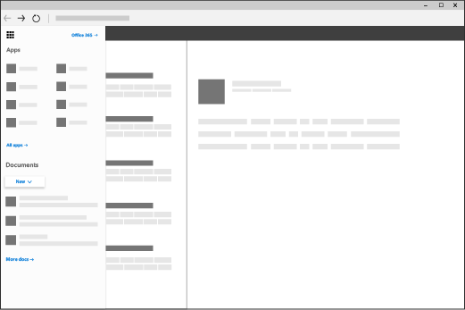

# Lägga till anpassade paneler i startprogrammet

I Microsoft 365 kan du snabbt och enkelt komma åt din e-post, kalendrar, dokument och appar med hjälp av startprogrammet ([läs mer](https://support.microsoft.com/en-us/office/meet-the-microsoft-365-app-launcher-79f12104-6fed-442f-96a0-eb089a3f476a)). Det här är appar som du får med Microsoft 365 samt anpassade appar som du lägger till från [SharePoint Store](https://support.office.com/article/dd98e50e-d3db-4ecb-9bb7-82b189822d43.aspx) eller [Azure AD](https://msdn.microsoft.com/office/office365/howto/connect-your-app-to-o365-app-launcher).
  
Du kan lägga till egna paneler i startprogrammet som pekar på SharePoint-webbplatser, externa webbplatser, äldre program och mycket mer. De anpassade panelerna visas under **Alla** appar i startprogrammet, men du kan fästa dem under **Start**-appar och instruera användarna att göra samma sak. Det här gör det enkelt att hitta de webbplatser, program och resurser som ni behöver i arbetet. I exemplet nedan används en egen panel som heter "Contoso-portalen" för att nå ett företags SharePoint-intranätwebbplats. 
  

  
## Lägga till en anpassad panel i startprogrammet

1. Gå till fliken Inställningar och välj **organisationsprofil** **i** **administrationscentret.** > 
    
2. På fliken **Organisationsprofil** väljer du **Anpassade startpaneler**för startprogram .
  
3. Välj **Lägg till en anpassad panel**. 
  
4. Ange ett **Panelnamn** för den nya panelen. Namnet visas sedan i panelen. 
    
5. Ange en **webbadress till panelen.** Det här är den plats där du vill att användarna ska gå när de väljer panelen i startprogrammet. Använd HTTPS i URL:en. Om du skapar en panel för en SharePoint-webbplats navigerar du till den webbplatsen, kopierar webbadressen och klistrar in den här. Webbadressen till standardgruppwebbplatsen ser ut så här:`https://<company_name>.sharepoint.com` 
  
6. Ange en **URL till bilden** för panelen. Bilden visas på sidan Mina program och i startprogrammet. TIPS: Bilden ska vara 60x60 pixlar och vara tillgänglig för alla i organisationen utan att behöva autentisering.

7. Ange en **beskrivning** för panelen. Du ser detta när du väljer panelen på sidan Mina appar och väljer **Appinformation**. 
  
8. Välj **Spara ändringar** om du vill skapa den anpassade panelen. 
    
Den anpassade panelen visas nu i startprogrammet på fliken **Alla** för dig och dina användare. 
  
## Befordra panelen till Startprogrammet

1. Välj ikonen för startprogrammet och välj **Alla appar**. 
    
2. Leta reda på den nya panelen för din app, välj ellipsen och välj **Fäst för startprogrammet**.
  
    > [!NOTE]
    > Om du inte ser länken till den anpassade panelen du skapade i föregående steg bör du kontrollera att du har tilldelats en Exchange Online-postlåda och att du loggat in till postlådan minst en gång. De här stegen krävs för anpassade paneler i Microsoft 365. 
  
> [!IMPORTANT]
> Både du och användarna måste utföra de här åtgärderna när ni vill att anpassade paneler från Mina program-sidan ska fästas i startprogrammet. 
  
## Edit or delete a custom tile

1. Gå till**Settings** > <a href="https://go.microsoft.com/fwlink/p/?linkid=2067339" target="_blank">fliken Organisationsprofilinställningar</a> i **administrationscentret.** > 
    
2. Välj **Redigera**bredvid **Lägg till anpassade paneler för din organisation**på sidan **Organisationsprofil.**

3. Uppdatera **panelnamnet**, **URL:en**, **beskrivningen** och **bild-URL:en** för den anpassade brickan (se den [Lägga till en anpassad panel i startprogrammet](#add-a-custom-tile-to-the-app-launcher)).
    
4. Välj **Uppdatera** \> **stäng**. 
    
Om du vill ta bort en anpassad panel markerar du panelen i fönstret **Anpassade paneler** och väljer **Ta bort panel** > **Ta bort**. 
  
## Hur går jag vidare?

Förutom att lägga till paneler i startprogrammet kan du lägga till startpaneler i navigeringsfältet[(läs mer).](https://support.office.com/article/personalize-your-office-365-experience-eb34a21b-52fa-4fbf-a8d5-146132242985) Information om hur du anpassar utseendet på Microsoft 365 så att det matchar organisationens varumärke finns [i Anpassa Microsoft 365-temat](../setup/customize-your-organization-theme.md).
  

