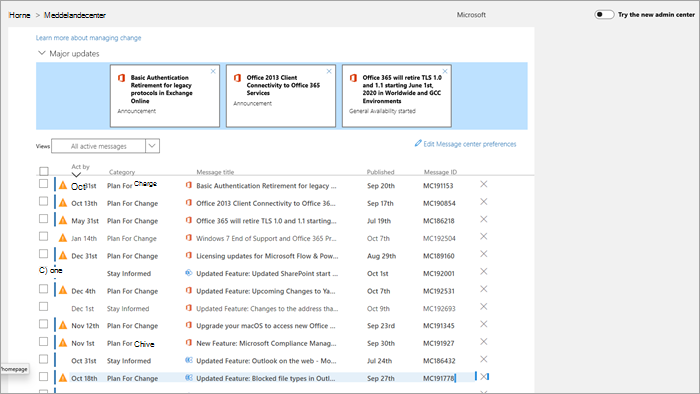

# Hantera meddelanden i Meddelandecenter

Inlägg i Meddelandecenter är viktiga meddelanden om nya och ändrade funktioner. Den här artikeln ger mer information om vad du kan göra med meddelanden för att hjälpa dig med hantering av ändringar i din organisation.
  
## Läsa ett meddelande

Gå till meddelande Center genom att gå till [administrations centret](https://go.microsoft.com/fwlink/p/?linkid=2024339)och välja Center för **hälso**  >  **meddelanden**. 

Markera en meddelande rubrik för att öppna den i Läs fönstret. Varje meddelande innehåller en sammanfattning av ändringen, en förklaring om hur ändringen kan påverka dig, information om hur du kan förbereda din organisation för ändringen och (i de flesta fall) en ytterligare informations länk där du kan läsa mer. Den ytterligare informationen fortsätter att vara tillgänglig även efter att ett meddelande har gått ut.

## Filtrera och sortera

::: moniker range="o365-worldwide"

Använd List menyn **filter** för att välja en filtrerad vy av meddelanden.

Du kan välja en kolumn rubrik för att sortera meddelanden i stigande eller fallande ordning. Till exempel sorteras i det här diagrammet meddelanden på **Agera senast**-datum.

::: moniker-end

::: moniker range="o365-germany"

Använd den nedrullningsbara menyn **vyer** för att välja en filtrerad vy av meddelanden. 
 
Du kan välja en kolumn rubrik för att sortera meddelanden i stigande eller fallande ordning. I den här illustrationen sorteras till exempel meddelandena **efter** datum.

::: moniker-end

::: moniker range="o365-21vianet"

Använd den nedrullningsbara menyn **vyer** för att välja en filtrerad vy av meddelanden. 
 
Du kan välja en kolumn rubrik för att sortera meddelanden i stigande eller fallande ordning. I den här illustrationen sorteras till exempel meddelandena **efter** datum.

::: moniker-end

## Ge feedback om ett inlägg

I meddelande Center kan du välja ett meddelande för att visa detaljer.

Om du vill ge feedback om meddelandet väljer du ikonen **gilla** eller **gilla** och ger feedback i text rutan som visas. Uppge ingen personlig information. Du kan till och med välja **det här om du vill kontakta mig angående feedback** och sedan välja **Skicka**.

## Dela ett meddelande

Ser du ett meddelande som någon annan måste göra något åt? Du kan dela innehållet i meddelandet med en annan användare via e-post:
  
1. Markera meddelandet för att öppna det och välj sedan **dela**.
  
2. Dela meddelandet genom att ange upp till två e-postadresser avgränsade med ett kolon. Du kan skicka till enskilda och gruppera e-postadresser. Du kan också välja att få en kopia av meddelandet via e-post (meddelandet skickas till din primära e-postadress) eller Lägg till ett personligt meddelande för att ge mottagare med mer kontext.
  
3. Välj **dela** för att skicka e-postmeddelandet.
    
## Hämta en länk

Behöver du följa upp med en annan administratör för att se till att de är medvetna om en ändring och åtgärd? Du kan skapa en länk för att dela via e-post eller snabb meddelanden, till exempel om du vill att användaren ska kopplas direkt till meddelandet. Den du delar länken med måste vara en administratör i Microsoft 365 för din organisation, eller så har de inte åtkomst till det länkade meddelandet.

::: moniker range="o365-worldwide"

1. Markera meddelandet för att öppna det.

2. Välj ikonen **Kopiera länk till Urklipp** .

3. Tillåt webbsidan att få åtkomst till Urklipp. En direkt länk kopieras till Urklipp.

4. Använd Ctrl + V eller högerklicka och välj **Klistra** in för att infoga länken.

::: moniker-end

::: moniker range="o365-germany"

1. Markera meddelandet för att öppna det.

2. Välj **mer** \>  i åtgärds fältet.

3. Tillåt webbsidan att få åtkomst till Urklipp. En direkt länk kopieras till Urklipp.

4. Använd Ctrl + V eller högerklicka och välj **Klistra** in för att infoga länken.

::: moniker-end

::: moniker range="o365-21vianet"

1. Markera meddelandet för att öppna det.

2. Välj **mer** \>  i åtgärds fältet.

3. Tillåt webbsidan att få åtkomst till Urklipp. En direkt länk kopieras till Urklipp.

4. Använd Ctrl + V eller högerklicka och välj **Klistra** in för att infoga länken.

::: moniker-end

## Läst och oläst

Alla meddelanden i Meddelandecenter som är olästa visas i fetstil. Om du öppnar ett meddelande markeras det som läst. Du kan markera ett meddelande som oläst.

::: moniker range="o365-worldwide"

1. På huvud sidan i meddelande Center väljer du ett meddelande.

2. Markera ikonen **Markera som oläst** (kuvert) högst upp i meddelandet.
  
::: moniker-end

::: moniker range="o365-germany"

1. Markera meddelandet för att öppna det.

2. Välj **Mer** \> **Markera som oläst**.

3. Stäng meddelandet.

::: moniker-end

::: moniker range="o365-21vianet"

1. Markera meddelandet för att öppna det.

2. Välj **Mer** \> **Markera som oläst**.

3. Stäng meddelandet.

::: moniker-end

## Arkivera och Återställ

Om du ser ett meddelande som inte gäller dig eller kanske du redan har arbetat med det kan du arkivera meddelandet för att ta bort det från vyn meddelande Center. Den vy som visas i meddelande centret är specifik för ditt användar konto, så arkiveringen från din vy påverkar inte andra administratörer.

::: moniker range="o365-worldwide"

- Markera ett meddelande på huvud sidan i meddelande centret och välj sedan **arkivera** ovanför meddelande listan.

- Öppna meddelandet och välj sedan **arkivera** längst ned i meddelandet.

Behöver du få ett arkiverat meddelande tillbaka? Inga problem.
  
1. Välj fliken **arkiverade meddelanden** högst upp i meddelande Center. En lista med arkiverade meddelanden visas. 

2. Markera meddelandet, Välj **Återställ** så återställs meddelandet till aktiva meddelanden.

::: moniker-end

::: moniker range="o365-germany"

Det finns två sätt att arkivera ett meddelande.
  
- Välj det X som visas till höger om meddelande-ID. Meddelandet tas bort från listan. Eller:

- Öppna meddelandet och välj **arkivera** högst upp i meddelandet.

Behöver du få tillbaka ett stängt meddelande? Inga problem.
  
1. Välj filtret **arkiverade meddelanden** i list rutan **vyer** . En lista med arkiverade meddelanden visas.

2. Välj **Återställ** till höger om meddelande-ID: t så återställs meddelandet till aktiva meddelanden.

::: moniker-end

::: moniker range="o365-21vianet"

Det finns två sätt att arkivera ett meddelande.
  
- Välj det X som visas till höger om meddelande-ID. Meddelandet tas bort från listan. Eller:

- Öppna meddelandet och välj **arkivera** högst upp i meddelandet.

Behöver du få ett arkiverat meddelande tillbaka? Inga problem.
  
1. Välj filtret **arkiverade meddelanden** i list rutan **vyer** . En lista med arkiverade meddelanden visas.

2. Välj **Återställ** till höger om meddelande-ID: t så återställs meddelandet till aktiva meddelanden.

::: moniker-end

## Följa upp dina meddelande Center-uppgifter i Planner

Mycket actionable information om ändringar i Microsoft 365-tjänsterna kommer till Microsoft 365 meddelande Center. Det kan vara svårt att hålla reda på vilka ändringar som kräver att uppgifter ska utföras, när och av vem och av vem som kan spåra varje uppgift. Du kanske också vill anteckna något och tagga det för att kontrol lera det senare. Du kan göra allt detta och mer när du synkroniserar dina meddelanden från Microsoft 365 Admin Center till Microsoft Planner. Mer information finns i [spåra dina meddelande Center uppgifter i Planner](https://docs.microsoft.comoffice365/planner/track-message-center-tasks-planner).

En översikt över Message Center finns i [meddelande Center i Microsoft 365](message-center.md). Om du vill lära dig hur du anger språk inställningar för att aktivera maskin översättning för inlägg i meddelande Center kan du läsa [översätta översättning för meddelanden i meddelande Center](language-translation-for-message-center-posts.md). Om du vill att ett annat sätt att få information om hälso status i real tid-tjänsten och meddelanden om meddelande Center kan du hänvisa till [Microsoft 365 service Communications API-översikt](https://go.microsoft.com/fwlink/p/?linkid=848507).
  
