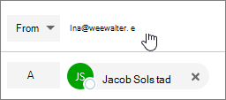

# Skicka e-post som en distributionslistaSend email as a distribution list

I Microsoft 365 kan du skicka e-post som en distributionslista.In Microsoft 365, you can send email as a distribution list. När en person som är medlem i distributionslistan svarar på ett meddelande som skickas till distributionslistan, verkar e-postmeddelandet komma från distributionslistan, inte från den enskilda användaren.When a person who is a member of the distribution list replies to a message sent to the distribution list, the email appears to be from the distribution list, not from the individual user. Det här avsnittet visar hur du gör detta.This topic shows you how to do this.
  
## Skicka e-post som en distributionslistaSend email as a distribution list

Innan du utför de här stegen kontrollerar du att du har lagts till i en Microsoft 365-distributionslista och att du har beviljats Send som behörighet för den.Before you perform these steps, make sure you've been added to a Microsoft 365 distribution list and you've have been granted Send as permission on it.
  
 **Administratörer**: Kontrollera att du har följt stegen i [Lägg till en Microsoft 365-användare eller kontakt i en lista](../email/add-user-or-contact-to-distribution-list.md) och tillåt medlemmar att skicka [e-post som ett Microsoft 365-gruppavsnitt](../create-groups/allow-members-to-send-as-or-send-on-behalf-of-group.md#allow-members-to-send-email-as-a-group) och lagt till rätt personer i distributionslistan.**Admins**: Make sure you've followed the steps in the [Add a Microsoft 365 user or contact to a list](../email/add-user-or-contact-to-distribution-list.md) and [Allow members to send email as a Microsoft 365 Group](../create-groups/allow-members-to-send-as-or-send-on-behalf-of-group.md#allow-members-to-send-email-as-a-group) topics, and added the correct people to the distribution list.
  
1. Öppna Outlook på webben och gå till inkorgen.Open Outlook on the web and go to your inbox. 
    
2. Öppna ett meddelande som skickades till distributionslistan.Open a message that was sent to the distribution list. 
    
3. Välj **Svara**.Select **Reply**. 
    
4. Längst ned i meddelandet väljer du **Mer** \> **Visa från**.At the bottom of the message, select **More** \> **Show from**.  
  
5. Högerklicka på Adressen Från - till exempel `Ina@weewalter.me` - och välj Ta **bort**.Right-click on the From address - such as `Ina@weewalter.me` - and choose **Remove**.  
  
6. Skriv sedan distributionslisteadressen, till exempel support@contoso.com och skicka meddelandet.Then type the distribution list address such as support@contoso.com, and send the message. Nästa gång du svarar från distributionslistan visas dess adress som ett alternativ i listan **Från.**The next time you reply from the distribution list, its address will appear as an option in the **From** list. 
  

