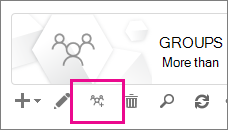

# <a name="upgrade-distribution-lists-to-microsoft-365-groups-in-outlook"></a><span data-ttu-id="e81dd-103">Uppgradera distributionslistor till Microsoft 365 grupper i Outlook</span><span class="sxs-lookup"><span data-stu-id="e81dd-103">Upgrade distribution lists to Microsoft 365 Groups in Outlook</span></span>

<span data-ttu-id="e81dd-104">Du kan uppgradera distributionslistor till Microsoft 365 grupper i Outlook.</span><span class="sxs-lookup"><span data-stu-id="e81dd-104">You can upgrade distribution lists to Microsoft 365 Groups in Outlook.</span></span> <span data-ttu-id="e81dd-105">Det här är ett bra sätt att ge organisationens distributionslistor alla funktioner som finns i Microsoft 365 Groups.</span><span class="sxs-lookup"><span data-stu-id="e81dd-105">This is a great way to give your organization's distribution lists all the features and functionality of Microsoft 365 Groups.</span></span> [<span data-ttu-id="e81dd-106">Varför du bör uppgradera dina distributionslistor till grupper i Outlook</span><span class="sxs-lookup"><span data-stu-id="e81dd-106">Why you should upgrade your distribution lists to groups in Outlook</span></span>](https://support.microsoft.com/office/7fb3d880-593b-4909-aafa-950dd50ce188)

<span data-ttu-id="e81dd-107">Du kan uppgradera dina distributionslistor en i taget eller flera samtidigt.</span><span class="sxs-lookup"><span data-stu-id="e81dd-107">You can upgrade DLs one at a time, or several at the same time.</span></span>

## <a name="upgrade-one-or-many-distribution-list-groups-to-microsoft-365-groups-in-outlook"></a><span data-ttu-id="e81dd-108">Uppgradera en eller flera distributionsgrupper till Microsoft 365 grupper i Outlook</span><span class="sxs-lookup"><span data-stu-id="e81dd-108">Upgrade one or many distribution list groups to Microsoft 365 Groups in Outlook</span></span>

<span data-ttu-id="e81dd-109">Du måste vara global administratör Exchange administratör för att uppgradera en distributionsgrupp.</span><span class="sxs-lookup"><span data-stu-id="e81dd-109">You must be a global admin or Exchange admin to upgrade a distribution list group.</span></span> <span data-ttu-id="e81dd-110">Om du vill Microsoft 365 till en e-postgrupp måste distributionsgruppen ha en ägare med en postlåda.</span><span class="sxs-lookup"><span data-stu-id="e81dd-110">To upgrade to Microsoft 365 Groups, the distribution list group must have an owner with a mailbox.</span></span>

### <a name="use-the-new-eac-to-upgrade-one-or-many-distribution-list-groups-to-microsoft-365-groups-in-outlook"></a><span data-ttu-id="e81dd-111">Använd den nya EAC för att uppgradera en eller flera distributionsgrupper till att Microsoft 365 grupper i Outlook</span><span class="sxs-lookup"><span data-stu-id="e81dd-111">Use the new EAC to upgrade one or many distribution list groups to Microsoft 365 Groups in Outlook</span></span>

1. <span data-ttu-id="e81dd-112">Gå till det [Exchange administrationscentret](https://admin.exchange.microsoft.com)och gå till **Mottagare** \> **grupper**.</span><span class="sxs-lookup"><span data-stu-id="e81dd-112">Go to the new [Exchange admin center](https://admin.exchange.microsoft.com), and navigate to **Recipients** \> **Groups**.</span></span>

2. <span data-ttu-id="e81dd-113">Välj den distributionsgrupp (även kallad **distributionsgrupp)** som du vill uppgradera Microsoft 365 gruppen från **sidan** Grupper.</span><span class="sxs-lookup"><span data-stu-id="e81dd-113">Select the distribution list group (also called a **distribution group**) that you want to upgrade to Microsoft 365 group from the **Groups** page.</span></span>

3. <span data-ttu-id="e81dd-114">Välj **distributionsgruppen Uppgradera** i verktygsfältet.</span><span class="sxs-lookup"><span data-stu-id="e81dd-114">Select the **Upgrade distribution group** from the tool bar.</span></span>

4. <span data-ttu-id="e81dd-115">I dialogrutan Är du **redo att uppgradera? klickar** du på **Uppgradera.**</span><span class="sxs-lookup"><span data-stu-id="e81dd-115">In the dialog box **Ready to upgrade?**, click **Upgrade**.</span></span> <span data-ttu-id="e81dd-116">Processen börjar direkt.</span><span class="sxs-lookup"><span data-stu-id="e81dd-116">The process begins immediately.</span></span> <span data-ttu-id="e81dd-117">Beroende på storleken på och antalet distributionsgrupper som du uppgraderar kan processen ta några minuter eller timmar.</span><span class="sxs-lookup"><span data-stu-id="e81dd-117">Depending on the size and number of distribution list groups you're upgrading, the process can take minutes or hours.</span></span>

> [!NOTE]
> <span data-ttu-id="e81dd-118">En banderoll högst upp anger uppgraderingen, till exempel *att distributionsgrupp(er) har uppgraderats. Det tar 5 minuter att återspegla ändringarna. Filtrera Microsoft 365 grupper för att se de uppgraderade gruppernas distruering.*</span><span class="sxs-lookup"><span data-stu-id="e81dd-118">A banner at the top indicates the upgrade, for example, *Distribution group(s) has been upgraded. It will take 5 minutes to reflect the changes. Filter by Microsoft 365 groups to see the upgraded distrubtion groups(s)*.</span></span>

### <a name="use-the-classic-eac-to-upgrade-one-or-many-distribution-list-groups-to-microsoft-365-groups-in-outlook"></a><span data-ttu-id="e81dd-119">Använd den klassiska versionen av EAC för att uppgradera en eller flera distributionsgrupper till Microsoft 365 grupper i Outlook</span><span class="sxs-lookup"><span data-stu-id="e81dd-119">Use the Classic EAC to upgrade one or many distribution list groups to Microsoft 365 Groups in Outlook</span></span>

1. <span data-ttu-id="e81dd-120">Gå till det klassiska <a href="https://go.microsoft.com/fwlink/p/?linkid=2059104" target="_blank">Exchange administrationscentret</a>.</span><span class="sxs-lookup"><span data-stu-id="e81dd-120">Go to the Classic <a href="https://go.microsoft.com/fwlink/p/?linkid=2059104" target="_blank">Exchange admin center</a>.</span></span>

2. <span data-ttu-id="e81dd-121">Gå till Exchange i klassiska versionen **av** \> **administrationscentret.**</span><span class="sxs-lookup"><span data-stu-id="e81dd-121">In the Classic Exchange admin center, go to **Recipients** \> **Groups**.</span></span><br/><span data-ttu-id="e81dd-122">Du ser ett meddelande om att du har distributionslistor (kallas även **distributionsgrupper)** som är kvalificerade för uppgradering till Microsoft 365 Grupper.</span><span class="sxs-lookup"><span data-stu-id="e81dd-122">You'll see a notice indicating you have distribution lists (also called **distribution groups**) that are eligible to be upgraded to Microsoft 365 Groups.</span></span><br/> <span data-ttu-id="e81dd-123"></span><span class="sxs-lookup"><span data-stu-id="e81dd-123"></span></span>

3. <span data-ttu-id="e81dd-124">Välj en eller flera distributionslistor (kallas även **distributionsgrupp)** på **gruppsidan.**</span><span class="sxs-lookup"><span data-stu-id="e81dd-124">Select one or more distribution lists (also called a **distribution group**) from the **groups** page.</span></span><br/><span data-ttu-id="e81dd-125"></span><span class="sxs-lookup"><span data-stu-id="e81dd-125"></span></span>

4. <span data-ttu-id="e81dd-126">Välj uppgraderingsikonen.</span><span class="sxs-lookup"><span data-stu-id="e81dd-126">Select the upgrade icon.</span></span><br/>

5. <span data-ttu-id="e81dd-128">I dialogrutan väljer du Ja **för att** bekräfta uppgraderingen.</span><span class="sxs-lookup"><span data-stu-id="e81dd-128">On the information dialog, select **Yes** to confirm the upgrade.</span></span> <span data-ttu-id="e81dd-129">Processen börjar direkt.</span><span class="sxs-lookup"><span data-stu-id="e81dd-129">The process begins immediately.</span></span> <span data-ttu-id="e81dd-130">Processen kan ta några minuter eller timmar, beroende på hur stora och hur många adresser du uppgraderar.</span><span class="sxs-lookup"><span data-stu-id="e81dd-130">Depending on the size and number of DLs you're upgrading, the process can take minutes or hours.</span></span><br/><span data-ttu-id="e81dd-131">Om det inte går att uppgradera distributionslistan visas en dialogruta som anger det.</span><span class="sxs-lookup"><span data-stu-id="e81dd-131">If the distribution list can't be upgraded, a dialog appears saying so.</span></span> <span data-ttu-id="e81dd-132">Se [Vilka distributionslistor kan inte uppgraderas?](#which-distribution-lists-cant-be-upgraded).</span><span class="sxs-lookup"><span data-stu-id="e81dd-132">See [Which distribution lists cannot be upgraded?](#which-distribution-lists-cant-be-upgraded).</span></span>

6. <span data-ttu-id="e81dd-133">Om du uppgraderar flera distributionslistor använder du listrutan för att filtrera fram vilka distributionslistor som har uppgraderats.</span><span class="sxs-lookup"><span data-stu-id="e81dd-133">If you're upgrading multiple distribution lists, use the drop-down list to filter which distribution lists have been upgraded.</span></span> <span data-ttu-id="e81dd-134">Om listan inte är färdig väntar du lite till och väljer Uppdatera **för** att se vad som har uppgraderats.</span><span class="sxs-lookup"><span data-stu-id="e81dd-134">If the list isn't complete, wait a while longer and then select **Refresh** to see what's been successfully upgraded.</span></span><br/><span data-ttu-id="e81dd-p107">Du får inget meddelande om att uppgraderingen har slutförts för alla distributionslistor du valde. Det här kan du se genom att visa vad som står under **Tillgängliga för uppgradering** eller **Uppgraderade distributionslistor**.</span><span class="sxs-lookup"><span data-stu-id="e81dd-p107">There's no notice that tells you when the upgrade process has completed for all DLs you selected. You can figure this out by looking to see what's listed under **Available for upgrade** or **Upgraded DLs**.</span></span>

7. <span data-ttu-id="e81dd-137">Om du valde en dl för uppgradering, men den fortfarande visas på sidan som Tillgänglig för uppgradering, gick det inte att uppgradera den.</span><span class="sxs-lookup"><span data-stu-id="e81dd-137">If you selected a DL for upgrade, but it's still appeared on the page as Available to upgrade, then it failed to upgrade.</span></span> <span data-ttu-id="e81dd-138">Läs mer i [Vad gör jag om uppgraderingen inte fungerar](#what-to-do-if-the-upgrade-doesnt-work).</span><span class="sxs-lookup"><span data-stu-id="e81dd-138">See [What to do if the upgrade doesn't work](#what-to-do-if-the-upgrade-doesnt-work).</span></span>

> [!NOTE]
> <span data-ttu-id="e81dd-p109">Om du får e-postsammandrag för grupper kanske du har lagt märke till erbjudandet om att uppgradera de kvalificerade distributionslistor du äger. Mer information om e-postsammandrag finns i [Hålla en gruppkonversation i Outlook](https://support.microsoft.com/office/a0482e24-a769-4e39-a5ba-a7c56e828b22).</span><span class="sxs-lookup"><span data-stu-id="e81dd-p109">If you're getting the groups digest emails you may notice at the bottom that it will sometimes offer to let you upgrade any eligible distribution lists that you're the owner of. See [Have a group conversation in Outlook](https://support.microsoft.com/office/a0482e24-a769-4e39-a5ba-a7c56e828b22) for more information about digest emails.</span></span>

## <a name="what-to-do-if-the-upgrade-doesnt-work"></a><span data-ttu-id="e81dd-141">Vad gör jag om uppgraderingen inte fungerar</span><span class="sxs-lookup"><span data-stu-id="e81dd-141">What to do if the upgrade doesn't work</span></span>

<span data-ttu-id="e81dd-142">Distributionslistor som inte går att uppgradera förändras inte.</span><span class="sxs-lookup"><span data-stu-id="e81dd-142">Distribution lists that fail to upgrade remain unchanged.</span></span>

<span data-ttu-id="e81dd-p110">Om du inte kan uppgradera en eller flera **kvalificerade** distributionslistor ska du öppna ett [supportärende](../../business-video/get-help-support.md). Ärendet eskaleras till ingenjörsteamet för grupper som försöker lösa problemet.</span><span class="sxs-lookup"><span data-stu-id="e81dd-p110">If one or more **eligible** distribution lists fail to be upgraded, open a [Support ticket](../../business-video/get-help-support.md). The issue will need to be escalated to the Groups Engineering team for them to figure out the problem.</span></span>

<span data-ttu-id="e81dd-145">Det är möjligt att distributionslistan inte uppgraderades på grund av ett avbrott i tjänsten, men osannolikt.</span><span class="sxs-lookup"><span data-stu-id="e81dd-145">It's possible that the distribution list didn't get upgraded because of a service outage, but unlikely.</span></span> <span data-ttu-id="e81dd-146">Om du vill kan du vänta en stund och sedan försöka uppgradera distributionslistan igen.</span><span class="sxs-lookup"><span data-stu-id="e81dd-146">If you want, wait a while and then try to upgrade the DL again.</span></span>

## <a name="how-to-use-powershell-to-upgrade-several-distribution-lists-at-the-same-time"></a><span data-ttu-id="e81dd-147">Använda PowerShell till att uppgradera flera distributionslistor åt gången</span><span class="sxs-lookup"><span data-stu-id="e81dd-147">How to use PowerShell to upgrade several distribution lists at the same time</span></span>

<span data-ttu-id="e81dd-148">Om du är van vid att använda PowerShell kanske du vill göra det i stället för att använda gränssnittet.</span><span class="sxs-lookup"><span data-stu-id="e81dd-148">If you're experienced at using PowerShell, you might want to go this route instead of using the UI.</span></span> <span data-ttu-id="e81dd-149">Vi har en uppsättning cmdlets som hjälper dig att uppgradera distributionslistor.</span><span class="sxs-lookup"><span data-stu-id="e81dd-149">We have a set of cmdlets that will help you upgrade distribution lists.</span></span> <span data-ttu-id="e81dd-150">Se nedan.</span><span class="sxs-lookup"><span data-stu-id="e81dd-150">See below.</span></span>

### <a name="upgrade-a-single-dl"></a><span data-ttu-id="e81dd-151">Uppgradera en enstaka dl</span><span class="sxs-lookup"><span data-stu-id="e81dd-151">Upgrade a single DL</span></span>

<span data-ttu-id="e81dd-152">Om du vill uppgradera en enda DLL-lista kör du följande kommando:</span><span class="sxs-lookup"><span data-stu-id="e81dd-152">To upgrade a single DL, run the following command:</span></span>

```PowerShell
Upgrade-DistributionGroup -DlIdentities \<Dl SMTP address\>
```

<span data-ttu-id="e81dd-153">Om du till exempel vill uppgradera en E-postadresser med SMTP-dl1@contoso.com kör du följande kommando:</span><span class="sxs-lookup"><span data-stu-id="e81dd-153">For example, if you want to upgrade a DLs with SMTP address dl1@contoso.com, run the following command:</span></span>

```PowerShell
Upgrade-DistributionGroup -DlIdentities dl1@contoso.com
```

> [!NOTE]
> <span data-ttu-id="e81dd-154">Du kan också uppgradera en enskild distributionslista till en Microsoft 365 grupp med [PowerShell-cmdleten New-UnifiedGroup](/powershell/module/exchange/new-unifiedgroup)</span><span class="sxs-lookup"><span data-stu-id="e81dd-154">You can also upgrade a single distribution list to a Microsoft 365 group using the [New-UnifiedGroup](/powershell/module/exchange/new-unifiedgroup) PowerShell cmdlet</span></span>

### <a name="upgrade-multiple-dls-in-a-batch"></a><span data-ttu-id="e81dd-155">Uppgradera flera E-adresser i en batch</span><span class="sxs-lookup"><span data-stu-id="e81dd-155">Upgrade multiple DLs in a batch</span></span>

<span data-ttu-id="e81dd-156">Du kan också överföra flera DLs som en batch och uppgradera dem tillsammans:</span><span class="sxs-lookup"><span data-stu-id="e81dd-156">You can also pass multiple DLs as a batch and upgrade them together:</span></span>

```PowerShell
Upgrade-DistributionGroup -DlIdentities \<DL SMTP address1\>, \< DL SMTP address2\>,
\< DL SMTP address3\>, \< DL SMTP address 4\>
```

<span data-ttu-id="e81dd-157">Om du till exempel vill uppgradera fem DLs med SMTP-adress `dl1@contoso.com` och , och kör du följande `dl2@contoso.com` `dl3@contoso.com` `dl4@contoso.com` `dl5@contoso.com` kommando:</span><span class="sxs-lookup"><span data-stu-id="e81dd-157">For example, if you want to upgrade five DLs with SMTP address `dl1@contoso.com` and `dl2@contoso.com`, `dl3@contoso.com`, `dl4@contoso.com` and `dl5@contoso.com`, run the following command:</span></span>

`Upgrade-DistributionGroup -DlIdentities dl1@contoso.com, dl2@contoso.com, dl3@contoso.com, dl4@contoso.com, dl5@contoso.com`

### <a name="upgrade-all-eligible-dls"></a><span data-ttu-id="e81dd-158">Uppgradera alla kvalificerade adresser</span><span class="sxs-lookup"><span data-stu-id="e81dd-158">Upgrade all eligible DLs</span></span>

<span data-ttu-id="e81dd-159">Du kan uppgradera alla kvalificerade adresser på två sätt.</span><span class="sxs-lookup"><span data-stu-id="e81dd-159">There are two ways in which you can upgrade all the eligible DLs.</span></span>

> [!NOTE]
> <span data-ttu-id="e81dd-160">Cmdleten Upgrade-DistributionGroup inte tar emot data från pipelinen, av den anledningen är det nödvändigt att använda operatorn "foreach-object {} " för att kunna köras.</span><span class="sxs-lookup"><span data-stu-id="e81dd-160">The Upgrade-DistributionGroup cmdlet doesn't receive data from the pipeline, for this reason it's required to use "foreach-object{}" operator to run successfully.</span></span>

1. <span data-ttu-id="e81dd-161">Hämta de kvalificerade DL:erna i klientorganisationen och uppgradera dem med hjälp av uppgraderingskommandot:</span><span class="sxs-lookup"><span data-stu-id="e81dd-161">Get the eligible DLs in the tenant and upgrade them using the upgrade command:</span></span>

```PowerShell
Get-EligibleDistributionGroupForMigration | Foreach-Object{
    Upgrade-DistributionGroup -DlIdentities $_.PrimarySMTPAddress
}
```

2. <span data-ttu-id="e81dd-162">Hämta listan över alla DLs och uppgradera bara de kvalificerade webbadresserna:</span><span class="sxs-lookup"><span data-stu-id="e81dd-162">Get the list of all DLs and upgrade only the eligible DLs:</span></span>

```PowerShell
Get-DistributionGroup| Foreach-Object{
    Upgrade-DistributionGroup -DlIdentities $_.PrimarySMTPAddress
}
```

## <a name="faq-about-upgrading-distribution-lists-to-microsoft-365-groups-in-outlook"></a><span data-ttu-id="e81dd-163">Vanliga frågor och svar om uppgradering av distributionslistor till Microsoft 365 grupper i Outlook</span><span class="sxs-lookup"><span data-stu-id="e81dd-163">FAQ about upgrading distribution lists to Microsoft 365 Groups in Outlook</span></span>

### <a name="which-distribution-lists-cant-be-upgraded"></a><span data-ttu-id="e81dd-164">Vilka distributionslistor kan inte uppgraderas?</span><span class="sxs-lookup"><span data-stu-id="e81dd-164">Which distribution lists can't be upgraded?</span></span>

<span data-ttu-id="e81dd-165">Du kan bara uppgradera enkla distributionslistor som hanteras i molnet och inte är kapslade.</span><span class="sxs-lookup"><span data-stu-id="e81dd-165">You can only upgrade cloud-managed, simple, non-nested distribution lists.</span></span> <span data-ttu-id="e81dd-166">I tabellen nedan visas distributionslistor som **INTE** kan uppgraderas.</span><span class="sxs-lookup"><span data-stu-id="e81dd-166">The table below lists distribution lists that **CANNOT** be upgraded.</span></span>

|<span data-ttu-id="e81dd-167">**Egenskap**</span><span class="sxs-lookup"><span data-stu-id="e81dd-167">**Property**</span></span>|<span data-ttu-id="e81dd-168">**Kvalificerad?**</span><span class="sxs-lookup"><span data-stu-id="e81dd-168">**Eligible?**</span></span>|
|:-----|:-----|
|<span data-ttu-id="e81dd-169">Lokalt hanterad distributionslista</span><span class="sxs-lookup"><span data-stu-id="e81dd-169">On-premises managed distribution list.</span></span>  <br/> |<span data-ttu-id="e81dd-170">Nej</span><span class="sxs-lookup"><span data-stu-id="e81dd-170">No</span></span>  <br/> |
|<span data-ttu-id="e81dd-p114">Kapslade distributionslistor Distributionslistan har antingen underordnade grupper eller är medlem i en annan grupp.</span><span class="sxs-lookup"><span data-stu-id="e81dd-p114">Nested distribution lists. Distribution list either has child groups or is a member of another group.</span></span>  <br/> |<span data-ttu-id="e81dd-173">Nej</span><span class="sxs-lookup"><span data-stu-id="e81dd-173">No</span></span>  <br/> |
|<span data-ttu-id="e81dd-174">Distributionslistor med en **annan RecipientTypeDetails** för medlemmar än **UserMailbox,** **SharedMailbox,** **TeamMailbox** och **MailUser**</span><span class="sxs-lookup"><span data-stu-id="e81dd-174">Distribution lists with member **RecipientTypeDetails** other than **UserMailbox**, **SharedMailbox**, **TeamMailbox**, **MailUser**</span></span>  <br/> |<span data-ttu-id="e81dd-175">Nej</span><span class="sxs-lookup"><span data-stu-id="e81dd-175">No</span></span>  <br/> |
|<span data-ttu-id="e81dd-176">Distributionslista med fler än 100 ägare</span><span class="sxs-lookup"><span data-stu-id="e81dd-176">Distribution list that has more than 100 owners</span></span>  <br/> |<span data-ttu-id="e81dd-177">Nej</span><span class="sxs-lookup"><span data-stu-id="e81dd-177">No</span></span>  <br/> |
|<span data-ttu-id="e81dd-178">Distributionslista som bara har medlemmar men ingen ägare</span><span class="sxs-lookup"><span data-stu-id="e81dd-178">Distribution list that only has members but no owner</span></span>  <br/> |<span data-ttu-id="e81dd-179">Nej</span><span class="sxs-lookup"><span data-stu-id="e81dd-179">No</span></span>  <br/> |
|<span data-ttu-id="e81dd-180">Distributionslista med alias som innehåller specialtecken</span><span class="sxs-lookup"><span data-stu-id="e81dd-180">Distribution list that has alias containing special characters</span></span>  <br/> |<span data-ttu-id="e81dd-181">Nej</span><span class="sxs-lookup"><span data-stu-id="e81dd-181">No</span></span>  <br/> |
|<span data-ttu-id="e81dd-182">Om distributionslistan är konfigurerad som en adress för vidarebefordran för Delad postlåda</span><span class="sxs-lookup"><span data-stu-id="e81dd-182">If the distribution list is configured to be a forwarding address for Shared Mailbox</span></span>  <br/> |<span data-ttu-id="e81dd-183">Nej</span><span class="sxs-lookup"><span data-stu-id="e81dd-183">No</span></span>  <br/> |
|<span data-ttu-id="e81dd-184">Om dl är en del av **avsändarbegränsningen** i en annan dl.</span><span class="sxs-lookup"><span data-stu-id="e81dd-184">If the DL is part of **Sender Restriction** in another DL.</span></span>  <br/> |<span data-ttu-id="e81dd-185">Nej</span><span class="sxs-lookup"><span data-stu-id="e81dd-185">No</span></span>  <br/> |
|<span data-ttu-id="e81dd-186">Säkerhetsgrupper</span><span class="sxs-lookup"><span data-stu-id="e81dd-186">Security groups</span></span>  <br/> |<span data-ttu-id="e81dd-187">Nej</span><span class="sxs-lookup"><span data-stu-id="e81dd-187">No</span></span>  <br/> |
|<span data-ttu-id="e81dd-188">Dynamiska distributionslistor</span><span class="sxs-lookup"><span data-stu-id="e81dd-188">Dynamic Distribution lists</span></span>  <br/> |<span data-ttu-id="e81dd-189">Nej</span><span class="sxs-lookup"><span data-stu-id="e81dd-189">No</span></span>  <br/> |
|<span data-ttu-id="e81dd-190">Distributionslistor som har konverterats till **RoomLists**</span><span class="sxs-lookup"><span data-stu-id="e81dd-190">Distribution lists that were converted to **RoomLists**</span></span>  <br/> |<span data-ttu-id="e81dd-191">Nej</span><span class="sxs-lookup"><span data-stu-id="e81dd-191">No</span></span>  <br/> |
|<span data-ttu-id="e81dd-192">Distributionslistor där **MemberJoinRestriction** och/eller **MemberDepartRestriction** är **stängt**</span><span class="sxs-lookup"><span data-stu-id="e81dd-192">Distribution lists where **MemberJoinRestriction** and/or **MemberDepartRestriction** is **Closed**</span></span>  <br/> |<span data-ttu-id="e81dd-193">Nej</span><span class="sxs-lookup"><span data-stu-id="e81dd-193">No</span></span>  <br/> |

### <a name="check-which-dls-are-eligible-for-upgrade"></a><span data-ttu-id="e81dd-194">Kontrollera vilka adresser som är kvalificerade för uppgradering</span><span class="sxs-lookup"><span data-stu-id="e81dd-194">Check which DLs are eligible for upgrade</span></span>

<span data-ttu-id="e81dd-195">Om du vill kontrollera om en dll-lista är berättigad eller inte kan du köra följande kommando:</span><span class="sxs-lookup"><span data-stu-id="e81dd-195">If you want to check whether a DL is eligible or not, you can run the below command:</span></span>

`Get-DistributionGroup \<DL SMTP address\> | Get-EligibleDistributionGroupForMigration`

<span data-ttu-id="e81dd-196">Om du vill kontrollera vilka adresser som är kvalificerade för uppgradering kör du följande kommando:</span><span class="sxs-lookup"><span data-stu-id="e81dd-196">If you want to check which DLs are eligible for upgrade just run the following command:</span></span>

`Get-EligibleDistributionGroupForMigration`

### <a name="who-can-run-the-upgrade-scripts"></a><span data-ttu-id="e81dd-197">Vilka kan köra uppgraderingsskripten?</span><span class="sxs-lookup"><span data-stu-id="e81dd-197">Who can run the upgrade scripts?</span></span>

<span data-ttu-id="e81dd-198">Personer med global administratör Exchange administratörsrättigheter.</span><span class="sxs-lookup"><span data-stu-id="e81dd-198">People with global admin or Exchange admin rights.</span></span>

### <a name="why-is-the-contact-card-still-showing-a-distribution-list-what-should-i-do-to-prevent-an-upgraded-distribution-list-from-showing-up-in-my-auto-suggest-list"></a><span data-ttu-id="e81dd-199">Varför visas det fortfarande en distributionslista på kontaktkortet?</span><span class="sxs-lookup"><span data-stu-id="e81dd-199">Why is the contact card still showing a distribution list?</span></span> <span data-ttu-id="e81dd-200">Hur kan jag förhindra att en uppgraderad distributionslista visas i min lista med automatiska förslag?</span><span class="sxs-lookup"><span data-stu-id="e81dd-200">What should I do to prevent an upgraded distribution list from showing up in my auto suggest list?</span></span>

- <span data-ttu-id="e81dd-201">För Outlook: När någon försöker skicka ett e-postmeddelande i Outlook genom att skriva namnet på Microsoft 365-gruppen efter migrering matchas mottagaren som distributionslistan i stället för gruppen.</span><span class="sxs-lookup"><span data-stu-id="e81dd-201">For Outlook: When someone tries to send an email in Outlook by typing the Microsoft 365 group name after migration, the recipient will be resolved as the distribution list instead of the group.</span></span> <span data-ttu-id="e81dd-202">Mottagarens kontaktkort blir distributionslistans kontaktkort.</span><span class="sxs-lookup"><span data-stu-id="e81dd-202">The contact card of the recipient will be the distribution lists contact card.</span></span> <span data-ttu-id="e81dd-203">Det här beror på mottagarens cache eller cachen för smeknamn i Outlook.</span><span class="sxs-lookup"><span data-stu-id="e81dd-203">This is because of the recipient cache or nick name cache in Outlook.</span></span> <span data-ttu-id="e81dd-204">E-postmeddelandet kommer att skickas till gruppen, men det kan vara förvirrande för avsändaren.</span><span class="sxs-lookup"><span data-stu-id="e81dd-204">The email will be sent successfully to the group, but might cause confusion to the sender.</span></span><br/><span data-ttu-id="e81dd-205">Du kan utföra stegen i den här artikeln Information om listan [Outlook för](/outlook/troubleshoot/contacts/information-about-the-outlook-autocomplete-list) att återställa cachen, vilket löser problemet.</span><span class="sxs-lookup"><span data-stu-id="e81dd-205">You can perform the steps in this article, [Information about the Outlook AutoComplete list](/outlook/troubleshoot/contacts/information-about-the-outlook-autocomplete-list) to reset the cache, which will fix this issue.</span></span>

- <span data-ttu-id="e81dd-206">För Outlook på webben: Om du har Outlook på webben ligger distributionslistan kvar som mottagare i cachen.</span><span class="sxs-lookup"><span data-stu-id="e81dd-206">For Outlook on the web: In case of Outlook on the web, the distribution list recipient will still remain in the cache.</span></span> <span data-ttu-id="e81dd-207">Du kan följa stegen i Ta bort föreslagna namn eller [e-postadresser](https://support.microsoft.com/office/9E1419D9-E88F-445B-B07F-F558B8A37C58) från listan Komplettera automatiskt om du vill uppdatera cachen så att gruppkontaktkortet visas.</span><span class="sxs-lookup"><span data-stu-id="e81dd-207">You can follow the steps in [Remove suggested name or email address from the Auto-Complete List](https://support.microsoft.com/office/9E1419D9-E88F-445B-B07F-F558B8A37C58) to refresh the cache to see the group contact card.</span></span>

### <a name="do-new-group-members-get-a-welcome-email-in-their-inbox"></a><span data-ttu-id="e81dd-208">Får nya gruppmedlemmar ett välkomstmeddelande i Inkorgen?</span><span class="sxs-lookup"><span data-stu-id="e81dd-208">Do new group members get a welcome email in their inbox?</span></span>

<span data-ttu-id="e81dd-p118">Nej. Inställningen för välkomstmeddelanden är inaktiverad som standard. Den här inställningen påverkar både befintliga och nya gruppmedlemmar som kan ansluta efter migreringen. Om gruppägare senare tillåter gästanvändare får inte heller gästanvändare något välkomstmeddelande i Inkorgen. Gästmedlemmar kan fortsätta att arbeta med gruppen.</span><span class="sxs-lookup"><span data-stu-id="e81dd-p118">No. The setting to enable welcome messages is set to false by default. This setting affects both existing and new group members who may join after the migration is complete. If the group owner later allows guest users, guest users won't receive a welcome email in their inbox. Guest members can continue working with the group.</span></span>

### <a name="what-if-one-or-some-of-the-dls-are-not-upgraded"></a><span data-ttu-id="e81dd-214">Vad händer om en eller några av de utl:erna inte uppgraderas?</span><span class="sxs-lookup"><span data-stu-id="e81dd-214">What if one or some of the DLs are not upgraded?</span></span>

<span data-ttu-id="e81dd-215">Det finns vissa fall där dl är berättigad men inte kan uppgraderas.</span><span class="sxs-lookup"><span data-stu-id="e81dd-215">There are some cases in which though DL is eligible but could not be upgraded.</span></span> <span data-ttu-id="e81dd-216">Dl uppgraderas inte och finns kvar som en dl.</span><span class="sxs-lookup"><span data-stu-id="e81dd-216">The DL does not get upgraded and remains as a DL.</span></span>

- <span data-ttu-id="e81dd-217">Där administratören har **tillämpat** principen för grupp-e-postadress för grupper i en organisation och de försöker uppgradera dll-adresser som inte uppfyller villkoren, uppgraderas inte dll-posten</span><span class="sxs-lookup"><span data-stu-id="e81dd-217">Where admin has applied **Group Email Address Policy** for the groups in an organization and they try to upgrade DLs that doesn't fulfill the criteria, the DL does not get upgraded</span></span>

- <span data-ttu-id="e81dd-218">DLs med **MemberJoinRestriction eller** **MemberDepartRestriction** inställd **på Stängd**, kunde inte uppgraderas</span><span class="sxs-lookup"><span data-stu-id="e81dd-218">DLs with **MemberJoinRestriction** or **MemberDepartRestriction** set to **Closed**, could not be upgraded</span></span>

### <a name="what-happens-to-the-dl-if-the-upgrade-from-eac-fails"></a><span data-ttu-id="e81dd-219">Vad händer med distributionslistan om uppgraderingen från EAC misslyckas?</span><span class="sxs-lookup"><span data-stu-id="e81dd-219">What happens to the DL if the upgrade from EAC fails?</span></span>

<span data-ttu-id="e81dd-p120">Uppgraderingen utförs bara när anropet skickas till servern. Om uppgraderingen misslyckas förblir distributionslistorna intakta. De fungerar som de brukade.</span><span class="sxs-lookup"><span data-stu-id="e81dd-p120">The upgrade will happen only when the call is submitted to the server. If the upgrade fails, your DLs will be intact. They will work like they used to.</span></span>

## <a name="related-content"></a><span data-ttu-id="e81dd-223">Relaterat innehåll</span><span class="sxs-lookup"><span data-stu-id="e81dd-223">Related content</span></span>

<span data-ttu-id="e81dd-224">[Jämför grupper](../create-groups/compare-groups.md) (artikel)</span><span class="sxs-lookup"><span data-stu-id="e81dd-224">[Compare groups](../create-groups/compare-groups.md) (article)</span></span>\
<span data-ttu-id="e81dd-225">[Förklara Microsoft 365 grupper för användarna](../create-groups/explain-groups-knowledge-worker.md) (artikel)</span><span class="sxs-lookup"><span data-stu-id="e81dd-225">[Explaining Microsoft 365 Groups to your users](../create-groups/explain-groups-knowledge-worker.md) (article)</span></span>\
[<span data-ttu-id="e81dd-226">Lägga till eller ta bort medlemmar Microsoft 365 grupper i administrationscentret</span><span class="sxs-lookup"><span data-stu-id="e81dd-226">Add or remove members from Microsoft 365 groups using the admin center</span></span>](../create-groups/add-or-remove-members-from-groups.md)