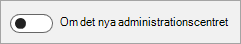

# Om det nya administrationscentret för Microsoft 365About the new Microsoft 365 admin center

::: moniker range="o365-worldwide"

Det nya administrationscentret för Microsoft 365 är byggt för IT-team som ett förenklat sätt att hantera dina Microsoft 365-tjänster.The new Microsoft 365 admin center is built for IT teams as a simplified way to manage your Microsoft 365 services. Administrationscentret ger en skräddarsydd upplevelse baserat på de unika behoven hos din roll eller organisation, förbättrar effektiviteten för vardagliga uppgifter och ger användbara insikter som hjälper dig att fatta datadrivna beslut för att ge användarna en bättre upplevelse.The admin center provides a tailored experience based on the unique needs of your role or organization, improves efficiency for everyday tasks, and provides actionable insights that help you make data-driven decisions to deliver a better experience for your users.

Microsoft 365 admin center är den gemensamma startpunkten för alla Microsoft 365-administratörer och kan nås på [https://admin.microsoft.com](https://go.microsoft.com/fwlink/?linkid=2024339) .The Microsoft 365 admin center is the common entry point for all Microsoft 365 admins and can be accessed at [https://admin.microsoft.com](https://go.microsoft.com/fwlink/?linkid=2024339). Specialiserade arbetsytor, som säkerhet eller enhetshantering, möjliggör mer detaljerad kontroll.Specialist workspaces, like Security or Device management, allow for more granular control. Mer information om hur administrationsenheterna ska fungera tillsammans finns i Hur är [det med de specifika typerna av IT-roller och andra arbetsytor som Säkerhet, Enhetshantering eller Exchange senare](#what-about-the-specific-types-of-it-roles-and-other-workspaces-like-security-device-management-or-exchange) i den här artikeln.For more information about how the admin centers will work together, see [What about the specific types of IT roles and other workspaces like Security, Device Management, or Exchange?](#what-about-the-specific-types-of-it-roles-and-other-workspaces-like-security-device-management-or-exchange) later in this article.

::: moniker-end

::: moniker range="o365-21vianet"

Det nya administrationscentret för Microsoft 365, som för närvarande förhandsgranskas, är byggt för IT-team som ett förenklat sätt att hantera dina Microsoft 365-tjänster.The new Microsoft 365 admin center, which is currently in preview, is built for IT teams as a simplified way to manage your Microsoft 365 services. Administrationscentret ger en skräddarsydd upplevelse baserat på de unika behoven hos din roll eller organisation, förbättrar effektiviteten för vardagliga uppgifter och ger användbara insikter som hjälper dig att fatta datadrivna beslut för att ge användarna en bättre upplevelse.The admin center provides a tailored experience based on the unique needs of your role or organization, improves efficiency for everyday tasks, and provides actionable insights that help you make data-driven decisions to deliver a better experience for your users.

Microsoft 365 admin center är den gemensamma startpunkten för alla Microsoft 365-administratörer och kan nås genom att logga in på [https://portal.partner.microsoftonline.cn/AdminPortal/Home#/homepage](https://go.microsoft.com/fwlink/p/?linkid=850627) .The Microsoft 365 admin center is the common entry point for all Microsoft 365 admins and can be accessed by logging in at [https://portal.partner.microsoftonline.cn/AdminPortal/Home#/homepage](https://go.microsoft.com/fwlink/p/?linkid=850627). Dessutom tillåter specialiserade arbetsytor, som Azure Active Directory och Exchange, mer detaljerad kontroll.Additionally, specialist workspaces, like Azure Active Directory and Exchange, allow for more granular control. Du kan komma åt de specialiserade arbetsytorna från navigeringsfönstret i administrationscentret för Microsoft 365.You can access the specialist workspaces from the navigation pane in the Microsoft 365 admin center.

::: moniker-end

::: moniker range="o365-worldwide"

När nya funktioner blir tillgängliga i Microsoft 365-administrationscentret kan du välja det nya administrationscentret och dela din feedback med Microsoft så att vi kan fortsätta att förbättra administratörsupplevelsen.As new features become available in the Microsoft 365 admin center, you'll be able to opt in to the new admin center and share your feedback with Microsoft so that we can continue to improve the admin experience. Om du anmäler dig påverkas inte användarna av användarna och du kan när som helst växla tillbaka till det gamla administrationscentret.If you opt in, there will be no impact to your users, and you can switch back to the old admin center at any time.
[Nyheter i det nya administrationscentret för Microsoft 365](whats-new-in-preview.md).[What's new in the NEW Microsoft 365 admin center](whats-new-in-preview.md).
  
> [!NOTE]
> Riktade versionsadministratörer får först tillgång till nya funktioner.Targeted release admins will have first access to new features. Nya funktioner kommer sedan att distribueras till alla administratörer.New features will then roll out to all admins. Det innebär att du kanske inte ser det nya administrationscentret, eller så kan det se annorlunda ut än vad som beskrivs i hjälpartiklar.This means that you may not see the new admin center, or it may look different than what is described in help articles. Se Delta i det nya administrationscentret nedan.To be among the first to see new features, see Participate in the new admin center, below. 
    
## Delta i det nya administrationscentretParticipate in the new admin center
Vi vill gärna att du deltar i det nya administrationscentret för Microsoft 365 så att du kan förbereda dig för förändring och ge oss feedback.We would love for you to participate in the new Microsoft 365 admin center so you can prepare for change and give us feedback.

### Aktivera Riktad releaseTurn on Targeted release

1. Logga in på [admin.microsoft.com](https://admin.microsoft.com)går du till navigeringsfönstret och väljer **Profilen Inställningar** \> **Organisation**.Sign in at [admin.microsoft.com](https://admin.microsoft.com), go to the navigation pane and select **Settings** \> **Organization profile**.

1. Logga in på [portal.partner.microsoftonline.cn](https://go.microsoft.com/fwlink/p/?linkid=513813)går du till navigeringsfönstret och väljer **Profilen Inställningar** \> **Organisation**.Sign in at [portal.partner.microsoftonline.cn](https://go.microsoft.com/fwlink/p/?linkid=513813), go to the navigation pane and select **Settings** \> **Organization profile**.

2. Gå till kortet **Frigör inställningar** och välj sedan **Redigera**.Go to the **Release preferences** card, and then select **Edit**. 
    
3. Välj antingen **Riktad version för alla** eller Riktad version för valda **användare**.Select either **Targeted release for everyone** or **Targeted release for selected users**. Om du väljer Riktad version för valda användare kontrollerar du att du lägger till ditt administratörskonto (och andra administratörer i organisationen som vill delta) i listan över valda användare.If you choose Targeted release for selected users, make sure that you add your admin account (and any other admins in your org who want to participate) to the list of selected users.
    
### Växla till det nya administrationscentret och tillbaka igenSwitch to the new admin center and back again

- När det nya administrationscentret för Microsoft 365 är tillgängligt för dig kan du anmäla dig genom att välja **Växlingsknappen Prova det nya administrationscentret** högst upp på startsidan.When the new Microsoft 365 admin center is available to you, you can opt in by selecting the **Try the new admin center** toggle located at the top of the Home page. Om du loggar ut från administrationscentret kommer vi ihåg ditt val och du loggar in igen i det nya administrationscentret.If you sign out of the admin center, we'll remember your selection and you'll sign back in to the new admin center.    
  
- Växla tillbaka till det gamla administrationscentret från startsidan genom att vrida växlingsknappen till **Av**.Switch back to the old admin center from the Home page by turning the toggle to **Off**.   

I det nya administrationscentret kan du ge Microsoft feedback om din upplevelse genom att välja **Ge feedback** bredvid knappen Behöver **du hjälp?**While in the new admin center, you can give Microsoft feedback about your experience by selecting **Give feedback** right next to the **Need help?** button at the bottom of every page. Berätta vad du gillar och vad vi kan göra bättre.Tell us what you like and what we could do better. Dessutom kan du få popup-undersökningar från tid till annan frågar om din totala visningar eller en viss upplevelse som är nyutgivna.In addition, you may get pop-up surveys from time-to-time asking about your overall impressions or a particular experience that's newly released. Du kan också ge feedback i slutet av den här artikeln genom att välja **Var den här informationen till hjälp?**You can also give feedback at the end of this article by selecting **Was this information helpful?**
  
Om du vill vara en tidig användare i det nya administrationscentret måste du aktivera Riktad version och sedan när det nya administrationscentret är tillgängligt kan du växla till det för att kolla upp det och ge feedback.If you want to be an early adopter in the new admin center, you'll need to turn on Targeted release, and then when the new admin center is available you can switch to it to check it out and provide feedback.
  
> [!NOTE]
> Åtkomst till det nya administrationscentret kommer att distribueras till alla Microsoft 365-administratörer.Access to the new admin center will be rolled out to all Microsoft 365 admins. Administratörer som finns i gruppen Riktad utgåva i organisationen får det nya administrationscentret först.Admins who are in the Targeted release group in their organization will get the new admin center first. Att vara i riktad release garanterar inte att du kommer att se växla omedelbart, men du kommer att få det tidigare än de i Standard release.Being in Targeted release does not guarantee you will see the toggle immediately, but you will get it sooner than those in Standard release. 
  
::: moniker-end

::: moniker range="o365-21vianet"

### Växla till det nya administrationscentret och tillbaka igenSwitch to the new admin center and back again

Medan det nya administrationscentret är i förhandsgranskning kan du växla fram och tillbaka mellan det nya administrationscentret och det gamla administrationscentret med hjälp av växlingsknappen högst upp på startsidan för administrationscentret.While the new admin center is in preview, you can switch back and forth between the new admin center and the old admin center by using the toggle located at the top of the admin center Home page. Det nya administrationscentret är fullt fungerande och har alla funktioner i det gamla administrationscentret.The new admin center is fully functional and has all the capabilities of the old admin center.

Om du vill prova det nya administrationscentret vrider du växlingsknappen till <b>Prova förhandsgranskningen</b>.To try the new admin center, turn the toggle to <b>Try the preview</b>. Växlingsknappen visar sedan <b>Förhandsgranska på</b>.The toggle will then show <b>Preview on</b>. Nästa gång du loggar in på administrationscentret kommer vi ihåg ditt val och loggar in dig i det nya administrationscentret.Next time you sign in to the admin center, we'll remember your selection and sign you in to the new admin center.

Om du vill gå tillbaka till det gamla administrationscentret vrider du växlingsknappen från <b>Förhandsgranska</b> till avstäckt position.To go back to using the old admin center, turn the toggle from <b>Preview on</b> to the off position. Nästa gång du loggar in på administrationscentret loggar vi in dig på det gamla administrationscentret.Next time you sign in to the admin center, we'll sign you in to the old admin center.

::: moniker-end

::: moniker range="o365-worldwide"

## Vanliga frågor och svarFrequently asked questions

Ser du inte dina frågor besvaras här?Don't see your questions answered here? Gå till avsnittet **Feedback** längst ned på den här sidan och ställ din fråga.Go to the **Feedback** section at the bottom of this page and ask your question. 
  
## Kan jag göra allt i det nya administrationscentret som jag kan göra i det gamla administrationscentret?Can I do everything in the new admin center that I can do in the old admin center?

Ja.Yes. Det nya administrationscentret är fullt fungerande och har alla funktioner i det gamla administrationscentret.The new admin center is fully functional and has all the capabilities of the old admin center.
  
## Vilka Microsoft 365-abonnemang är tillgängliga för utvärderingsversion eller köp?Which Microsoft 365 plans are available to trial or buy?

Microsoft 365 är en komplett, intelligent lösning som inkluderar Office 365, Windows 10 och Enterprise Mobility + Security som gör det möjligt för alla att vara kreativa och arbeta tillsammans, säkert.Microsoft 365 is a complete, intelligent solution that includes Office 365, Windows 10, and Enterprise Mobility + Security that empowers everyone to be creative and work together, securely. Följande Microsoft 365-prenumerationer finns i administrationscentret som du kan prova eller köpa nu:The following Microsoft 365 subscriptions are available in the admin center for you to try or buy now:
  
- Microsoft 365 för företagMicrosoft 365 for business
- Microsoft 365 Företag E3Microsoft 365 Enterprise E3
- Microsoft 365 Företag E5Microsoft 365 Enterprise E5
    
Mer information finns i [Prova eller köpa en Microsoft 365-prenumeration.](../commerce/try-or-buy-microsoft-365.md)For more information, see [Try or buy a Microsoft 365 subscription](../commerce/try-or-buy-microsoft-365.md).

## Jag hittade en bugg eller jag vill begära en funktionsförbättring.I found a bug or I want to request a feature enhancement. Hur meddelar jag Microsoft?How do I let Microsoft know?

Vi älskar att höra från dig!We love to hear from you! Genom att rapportera fel och dela feedback kan vi göra Microsoft 365-administrationscentret bättre.Reporting bugs and sharing feedback helps us make the Microsoft 365 admin center better. För att ge feedback, välj **feedback-knappen** längst ner på sidan och använd formuläret för att skicka oss dina tankar.To give feedback, select the **Feedback** button on the bottom of the page and use the form to send us your thoughts. Markera kryssrutan och bekräfta din e-postadress om du vill att någon från Microsoft 365-administrationscentret ska följa upp dina kommentarer.Select the checkbox and confirm your email address if you want someone from the Microsoft 365 admin center team to follow up on your comments. Vi kan inte lova att följa upp varje bit av feedback, men vi ska försöka!We can't promise to follow up on every piece of feedback, but we're going to try! 
  
Du kan också ge feedback från utanför admin center på vår UserVoice forum.You can also give feedback from outside of the admin center on our UserVoice forum. Du kan använda den här sidan för att göra funktionsförslag som kan röstas fram av andra forumanvändare: [UserVoice forum för det nya admin-centret](https://go.microsoft.com/fwlink/?linkid=2024994).You can use this page to make feature suggestions that can be voted on by other forum users: [UserVoice forum for the new admin center](https://go.microsoft.com/fwlink/?linkid=2024994).

## Hur är det med de specifika typerna av IT-roller och andra arbetsytor som Säkerhet, Enhetshantering eller Exchange?What about the specific types of IT roles and other workspaces like Security, Device Management, or Exchange?

Microsoft 365-administrationscentret är den gemensamma startpunkten för alla team och roller som hanterar Microsoft 365.The Microsoft 365 admin center is the common entry point for all teams and roles managing Microsoft 365. Erfarenheten, informationen och kontrollerna är skräddarsydda och anpassningsbara för varje administratör och roll.The experience, information, and controls are tailored and customizable for each admin and role. Dessutom tillåter specialiserade arbetsytor djup, detaljerad kontroll.Additionally, specialist workspaces allow for deep, granular control. Dessa specialarbetsytor inkluderar SharePoint, Teams &amp; Skype, Exchange, Security, Compliance, Device Management och Azure Active Directory.These specialist workspaces include SharePoint, Teams &amp; Skype, Exchange, Security, Compliance, Device Management, and Azure Active Directory. Du hittar de specialiserade arbetsytorna från navigeringsfönstret i Microsoft 365 admin center på [https://admin.microsoft.com](https://go.microsoft.com/fwlink/?linkid=2024339) .You can find the specialist workspaces from the navigation pane in the Microsoft 365 admin center at [https://admin.microsoft.com](https://go.microsoft.com/fwlink/?linkid=2024339).
  
Det tar en stund att uppdatera alla administrationscenter för att få en sammanhängande upplevelse, men du kan läsa mer om de administrationscenter vi redan har börjat göra om:Updating all of the admin centers to have a coherent experience will take awhile, but you can learn more about the admin centers we've already started to makeover:
  
- [Komma igång med det nya Administrationscentret för SharePointGet started with the new SharePoint Admin Center](https://go.microsoft.com/fwlink/?linkid=2024186)
    
- [Hantera team under övergången till det nya Administrationscentret för Microsoft Teams &amp; Skype för företagManage Teams during the transition to the new Microsoft Teams &amp; Skype for Business Admin Center](https://go.microsoft.com/fwlink/?linkid=2024308)
    
- [Översikt över Hantering av Microsoft 365-enheterOverview of Microsoft 365 Device Management](https://go.microsoft.com/fwlink/?linkid=2006262)
    
- [Vi presenterar Microsoft 365 Security and Compliance CenterIntroducing the Microsoft 365 Security and Compliance Center](https://go.microsoft.com/fwlink/?linkid=2025413)

::: moniker-end