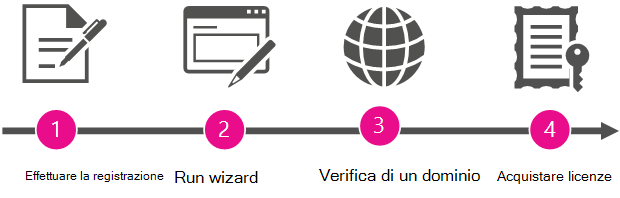

# Bli administratör och köp Office 365 åt din organisation

Microsoft gör det enkelt för personer i organisationen att registrera sig och använda verktyg och tjänster utan att vänta på en formell distribution från IT-avdelningen.
  
Organisationen kan låta personerna fortsätta att använda tjänsterna som de är. Men om dessa personer har registrerat sig för Skype-möten som en av dessa tjänster, kan du tilldela en administratör för att uppgradera och få en mer fullständig lösning för möten med Skype för företag och Office-program, fillagring och delning med mera.
  
## Varför bli administratör och köpa Office 365 åt din organisation?

När en anställd registrerar sig för Skype-möten med sitt arbetskonto har de inte möjlighet att hantera tjänsten. Och de får endast de mest grundläggande funktionerna: de kan ha ett obegränsat antal möten men endast med 10 eller färre deltagare (efter 60 dagar är högsta antal deltagare tre personer). 
  
När du konfigurerar en administratör för tjänsten och köper Office 365 till användarna får de mer avancerade funktioner. Och du får möjlighet att hantera tjänsterna, så att du kan tillämpa principer och lägga till nya användare.
  
Som en bonus har du telefonsupport dygnet runt.
  
## Så här blir du administratör

Om du vill bli administratör ska du först bevisa att du äger domänen som personerna har registrerat sig med (t.ex. contoso.com). Därefter uppgraderar du till Office 365 för alla i företaget som redan använder Skype-möten. En guide hjälper dig genom stegen.
  
> [!NOTE]
> Att bli administratör och uppgradera till Office 365 är en del av samma process. Du kan inte uppgradera utan att första bli administratör och du kan inte hantera tjänsterna som administratör om du inte också uppgraderar till Office 365. 
  
 **Varför ber vi dig att bevisa att du äger domänen?** Eftersom alla som registrerar sig med en e-postadress på samma domän (t.rob@contoso.com och sara@contoso.com) grupperas tillsammans efter domännamnet. Vi bestämmer vilken grupp varje person tillhör efter domändelen av deras e-postadresser (som contoso.com), så att personer från samma organisation kan arbeta tillsammans. Eftersom de tillhör samma grupp kan de samarbeta med varandra.
  
Om du vill bli administratör för gruppen ska du verifiera att du äger den domän som alla i organisationen är grupperade under. Om du har behörighet att bevisa domänägarskap (genom att logga in där domänen hanteras) är det rimligt att du kan hantera Office 365-tjänster för personer som använder den domänen.
  
När du blir administratör kan du också lägga till nya användare eller tillämpa principer, om du vill.
  
## Översikt över stegen

  
En guide hjälper dig genom processen, men här är en sammanfattning av varje steg.
  
|||
|:-----|:-----|
||**Registrera dig** Innan du kan bli administratör måste du ha registrerat dig för Skype-möten med din arbets-e-postadress.    |
||**Kör guiden** När du har registrerat dig kör du guiden genom att göra något av följande:     Kör **guiden Bli administratör** som visas när du har valt **Admin** i startprogrammet .     ELLER     Välj att **uppgradera till Office 365** i Skype-möten och välj sedan den Office 365-prenumeration som du vill uppgradera till.    |
||**Verifiera domänägarskap** I nästa steg ska du verifiera för Office 365 att du äger eller hanterar domännamnet (t.ex. contoso.com), som är kopplat till organisationens e-postadresser. Endast ägaren av domännamnet har behörighet att göra detta.    |
||**Köp licenser** I det sista steget i guiden köper du Office 365-licenser för varje person i organisationen som har registrerat sig för Skype-möten med sin arbets-e-postadress.    Om till exempel två användare har registrerat sig för Skype-möten med sin arbets-e-postadress måste du köpa två licenser - en för var och en av dem.    > [!NOTE]> Du kan inte hantera Office 365 förrän du har köpt licenserna.           |

## Din Office 365-prenumeration

När du har verifierat domänen och köpt licenser uppgraderas organisationen till Office 365. Det här gör också att personliga inställningar från prenumerationen på Skype-möten som enskilda användare har använt överförs (till den betalda prenumerationen).
  
Den Office 365-prenumeration som organisationen uppgraderas till beror på vilken guide du använde:
  
|||
|:-----|:-----|
|**Hur guiden startades**   |**Prenumerationsalternativ**   |
|Med Admin-panelen i startprogrammet    |Office 365 Business Essentials    |
|Genom att välja **Uppgradera till Office 365** i Skype-möten    |Office 365 Business Essentials eller Office 365 Business Premium    |
   
## Hur går jag vidare?

Nu när du är administratör kanske du vill göra följande:
  
|****Uppgift****|****Information****|
|:-----|:-----|
|Lägga till eller ta bort licenser    |Du kan [lägga till fler licenser](../../commerce/licenses/buy-licenses.md) för användare som inte använder Office 365 ännu, eller ta bort licenser från [användare](../manage/remove-licenses-from-users.md) som du inte vill använda organisationens Office 365-prenumeration.    |
|Kontakta andra som redan registrerat sig    |Få kontakt med andra användare och meddela dem att du hanterar deras Office 365-prenumeration och att de har uppgraderats. [Följ de här stegen](../add-users/add-users.md) för att se en lista över **aktiva användare** och deras e-postadresser.    |
|Börja använda Office 365    |Besök [Office 365 Learning Center](https://support.office.com/learn/office365-for-business) och läs hur du loggar in, kontrollerar e-post, delar dokument med mera. Du och dina användare kan använda den här webbplatsen för att komma igång med Office 365.    |
|Hantera din Office 365-prenumeration    |Besök [hjälpcentret för Office 365-administratörer](../admin-home.md) och lär dig vanliga administrativa uppgifter som att lägga till och ta bort användare, återställa lösenord och konfigurera mobila enheter.    |

## Behöver du mer hjälp?

[Ring Microsoft-support](../contact-support-for-business-products.md)
