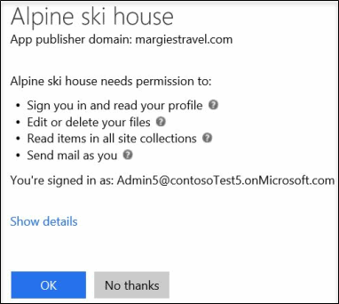

# Slå på och stänga av integrerade applikationerTurning Integrated Apps on or off

När integrerade appar är aktiverade kan användare i organisationen tillåta att appar från tredje part får åtkomst till sin Microsoft 365-information.When Integrated Apps is turned on, users in your organization can allow third-party apps to access their Microsoft 365 information. Till exempel tredjepartsprogram som använder informationen i kalendern eller kan användas för att redigera filer i en OneDrive-mapp.For example, when someone uses a third-party app, that app might ask for permission to access their calendar and to edit files that are in a OneDrive folder.

## Slå på och stänga av integrerade applikationerTurning Integrated Apps on or off

Så här aktiverar/inaktiverar du integrerade appar:Here's how to turn Integrated Apps on or off.

1. Gå till \> sidan **Inställningar,** **Tjänster** i administrationscentret **för** \> Microsoft 365 och välj sedan **Integrerade appar**.In the Microsoft 365 admin center, go to the **Settings** \> **Settings** page, \> **Services** tab, and then select **Integrated apps**.

2. På sidan **Integrerade appar** väljer du alternativet att aktivera eller inaktivera integrerade appar.On the **Integrated Apps** page, select the option to turn Integrated Apps on or off.

## Mer information om integrerade apparMore info on Integrated Apps

En integrerad app kan skapas inifrån din egen organisation, eller så kan den komma från en annan organisation eller en tredje part.An integrated app can be created from within your own organization, or it can come from another organization or a third-party.

Om du har aktiverat integrerade appar och använder en sådan får du en fråga om vilken behörighetsnivå till användarens information som appen ska ha.When Integrated Apps is turned on and an app is used, the app asks for permission to set the level of access it needs when it accesses the user's information. En användare kan endast ge åtkomst till appar som de äger och som har åtkomst till sin Microsoft 365-information.A user can give access only to apps they own that access their Microsoft 365 information. Det går inte att ge åtkomst till andra användares information.They can't give an app access to any other user's information.

Det finns två typer av behörigheter som används när du använder integrerade appar i Microsoft 365: användarbehörigheter och administratörsbehörigheter.There are two kinds of permissions that are used when using Integrated Apps in Microsoft 365: user permissions and admin permissions. Exempel: Om integrerade appar är aktiverat för organisationen och en tredjepartsapp används kan användaren få en fråga om appen får använda användarens profilinformation, redigera och ta bort filer, använda information i webbplatssamlingar och skicka e-post i användarens namn.For example, when your organization is enabled for Integrated Apps and a user uses a third-party app, the app might ask for the user's permission to read their user profile details, edit or delete their files, read items contained in site collections, and send email as that user.

Om en administratör registrerar en app för alla användare i en organisation ombeds han eller hon om tillåtelse att låta appen komma åt information och resurser i organisationen.If an admin registers an app for all users in an organization, he or she is asked for permission to let that app access information and resources in the organization. Efter det, när andra användare i organisationen använder appen, får de ingen fråga om behörighet.After this, when other users in the organization use that app, they won't be asked for permission. När en administratör registrerar en app måste den administratören kontrollera appens utgivare.When an admin registers an app, that admin must make sure that they trust that app's publisher. Mer information om registrering av appar finns i [Lägga till, uppdatera och ta bort program](https://go.microsoft.com/fwlink/p/?LinkID=518600).For details on registering an app, see [Adding, Updating and Removing an Application](https://go.microsoft.com/fwlink/p/?LinkID=518600).

Om du har inaktiverat integrerade appar avinstalleras inte program som redan har installerats och har behörighet till information, och behörigheterna tas inte bort. Trots att integrerade appar är inaktiverat kan administratörer fortfarande registrera program och göra dem tillgängliga för användarna och tillåta att apparna använder informationen. Mer information om hur du tar bort en registrerad app och dess behörigheter finns i [Lägga till, uppdatera och ta bort program](https://go.microsoft.com/fwlink/?LinkID=518600&amp;clcid=0x409).If Integrated Apps is turned off, apps that have already been installed and have permission to access information won't be uninstalled, and the permissions won't be removed. Even though Integrated Apps is turned off, admins can still register apps to make them available to their users and allow those apps access to the users' information. For details on removing a registered application and it's permissions, see [Adding, Updating and Removing an Application](https://go.microsoft.com/fwlink/?LinkID=518600&amp;clcid=0x409).

