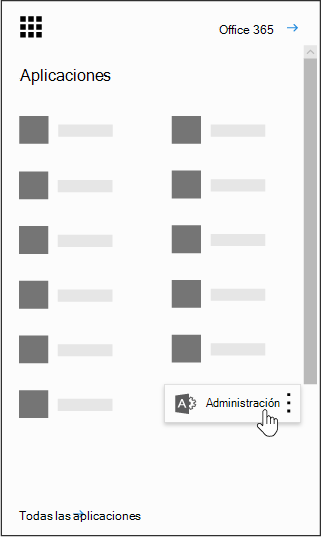

# Power BI i organisationen

På den här sidan beskrivs hur användare i organisationen kan använda Power BI, och hur du kan styra hur din organisation tar del av den här tjänsten.

## Vad är Power BI?

Med Microsoft Power BI kan användarna visualisera data, dela upptäckter med varandra och samarbeta på nya och intuitiva sätt. Mer information finns på [Power BI-webbplatsen](https://powerbi.microsoft.com/en-us/).
  
## Uppfyller Power BI nationella, regionala och branschspecifika efterlevnadskrav?

Mer information om Power BI-efterlevnad finns i [Microsoft Säkerhetscenter.](https://go.microsoft.com/fwlink/?LinkId=785324)
  
## Hur registrerar sig användarna för Power BI?

Som administratör kan du registrera dig för Power BI via [Power BI-webbplatsen](https://powerbi.microsoft.com/en-us/). Du kan också registrera dig via sidan Köptjänster i administrationscentret för Microsoft 365. När administratörer registrerar sig för Power BI kan de tilldela prenumerationslicenser till användare som bör ha åtkomst.
  
Dessutom kan enskilda användare i organisationen registrera sig för Power BI via [Power BI-webbplatsen](https://powerbi.microsoft.com/en-us/). När en användare i organisationen registrerar sig för Power BI tilldelas den användaren en Power BI-licens automatiskt.
  
## Hur registrerar sig enskilda användare inom organisationen?

Det finns tre situationer som kan gälla för användare i organisationen:
  
### Situation 1: Organisationen har redan en befintlig Microsoft 365-miljö och användaren som registrerar sig för Power BI har redan ett Microsoft 365-konto.

I den här situationen, där användaren redan har ett konto för arbetet eller skolan hos klientorganisationen (t.ex. contoso.com) men ännu inte har Power BI, aktiverar Microsoft helt enkelt abonnemanget för kontot, och användaren får automatiskt ett meddelande om hur man använder Power BI-tjänsten.
  
### Situation 2: Organisationen har en befintlig Microsoft 365-miljö och användaren som registrerar sig för Power BI har inget Microsoft 365-konto.

I det här scenariot har användaren en e-postadress i organisationens domän (till exempel contoso.com) men har ännu inte ett Microsoft 365-konto. I så fall kan användaren registrera sig för Power BI och får automatiskt ett konto. Det innebär att användaren får åtkomst till Power BI-tjänsten. Om en anställd som heter Nancy till exempel använder sin e-postadress till arbetet (till exempel Nancy@contoso.com) för att registrera sig lägger Microsoft automatiskt till Nancy som användare i Contoso Microsoft 365-miljön och aktiverar Power BI för kontot.
  
### Scenario 3: Organisationen har inte en Microsoft 365-miljö ansluten till din e-postdomän.

Organisationen behöver inte vidta några administrativa åtgärder för att kunna dra nytta av Power BI.
  
> [!IMPORTANT]
> Om organisationen har flera e-postdomäner och du föredrar att alla e-postadresstillägg finns i samma klientorganisation, ska du lägga till alla e-postadressdomäner i klientorganisationen innan användarna skapar den primära klientorganisationen. Det finns ingen automatiserad mekanism för att flytta användare mellan klientorganisationen när de har skapats. Mer information om den här processen finns i Om jag har flera domäner, kan jag styra den klientorganisation som användare läggs till [i?](#if-i-have-multiple-domains-can-i-control-the-tenant-that-users-are-added-to) längre fram i den här artikeln och Lägga till en domän i [Office 365](../setup/add-domain.md) online.
  
## Hur ändrar det här mitt nuvarande sätt att hantera identiteter för organisationens användare?

Om organisationen redan har en befintlig Microsoft 365-miljö och alla användare i organisationen har Microsoft 365-konton ändras inte identitetshanteringen.
  
Om organisationen redan har en befintlig Microsoft 365-miljö, men inte alla användare i organisationen har Microsoft 365-konton, skapas en användare i klientorganisationen och licenser tilldelas baserat på användarens e-postadress för arbetet eller skolan. Det innebär att antalet användare som du hanterar växer efter hand som användare inom organisationen registrerar sig för tjänsten.
  
Om du hanterar katalogen lokalt och använder AD FS (Active Directory Federation Services), så kommer Microsoft inte att lägga till några användare i klientorganisationen, och användare som försöker gå med i klientorganisationen får ett meddelande om att de ska kontakta organisationens administratör.
  
Om organisationen inte har en Microsoft 365-miljö ansluten till din e-postdomän ändras inte ditt sätt att hantera identiteter. Användarna läggs till i en ny, molnbaserad användarkatalog, och du har möjlighet att välja att ta över som administratör för klientorganisationen och hantera dem.
  
## Vilken är processen för att hantera en klientorganisation som skapats av Microsoft för mina användare?

Om en klientorganisation har skapats av Microsoft kan du begära och hantera klientorganisationen genom att följa stegen nedan:
  
1. Anslut till klientorganisationen genom att [registrera dig för Power BI](https://go.microsoft.com/fwlink/?LinkId=522448) med en e-postadressdomän som överensstämmer med den klientorganisationsdomän som du vill hantera. Om Microsoft t.ex. skapade klientorganisationen contoso.edu, så måste du ansluta till klientorganisationen med en e-postadress som slutar med @contoso.edu.

1. Begära administratörskontroll genom att verifiera att du äger domänen: du kan ge dig själv administratörsrollen genom att verifiera att du äger domänen. Gör så här:

::: moniker range="o365-worldwide"

3. Gå till [https://admin.microsoft.com](https://admin.microsoft.com).

::: moniker-end

::: moniker range="o365-germany"

3. Gå till [https://portal.office.de](https://portal.office.de).

::: moniker-end

::: moniker range="o365-21vianet"

3. Gå till [https://portal.partner.microsoftonline.cn](https://portal.partner.microsoftonline.cn).

::: moniker-end

4. Välj ikonen för startprogrammet i det övre vänstra hörnet, och välj sedan **Admin**.

    
  
5. Läs instruktionerna på **sidan Bli administratör** och välj sedan **Ja, jag vill vara administratör.**

    > [!NOTE]
    >  Om det här alternativet inte visas finns det redan en administratör på plats.
  
## Om jag har flera domäner, kan jag styra den klientorganisation som användare läggs till i?

Om du inte gör någonting skapas en klientorganisation för varje e-postdomän och e-postunderdomän för användare.
  
Om du vill att alla användare ska finnas i samma klientorganisation, oavsett e-postadresstillägg, gör du följande:
  
- Skapa en målklientorganisation i förväg eller använd en befintlig klientorganisation, och lägg till alla befintliga domäner och underdomäner som du vill samla i den klientorganisationen. Då kommer alla användare med e-postadresser som slutar med de domänerna och underdomänerna automatiskt att gå med i målklientorganisationen när de registrerar sig.

> [!IMPORTANT]
> Det finns ingen automatiserad mekanism för att flytta användare mellan klientorganisationer när de har skapats. Mer information om hur du lägger till domäner i en enda Microsoft 365-klientorganisation finns i [Lägga till en domän i Office 365.](../setup/add-domain.md)

> [!IMPORTANT]
> Mer information och råd om hur du hanterar klientorganisationen finns i [Vad är Power BI-administration?](/power-bi/service-admin-administering-power-bi-in-your-organization).
  
## Hur kan jag förhindra att användare ansluter sig till min befintliga klientorganisation?

Som administratör kan du vidta åtgärder för att hindra användare från att ansluta till den befintliga klientorganisationen. Om du blockerar användare från att ansluta till klientorganisationen kommer användarnas försök att logga in att misslyckas och de hänvisas till att kontakta organisationens administratör. Du behöver inte upprepa den här processen om du redan har inaktiverat automatisk licensdistribution tidigare (till exempel Office 365 Education för studenter, lärare och personal).
  
För de här stegen måste du använda Windows PowerShell. Om du vill få hjälp med att komma igång med Windows PowerShell kan du läsa [PowerShell Komma igång](/powershell/scripting/overview).
  
För att utföra följande steg måste du installera den senaste 64-bitarsversionen av [Azure Active Directory V2 PowerShell-modulen.](https://www.powershellgallery.com/packages/AzureADPreview/2.0.2.5)
  
När du har valt länken väljer du **Kör för** att köra installationspaketet.
  
**Inaktivera automatisk anslutning till klientorganisation**: Använd det här Windows PowerShell-kommandot för att hindra nya användare från att ansluta till en hanterad klientorganisation:
  
Så här inaktiverar du automatisk anslutning till klientorganisation för nya användare:  `Set-MsolCompanySettings -AllowEmailVerifiedUsers $false`
  
Så här aktiverar du automatisk anslutning till klientorganisation för nya användare:  `Set-MsolCompanySettings -AllowEmailVerifiedUsers $true`
  
> [!NOTE]
> Det förhindrar att nya användare i organisationen registrerar sig för Power BI. Användare som registrerar sig för Power BI innan du inaktiverar nya registreringar för organisationen kommer att få behålla sina licenser. Anvisningar om [hur du tar](#how-do-i-remove-power-bi-for-users-that-already-signed-up) bort åtkomst till Power BI för användare som redan har registrerat sig för tjänsten finns i Hur tar jag bort åtkomst till Power BI för användare som tidigare har registrerat sig för tjänsten.
  
## Hur tillåter jag att användare ansluter till min befintliga klientorganisation?

Om du vill tillåta att användarna ansluter till klientorganisationen inverterar du kommandot som anges i frågan ovan:  `Set-MsolCompanySettings -AllowEmailVerifiedUsers $true`
  
## Hur verifierar jag om jag har blockering aktiverad i klientorganisationen?

Använd följande PowerShell-skript:  `Get-MsolCompanyInformation | fl allow*`
  
## Hur kan jag förhindra att min befintliga användare börjar använda Power BI?

**Inaktivera automatisk licensdistribution:** Använd det här Windows PowerShell-skriptet för att inaktivera automatiska licensdistributioner för befintliga användare. Du behöver inte upprepa den här processen om du redan har inaktiverat automatisk licensdistribution tidigare (till exempel Office 365 Education för studenter, lärare och personal).
  
Så här inaktiverar du automatisk licensdistribution för befintliga användare:  `Set-MsolCompanySettings -AllowAdHocSubscriptions $false`
  
Så här aktiverar du automatisk licensdistribution för befintliga användare:  `Set-MsolCompanySettings -AllowAdHocSubscriptions $true`
  
> [!NOTE]
> Flaggan *AllowAdHocSubscriptions* används för att styra flera olika användarfunktioner för organisationen, bland annat möjligheten för användare att registrera sig för tjänsten Azure Rights Management Service. Om den här flaggan ändras, påverkas alla de här funktionerna.
  
## Hur tillåter jag att de befintliga användarna registrerar sig för Power BI?

Om du vill tillåta att användarna registrerar sig för Power BI inverterar du kommandot som anges i frågan ovan:  `Set-MsolCompanySettings -AllowAdHocSubscriptions $true`
  
## Hur tar jag bort Power BI för användare som redan registrerat sig?

Om en användare har registrerat sig för Power BI, men du inte längre vill att de ska ha åtkomst till Power BI, kan du ta bort Power BI-licensen för den användaren.

::: moniker range="o365-worldwide"
  
1. I administrationscentret går du till sidan **Användare** \> <a href="https://go.microsoft.com/fwlink/p/?linkid=834822" target="_blank">Aktiva användare</a>.

2. Leta reda på den användare du vill ta bort licensen för och välj sedan namnet.

3. Avmarkera **kryssrutan** **Microsoft Power BI** på fliken Licenser och appar.

4. Välj **Spara ändringar**.

::: moniker-end

::: moniker range="o365-germany"

1. I administrationscentret går du till sidan **Användare** \> <a href="https://go.microsoft.com/fwlink/p/?linkid=847686" target="_blank">Aktiva användare</a>.

2. Leta reda på den användare du vill ta bort licensen för och välj sedan namnet.

3. Bredvid **Produktlicenser väljer** du **Redigera**.

4. Inaktivera alternativet **Microsoft Power BI.**

5. Välj **Spara**.

::: moniker-end

::: moniker range="o365-21vianet"

1. I administrationscentret går du till sidan **Användare** \> <a href="https://go.microsoft.com/fwlink/p/?linkid=850628" target="_blank">Aktiva användare</a>.

2. Leta reda på den användare du vill ta bort licensen för och välj sedan namnet.

3. Bredvid **Produktlicenser väljer** du **Redigera**.

4. Inaktivera alternativet **Microsoft Power BI.**

5. Välj **Spara**.

::: moniker-end

## Hur vet jag när nya användare har anslutit till min klientorganisation?

Användare som har anslutit till din klientorganisation som en del av det här programmet tilldelas en unik licens som du kan filtrera efter i det aktiva användarfönstret på instrumentpanelen för administratörer.
  
Om du vill skapa den nya vyn följer du anvisningarna i Skapa en anpassad användarvy i [administrationscentret.](../add-users/create-edit-or-delete-a-custom-user-view.md#create-a-custom-user-view) Välj Microsoft Power BI under **Tilldelad produktlicens.** När den nya vyn har skapats kan du se alla användare i klientorganisationen som har registrerat sig för det här programmet.
  
## Finns det något annat som jag ska vara förberedd på?

Du får eventuellt fler förfrågningar om återställning av lösenord. Mer information om den här processen finns i [Återställa en användares lösenord](../add-users/reset-passwords.md).
  
Du kan ta bort en användare från klientorganisationen via standardprocessen i administrationscentret. Men om användaren fortfarande har en aktiv e-postadress från organisationen kan de ansluta igen såvida du inte blockerar alla användare från att ansluta.
  
## Varför visades 1 miljon licenser för Microsoft Power BI i min klientorganisation?

Eftersom din organisation är kvalificerad, är användare inom organisationen behöriga att använda Microsoft Power BI-tjänsten, och de här licenserna representerar den tillgängliga kapaciteten för nya Power BI-användare inom klientorganisationen. Ingen avgift utgår för de här licenserna. Om du har valt att tillåta användare att registrera sig själva för Power BI, kommer de att tilldelas en av de tillgängliga licenserna när de har slutfört registreringsprocessen. Du kan också välja att själv tilldela de här licenserna till användarna via administrationscentret.
  
## Kostar det någonting? Debiteras jag för licenserna?

Licenserna gäller för den kostnadsfria versionen av Power BI. Om du vill ha fler funktioner kan du ta en titt på Power BI Pro.
  
## Varför 1 miljon licenser?

Vi valde ett antal som var tillräckligt stort för att majoriteten av alla organisationer skulle ha tillräckligt många licenser för att kunna erbjuda den här förmånen till sina användare utan fördröjning.
  
## Vad händer om jag behöver mer än 1 miljon licenser?

Kontakta din Microsoft-kontorepresentant för mer information om du behöver skaffa ytterligare licenser.