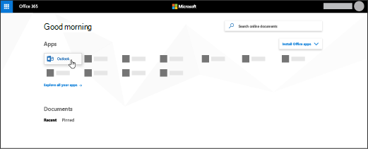

# Konfigurera Outlook för att läsa e-postSet up Outlook to read email

Din Office 365-prenumeration medföljer en webbaserad Outlook, men om din prenumeration innehåller Office-klientappar får du också Outlook som du kan installera på din dator eller dina enheter.Your Office 365 subscription comes with a web-based Outlook, but if your subscription includes Office client apps, you will also get Outlook you can install on your personal computer or devices.
  
## Konfigurera ett e-postkonto i OutlookSet up an email account in Outlook

Första gången du öppnar Outlook öppnas en guiden Automatiskt konto.The first time you open Outlook, an Auto Account Wizard opens. Om inte, välj **Arkiv** sedan **Lägg till konto**.If not, choose **File** then **Add Account**.
  
1. På sidan **E-postkonton** väljer du **Nästa** \> **lägg till konto**.On the **E-mail Accounts** page, choose **Next** \> **Add Account**.
    
2. På sidan **Konfigurera automatiskt konto** anger du ditt namn, din e-postadress och ditt lösenord och väljer sedan **Nästa** \> **slut**.On the **Auto Account Setup** page, enter your name, email address, and password, and then choose **Next** \> **Finish**.
    
Läs [hela artikeln](https://support.office.com/article/6e27792a-9267-4aa4-8bb6-c84ef146101b.aspx).Read [full article](https://support.office.com/article/6e27792a-9267-4aa4-8bb6-c84ef146101b.aspx).
  
## Hur installerar jag Office-apparna, inklusive Outlook?How do I install the Office apps, including Outlook?

1. Gå till [admin.microsoft.com/OLS/MySoftware](https://admin.microsoft.com/OLS/MySoftware.aspx).Go to [admin.microsoft.com/OLS/MySoftware](https://admin.microsoft.com/OLS/MySoftware.aspx).
    
2. Logga in med ditt jobb- eller skolkontoSign in with your work or school account.
    
3. Välj **Installera**på Hantera installationer.On Manage installs, select **Install**.
    
## Konfigurera ett e-postkonto i Outlook 2016 för MacSet up an email account in Outlook 2016 for Mac

Första gången du öppnar Outlook-appen öppnas guiden Konfigurera min inkorg.The first time you open Outlook app, Set up my Inbox wizard opens. I guiden:In the wizard: 
  
1. Välj **Lägg till konto**på sidan Konfigurera min **Inkorg.**On the **Set up my Inbox** page, select **Add Account**.
    
2. På sidan **Konton** väljer du **Exchange eller Office 365**.On the **Accounts** page, select **Exchange or Office 365**.
    
3. På sidan **Ange ditt Exchange-kontoinformation** anger du ditt namn, din e-postadress och ditt lösenord och väljer sedan **Lägg till konto**.On the **Enter your Exchange account information** page, enter your name, email address, and password, and then select **Add Account**.
    
Läs [hela artikeln](https://support.office.com/article/6e27792a-9267-4aa4-8bb6-c84ef146101b.aspx#PickTab=Outlook_for_Mac).Read [full article](https://support.office.com/article/6e27792a-9267-4aa4-8bb6-c84ef146101b.aspx#PickTab=Outlook_for_Mac). 
  
## Hur öppnar jag min e-post online?How do I access my mail online?

När du har loggat in på Office 365 väljer du **Outlook**.After you sign in to Office 365, select **Outlook**.
  

  
Hittar du inte appen du söker? Från appfönstret kan du välja **Alla appar** för att se en alfabetisk lista över tillgängliga Office 365-appar. Därifrån kan du söka efter en specifik app.Can't find the app you're looking for? From the app launcher, select **All apps** to see an alphabetical list of the Office 365 apps available to you. From there, you can search for a specific app. 
  
## Hur vet jag om min prenumeration innehåller Office-appar?How do I know if my subscription includes Office apps?

Office 365 Business Premium och Office 365 Business inkluderar Office-appar.Office 365 Business Premium and Office 365 Business include Office apps. Mer information finns i [Office 365 Business-abonnemang](https://go.microsoft.com/fwlink/p/?LinkId=723731)eller [Office 365 Enterprise-abonnemang](https://go.microsoft.com/fwlink/p/?LinkId=800029).For details see [Office 365 Business plans](https://go.microsoft.com/fwlink/p/?LinkId=723731), or [Office 365 Enterprise plans](https://go.microsoft.com/fwlink/p/?LinkId=800029).
  
## Hur avgör jag vilken prenumeration jag har?How do I determine what subscription I have?

Information om hur du tar reda på din prenumeration finns i [Vilken prenumeration har jag?](../admin-overview/what-subscription-do-i-have.md)To determine your subscription, see [What subscription do I have?](../admin-overview/what-subscription-do-i-have.md)
  

