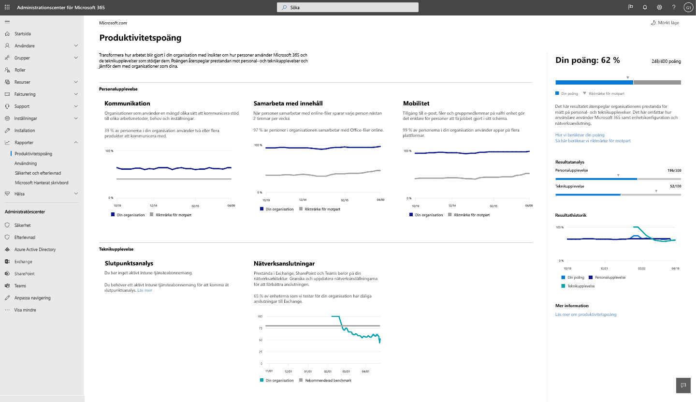

# Microsofts produktivitetspoäng (förhandsversion)

Produktivitetspoäng hjälper organisationer att förändra hur arbetet utförs med insikter om hur människor använder Microsoft 365 och de teknikupplevelser som stöder dem. Poängen återspeglar organisationens resultat mot mått på medarbetar- och teknikupplevelse och jämför dina poäng med organisationer som din.

Poängen inkluderar:

- **Mätvärden** som hjälper dig att se hur personer använder Microsoft 365-produkter för att samarbeta, kommunicera och arbeta på olika plattformar.
- **Insikter** om data som hjälper dig att identifiera möjligheter att förbättra medarbetarnas produktivitet och tillfredsställelse.
- **Rekommenderade åtgärder** som du kan vidta för att hjälpa användarna i organisationen att använda Microsoft 365-produkter effektivt så att alla kan göra sitt bästa.

Vi tillhandahåller data, insikter och rekommendationer inom två områden: 

- **Medarbetarnas erfarenhet:** Vi mäter hur personer samarbetar med innehåll, hur de använder Microsoft 365-produkter för att kommunicera och om de använder Microsoft 365 på olika plattformar. 

    Vi ger dessa insikter eftersom när människor samarbetar online sparar de tid. När de har friheten att arbeta på alla enheter, de är mer produktiva och nöjda. När de kan kommunicera på ett flexibelt sätt är de mer effektiva, bildar bättre relationer och din organisation är mer enhetlig. För bevis, se [Forrester rapport](https://vc2prod.blob.core.windows.net/vc-resources/TEIStudies/TEI%20of%20Microsoft%20365%20E5%20-%20Oct%202018.pdf).

- **Teknikerfarenhet:** Produktiviteten är beroende av tillförlitlig och högpresterande teknik samt effektiv användning av Microsoft 365. Vi tillhandahåller slutpunktsanalys, som ger dig insikter och rekommendationer om enhetsinstallation och starttider, och vi tillhandahåller Microsoft 365-nätverksanslutningsstatistik för din organisation.

Mer information om slutpunktsanalys finns [i översikten över nätverksanslutningen](https://docs.microsoft.com/office365/enterprise/office-365-networking-overview).
  

## Hur poängen beräknas

Din produktivitetspoäng baseras på de sammanlagda poängen för dina kategorier av medarbetar- och teknikupplevelser. Varje kategori viktas lika, med totalt 100 poäng per kategori. Den totala möjliga poäng för produktivitetspoäng är 500.

### Poängkategorier 

- Samarbete om innehåll (100 poäng)
- Meddelande (100 poäng)
- Rörlighet (100 poäng)
- Analys av slutpunkt (100 poäng)
- Nätverksanslutning (100 poäng)
- **Totalt möjligt = 500 poäng**
 
 I varje kategori identifierar vi mönster för viktiga aktiviteter som är indikatorer för hur personer använder Microsoft 365-produkter för att samarbeta, kommunicera och arbeta på olika plattformar. Vi erbjuder 28-dagars och 180-dagars utsikt över de viktigaste aktiviteterna. Vi tillhandahåller också stödmått som inte ingår i poängberäkningen men som är viktiga för att hjälpa dig att identifiera underliggande beteenden och inställningar som du kan agera på för att driva förändring.

### Produkter som ingår i produktivitetspoäng 

Produktivitetspoängen omfattar data från Exchange, SharePoint, OneDrive, Teams, Word, Excel, PowerPoint, OneNote, Outlook, Yammer och Skype.

Din poäng uppdateras dagligen och återspeglar användaråtgärder som slutförts under de senaste 28 till 180 dagarna (inklusive den aktuella dagen).

## Förutsättningar 

Du behöver en Microsoft 365 för företag eller Office 365 för företagsprenumeration för att få data från medarbetarnas erfarenhet och du måste använda molntjänster för flera innehavare. Om du vill hämta slutpunktsanalysdata för din klientorganisation måste du lägga till Microsoft Intune i din prenumeration. Intune hjälper dig att skydda organisationens data genom att hantera enheter och appar.       När du har Intune kan du aktivera slutpunktsanalys inom Intune-upplevelsen. Läs mer om Microsoft Intune. 

Om du vill visa produktivitetspoängen för din organisation måste du ha en av följande roller: 

- Global administratör 
- Exchange-administratörer
- SharePoint-administratör 
- Skype för företag-administratör 
- Teams-administratör 
- Global läsare 
- Rapporter Reader 

Du kan komma åt upplevelsen från Microsoft 365 Admin home under **Reports** > **Productivity Score**.

## Tolka produktivitetspoäng 

På hemsidan för produktivitetspoäng visas din totala poäng- och poänghistorik samt den primära insikten för varje kategori

**Din poäng** visas som ett procentvärde såväl som i poäng så att du kan se dina poäng (täljare) och högsta möjliga poäng (nämnare).

**Peer riktmärken** kan du jämföra dina poäng med organisationer som din. För kategorierna medarbetarnas erfarenhet beräknas peer-benchmark-måttet som medelvärdet av mått inom en uppsättning liknande organisationer. Uppsättningen består av organisationer i din region med ett liknande antal licensierade användare, typer av licenser, bransch och anställning med Microsoft 365. 

Peer-riktmärket för slutpunktsanalys innehåller mål för enhetens startprestanda och rekommenderad programvarukonfiguration baserat på aggregerade medianvärden för alla klienter.

För nätverksanslutning är det rekommenderade riktmärket 80 poäng.

Avsnittet **Poängfördelning** ger en uppdelning av produktivitetspoängen med riktmärken efter personal- och teknikupplevelseområden.

Poänghistoriken visar hur dina poäng i varje kategori har förändrats under de senaste 6 månaderna.

**Erfarenhetsområdena Medarbetarnas erfarenhet** och **Teknik** innehåller de primära insikterna för kategorierna inom dessa områden. Du kan klicka på varje kategori för att se djupare insikter.

## Kategoriinformationssidor

Varje kategoriinformationssida visar den primära insikten och stödmåtten samt relaterad forskning och åtgärder som du kan vidta för att driva förändring i organisationen. Forskning stöder vikten och logiken bakom de primära insikterna för varje kategori. Mer information [finns i Forrester-rapporten](https://vc2prod.blob.core.windows.net/vc-resources/TEIStudies/TEI%20of%20Microsoft%20365%20E5%20-%20Oct%202018.pdf).

### Information om innehållssamarbete

Den primära insikten för innehållssamarbete är antalet personer som skapar, läser och samarbetar (redigerar och delar) online. Dessa åtgärder är viktiga eftersom forskning visar att när människor samarbetar med online-filer, sparar varje person i genomsnitt 100 minuter, eller nästan 2 timmar, per vecka.

Vi definierar innehållssamarbete som en person som skapar och delar en Office-fil och sedan minst en annan person som redigerar den. 

Läsare: Personer som kommer åt eller laddar ned onlinefiler i OneDrive eller SharePoint.

**Skapare:** Personer som skapar, ändrar, laddar upp, synkroniserar, checkar in, kopierar eller flyttar Online-OneDrive- eller SharePoint-filer.

Medarbetare: Personer som samarbetar med onlinefiler med OneDrive eller SharePoint. Två personer är medarbetare om en av dem läser eller redigerar ett onlinedokument i Word, Excel, PowerPoint, OneNote eller PDF när den andra personen har skapat eller modifierat det i ett 28-dagarsfönster.

De filtyper som övervägs för samarbete är Word-, Excel-, PowerPoint-, OneNote- och PDF-filer.

Vi ger insikter om starttiderna och konfigurerar för enheter i din organisation samt nätverksanslutningsinsikter för innehållssamarbete eftersom samarbete med onlinefiler kräver tillförlitliga enheter som startar snabbt och har uppdaterad programvara samt bra anslutning till Microsoft 365.

### Information om kommunikation

Den primära insikten för kommunikation är hur ofta personer i organisationen använder e-post, chatt och community-inlägg för att kommunicera. Den här insikten är viktig eftersom när människor använder en mängd olika kommunikationsverktyg i realtid kan de välja det kommunikationssätt som hjälper dem att bli mest effektiva, och de har verktyg som chatt och grupper som hjälper dem att utveckla relationer över kontorsplatser.

### Information om rörlighet

Den primära insikten för mobilitet är antalet personer som får åtkomst till filer och använder e-post och chatt på flera plattformar. Möjligheten att arbeta från vilken plats som helst på vilken enhet de väljer är viktigt för personer med försäljningsroller, högre chefer, konsulter och andra som behöver arbeta bort från kontoret för att vara produktiva. Förbättringar för dessa arbetstagare har stor inverkan. 

Vi mäter procentandelen och det absoluta antalet personer som använde minst en Microsoft 365 produktivitetsapp på två eller flera plattformar, inklusive stationära, mobila och webb. De produktivitetsappar vi mäter är Outlook, Teams, Word, Excel, PowerPoint, OneNote, Yammer och Skype. Personer måste ha Microsoft 365-appar för företags-, Exchange-, Yammer-, Skype- eller Teams-licenser som ska mätas. 

## vi vill höra från dig

Vänligen dela dina tankar om Produktivitetspoäng och dina idéer om hur du kan förbättra den. Använd avsnitten **Feedback** i produkten och/eller kontakta produktivitetspoängteamet på ProductivityScorePreview@service.microsoft.com.