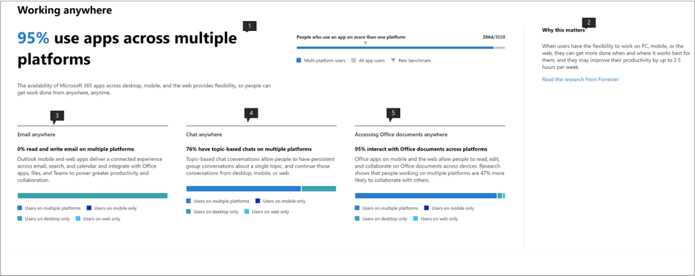

# Microsofts produktivitetspoäng (förhandsversion)

Microsoft 365 erbjuder produktivitetslösningar som gör att din organisation kan uppfylla sina affärsmål. Produktivitetspoäng ger insikter om hur du använder dessa lösningar som du kan omvandla till hur arbetet utförs.Den innehåller: 

- **Synlighet** genom att hjälpa dem att förstå hur människor arbetar i form av sin nuvarande poäng med uppdelning mellan kategorier av medarbetarerfarenhet och teknik erfarenhet (kommer snart). 
- **Insikter** för att identifiera möjligheter för att möjliggöra förbättrade upplevelser. 
- **Åtgärder** för att uppdatera färdigheter och system så att alla kan göra sitt bästa arbete. 

Poängen och insikterna finns i två kategorier –  

- **Medarbetarerfarenhet:** visar hur Microsoft 365 hjälper till att skapa en produktiv och engagerad arbetsstyrka genom att kvantifiera hur människor samarbetar med innehåll, arbetar var som helst, genom att förstå kommunikationsstilar (kommer snart) och genom att utveckla en möteskultur (kommer snart) 

- **Teknikupplevelse** (kommer snart): Hjälper dig att optimera dina enhetsupplevelser, till exempel proaktivt åtgärda vanliga helpdesk-problem, och förbättra datorns starttider och ditt nätverk för att säkerställa att dina appar fungerar bra.  

## Så här fungerar det

### Områden av poängsättning 

Inom varje poängkategori ger Produktivitetspoäng insikter om din arbetsomvandling mellan områden. De områden som omfattas av medarbetarerfarenhet är:

- Samarbeta med innehåll  
- Arbeta var som helst 
- Förstå kommunikationsstilar (kommer snart) 
- Utveckla ett möte kultur (kommer snart) 

### Bedömning av användaråtgärder 

Inom varje område mäter vi de forskningsbaserade nyckelåtgärder som representerar de arbetssätt som gör det möjligt för organisationer att omvandlas till en mycket produktiv organisation. För varje område beräknar vi % av användarna som utför dessa åtgärder under de senaste 28 dagarna. 

Medarbetarupplevelsens poäng är kurerad som en genomsnittlig poäng i alla områden. Observera att vi kommer att fortsätta att lägga till fler områden till Medarbetarnas erfarenhet och teknikupplevelse över tid. 

### Produkter som ingår i produktivitetspoängen 

Produktivitetspoäng innehåller för närvarande signaler från de viktigaste arbetsbelastningarna i Microsoft 365 OneDrive, SharePoint, Word, Excel, PowerPoint, OneNote, Outlook, Yammer, Teams, Skype. 

Din poäng uppdateras dagligen och återspeglar användaråtgärder som slutförts under de senaste 28 dagarna (inklusive den aktuella dagen).

## Åtkomst och nödvändiga behörigheter 

För medarbetarupplevelsen måste du ha en prenumeration på ett Microsoft 365 för affärsabonnemang med flera användare. 

Om du vill ha behörighet att komma åt Microsofts produktivitetspoäng måste du ha följande roller: 

- Global administratör 
- Exchange-administratörer 
- SharePoint-administratörer 
- Skype för företag-administratörer 
- Teams-administratör 
- Global läsare 
- Rapporter Reader 

Du kan komma åt upplevelsen från Microsoft 365 Admin home genom att välja **Rapporter** > **Produktivitetspoäng** i den vänstra navigeringen.

## Tolka produktivitetspoäng 

### Läs om hur din organisation fungerar 

he Productivity Score hemsida ger den aktuella poängen och historiken i procent, primära insikter för områden inom varje poängkategori kompletterad med riktmärken. 

1.**Produktivitetspoängen** är listad i procent <numerator> / <denominator> och i formatet så att du även kan se dina absoluta poäng (täljare) och högsta möjliga poäng  
1. Med den här pivoten kan du välja den poängkategori som du vill fokusera på. I förhandsgranskningen kan du bara visa **medarbetarupplevelse,** men valet kommer snart att utökas till att omfatta **teknikupplevelse**. 
1. **Peer benchmark** kan du jämföra din nuvarande poäng med organisationer som du. Referensmåttet beräknas som medelvärdet av mått inom en uppsättning liknande organisationer. Uppsättningen består av organisationer som har liknande antal aktiverade användare, regioner, vilka typer av licenser du äger, bransch och innehav inom Microsoft 365 eller Office 365. 
1. Avsnittet **Poängkategorier** ger en uppdelning av produktivitetspoängen med riktmärken per kategori.
1. **Poänghistoriken** visar hur dina poäng i varje kategori har flyttats under de senaste 6 månaderna.
1. Den primära insikten för **att samarbeta om innehåll** visar relevanta mått med riktmärken från det här området som bidrar till poängen. Välj **Visa information** om du vill visa informationssidan för området.
1. Den primära insikten för **att arbeta var som helst** visar relevanta mått med riktmärken från detta område som bidrar till poängen. Välj **Visa information** om du vill visa informationssidan för området.  

### Insikter för att identifiera möjligheter att förbättra upplevelser 

För varje område väljer du **Visa information** i den primära insikten om du vill visa områdesinformationssidan som visar ytterligare insikter, relaterad forskning och åtgärder för att förbättra dina poäng. .

Alla områdesdetaljer följer följande struktur: 

- Överst till vänster: Primär insikt behålls från startsidan.
- Nere till vänster: Stöd insikter med kontextuella åtgärder.  
- Höger: Akademisk forskning som visar sambandet mellan området och produktivitet.

Dessutom innehåller alla insikter följande element: 

- Rubrik: Nyckel takeaway eller resultat spåras för varje insikt;
- Sammanfattning: Ytterligare förklaring till varför måtten i insikten är viktiga för organisationens produktivitet. 
- Datavisualisering: Visuellt kvantifierar organisationens position med avseende på måtten i insikten med riktmärken som tillämpligt.
- Åtgärder: Kontextuella åtgärder som kan hjälpa till att driva mer av det önskade resultatet per insikt och därmed förbättra din poäng.

### Sidan Områdesinformation – Samarbeta om innehåll 

Att samarbeta på innehållssidan innehåller den primära insikten från startsidan för produktivitetsresultat. Den har följande komponenter:

1. Rubrik: Kvantifierar hur många procent av användarna som samarbetar med innehåll (nyckelresultat).
1. Kropp: Mer detaljerat om hur ökat samarbete leder till högre produktivitet.
1. Visualisering: Detta kvantifierar visuellt varje element som bidrar till poängen för detta område med riktmärken:

    - **Läsare**: Kvantifierar användare som använder eller hämtar filer i molnet (OneDrive och SharePoint) i en bas av OneDrive- och SharePoint-aktiverade användare.
    - **Författare**: Kvantifierar användare som ändrar, laddar upp, synkroniserar, checkar in, kopierar eller flyttar filer i molnet (OneDrive och SharePoint) i en bas av OneDrive- och SharePoint-aktiverade användare.
    - **Medarbetare**: Kvantifierar användare som samarbetar med filer i molnet (OneDrive och SharePoint) i en bas av OneDrive- och SharePoint-aktiverade användare. Två användare är medarbetare om en av dem läser eller redigerade ett Word-, Excel-, PowerPoint-, OneNote- eller PDF-molndokument efter att det andra har skapat eller ändrat det i ett 28-dagarsfönster.

1. **Varför det är viktigt** ger en sammanfattning av forskning som länkar samarbete på molnfiler med produktivitet. **Läs forskningen från Forrester** går till en forskningsartikel som ger mer sammanhang om hur samarbete bidrar till ökad produktivitet.
1. Med hjälp av insikt om **samarbete i flera filer** kvantifieras hur användare i organisationen samarbetar mellan olika filer. 
1. Stöd insikt om **Delning av molnfiler** kvantifierar om användare delar innehåll i molnet samtidigt som de skiljer sig från intern och extern delning.
1. Stödinsikt för **att skicka molnfiler via e-post** kvantifierar om användare som delar filer via e-post använder bilagor kontra länkar till molnfiler.

De filtyper som övervägs för samarbete är Word/Excel/PowerPoint/OneNote/PDF.

### Sidan Områdesinformation – Arbeta var som helst 

På sidan Arbeta var som helst kvantifieras de användare (i procent och absolut värde) som har använt minst en produktivitetsapp på två eller flera plattformar, som är stationära, mobila och webb. Användarna får högre poäng för att använda fler appar och plattformar. De appar som övervägs är Outlook, Teams, Word, Excel, PowerPoint, OneNote, Yammer, Skype. Basen för insikten är användare som är aktiverade för Microsoft 365 Apps för företag, Exchange, Yammer, Skype eller Teams.

1. **Varför det spelar roll** ger en sammanfattning från forskning som kopplar användningen av flera plattformar till högre produktivitet. **Läs forskningen från Forrester** går till en forskningsartikel som ger mer sammanhang om hur arbetet i hela bidrar till ökad produktivitet.
1. Med hjälp av insikt om **e-post var som helst** kvantifieras antalet användare i organisationen som använder Outlook på olika plattformar inom bas av användare som är aktiva i Outlook.
1. Med hjälp av insikt i **chatten var som helst** kvantifieras hur användare i din organisation använder Teams på olika plattformar inom basen av användare som är aktiva i Teams.
1. Med stöd för insikten om **hur du får åtkomst till Office-dokument var som helst** kvantifieras hur användare i organisationen använder Word, Excel, PowerPoint och OneNote på olika plattformar inom basen av användare som är aktiva i Word, Excel, PowerPoint eller OneNote.

### Åtgärder för att uppdatera färdigheter och system 

För att främja användbarhet, varje stödjande insikt kommer med infogade åtgärder som kan hjälpa till att omvandla din medarbetarupplevelse varav några kan konfigurationsändringar eller informationskampanjer. Om du klickar på dessa uppmaningar öppnas de alternativ för panelen rekommenderade åtgärder som du kan tänka dig. För närvarande är åtgärderna i **samarbeta om innehåll** aktiverade.

1. **Vyåtgärderna** går till en ruta med alla åtgärder som är relaterade till Samarbeta med innehåll.
1. **Uppmuntra användare att samarbeta** går till en lista med instruktionsvideor om samarbete med ämnen som samtidig redigering och @mentions. 
1. **Anpassa inställningarna** för extern delning går till en sida med en översikt över extern delning som beskriver vad som händer när användarna delar, beroende på vad de delar och med vem.  
1. **Ersätt bifogade filer med delade länkar** går till en sida som förklarar hur du delar OneDrive-länkar i stället för bilagor via e-post för bättre samarbete.

Om du väljer någon av åtgärdsknapparna öppnas fönstret **Rekommenderade åtgärder** till höger som har en sammanfattning av varje åtgärd och en länk till dokumentationssidorna.

## Vi vill höra från dig 

Vi vill använda den privata förhandsvisningen programmet för att få feedback och använda lärdomar för att samskapa produkten med dig framöver. Du kan använda avsnitten **Feedback** i produkten och/eller nå ut till produktivitetspoängteamet på ProductivityScorePreview@service.microsoft.com.

Fyll i formuläret på https://aka.ms/productivityscorepreview.  
