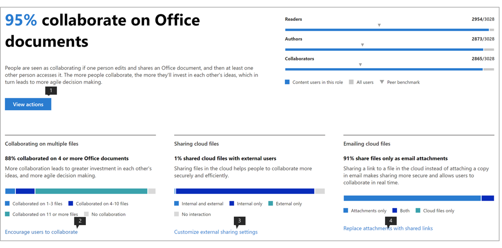

# Microsofts produktivitetspoäng (förhandsversion)Microsoft Productivity score (Preview)

Microsoft 365 erbjuder produktivitetslösningar som gör att din organisation kan uppfylla sina affärsmål.Microsoft 365 offers productivity solutions that enables your organization to meet its business goals. Produktivitetspoäng ger insikter om hur du använder dessa lösningar som du kan omvandla till hur arbetet utförs.Productivity Score provides insights to use these solutions that you can transform to how work gets done.Den innehåller: It contains: 

- **Synlighet** genom att hjälpa dem att förstå hur människor arbetar i form av sin nuvarande poäng med uppdelning mellan kategorier av medarbetarerfarenhet och teknik erfarenhet (kommer snart).**Visibility** by helping them understand how people work in the form of their current score with breakdown across categories of Employee experience and Technology experience (coming soon). 
- **Insikter** för att identifiera möjligheter för att möjliggöra förbättrade upplevelser.**Insights** to identify opportunities to enable improved experiences. 
- **Åtgärder** för att uppdatera färdigheter och system så att alla kan göra sitt bästa arbete.**Actions** to update skills and systems so everyone can do their best work. 

Poängen och insikterna finns i två kategorier –The score and the insights are present across two categories –  

- **Medarbetarerfarenhet:** visar hur Microsoft 365 hjälper till att skapa en produktiv och engagerad arbetsstyrka genom att kvantifiera hur människor samarbetar med innehåll, arbetar var som helst, genom att förstå kommunikationsstilar (kommer snart) och genom att utveckla en möteskultur (kommer snart)**Employee experience:** shows how Microsoft 365 is helping to create a productive and engaged workforce by quantifying how people collaborate on content, work anywhere, by understanding communication styles (coming soon), and by developing a meeting culture (coming soon) 

- **Teknikupplevelse** (kommer snart): Hjälper dig att optimera dina enhetsupplevelser, till exempel proaktivt åtgärda vanliga helpdesk-problem, och förbättra datorns starttider och ditt nätverk för att säkerställa att dina appar fungerar bra.**Technology experience** (coming soon): Assists you to optimize your device experiences such as proactively fixing common helpdesk issues,  and improving PC startup times and your network to ensure your apps work well.  

## Så här fungerar detHow it works

### Områden av poängsättningAreas of scoring 

Inom varje poängkategori ger Produktivitetspoäng insikter om din arbetsomvandling mellan områden.Within each score category, Productivity Score provides insights on your work transformation across areas. De områden som omfattas av medarbetarerfarenhet är:The areas covered within Employee experience are:

- Samarbeta med innehållCollaborating on content  
- Arbeta var som helstWorking anywhere 
- Förstå kommunikationsstilar (kommer snart)Understanding communication styles (coming soon) 
- Utveckla ett möte kultur (kommer snart)Developing a meeting culture (coming soon) 

### Bedömning av användaråtgärderScoring user actions 

Inom varje område mäter vi de forskningsbaserade nyckelåtgärder som representerar de arbetssätt som gör det möjligt för organisationer att omvandlas till en mycket produktiv organisation.Within each area, we measure the research-based key actions which represent the ways of working that enable organizations to transform into highly productive organization. För varje område beräknar vi % av användarna som utför dessa åtgärder under de senaste 28 dagarna.For each area we compute the % of users who perform these actions within the last 28 days. 

Medarbetarupplevelsens poäng är kurerad som en genomsnittlig poäng i alla områden.The Employee experience score is curated as an average score across all areas. Observera att vi kommer att fortsätta att lägga till fler områden till Medarbetarnas erfarenhet och teknikupplevelse över tid.Note that we will keep adding more areas to Employee experience and Technology experience over time. 

### Produkter som ingår i produktivitetspoängenProducts included in the Productivity Score 

Produktivitetspoäng innehåller för närvarande signaler från de viktigaste arbetsbelastningarna i Microsoft 365 OneDrive, SharePoint, Word, Excel, PowerPoint, OneNote, Outlook, Yammer, Teams, Skype.Productivity Score currently includes signals from the key Microsoft 365 workloads OneDrive, SharePoint, Word, Excel, PowerPoint, OneNote, Outlook, Yammer, Teams, Skype. 

Din poäng uppdateras dagligen och återspeglar användaråtgärder som slutförts under de senaste 28 dagarna (inklusive den aktuella dagen).Your score is updated daily and reflects user actions completed in the last 28 days (including the current day).

## Åtkomst och nödvändiga behörigheterAccess and required permissions 

För medarbetarupplevelsen måste du ha en prenumeration på ett Office 365 för företag-abonnemang eller ett Microsoft 365 Business-abonnemang med flera användare.For the employee experience, you must have a subscription to an Office 365 for business plan or a Microsoft 365 Business plan with multiple users. 

Om du vill ha behörighet att komma åt Microsofts produktivitetspoäng måste du ha följande roller:To have permission to access Microsoft Productivity Score, you must have of the following roles: 

- Global administratörGlobal admin 
- Exchange-administratörerExchange admins 
- SharePoint-administratörerSharePoint admins 
- Skype för företag-administratörerSkype for Business admins 
- Teams-administratörTeams admin 
- Global läsareGlobal Reader 
- Rapporter ReaderReports Reader 

Du kan komma åt upplevelsen från Microsoft 365 Admin home genom att välja **Rapporter** > **Produktivitetspoäng** i den vänstra navigeringen.You can access the experience from Microsoft 365 Admin home by choosing **Reports** > **Productivity Score** in the left navigation.

## Tolka produktivitetspoängInterpreting Productivity Score 

### Läs om hur din organisation fungerarLearn how your organization works 

he Productivity Score hemsida ger den aktuella poängen och historiken i procent, primära insikter för områden inom varje poängkategori kompletterad med riktmärken.he Productivity Score home page provides the current score and history on a percentage basis, primary insights for areas within each score category supplemented by benchmarks. 

1.**Produktivitetspoängen** är listad i procent <numerator> / <denominator> och i formatet så att du även kan se dina absoluta poäng (täljare) och högsta möjliga poäng1.**Productivity Score** is listed on a percentage basis as well as in the <numerator>/<denominator> format so you can also see your absolute points (numerator) and maximum possible points  
1. Med den här pivoten kan du välja den poängkategori som du vill fokusera på.This pivot allows you to select the score category you want to focus on. I förhandsgranskningen kan du bara visa **medarbetarupplevelse,** men valet kommer snart att utökas till att omfatta **teknikupplevelse**.In the preview, you can only view **Employee experience**, but the selection will soon expand to include **Technology experience**. 
1. **Peer benchmark** kan du jämföra din nuvarande poäng med organisationer som du.**Peer benchmark** allows you to compare your current score with organizations like you. Referensmåttet beräknas som medelvärdet av mått inom en uppsättning liknande organisationer.The benchmark measure is calculated as the average of measures within a set of similar organizations. Uppsättningen består av organisationer som har liknande antal aktiverade användare, regioner, vilka typer av licenser du äger, bransch och innehav inom Microsoft 365 eller Office 365.The set is composed of organizations who have similar number of enabled users, region, the types of licenses you own, industry, and tenure within Microsoft 365 or Office 365. 
1. Avsnittet **Poängkategorier** ger en uppdelning av produktivitetspoängen med riktmärken per kategori.The **Score categories** section provides a breakdown of your Productivity Score with benchmarks per category.
1. **Poänghistoriken** visar hur dina poäng i varje kategori har flyttats under de senaste 6 månaderna.**Score history** displays how your score in each category has moved in the past 6 months.
1. Den primära insikten för **att samarbeta om innehåll** visar relevanta mått med riktmärken från det här området som bidrar till poängen.The primary insight for **Collaborating on content** shows the relevant measures with benchmarks from this area that contribute to the score. Välj **Visa information** om du vill visa informationssidan för området.Select **View Details** to see the area detail page.
1. Den primära insikten för **att arbeta var som helst** visar relevanta mått med riktmärken från detta område som bidrar till poängen.The primary insight for **Working anywhere** shows the relevant measures with benchmarks from this area that contribute to the score. Välj **Visa information** om du vill visa informationssidan för området.Select **View Details** to see the area detail page.  

### Insikter för att identifiera möjligheter att förbättra upplevelserInsights to identify opportunities to improve experiences 

För varje område väljer du **Visa information** i den primära insikten om du vill visa områdesinformationssidan som visar ytterligare insikter, relaterad forskning och åtgärder för att förbättra dina poäng.For each area, select **View Details** in the primary insight to view the area detail page that displays additional insights, related research and actions to improve your score. ..

Alla områdesdetaljer följer följande struktur:All area detail pages follow the following structure: 

- Överst till vänster: Primär insikt behålls från startsidan.Top left: Primary insight retained from the home page.
- Nere till vänster: Stöd insikter med kontextuella åtgärder.Bottom left: Supporting insights with contextual actions.  
- Höger: Akademisk forskning som visar sambandet mellan området och produktivitet.Right: Academic research demonstrating the relationship between the area and productivity.

Dessutom innehåller alla insikter följande element:Additionally, all insights contain the following elements: 

- Rubrik: Nyckel takeaway eller resultat spåras för varje insikt;Header: Key takeaway or outcome tracked for each insight;
- Sammanfattning: Ytterligare förklaring till varför måtten i insikten är viktiga för organisationens produktivitet.Summary: Further explanation of why the measures in the insight are important for your organization’s productivity. 
- Datavisualisering: Visuellt kvantifierar organisationens position med avseende på måtten i insikten med riktmärken som tillämpligt.Data visualization: Visually quantifies your organization’s position with regard to the measures in the insight with benchmarks as applicable.
- Åtgärder: Kontextuella åtgärder som kan hjälpa till att driva mer av det önskade resultatet per insikt och därmed förbättra din poäng.Actions: Contextual action that can help drive more of the desired outcome per the insight and thus improve your score.

### Sidan Områdesinformation – Samarbeta om innehållArea detail page – Collaborating on content 

Att samarbeta på innehållssidan innehåller den primära insikten från startsidan för produktivitetsresultat.Collaborating on content page contains the primary insight from the Productivity Score home page. Den har följande komponenter:It has the following components:

1. Rubrik: Kvantifierar hur många procent av användarna som samarbetar med innehåll (nyckelresultat).Header: Quantifies what percentage of users are collaborating on content (key outcome).
1. Kropp: Mer detaljerat om hur ökat samarbete leder till högre produktivitet.Body: More detail on how increased collaboration leads to higher productivity.
1. Visualisering: Detta kvantifierar visuellt varje element som bidrar till poängen för detta område med riktmärken:Visualization: This visually quantifies each element that contributes to the score for this area with benchmarks:

    - **Läsare**: Kvantifierar användare som använder eller hämtar filer i molnet (OneDrive och SharePoint) i en bas av OneDrive- och SharePoint-aktiverade användare.**Readers**: Quantifies users accessing or downloading files on the cloud (OneDrive and SharePoint) within a base of OneDrive and SharePoint enabled users.
    - **Författare**: Kvantifierar användare som ändrar, laddar upp, synkroniserar, checkar in, kopierar eller flyttar filer i molnet (OneDrive och SharePoint) i en bas av OneDrive- och SharePoint-aktiverade användare.**Authors**:  Quantifies users modifying, uploading, syncing, checking in, copying or moving files on the cloud (OneDrive and SharePoint) within a base of OneDrive and SharePoint enabled users.
    - **Medarbetare**: Kvantifierar användare som samarbetar med filer i molnet (OneDrive och SharePoint) i en bas av OneDrive- och SharePoint-aktiverade användare.**Collaborators**: Quantifies users collaborating on files on the cloud (OneDrive and SharePoint) within a base of OneDrive and SharePoint enabled users. Två användare är medarbetare om en av dem läser eller redigerade ett Word-, Excel-, PowerPoint-, OneNote- eller PDF-molndokument efter att det andra har skapat eller ändrat det i ett 28-dagarsfönster.Two users are Collaborators if one of them read or edited a Word, Excel, PowerPoint, OneNote or PDF cloud document after the other created or modified it within a 28-day window.

1. **Varför det är viktigt** ger en sammanfattning av forskning som länkar samarbete på molnfiler med produktivitet.**Why it matters** provides a summary of research linking collaboration on cloud files with productivity. **Läs forskningen från Forrester** går till en forskningsartikel som ger mer sammanhang om hur samarbete bidrar till ökad produktivitet.**Read the research from Forrester** goes to a research article that provides more context on how collaboration is conducive to increased productivity.
1. Med hjälp av insikt om **samarbete i flera filer** kvantifieras hur användare i organisationen samarbetar mellan olika filer.Supporting insight on **Collaborating on multiple files** quantifies how users in your organization are collaborating across different files. 
1. Stöd insikt om **Delning av molnfiler** kvantifierar om användare delar innehåll i molnet samtidigt som de skiljer sig från intern och extern delning.Supporting insight on **Sharing cloud files** quantifies if users are sharing content on the cloud while drawing distinction between internal and external sharing.
1. Stödinsikt för **att skicka molnfiler via e-post** kvantifierar om användare som delar filer via e-post använder bilagor kontra länkar till molnfiler.Supporting insight on **Emailing cloud files** quantifies if users sharing files via email are using attachments versus links to cloud files.

De filtyper som övervägs för samarbete är Word/Excel/PowerPoint/OneNote/PDF.The file types considered for collaboration are Word/Excel/PowerPoint/OneNote/PDF.

### Sidan Områdesinformation – Arbeta var som helstArea detail page – Working anywhere 

På sidan Arbeta var som helst kvantifieras de användare (i procent och absolut värde) som har använt minst en produktivitetsapp på två eller flera plattformar, som är stationära, mobila och webb.The Working anywhere page quantifies the users (as a percentage and absolute value) who used at least one productivity app across two or more platforms, which are desktop, mobile and web. Användarna får högre poäng för att använda fler appar och plattformar.Users get scored higher for using more apps and platforms. De appar som övervägs är Outlook, Teams, Word, Excel, PowerPoint, OneNote, Yammer, Skype.The apps being considered are Outlook, Teams, Word, Excel, PowerPoint, OneNote, Yammer, Skype. Basen för insikten är användare som är aktiverade för Office 365 ProPlus, Exchange, Yammer, Skype eller Teams.The base of the insight are users enabled for Office 365 ProPlus, Exchange, Yammer, Skype or Teams.

1. **Varför det spelar roll** ger en sammanfattning från forskning som kopplar användningen av flera plattformar till högre produktivitet.**Why it matters** provides a summary from research linking usage of multiple platforms to higher productivity. **Läs forskningen från Forrester** går till en forskningsartikel som ger mer sammanhang om hur arbetet i hela bidrar till ökad produktivitet.**Read the research from Forrester** goes to a research article that provides more context on how working across is conducive to increased productivity.
1. Med hjälp av insikt om **e-post var som helst** kvantifieras antalet användare i organisationen som använder Outlook på olika plattformar inom bas av användare som är aktiva i Outlook.Supporting insight on **Email anywhere** quantifies number of users in your organization using Outlook across platforms within base of users active on Outlook.
1. Med hjälp av insikt i **chatten var som helst** kvantifieras hur användare i din organisation använder Teams på olika plattformar inom basen av användare som är aktiva i Teams.Supporting insight on **Chat anywhere** quantifies how users in your organization are using Teams across platforms within base of users active on Teams.
1. Med stöd för insikten om **hur du får åtkomst till Office-dokument var som helst** kvantifieras hur användare i organisationen använder Word, Excel, PowerPoint och OneNote på olika plattformar inom basen av användare som är aktiva i Word, Excel, PowerPoint eller OneNote.Supporting insight on **Accessing Office documents anywhere** quantifies how users in your organization are using Word, Excel, PowerPoint and OneNote across platforms within base of users active on Word, Excel, PowerPoint or OneNote.

### Åtgärder för att uppdatera färdigheter och systemActions for update skills and systems 

För att främja användbarhet, varje stödjande insikt kommer med infogade åtgärder som kan hjälpa till att omvandla din medarbetarupplevelse varav några kan konfigurationsändringar eller informationskampanjer.In order to promote actionability, each supporting insight comes with inline actions that can help transform your employee experience some of which can be configuration changes or awareness campaigns. Om du klickar på dessa uppmaningar öppnas de alternativ för panelen rekommenderade åtgärder som du kan tänka dig.Clicking on these calls-to-action opens in the recommended actions panel options that you might consider. För närvarande är åtgärderna i **samarbeta om innehåll** aktiverade.Currently the actions in the **Collaborating on content** are enabled.

1. **Vyåtgärderna** går till en ruta med alla åtgärder som är relaterade till Samarbeta med innehåll.The **View Actions** goes to a pane listing all actions related to Collaborating on content.
1. **Uppmuntra användare att samarbeta** går till en lista med instruktionsvideor om samarbete med ämnen som samtidig redigering och @mentions.**Encourage users to collaborate** goes to a list of instructional videos on collaboration with topics such as co-authoring and @mentions. 
1. **Anpassa inställningarna** för extern delning går till en sida med en översikt över extern delning som beskriver vad som händer när användarna delar, beroende på vad de delar och med vem.**Customize external sharing** settings goes to a page with an overview on external sharing describing what happens when users share, depending on what they're sharing and with whom.  
1. **Ersätt bifogade filer med delade länkar** går till en sida som förklarar hur du delar OneDrive-länkar i stället för bilagor via e-post för bättre samarbete.**Replace attachments with shared links** goes to a page explaining how to share OneDrive links instead of attachments over email for better collaboration.

Om du väljer någon av åtgärdsknapparna öppnas fönstret **Rekommenderade åtgärder** till höger som har en sammanfattning av varje åtgärd och en länk till dokumentationssidorna.Selecting any of the action buttons opens the **Recommended actions** pane on the right that has a summary of each action and a link to the documentation pages.

## Vi vill höra från digWe want to hear from you 

Vi vill använda den privata förhandsvisningen programmet för att få feedback och använda lärdomar för att samskapa produkten med dig framöver.We want to utilize the private preview program to glean feedback and use the learnings to co-create the product with you going forward. Du kan använda avsnitten **Feedback** i produkten och/eller nå ut till produktivitetspoängteamet på ProductivityScorePreview@service.microsoft.com.You can use the **Feedback** sections within the product and/or reach out to the Productivity Score team at ProductivityScorePreview@service.microsoft.com.

Fyll i formuläret på https://aka.ms/productivityscorepreview.To request access to the private preview please fill out the form at https://aka.ms/productivityscorepreview.  
