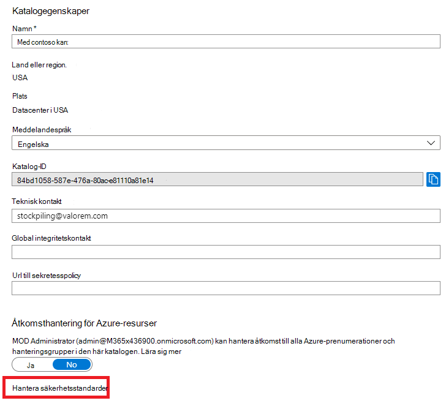
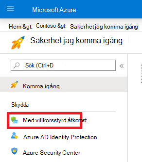
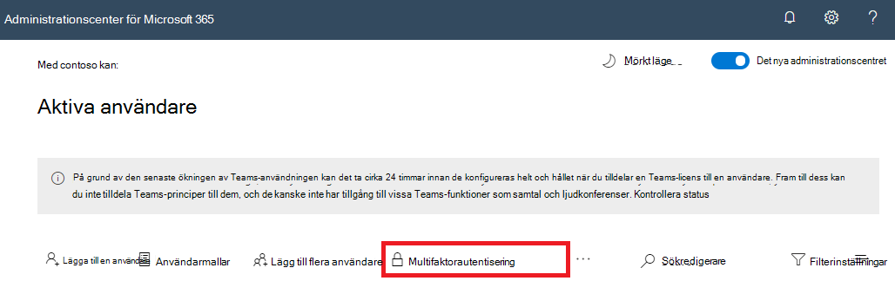

# Multifaktorautentisering för Microsoft 365

Lösenord är den vanligaste metoden för att autentisera en inloggning på en dator eller onlinetjänst, men de är också de mest sårbara. Användare kan välja enkla lösenord och använda samma lösenord för flera inloggningar till olika datorer och tjänster.

För att ge ytterligare säkerhetsnivå för inloggningar måste du använda multifaktorautentisering (MFA), som använder både ett lösenord, som bör vara starkt, och en ytterligare verifieringsmetod baserat på:

- En sak som du har med dig är inte enkelt att duplicera, till exempel en smartphone.
- Ett objekt som du är unikt och som finns i ens namn, som ditt fingeravtryck, ansikte eller annat biometriskt attribut.

Den ytterligare verifieringsmetoden används inte förrän användarens lösenord har verifierats. Med MFA har attacker inte din smartphone eller ditt fingeravtryck för att slutföra inloggningen, även om ett starkt användarlösenord har komprometterats.

## MFA-stöd i Microsoft 365

Som standard stöder både Microsoft 365 och Office 365 MFA för användarkonton med:

- Ett SMS som skickas till en telefon där användaren måste ange en verifieringskod.
- Ett telefonsamtal.
- Appen Microsoft Authenticator smartphone.

I båda fallen använder MFA-inloggningsmetoden "något du har med dig som inte är lätt att duplicera" för den ytterligare verifieringen. Du kan aktivera MFA för e-Microsoft 365 och Office 365 på flera Office 365:

- Med standardinställningar för säkerhet
- Med villkorsstyrda åtkomstprinciper
- För varje enskilt användarkonto (rekommenderas inte)

Dessa sätt baseras på ditt Microsoft 365 plan.

|Planera|Rekommendation|Typ av kund|
|---|---|---|
|Alla Microsoft 365 abonnemang|Använd säkerhetsstandarder, som kräver MFA för alla användarkonton. 
 Du kan också konfigurera MFA per användare för enskilda användarkonton, men det rekommenderas inte.|Småföretag|
|Microsoft 365 Business Premium 
 Microsoft 365 E3 
 Azure Active Directory (Azure AD) Premium P1-licenser|Använd villkorsstyrda åtkomstprinciper om du vill kräva MFA för användarkonton baserat på gruppmedlemskap, appar eller andra villkor.|Småföretag till företag|
|Microsoft 365 E5 
 Azure AD Premium P2-licenser|Använd Azure AD Identity Protection om du vill kräva MFA baserat på villkor för inloggningsrisk.|Enterprise|
||||

### Standardinställningar för säkerhet

Standardinställningar för säkerhet är en ny funktion för Microsoft 365 och Office 365, betalade eller utvärderingsprenumerationer skapade efter den 21 oktober 2019. De här prenumerationerna har aktiverat säkerhetsstandarder, som:

- Kräver att alla användare använder MFA med Microsoft Authenticator program.
- Blockerar äldre autentisering.

Användare har 14 dagar på sig att registrera sig för MFA med Microsoft Authenticator-appen från sina smartphones, som börjar från första gången de loggar in efter att standardinställningar för säkerhet har aktiverats. Efter 14 dagar kommer användaren inte att kunna logga in förrän MFA-registreringen är klar.

Standardinställningar för säkerhet säkerställer att alla organisationer har en grundläggande säkerhetsnivå för användarinloggning som är aktiverad som standard. Du kan inaktivera säkerhetsstandarder till att använda MFA med villkorsstyrda åtkomstprinciper.

Du aktiverar eller inaktiverar säkerhetsstandarder i **fönstret** Egenskaper för Azure AD i Azure-portalen.

Du kan använda säkerhetsstandarder i alla Microsoft 365 abonnemang.

Mer information finns i den här [översikten över standardinställningar för säkerhet](/azure/active-directory/fundamentals/concept-fundamentals-security-defaults).

### Principer för villkorsstyrd åtkomst

Principer för villkorsstyrd åtkomst är en uppsättning regler som anger villkoren under vilka inloggningar utvärderas och tillåts. Du kan till exempel skapa en princip för villkorsstyrd åtkomst som anger:

- Om namnet på användarkontot är medlem i en grupp för användare som är tilldelade rollerna Exchange, användare, lösenord, säkerhet, SharePoint eller global administratör krävs MFA innan åtkomst tillåts.

Med den här principen kan du kräva MFA baserat på gruppmedlemskap, i stället för att försöka konfigurera enskilda användarkonton för MFA när de tilldelas eller tas bort från dessa administratörsroller.

Du kan också använda villkorsstyrda åtkomstprinciper för mer avancerade funktioner, till exempel krav på MFA för specifika appar eller att inloggningen görs från en kompatibel enhet, till exempel en bärbar dator som kör Windows 10.

Du konfigurerar principer för villkorsstyrd **åtkomst från** säkerhetsfönstret för Azure AD i Azure-portalen.

Du kan använda villkorsstyrda åtkomstprinciper med:

- Microsoft 365 Business Premium
- Microsoft 365 E3 och E5
- Azure AD Premium P1- och Azure AD Premium P2-licenser

För småföretag med Microsoft 365 Business Premium kan du enkelt använda villkorsstyrda principer med följande steg:

1. Skapa en grupp som innehåller användarkonton som kräver MFA.
2. Aktivera principen **Kräv MFA för globala** administratörer.
3. Skapa en gruppbaserad villkorsstyrd åtkomstprincip med följande inställningar:
    - Uppgifter > Användare och grupper: Namnet på gruppen från steg 1 ovan.
    - Uppgifter > Molnappar eller åtgärder: Alla molnappar.
    - Access-> bevilja > åtkomst > Kräv multifaktorautentisering.
4. Aktivera principen.
5. Lägg till ett användarkonto i gruppen som skapades i steg 1 ovan och testa.
6. Om du vill kräva MFA för ytterligare användarkonton lägger du till dem i gruppen som skapades i steg 1.

Med den här principen för villkorsstyrd åtkomst kan du distribuera MFA-kravet till användarna i din egen takt.

Företag bör använda [vanliga principer för villkorsstyrd](/azure/active-directory/conditional-access/concept-conditional-access-policy-common) åtkomst för att konfigurera följande principer:

- [Kräv MFA för administratörer](/azure/active-directory/conditional-access/howto-conditional-access-policy-admin-mfa)
- [Kräv MFA för alla användare](/azure/active-directory/conditional-access/howto-conditional-access-policy-all-users-mfa)
- [Blockera äldre autentisering](/azure/active-directory/conditional-access/howto-conditional-access-policy-block-legacy)

Mer information finns i den här [översikt över villkorsstyrd åtkomst](/azure/active-directory/conditional-access/overview).

### Azure AD Identity Protection

Med Azure AD Identity Protection kan du skapa ytterligare en villkorsstyrd åtkomstprincip som kräver [MFA när inloggningsrisken är medium eller hög.](../../security/office-365-security/identity-access-policies.md#require-mfa-based-on-sign-in-risk)

Du kan använda Azure AD Identity Protection och riskbaserade villkorsstyrda åtkomstpolicyer med:

- Microsoft 365 E5
- Azure AD Premium P2-licenser

Mer information finns i den här [översikt över Azure AD Identity Protection](/azure/active-directory/identity-protection/overview-identity-protection).

### Äldre MFA per användare (rekommenderas inte)

Du bör använda antingen säkerhetsstandarder eller villkorsstyrda åtkomstprinciper för att kräva MFA för inloggningar för användarkonton. Men om någon av dessa inte kan användas rekommenderar Microsoft starkt MFA för användarkonton som har administratörsroller, särskilt den globala administratörsrollen, för alla storleksprenumerationer.

Du aktiverar MFA för enskilda användarkonton i **fönstret** Aktiv användare Microsoft 365 administrationscentret.

När funktionen är aktiverad uppmanas användaren nästa gång att registrera sig för MFA samt välja och testa den ytterligare verifieringsmetoden.

### Använda dessa metoder tillsammans

I den här tabellen visas resultatet av att aktivera MFA med standardinställningar för säkerhet, principer för villkorsstyrd åtkomst och användarspecifika kontoinställningar.

|*Objekt*|Aktiverad|Inaktiverad|Metod för sekundär autentisering|
|---|---|---|---|
|**Standardinställningar för säkerhet**|Det går inte att använda villkorsstyrda åtkomstprinciper|Det går att använda principer för villkorsstyrd åtkomst|Microsoft Authenticator-appen|
|**Principer för villkorsstyrd åtkomst**|Om några är aktiverade kan du inte aktivera säkerhetsstandardvärden|Om alla är inaktiverade kan du aktivera standardinställningar för säkerhet|Användardefinierad under MFA-registrering|
|**Äldre MFA per användare (rekommenderas inte)**|Åsidosätter säkerhetsstandarder och villkorsstyrda åtkomstprinciper som kräver MFA vid varje inloggning|Åsidosätts av säkerhetsstandarder och villkorsstyrda åtkomstprinciper|Användardefinierad under MFA-registrering|
||||

Om säkerhetsstandarder är aktiverade uppmanas alla nya användare att registrera sig för MFA och att appen Microsoft Authenticator vid nästa inloggning.

## Olika sätt att hantera MFA-inställningar

Det finns två sätt att hantera MFA-inställningar.

I Azure Portal kan du:

- Aktivera och inaktivera säkerhetsstandarder
- Konfigurera principer för villkorsstyrd åtkomst

I Microsoft 365 kan du konfigurera MFA-inställningar per användare och tjänst.

## Nästa steg

[Konfigurera MFA för Microsoft 365](set-up-multi-factor-authentication.md)

## Relaterat innehåll

[Aktivera multifaktorautentisering](../../business-video/turn-on-mfa.md) (video)\
[Aktivera multifaktorautentisering för telefonen](../../business-video/set-up-mfa.md) (video)