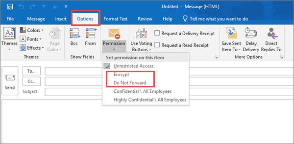

# De 10 bästa sätten att skydda Microsoft 365 för företag-abonnemangTop 10 ways to secure Microsoft 365 for business plans

::: moniker range="o365-21vianet"

> [!NOTE]
> Administrationscentret förändras.The admin center is changing. Om dina erfarenheter inte överensstämmer med uppgifterna som visas här kan du läsa mer i [Om det nya administrationscentret för Microsoft 365](https://docs.microsoft.com/microsoft-365/admin/microsoft-365-admin-center-preview?view=o365-21vianet).If your experience doesn't match the details presented here, see [About the new Microsoft 365 admin center](https://docs.microsoft.com/microsoft-365/admin/microsoft-365-admin-center-preview?view=o365-21vianet).

::: moniker-end

Om du är en liten eller medels Tor organisation med en av Microsofts affärs abonnemang och din organisations typ är riktad mot cyberterrorism kriminella och hackare kan du använda vägledningen i den här artikeln för att öka säkerheten i organisationen.If you are a small or medium-size organization using one of Microsoft's business plans and your type of organization is targeted by cyber criminals and hackers, use the guidance in this article to increase the security of your organization. Den här vägledningen hjälper organisationen att nå de mål som beskrivs i Harvard Kennedy School [Cybersecurity kampanj hand bok](https://go.microsoft.com/fwlink/p/?linkid=2015598).This guidance helps your organization achieve the goals described in the Harvard Kennedy School [Cybersecurity Campaign Handbook](https://go.microsoft.com/fwlink/p/?linkid=2015598).

Microsoft rekommenderar att du utför de uppgifter som visas i följande tabell som gäller för din service plan.Microsoft recommends that you complete the tasks listed in the following table that apply to your service plan.

||UppgiftTask|Microsoft 365 Business StandardMicrosoft 365 Business Standard|Microsoft 365 Business PremiumMicrosoft 365 Business Premium|
|---|---|---|---|
|9.11|[Konfigurera multifaktorautentiseringSet up multi-factor authentication](secure-your-business-data.md#setup)|||
|två2|[Utbilda dina användareTrain your users](secure-your-business-data.md#train)|||
|amp;3D3|[Använda dedikerade administratörs kontonUse dedicated admin accounts](secure-your-business-data.md#admin)|||
|9.44|[Höja nivån på skyddet mot skadlig program vara i e-postRaise the level of protection against malware in mail](secure-your-business-data.md#malware)|||
|T55|[Skydda mot utpressningstrojanerProtect against ransomware](secure-your-business-data.md#ransomware)|||
|18.66|[Stoppa automatisk vidarebefordring för e-postStop auto-forwarding for email](secure-your-business-data.md#forwarding)|||
|borttagning7|[Använda Office meddelande krypteringUse Office Message Encryption](secure-your-business-data.md#encryption)|||
|8.28|[Skydda din e-post från nätfiske-attackerProtect your email from phishing attacks](secure-your-business-data.md#phishing)|||
|99|[Skydda mot skadliga bifogade filer och filer med säkra bifogade filerProtect against malicious attachments and files with Safe Attachments](secure-your-business-data.md#atp)|||
|10.310|[Skydda mot nätfiske-attacker med säkra länkarProtect against phishing attacks with Safe Links](secure-your-business-data.md#phishingatp)|||

Innan du börjar bör du kontrol lera din [microsoft 365 säkra Poäng](https://docs.microsoft.com/microsoft-365/security/mtp/microsoft-secure-score) i Microsoft 365 säkerhets Center.Before you begin, check your [Microsoft 365 Secure Score](https://docs.microsoft.com/microsoft-365/security/mtp/microsoft-secure-score) in the Microsoft 365 security center. Från en central instrument panel kan du övervaka och förbättra säkerheten för dina Microsoft 365-identiteter, data, appar, enheter och infrastruktur.From a centralized dashboard, you can monitor and improve the security for your Microsoft 365 identities, data, apps, devices, and infrastructure. Du får poäng för att konfigurera rekommenderade säkerhetsfunktioner, utföra säkerhetsrelaterade uppgifter (som att visa rapporter) eller adress rekommendationer med en tredje parts program eller program vara.You are given points for configuring recommended security features, performing security-related tasks (such as viewing reports), or addressing recommendations with a third-party application or software. Med ytterligare insikter och mer insyn i en bredare uppsättning Microsoft-produkter och-tjänster kan du känna dig säker på hur din organisations säkerhets tillstånd fungerar.With additional insights and more visibility into a broader set of Microsoft products and services, you can feel confident reporting about your organization's security health.

## 1: Konfigurera multifaktorautentisering1: Set up multi-factor authentication

Att använda multifaktorautentisering är ett av de enklaste och mest effektiva sätten att öka säkerheten i organisationen.Using multi-factor authentication is one of the easiest and most effective ways to increase the security of your organization. Det är enklare än att det låter: när du loggar in innebär multifaktorautentisering att du skriver en kod från telefonen för att få till gång till Microsoft 365.It's easier than it sounds - when you log in, multi-factor authentication means you'll type a code from your phone to get access to Microsoft 365. Detta kan förhindra att hackare tar över om de känner till ditt lösen ord.This can prevent hackers from taking over if they know your password. Multifaktorautentisering kallas också för tvåstegsverifiering.Multi-factor authentication is also called 2-step verification. Enskilda personer kan lägga till tvåstegsverifiering till de flesta konton, till exempel till sina Google-eller Microsoft-konton.Individuals can add 2-step verification to most accounts easily, for example, to their Google or Microsoft accounts. Så här lägger du [till tvåstegsverifiering för ditt personliga Microsoft-konto](https://go.microsoft.com/fwlink/p/?linkid=2016403).Here's how to [add two-step verification to your personal Microsoft account](https://go.microsoft.com/fwlink/p/?linkid=2016403).

För företag som använder Microsoft 365 lägger du till en inställning som kräver att användarna loggar in med multifaktorautentisering.For businesses using Microsoft 365, add a setting that requires your users to log in using multi-factor authentication. När du gör den här ändringen uppmanas användarna att konfigurera sin telefon för tvåfaktorautentisering nästa gång de loggar in.When you make this change, users will be prompted to set up their phone for two-factor authentication next time they log in.
Om du vill se en utbildnings video om hur du konfigurerar MFA och hur användarna ska konfigureras kan du läsa [Konfigurera MFA](https://support.microsoft.com/office/e12187b8-216a-4490-9e3b-df34a06fb787) och konfigurera [användare](https://support.microsoft.com/office/a32541df-079c-420d-9395-9d59354f7225).To see a training video for how to set up MFA and how users complete the set up, see [set up MFA](https://support.microsoft.com/office/e12187b8-216a-4490-9e3b-df34a06fb787) and [user set up](https://support.microsoft.com/office/a32541df-079c-420d-9395-9d59354f7225).

För att konfigurera multifaktorautentisering kan du aktivera säkerhets standarder:To set up multi-factor authentication, you turn on Security defaults:

För de flesta organisationer tillhandahåller standardinställningar för säkerhet en god nivå av ytterligare inloggningssäkerhet.For most organizations, Security defaults offer a good level of additional sign-in security. Mer information finns i [Vad är standardinställningar för säkerhet?](https://docs.microsoft.com/azure/active-directory/fundamentals/concept-fundamentals-security-defaults)For more information, see [What are security defaults?](https://docs.microsoft.com/azure/active-directory/fundamentals/concept-fundamentals-security-defaults)

Om prenumerationen är ny kan standardinställningar för säkerhet redan vara aktiverat för dig automatiskt.If your subscription is new, Security defaults might already be turned on for you automatically.

Du aktiverar eller inaktiverar säkerhetsinställningar för Azure Active Directory (Azure AD) i Microsoft Azure-portalen från fönstret **Egenskaper**.You enable or disable security defaults from the **Properties** pane for Azure Active Directory (Azure AD) in the Azure portal.

1. Logga in som global administratör på [Administrationscenter för Microsoft 365](https://admin.microsoft.com).Sign in to the [Microsoft 365 admin center](https://admin.microsoft.com) with global admin credentials.
2. I det vänstra navigeringsfältet väljer du **Visa alla** och under **Administratörscenter** väljer du **Azure Active Directory**.In the left nav choose **Show All** and under **Admin centers** , choose **Azure Active Directory**.
3. I **Azure Active Directory administratörscenter** väljer du **Azure Active Directory** > **Egenskaper**.In the **Azure Active Directory admin center** choose **Azure Active Directory** > **Properties**.
4. Längst ner på sidan väljer du **Hantera standardinställningar för säkerhet**.At the bottom of the page, choose **Manage Security defaults**.
5. Välj **Ja** för att aktivera standardinställningar för säkerhet eller **Nej** för att inaktivera dem och välj sedan **Spara**.Choose **Yes** to enable security defaults or **No** to disable security defaults, and then choose **Save**.

När du har konfigurerat multifaktorautentisering för din organisation måste dina användare konfigurera tvåstegsverifiering på sina enheter.After you set up multi-factor authentication for your organization, your users will be required to set up two-step verification on their devices. Mer information finns i [Konfigurera tvåstegsverifiering för Microsoft 365](https://support.microsoft.com/office/ace1d096-61e5-449b-a875-58eb3d74de14).For more information, see [Set up 2-step verification for Microsoft 365](https://support.microsoft.com/office/ace1d096-61e5-449b-a875-58eb3d74de14).

Fullständiga uppgifter och fullständiga rekommendationer finns i [Konfigurera multifaktorautentisering för användare](set-up-multi-factor-authentication.md).For full details and complete recommendations, see [Set up multi-factor authentication for users](set-up-multi-factor-authentication.md).

## 2: träna dina användare2: Train your users

Det här är en utmärkt vägledning i Harvard Kennedy School [Cybersecurity-kampanjen](https://go.microsoft.com/fwlink/p/?linkid=2015598) med att skapa en starkt kultur av säkerhets medvetenhet inom din organisation, inklusive utbildnings användare för att identifiera nätfiske-attacker.The Harvard Kennedy School [Cybersecurity Campaign Handbook](https://go.microsoft.com/fwlink/p/?linkid=2015598) provides excellent guidance on establishing a strong culture of security awareness within your organization, including training users to identify phishing attacks.

Utöver den här vägledningen rekommenderar Microsoft att användarna vidtar åtgärderna som beskrivs i den här artikeln: [skydda ditt konto och dina enheter från hackare och skadlig program vara](https://support.microsoft.com/office/066d6216-a56b-4f90-9af3-b3a1e9a327d6).In addition to this guidance, Microsoft recommends that your users take the actions described in this article: [Protect your account and devices from hackers and malware](https://support.microsoft.com/office/066d6216-a56b-4f90-9af3-b3a1e9a327d6). Dessa åtgärder inkluderar:These actions include:

- Använda starka lösen ordUsing strong passwords

- Skydda enheterProtecting devices

- Aktivera säkerhetsfunktioner på datorer med Windows 10 och MacEnabling security features on Windows 10 and Mac PCs

Microsoft rekommenderar också att användare skyddar sina privata e-postkonton genom att vidta åtgärder som rekommenderas i följande artiklar:Microsoft also recommends that users protect their personal email accounts by taking the actions recommended in the following articles:

- [Skydda ditt Outlook.com-e-postkontoHelp protect your Outlook.com email account](https://support.microsoft.com/office/a4f20fc5-4307-4ece-8231-6d4d4bd8a9ba)

- [Skydda ditt Gmail-konto med tvåstegsverifieringProtect your Gmail account with 2-step verification](https://go.microsoft.com/fwlink/p/?linkid=2015688&)

## 3: använda dedikerade administratörs konton3: Use dedicated admin accounts

De administrativa konton du använder för att administrera Microsoft 365-miljön inkluderar förhöjda behörigheter.The administrative accounts you use to administer your Microsoft 365 environment include elevated privileges. Dessa är värdefulla mål för hackare och cyberterrorism kriminella.These are valuable targets for hackers and cyber criminals. Använd endast administratörs konton för administration.Use admin accounts only for administration. Administratörer ska ha ett separat användar konto för regelbunden, icke-administrativ användning och bara använda sitt administratörs konto när det behövs för att slutföra en uppgift som är kopplad till deras jobb funktion.Admins should have a separate user account for regular, non-administrative use and only use their administrative account when necessary to complete a task associated with their job function. Ytterligare rekommendationer:Additional recommendations:

- Se till att administratörs konton också är inställda för multifaktorautentisering.Be sure admin accounts are also set up for multi-factor authentication.

- Innan du använder administratörs konton kan du stänga alla icke relaterade webbläsar-och appar, inklusive personliga e-postkonton.Before using admin accounts, close out all unrelated browser sessions and apps, including personal email accounts.

- När du har slutfört administratörs uppgifterna måste du logga ut från webbläsarsessionen.After completing admin tasks, be sure to log out of the browser session.

## 4: Höj skyddet mot skadlig program vara i e-post4: Raise the level of protection against malware in mail

Din Microsoft 365-miljö har skydd mot skadlig program vara, men du kan öka skyddet genom att blockera bifogade filer med filtyper som ofta används för skadlig program vara.Your Microsoft 365 environment includes protection against malware, but you can increase this protection by blocking attachments with file types that are commonly used for malware. Om du vill öka skyddet mot skadlig program vara i e-post kan du titta på en [kort utbildnings video](https://support.microsoft.com/office/02b5783a-eea0-42e8-8856-62440718c3f0)eller göra följande:To bump up malware protection in email, view a [short training video](https://support.microsoft.com/office/02b5783a-eea0-42e8-8856-62440718c3f0), or complete the following steps:

1. Gå till <https://protection.office.com> och logga in med dina inloggnings uppgifter för ditt administratörs konto.Go to <https://protection.office.com> and sign in with your admin account credentials.

2. Välj **policy** **Threat management** \> **anti-malware** under Threat Management i navigerings fönstret för säkerhets &.In the Security & Compliance Center, in the left navigation pane, under **Threat management** , choose **Policy** \> **Anti-Malware**.

3. Dubbelklicka på standard principen för att redigera företagets policy.Double-click the default policy to edit this company-wide policy.

4. Välj **Inställningar**.Select **Settings**.

5. Välj **på** under **vanliga typer av bifogade filer**.Under **Common Attachment Types Filter** , select **On**. De filtyper som blockeras visas i fönstret direkt under den här kontrollen.The file types that are blocked are listed in the window directly below this control. Du kan lägga till och ta bort filtyper senare om det behövs.You can add or delete file types later, if needed.

6. Välj **Spara.**Select **Save.**

Mer information finns i [skydda mot skadlig program vara i EOP](https://docs.microsoft.com/microsoft-365/security/office-365-security/anti-malware-protection).For more information, see [Anti-malware protection in EOP](https://docs.microsoft.com/microsoft-365/security/office-365-security/anti-malware-protection).

## 5: skydda mot utpressnings tro Jan5: Protect against ransomware

Utpressnings tro Jan attack begränsar åtkomsten till data genom att kryptera filer eller låsa dator skärmar.Ransomware restricts access to data by encrypting files or locking computer screens. Sedan försöker extort pengar från offer genom att be om "utpressning", vanligt vis i form av cryptocurrencies som Bitcoin, i Exchange för åtkomst till data.It then attempts to extort money from victims by asking for "ransom," usually in form of cryptocurrencies like Bitcoin, in exchange for access to data.

Du kan skydda mot utpressnings tro Jan genom att skapa en eller flera e-postflödes regler för att blockera fil namns tillägg som ofta används för utpressnings Jan program vara, eller för att varna användare som tar emot dessa bilagorYou can protect against ransomware by creating one or more mail flow rules to block file extensions that are commonly used for ransomware, or to warn users who receive these attachments in email. En bra start punkt är att skapa två regler:A good starting point is to create two rules:

- Varna användare innan du öppnar bifogade filer i Office med makron.Warn users before opening Office file attachments that include macros. Utpressnings tro Jan kan vara dolda inuti makron, så vi meddelar användare att inte öppna de här filerna från personer som de inte känner.Ransomware can be hidden inside macros, so we'll warn users to not open these files from people they do not know.

- Blockera filtyper som kan innehålla utpressnings tro Jan eller annan skadlig kod.Block file types that could contain ransomware or other malicious code. Vi börjar med en gemensam lista med körbara filer (visas i tabellen nedan).We'll start with a common list of executables (listed in the table below). Om din organisation använder någon av de här körbara typerna och du förväntar dig att få skicka meddelanden via e-post lägger du till dessa i föregående regel (varna användare).If your organization uses any of these executable types and you expect these to be sent in email, add these to the previous rule (warn users).

Om du vill skapa en regel för e-posttransport kan du titta på en [kort utbildnings video](https://support.microsoft.com/office/a9ecca03-42a6-4867-b9fd-38e3f6bb06ad)eller göra följande:To create a mail transport rule, view a [short training video](https://support.microsoft.com/office/a9ecca03-42a6-4867-b9fd-38e3f6bb06ad), or complete the following steps:

1. Gå till [administrationscentret för Exchange](https://go.microsoft.com/fwlink/p/?linkid=2059104).Go to the [Exchange admin center](https://go.microsoft.com/fwlink/p/?linkid=2059104).

2. Välj **regler** i kategorin **e-postflöde** .In the **mail flow** category, select **rules**.

3. Välj **+** och skapa sedan **en ny regel**.Select **+** , and then **Create a new rule**.

4. Välj \* \* \* \* längst ned i dialog rutan för att se alla alternativ.Select \*\*\*\* at the bottom of the dialog box to see the full set of options.

5. Använd inställningarna i tabellen nedan för varje regel.Apply the settings in the following table for each rule. Låt resten av inställningarna vara standard, såvida du inte vill ändra dem.Leave the rest of the settings at the default, unless you want to change these.

6. Välj **Spara**.Select **Save**.
    
| InställningSetting | Varna användare innan du öppnar bifogade filer av Office-filerWarn users before opening attachments of Office files | Blockera filtyper som kan innehålla utpressnings tro Jan eller annan skadlig kodBlock file types that could contain ransomware or other malicious code |
|:-----|:-----|:-----|
|NamnName    |Policy för antipressnings tro Jan: varna användareAnti-ransomware rule: warn users    |Regel för antipressnings skydd: blockera filtyperAnti-ransomware rule: block file types    |
|Använd den här regeln om.Apply this rule if . .. ..    |Bifogade filer.Any attachment . .. .. fil namns tillägg matchar.file extension matches . .. ..    |Bifogade filer.Any attachment . .. .. fil namns tillägg matchar.file extension matches . .. ..    |
|Ange ord eller fraserSpecify words or phrases    |Lägg till följande filtyper:Add these file types:    dotm, DOCM, xlsm, sltm, xla, XLAM, XLL, PPTM, POTM, PPAM, PPSM, sldmdotm, docm, xlsm, sltm, xla, xlam, xll, pptm, potm, ppam, ppsm, sldm    |Lägg till följande filtyper:Add these file types:    ade, ADP, Ani, bas, bat, chm, cmd, com, cpl, CRT, HLP, HT, HTA, inf, ins, Internet leverantör, jobb, js, jse, lnk, MDA, MDB, MDE, MDZ, MSC, MSI, msp, MST, PCD, REG, SCR, Sct, SHS, URL, VB, VBE, vbs, WSC, WSF, WSHade, adp, ani, bas, bat, chm, cmd, com, cpl, crt, hlp, ht, hta, inf, ins, isp, job, js, jse, lnk, mda, mdb, mde, mdz, msc, msi, msp, mst, pcd, reg, scr, sct, shs, url, vb, vbe, vbs, wsc, wsf, wsh, exe, pif    |
|Gör följande.Do the following . .. ..    |Före en fri skrivningPrepend a disclaimer    |Blockera meddelandet.Block the message . .. .. avvisa meddelandet och ta med en förklaringreject the message and include an explanation    |
|Ange meddelande textProvide message text    |Öppna inte dessa typer av filer – såvida du inte förväntar dem – eftersom filerna kan innehålla skadlig kod och veta att avsändaren inte är garanti för säkerheten.Do not open these types of files—unless you were expecting them—because the files may contain malicious code and knowing the sender isn't a guarantee of safety.    ||
   
> [!TIP]
> Du kan också lägga till de filer som du vill blockera i listan med skadlig program vara i [steg 4](#4-raise-the-level-of-protection-against-malware-in-mail).You can also add the files you want to block to the Anti-malware list in [step 4](#4-raise-the-level-of-protection-against-malware-in-mail).

Mer information finns i:For more information, see:

- [Utpressnings tro Jan: minska riskernaRansomware: how to reduce risk](https://www.microsoft.com/security/blog/2020/04/28/ransomware-groups-continue-to-target-healthcare-critical-services-heres-how-to-reduce-risk/)

- [Återställa OneDriveRestore your OneDrive](https://support.microsoft.com/office/fa231298-759d-41cf-bcd0-25ac53eb8a15)

## 6: stoppa automatisk vidarebefordran för e-post6: Stop auto-forwarding for email

Hackare som får till gång till en användares post låda kan exfiltrate e-post genom att konfigurera post lådan så att e-post skickas automatisktHackers who gain access to a user's mailbox can exfiltrate mail by configuring the mailbox to automatically forward email. Detta kan inträffa även om användarens kännedom inte är medvetenhet.This can happen even without the user's awareness. Du kan förhindra detta genom att konfigurera en regel för e-postflöde.You can prevent this from happening by configuring a mail flow rule.

Så här skapar du en e-posttransport regel:To create a mail transport rule:

1. Gå till [administrationscentret för Exchange](https://go.microsoft.com/fwlink/p/?linkid=2059104).Go to the [Exchange admin center](https://go.microsoft.com/fwlink/p/?linkid=2059104).

2. Välj **regler** i kategorin **e-postflöde** .In the **mail flow** category, select **rules**.

3. Välj **+** och skapa sedan **en ny regel**.Select **+** , and then **Create a new rule**.

4. Välj **fler alternativ** längst ned i dialog rutan för att visa alla alternativ.Select **More options** at the bottom of the dialog box to see the full set of options.

5. Använd inställningarna i följande tabell.Apply the settings in the following table. Låt resten av inställningarna vara standard, såvida du inte vill ändra dem.Leave the rest of the settings at the default, unless you want to change these.

6. Välj **Spara**.Select **Save**.

|InställningSetting|Avvisa e-postmeddelanden som skickas automatiskt till externa domänerReject Auto-Forward emails to external domains|
|---|---|
|NamnName|Förhindra automatisk vidarebefordran av e-post till externa domänerPrevent auto forwarding of email to external domains|
|Använd den här regeln om...Apply this rule if ...|Avsändaren.The sender . .. .. är externt/internt.is external/internal . .. .. Inom organisationenInside the organization|
|Lägg till villkorAdd condition|Mottagaren.The recipient . .. .. är externt/internt.is external/internal . .. .. Utanför organisationenOutside the organization|
|Lägg till villkorAdd condition|Meddelande egenskaper.The message properties . .. .. inkludera meddelande typen.include the message type . .. .. Automatisk vidarebefordranAuto-forward|
|Gör följande:Do the following ...|Blockera meddelandet.Block the message . .. .. avvisa meddelandet och ta med en förklaring.reject the message and include an explanation.|
|Ange meddelande textProvide message text|E-post utanför organisationen förhindras automatiskt av säkerhets skäl.Auto-forwarding email outside this organization is prevented for security reasons.|

## 7: använda Office Message Encryption7: Use Office Message Encryption

Office meddelande kryptering ingår i Microsoft 365.Office Message Encryption is included with Microsoft 365. Den är redan konfigurerad.It's already set up. Med Office Message Encryption kan organisationen skicka och ta emot krypterade e-postmeddelanden mellan personer inom och utanför organisationen.With Office Message Encryption, your organization can send and receive encrypted email messages between people inside and outside your organization. Office 365 meddelande kryptering fungerar med Outlook.com, Yahoo!, Gmail och andra e-posttjänster.Office 365 Message Encryption works with Outlook.com, Yahoo!, Gmail, and other email services. Kryptering via e-post säkerställer att endast avsedda mottagare kan visa meddelande innehåll.Email message encryption helps ensure that only intended recipients can view message content.

Office meddelande kryptering ger två skydds alternativ när du skickar e-post:Office Message Encryption provides two protection options when sending mail:

- Vidarekoppla inteDo not forward

- InträffadeEncrypt

Din organisation kan ha konfigurerat ytterligare alternativ som använder en etikett i e-postmeddelandet, till exempel konfidentiellt.Your organization might have configured additional options that apply a label to email, such as Confidential.

### Skicka skyddad e-postTo send protected email

I Outlook för PC väljer du **alternativ** i e-postmeddelandet och väljer sedan **behörigheter**.In Outlook for PC, select **Options** in the email, and then choose **Permissions**.

I Outlook.com väljer du **skydda** i e-postmeddelandet.In Outlook.com, select **Protect** in the email. Standard skyddet **vidarebefordras inte**.The default protection is **Do not forward**. Om du vill ändra detta för kryptering väljer du **ändra behörigheter** för \> **kryptera**.To change this to encrypt, select **Change Permissions** \> **Encrypt**.

### Ta emot krypterad e-postTo receive encrypted email

Om mottagaren har Outlook 2013 eller Outlook 2016 och ett Microsoft-e-postkonto visas en avisering om objektets begränsade behörigheter i Läs fönstret.If the recipient has Outlook 2013 or Outlook 2016 and a Microsoft email account, they'll see an alert about the item's restricted permissions in the Reading pane. När du har öppnat meddelandet kan mottagaren Visa meddelandet på samma sätt som andra.After opening the message, the recipient can view the message just like any other.

Om mottagaren använder en annan e-postklient eller ett e-postkonto, till exempel Gmail eller Yahoo, visas en länk som gör att de kan logga in för att läsa e-postmeddelandet eller begära att ett lösen ord i en webbläsare visas.If the recipient is using another email client or email account, such as Gmail or Yahoo, they'll see a link that lets them either sign in to read the email message or request a one-time passcode to view the message in a web browser. Om användarna inte får e-postmeddelandet kan de kontrol lera mappen skräp post eller skräppostmappen.If users aren't receiving the email, have them check their Spam or Junk folder.

Mer information finns i [skicka, Visa och svara på krypterade meddelanden i Outlook för PC](https://support.microsoft.com/office/eaa43495-9bbb-4fca-922a-df90dee51980).For more information, see [Send, view, and reply to encrypted messages in Outlook for PC](https://support.microsoft.com/office/eaa43495-9bbb-4fca-922a-df90dee51980).

## 8. skydda din e-post från nätfiske-attacker8. Protect your email from phishing attacks

Om du har konfigurerat en eller flera egna domäner för Microsoft 365-miljön kan du konfigurera riktat mot nätfiske-skydd.If you've configured one or more custom domains for your Microsoft 365 environment, you can configure targeted anti-phishing protection. Skydd mot nätfiske, en del av Microsoft Defender för Office 365, skyddar din organisation från illasinnade nätfiske-attacker och andra nät fiske attacker.Anti-phishing protection, a part of Microsoft Defender for Office 365, can help protect your organization from malicious impersonation-based phishing attacks and other phishing attacks. Om du inte har konfigurerat en egen domän behöver du inte göra detta.If you haven't configured a custom domain, you do not need to do this.

Vi rekommenderar att du kommer igång med detta skydd genom att skapa en princip för att skydda de viktigaste användarna och din egen domän.We recommend that you get started with this protection by creating a policy to protect your most important users and your custom domain.

Om du vill skapa en AntiPhishing-princip i Defender för Office 365 visar du en [kort utbildnings video](https://support.microsoft.com/office/86c425e1-1686-430a-9151-f7176cce4f2c)eller gör så här:To create an anti-phishing policy in Defender for Office 365, view a [short training video](https://support.microsoft.com/office/86c425e1-1686-430a-9151-f7176cce4f2c), or complete the following steps:

1. Gå till <https://protection.office.com>.Go to <https://protection.office.com>.

2. Välj **princip** i det vänstra navigerings **fönstret under säkerhets & efterlevnad.**In the Security & Compliance Center, in the left navigation pane, under **Threat management** , select **Policy**.

3. Välj **anti-nätfiske** på sidan policy.On the Policy page, select **Anti-phishing**.

4. På sidan för nätfiske väljer du **+ skapa**.On the Anti-phishing page, select **+ Create**. En guide öppnas med instruktioner för hur du definierar din skydds policy för nätfiske.A wizard launches that steps you through defining your anti-phishing policy.

5. Ange namn, beskrivning och inställningar för principen enligt rekommendationer i diagrammet nedan.Specify the name, description, and settings for your policy as recommended in the chart below. Mer information finns i [Läs mer om anti-nätfiske-principer i Microsoft Defender för Office 365-alternativ](https://docs.microsoft.com/microsoft-365/security/office-365-security/set-up-anti-phishing-policies) .See [Learn about anti-phishing policy in Microsoft Defender for Office 365 options](https://docs.microsoft.com/microsoft-365/security/office-365-security/set-up-anti-phishing-policies) for more details.

6. När du har granskat dina inställningar väljer du **skapa den här principen** eller **Spara** på lämpligt sätt.After you have reviewed your settings, select **Create this policy** or **Save** , as appropriate.

|Inställning eller alternativSetting or option|Rekommenderad inställningRecommended setting|
|---|---|
|NamnName|Domän och mest värdefulla kampanj personalDomain and most valuable campaign staff|
|BeskrivningDescription|Se till att du har den viktigaste personalen och att domänen inte personifieras.Ensure most important staff and our domain are not being impersonated.|
|Lägga till användare att skyddaAdd users to protect|Välj **+ Add a Condition, mottagaren är**.Select **+ Add a condition, The recipient is**. Skriv användar namn eller ange e-postadress för kandidat-, kampanj ansvarig och andra viktiga medlemmar i personalen.Type user names or enter the email address of the candidate, campaign manager, and other important staff members. Du kan lägga till upp till 20 interna och externa adresser som du vill skydda från personifiering.You can add up to 20 internal and external addresses that you want to protect from impersonation.|
|Lägga till domäner att skyddaAdd domains to protect|Välj **+ Add a Condition, mottagar domänen är**.Select **+ Add a condition, The recipient domain is**. Ange den anpassade domän som är kopplad till Microsoft 365-prenumerationen om du har definierat en.Enter the custom domain associated with your Microsoft 365 subscription, if you defined one. Du kan ange fler än en domän.You can enter more than one domain.|
|Välj åtgärderChoose actions|Om e-post skickas av en personifierad användare: Välj **omdirigera meddelande till en annan e-postadress** och ange sedan e-postadressen för säkerhets administratören. till exempel securityadmin@contoso.com.If email is sent by an impersonated user: select **Redirect message to another email address** , and then type the email address of the security administrator; for example, securityadmin@contoso.com.   Om e-post skickas av en domänkontrollant: Välj **karantän meddelande**.If email is sent by an impersonated domain: select **Quarantine message**.|
|Post lådans intelligensMailbox intelligence|Som standard väljs post lådans intelligens när du skapar en ny skydds policy.By default, mailbox intelligence is selected when you create a new anti-phishing policy. Lämna den här **inställningen för** bästa resultat.Leave this setting **On** for best results.|
|Lägga till betrodda avsändare och domänerAdd trusted senders and domains|I det här exemplet definierar du inte några åsidosättningar.For this example, don't define any overrides.|
|Tillämpas påApplied to|Välj **mottagar domänen**.Select **The recipient domain is**. Välj **Välj** under **något av dessa**.Under **Any of these** , select **Choose**. Välj **+ Lägg till**.Select **+ Add**. Markera kryss rutan bredvid domän namnet, till exempel contoso.com, i listan och välj sedan **Lägg till**.Select the check box next to the name of the domain, for example, contoso.com, in the list, and then select **Add**. Välj **Klar**.Select **Done**.|
|

Mer information finns i [Konfigurera anti-nätfiske-principer i Defender för Office 365](https://docs.microsoft.com/microsoft-365/security/office-365-security/configure-atp-anti-phishing-policies).For more information, see [Set up anti-phishing policies in Defender for Office 365](https://docs.microsoft.com/microsoft-365/security/office-365-security/configure-atp-anti-phishing-policies).

## 9: skydda mot skadliga bifogade filer och filer med säkra bifogade filer9: Protect against malicious attachments and files with Safe Attachments

Personer skickar, tar emot och delar ut bifogade filer regelbundet, till exempel dokument, presentationer, kalkyl blad och annat.People regularly send, receive, and share attachments, such as documents, presentations, spreadsheets, and more. Det är inte alltid enkelt att berätta om en bifogad fil är säker eller skadlig genom att titta i ett e-postmeddelande.It's not always easy to tell whether an attachment is safe or malicious just by looking at an email message. Microsoft Defender för Office 365 innehåller skyddad bilagor, men detta skydd är inte aktiverat som standard.Microsoft Defender for Office 365 includes Safe Attachment protection, but this protection is not turned on by default. Vi rekommenderar att du skapar en ny regel för att börja använda detta skydd.We recommend that you create a new rule to begin using this protection. Det här tillägget gäller för filer i SharePoint, OneDrive och Microsoft Teams.This protection extends to files in SharePoint, OneDrive, and Microsoft Teams.

Om du vill skapa en policy för säker bifogad fil kan du titta på en [kort utbildnings video](https://support.microsoft.com/office/e7e68934-23dc-4b9c-b714-e82e27a8f8a5)eller göra följande:To create an Safe attachment policy, view a [short training video](https://support.microsoft.com/office/e7e68934-23dc-4b9c-b714-e82e27a8f8a5), or complete the following steps:

1. Gå till <https://protection.office.com> och logga in med ditt administratörs konto.Go to <https://protection.office.com> and sign in with your admin account.

2. Välj **princip** i det vänstra navigerings **fönstret under säkerhets & efterlevnad.**In the Security & Compliance Center, in the left navigation pane, under **Threat management** , select **Policy**.

3. På princip sidan väljer du **säkra bifogade filer**.On the Policy page, select **Safe Attachments**.

4. På sidan betrodda bifogade filer tillämpar du det här skyddet brett genom att markera kryss rutan **Aktivera ATP för SharePoint, OneDrive och Microsoft Teams** .On the Safe attachments page, apply this protection broadly by selecting the **Turn on ATP for SharePoint, OneDrive, and Microsoft Teams** check box.

5. Välj **+** för att skapa en ny princip.Select **+** to create a new policy.

6. Använd inställningarna i följande tabell.Apply the settings in the following table.

7. När du har granskat dina inställningar väljer du **skapa den här principen** eller **Spara** på lämpligt sätt.After you have reviewed your settings, select **Create this policy** or **Save** , as appropriate.

|Inställning eller alternativSetting or option|Rekommenderad inställningRecommended setting|
|---|---|
|NamnName|Blockera aktuella och framtida e-postmeddelanden med upptäckt skadlig kod.Block current and future emails with detected malware.|
|BeskrivningDescription|Blockera aktuella och framtida e-postmeddelanden och bifogade filer med upptäckt skadlig kod.Block current and future emails and attachments with detected malware.|
|Spara bifogade filer, svar på skadlig program varaSave attachments unknown malware response|Välj **blockera-blockera aktuella och framtida e-postmeddelanden och bifogade filer med identifierad skadlig kod**.Select **Block - Block the current and future emails and attachments with detected malware**.|
|Omdirigera bilaga vid identifieringRedirect attachment on detection|Aktivera omdirigering (Välj den här rutan)Enable redirection (select this box)   Ange administratörs kontot eller en installations program vara för karantän.Enter the admin account or a mailbox setup for quarantine.   Använda ovanstående markering om genomsökning av skadlig kod för bifogade filer eller fel inträffar (Välj den här rutan).Apply the above selection if malware scanning for attachments times out or error occurs (select this box).|
|Tillämpas påApplied to|Mottagar domänen är.The recipient domain is . .. .. Välj din domän.select your domain.|
|

Mer information finns i [Konfigurera anti-nätfiske-principer i Defender för Office 365](https://docs.microsoft.com/microsoft-365/security/office-365-security/configure-atp-anti-phishing-policies).For more information, see [Set up anti-phishing policies in Defender for Office 365](https://docs.microsoft.com/microsoft-365/security/office-365-security/configure-atp-anti-phishing-policies).

## 10: skydda mot nätfiske-attacker med säkra länkar10: Protect against phishing attacks with Safe Links

Hackare döljer ibland skadliga webbplatser i länkar i e-post eller andra filer.Hackers sometimes hide malicious websites in links in email or other files. Säkra länkar, en del av Microsoft Defender för Office 365, kan skydda din organisation genom att ange inloggnings kontroll för webb adresser (URL: er) i e-postmeddelanden och Office-dokument.Safe Links, part of Microsoft Defender for Office 365, can help protect your organization by providing time-of-click verification of web addresses (URLs) in email messages and Office documents. Skydd definieras genom principer för säkra länkar.Protection is defined through Safe Links policies.

Vi rekommenderar att du gör följande:We recommend that you do the following:

- Ändra standard principen för att öka skyddet.Modify the default policy to increase protection.

- Lägg till en ny princip riktade till alla mottagare i domänen.Add a new policy targeted to all recipients in your domain.

För att komma till säkra länkar kan du titta på en [kort utbildnings video](https://support.microsoft.com/office/61492713-53c2-47da-a6e7-fa97479e97fa)eller göra följande:To get to Safe Links, view a [short training video](https://support.microsoft.com/office/61492713-53c2-47da-a6e7-fa97479e97fa), or complete the following steps:

1. Gå till <https://protection.office.com> och logga in med ditt administratörs konto.Go to <https://protection.office.com> and sign in with your admin account.

2. Välj **princip** i det vänstra navigerings **fönstret under säkerhets & efterlevnad.**In the Security & Compliance Center, in the left navigation pane, under **Threat management** , select **Policy**.

3. Välj **Safe Links** på princip sidan.On the Policy page, select **Safe Links**.

Så här ändrar du standard principen:To modify the default policy:

1. Dubbelklicka på **standard** principen på sidan Safe Links under **principer som gäller för hela organisationen**.On the Safe links page, under **Policies that apply to the entire organization** , double-click the **Default** policy.

2. Ange en URL som ska blockeras, till exempel _example.com_ , under **inställningar som gäller för innehåll i Office 365** och välj **+** .Under **Settings that apply to content across Office 365** , enter a URL to be blocked, such as _example.com_ , and select **+**.

3. Välj **Office 365-program** under **inställningar som gäller för innehåll utom e-post** , **Spåra inte när användare klickar på säkra länkar** och låter **inte användare klicka genom säkra länkar till original-URL: en**.Under **Settings that apply to content except email** , select **Office 365 applications** , **Do not track when users click safe links** , and **Do not let users click through safe links to original URL**.

4. Välj **Spara**.Select **Save**.

Så här skapar du en ny princip för alla mottagare i domänen:To create a new policy targeted to all recipients in your domain:

1. På sidan Safe Links, under **principer som gäller för specifika mottagare** , väljer **+** du för att skapa en ny princip.On the Safe links page, under **Policies that apply to specific recipients** , select **+** to create a new policy.

2. Använd inställningarna i följande tabell.Apply the settings listed in the following table.

3. Välj **Spara**.Select **Save**.

|Inställning eller alternativSetting or option|Rekommenderad inställningRecommended setting|
|---|---|
|NamnName|Principer för säkra Länkar för alla mottagare i domänenSafe links policy for all recipients in the domain|
|Välj åtgärd för okända URL-adresser i meddelandenSelect the action for unknown potentially malicious URLs in messages|Välj **URL-adresser skrivs igen och kontrol leras mot en lista över kända illasinnade länkar när användaren klickar på länken**.Select **On - URLs will be rewritten and checked against a list of known malicious links when user clicks on the link**.|
|Använda URL-genomsökning i real tid för misstänkta länkar och länkar som pekar på filerApply real-time URL scanning for suspicious links and links that point to files|Markera den här rutan.Select this box.|
|Tillämpas påApplied to|Mottagar domänen är.The recipient domain is . .. .. Välj din domän.select your domain.|
|

Mer information finns i [säkra länkar i Microsoft Defender för Office 365](https://docs.microsoft.com/microsoft-365/security/office-365-security/atp-safe-links).For more information, see [Safe Links in Microsoft Defender for Office 365](https://docs.microsoft.com/microsoft-365/security/office-365-security/atp-safe-links).
