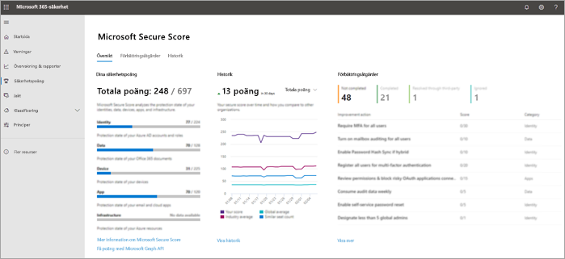

# De 10 bästa sätten att skydda Office 365 och Microsoft 365 Business-abonnemangTop 10 ways to secure Office 365 and Microsoft 365 Business plans

Om du är en liten eller medelstor organisation som använder en av Microsofts affärsplaner och din typ av organisation är måltavla för cyberbrottslingar och hackare använder du vägledningen i den här artikeln för att öka säkerheten för din organisation.If you are a small or medium-size organization using one of Microsoft's business plans and your type of organization is targeted by cyber criminals and hackers, use the guidance in this article to increase the security of your organization. Den här vägledningen hjälper din organisation att uppnå de mål som beskrivs i Handboken för Harvard Kennedy School [Cybersecurity Campaign](https://go.microsoft.com/fwlink/?linkid=2015598&amp;clcid=0x409).This guidance helps your organization achieve the goals described in the Harvard Kennedy School [Cybersecurity Campaign Handbook](https://go.microsoft.com/fwlink/?linkid=2015598&amp;clcid=0x409).
  
Microsoft rekommenderar att du slutför uppgifterna i följande tabell som gäller för serviceplanen.Microsoft recommends that you complete the tasks listed in the following table that apply to your service plan. 
  
||**Uppgift****Task**|**Office 365 Business Premium****Office 365 Business Premium**|**Microsoft 365 Företag****Microsoft 365 Business**|
|:-----|:-----|:-----|:-----|
|11    |[Konfigurera multifaktorautentiseringSet up multi-factor authentication](secure-your-business-data.md#setup)   |             |             |
|22    |[Utbilda dina användareTrain your users](secure-your-business-data.md#train)   |             |             |
|33    |[Använda dedikerade administratörskontonUse dedicated admin accounts](secure-your-business-data.md#admin)   |             |             |
|44    |[Höj skyddsnivån mot skadlig kod i postRaise the level of protection against malware in mail](secure-your-business-data.md#malware)   |             |             |
|55    |[Skydda mot ransomwareProtect against ransomware](secure-your-business-data.md#ransomware)   |             |             |
|66    |[Stoppa automatisk vidarebefordran för e-postStop auto-forwarding for email](secure-your-business-data.md#forwarding)   |             |             |
|77    |[Använda Office-meddelandekrypteringUse Office Message Encryption](secure-your-business-data.md#encryption)   ||             |
|88    |[Skydda din e-post från nätfiskeattackerProtect your email from phishing attacks](secure-your-business-data.md#phishing)   ||             |
|99    |[Skydda mot skadliga bilagor och filer med ATP-säkra bilagorProtect against malicious attachments and files with ATP Safe Attachments](secure-your-business-data.md#atp)   ||             |
|1010    |[Skydda mot nätfiskeattacker med ATP Safe LinksProtect against phishing attacks with ATP Safe Links](secure-your-business-data.md#phishingatp)   ||             |
   
Innan du börjar kontrollerar du ditt [Microsoft 365 Secure Score](https://docs.microsoft.com/microsoft-365/security/mtp/microsoft-secure-score) i microsoft 365-säkerhetscentret.Before you begin, check your [Microsoft 365 Secure Score](https://docs.microsoft.com/microsoft-365/security/mtp/microsoft-secure-score) in the Microsoft 365 security center. Från en centraliserad instrumentpanel kan du övervaka och förbättra säkerheten för dina Microsoft 365-identiteter, data, appar, enheter och infrastruktur.From a centralized dashboard, you can monitor and improve the security for your Microsoft 365 identities, data, apps, devices, and infrastructure. Du får poäng för att konfigurera rekommenderade säkerhetsfunktioner, utföra säkerhetsrelaterade uppgifter (till exempel visa rapporter) eller hantera rekommendationer med ett program eller en programvara från tredje part.You are given points for configuring recommended security features, performing security-related tasks (such as viewing reports), or addressing recommendations with a third-party application or software. Med ytterligare insikter och mer insyn i en bredare uppsättning Microsoft-produkter och -tjänster kan du känna dig säker på att rapportera om organisationens säkerhetshälsa.With additional insights and more visibility into a broader set of Microsoft products and services, you can feel confident reporting about your organization's security health.
  

  
## 1: Ställa in multifaktorautentisering1: Set up multi-factor authentication

Att använda multifaktorautentisering är ett av de enklaste och mest effektiva sätten att öka säkerheten för din organisation.Using multi-factor authentication is one of the easiest and most effective ways to increase the security of your organization. Det är enklare än det låter - när du loggar in innebär multifaktorautentisering att du skriver en kod från telefonen för att få tillgång till Microsoft 365.It's easier than it sounds - when you log in, multi-factor authentication means you'll type a code from your phone to get access to Microsoft 365. Detta kan hindra hackare från att ta över om de känner till ditt lösenord.This can prevent hackers from taking over if they know your password. Multifaktorautentisering kallas också tvåstegsverifiering.Multi-factor authentication is also called 2-step verification. Enskilda personer kan enkelt lägga till tvåstegsverifiering i de flesta konton, till exempel i sina Google- eller Microsoft-konton.Individuals can add 2-step verification to most accounts easily, for example, to their Google or Microsoft accounts. Så här lägger du till [tvåstegsverifiering i ditt personliga Microsoft-konto](https://go.microsoft.com/fwlink/?linkid=2016403&amp;clcid=0x409).Here's how to [add two-step verification to your personal Microsoft account](https://go.microsoft.com/fwlink/?linkid=2016403&amp;clcid=0x409).
  
För företag som använder Office 365 och Microsoft 365 lägger du till en inställning som kräver att användarna loggar in med multifaktorautentisering.For businesses using Office 365 and Microsoft 365, add a setting that requires your users to log in using multi-factor authentication. När du gör den här ändringen uppmanas användarna att konfigurera sin telefon för tvåfaktorsautentisering nästa gång de loggar in.When you make this change, users will be prompted to set up their phone for two-factor authentication next time they log in.
Information om hur du visar en utbildningsvideo för hur du konfigurerar MFA och hur användarna slutför konfigurera den finns [i konfigurera MFA](https://support.office.com/article/e12187b8-216a-4490-9e3b-df34a06fb787) och [användarskapare](https://support.office.com/article/a32541df-079c-420d-9395-9d59354f7225).To see a training video for how to set up MFA and how users complete the set up, see [set up MFA](https://support.office.com/article/e12187b8-216a-4490-9e3b-df34a06fb787) and [user set up](https://support.office.com/article/a32541df-079c-420d-9395-9d59354f7225).
  
Så här ställer du in multifaktorautentisering:To set up multi-factor authentication:

1. Välj**Aktiva användare i** **administrationscentret** > . [admin center](https://go.microsoft.com/fwlink/p/?linkid=834822)In the [admin center](https://go.microsoft.com/fwlink/p/?linkid=834822), select **Users** > **Active Users**.

2. Välj **Multifaktorautentisering**i avsnittet **Aktiva användare** .In the **Active Users** section, select  **Multi-Factor Authentication**.

3. På sidan **Multifaktorautentisering** väljer du **Användare** om du aktiverar detta för en användare eller så kan du utföra en **massuppdatering**.On the **Multi-Factor Authentication** page, select **User** if you are enabling this for one user Or you can perform a **Bulk Update**.

4. Välj **Aktivera** under **Snabbsteg**.Select **Enable** under **Quick Steps**.

5. Välj **Aktivera multifaktorautentisering**i popup-fönstret .In the pop-up window, choose **Enable Multi-Factor Authentication**.

När du har konfigurerat multifaktorautentisering för din organisation måste dina användare konfigurera tvåstegsverifiering på sina enheter.After you set up multi-factor authentication for your organization, your users will be required to set up two-step verification on their devices. Mer information finns i [Konfigurera tvåstegsverifiering för Office 365](https://support.office.com/article/ace1d096-61e5-449b-a875-58eb3d74de14).For more information, see [Set up 2-step verification for Office 365](https://support.office.com/article/ace1d096-61e5-449b-a875-58eb3d74de14).
  
Fullständig information och fullständiga rekommendationer finns i [Konfigurera multifaktorautentisering för Office 365-användare](set-up-multi-factor-authentication.md).For full details and complete recommendations, see [Set up multi-factor authentication for Office 365 users](set-up-multi-factor-authentication.md).
  
## 2: Träna dina användare2: Train your users

Harvard Kennedy School [Cybersecurity Campaign Handbook](https://go.microsoft.com/fwlink/?linkid=2015598&amp;clcid=0x409) ger utmärkt vägledning om hur du skapar en stark kultur av säkerhetsmedvetenhet inom din organisation, inklusive utbildning användare att identifiera phishing-attacker.The Harvard Kennedy School [Cybersecurity Campaign Handbook](https://go.microsoft.com/fwlink/?linkid=2015598&amp;clcid=0x409) provides excellent guidance on establishing a strong culture of security awareness within your organization, including training users to identify phishing attacks. 
  
Utöver den här vägledningen rekommenderar Microsoft att användarna vidtar de åtgärder som beskrivs i den här artikeln: [Skydda ditt konto och dina enheter från hackare och skadlig kod](https://support.office.com/article/066d6216-a56b-4f90-9af3-b3a1e9a327d6.aspx).In addition to this guidance, Microsoft recommends that your users take the actions described in this article: [Protect your account and devices from hackers and malware](https://support.office.com/article/066d6216-a56b-4f90-9af3-b3a1e9a327d6.aspx). Dessa åtgärder omfattar:These actions include:
  
- Använda starka lösenordUsing strong passwords
    
- Skydda enheterProtecting devices
    
- Aktivera säkerhetsfunktioner på Windows 10- och Mac-datorerEnabling security features on Windows 10 and Mac PCs
    
Microsoft rekommenderar också att användarna skyddar sina personliga e-postkonton genom att vidta de åtgärder som rekommenderas i följande artiklar:Microsoft also recommends that users protect their personal email accounts by taking the actions recommended in the following articles:
  
- [Skydda ditt Outlook.com e-postkontoHelp protect your Outlook.com email account](https://support.office.com/article/a4f20fc5-4307-4ece-8231-6d4d4bd8a9ba.aspx)
    
- [Skydda ditt Gmail-konto med tvåstegsverifieringProtect your Gmail account with 2-step verification](https://go.microsoft.com/fwlink/?linkid=2015688&amp;clcid=0x409)
    
## 3: Använd dedikerade administratörskonton3: Use dedicated admin accounts

De administrativa konton som du använder för att administrera din Office 365- eller Microsoft 365-miljö innehåller förhöjda privilegier.The administrative accounts you use to administer your Office 365 or Microsoft 365 environment include elevated privileges. Dessa är värdefulla mål för hackare och cyberbrottslingar.These are valuable targets for hackers and cyber criminals. Använd endast administratörskonton för administration.Use admin accounts only for administration. Administratörer bör ha ett separat användarkonto för regelbunden, icke-administrativ användning och endast använda sitt administrativa konto när det behövs för att slutföra en uppgift som är associerad med deras jobbfunktion.Admins should have a separate user account for regular, non-administrative use and only use their administrative account when necessary to complete a task associated with their job function. Ytterligare rekommendationer:Additional recommendations:
  
- Se till att administratörskonton också är konfigurerade för multifaktorautentisering.Be sure admin accounts are also set up for multi-factor authentication. 
    
- Innan du använder administratörskonton stänger du alla orelaterade webbläsarsessioner och appar, inklusive personliga e-postkonton.Before using admin accounts, close out all unrelated browser sessions and apps, including personal email accounts.
    
- När du har slutfört administratörsuppgifter måste du logga ut från webbläsarsessionen.After completing admin tasks, be sure to log out of the browser session.
    
## 4: Höj skyddsnivån mot skadlig kod i post4: Raise the level of protection against malware in mail

Office 365- eller Microsoft 365-miljön innehåller skydd mot skadlig kod, men du kan öka det här skyddet genom att blockera bifogade filer med filtyper som ofta används för skadlig kod.Your Office 365 or Microsoft 365 environment includes protection against malware, but you can increase this protection by blocking attachments with file types that are commonly used for malware. Om du vill stöta upp skyddet för skadlig programvara i e-post kan du visa en [kort träningsvideo](https://support.office.com/article/02b5783a-eea0-42e8-8856-62440718c3f0)eller utföra följande steg:To bump up malware protection in email, view a [short training video](https://support.office.com/article/02b5783a-eea0-42e8-8856-62440718c3f0), or complete the following steps:
  
1. Gå [https://protection.office.com](https://protection.office.com) till och logga in med dina administratörskontouppgifter.Go to [https://protection.office.com](https://protection.office.com) and sign in with your admin account credentials. 
    
2. Välj **Policy** \> **Anti-Malware**i det vänstra navigeringsfönstret **Threat management**i Office &amp; 365 Security Compliance Center i det vänstra navigeringsfönstret.In the Office 365 Security &amp; Compliance Center, in the left navigation pane, under **Threat management**, choose **Policy** \> **Anti-Malware**.
    
3. Dubbelklicka på standardprincipen om du vill redigera den här företagsövergripande principen.Double-click the default policy to edit this company-wide policy.
    
4. Välj **Inställningar**.Select **Settings**.
    
5. Under **Filter för vanliga typer av bifogade filer**väljer du **På**.Under **Common Attachment Types Filter**, select **On**. De filtyper som är blockerade visas i fönstret direkt under den här kontrollen.The file types that are blocked are listed in the window directly below this control. Du kan lägga till eller ta bort filtyper senare om det behövs.You can add or delete file types later, if needed.
    
6. Välj **Spara.**Select **Save.**
    
Mer information finns i [Skydd mot skadlig kod](https://go.microsoft.com/fwlink/?linkid=2015692&amp;clcid=0x409).For more information, see [Anti-malware protection](https://go.microsoft.com/fwlink/?linkid=2015692&amp;clcid=0x409).
  
## 5: Skydda mot ransomware5: Protect against ransomware

Ransomware begränsar åtkomsten till data genom att kryptera filer eller låsa datorskärmar.Ransomware restricts access to data by encrypting files or locking computer screens. Det försöker sedan att pressa pengar från offer genom att be om "lösen", vanligtvis i form av kryptokurar som Bitcoin, i utbyte mot tillgång till data.It then attempts to extort money from victims by asking for "ransom," usually in form of cryptocurrencies like Bitcoin, in exchange for access to data. 
  
Du kan skydda mot ransomware genom att skapa en eller flera regler för e-postflöde för att blockera filnamnstillägg som ofta används för ransomware, eller för att varna användare som tar emot dessa bilagor via e-post.You can protect against ransomware by creating one or more mail flow rules to block file extensions that are commonly used for ransomware, or to warn users who receive these attachments in email. En bra utgångspunkt är att skapa två regler:A good starting point is to create two rules:
  
- Varna användare innan du öppnar Office-bifogade filer som innehåller makron.Warn users before opening Office file attachments that include macros. Ransomware kan döljas inuti makron, så vi varnar användarna att inte öppna dessa filer från människor som de inte känner.Ransomware can be hidden inside macros, so we'll warn users to not open these files from people they do not know. 
    
- Blockera filtyper som kan innehålla ransomware eller annan skadlig kod.Block file types that could contain ransomware or other malicious code. Vi börjar med en gemensam lista över körbara filer (listade i tabellen nedan).We'll start with a common list of executables (listed in the table below). Om din organisation använder någon av dessa körbara typer och du förväntar dig att dessa ska skickas i e-post lägger du till dessa i föregående regel (varna användare).If your organization uses any of these executable types and you expect these to be sent in email, add these to the previous rule (warn users).
    
Om du vill skapa en regel för e-posttransport kan du visa en [kort träningsvideo](https://support.office.com/article/a9ecca03-42a6-4867-b9fd-38e3f6bb06ad)eller utföra följande steg:To create a mail transport rule, view a [short training video](https://support.office.com/article/a9ecca03-42a6-4867-b9fd-38e3f6bb06ad), or complete the following steps:
  
1. Gå till <a href="https://go.microsoft.com/fwlink/p/?linkid=2059104" target="_blank">administrationscentret för Exchange</a>.Go to the <a href="https://go.microsoft.com/fwlink/p/?linkid=2059104" target="_blank">Exchange admin center</a>.

2. Välj **regler**i kategorin **e-postflöde** .In the **mail flow** category, select **rules**.
    
3. Markera **+** och **skapa sedan en ny regel**.Select **+**, and then **Create a new rule**.
    
4. Välj \*\*\*\* längst ned i dialogrutan om du vill se hela uppsättningen alternativ.Select \*\*\*\* at the bottom of the dialog box to see the full set of options. 
    
5. Använd inställningarna i följande tabell för varje regel.Apply the settings in the following table for each rule. Lämna resten av inställningarna som standard, om du inte vill ändra dessa.Leave the rest of the settings at the default, unless you want to change these.
    
6. Välj **Spara**.Select **Save**.
    
|**Inställning****Setting**|**Varna användare innan du öppnar bifogade filer i Office-filer****Warn users before opening attachments of Office files**|**Blockera filtyper som kan innehålla ransomware eller annan skadlig kod****Block file types that could contain ransomware or other malicious code**|
|:-----|:-----|:-----|
|NamnName    |Anti-ransomware regel: varna användareAnti-ransomware rule: warn users    |Anti-ransomware regel: blockera filtyperAnti-ransomware rule: block file types    |
|Använd den här regeln om .Apply this rule if . .. ..    |Alla bifogade filer .Any attachment . .. .. filändelsen matchar .file extension matches . .. ..    |Alla bifogade filer .Any attachment . .. .. filändelsen matchar .file extension matches . .. ..    |
|Ange ord eller fraserSpecify words or phrases    |Lägg till följande filtyper:Add these file types:    dotm, docm, xlsm, sltm, xla, xlam, xll, pptm, potm, ppam, ppsm, sldmdotm, docm, xlsm, sltm, xla, xlam, xll, pptm, potm, ppam, ppsm, sldm    |Lägg till följande filtyper:Add these file types:    ade, adp, ani, bas, bat, chm, cmd, com, cpl, crt, hlp, ht, hta, ins, isp, job, js, jse, lnk, mda, mdb, mde, mdz, msc, msi, msp, mst, pcd, reg, scr, sct, shs, url, vb, vbe, vbs, wsc, wsf, wsh, exe, pifade, adp, ani, bas, bat, chm, cmd, com, cpl, crt, hlp, ht, hta, inf, ins, isp, job, js, jse, lnk, mda, mdb, mde, mdz, msc, msi, msp, mst, pcd, reg, scr, sct, shs, url, vb, vbe, vbs, wsc, wsf, wsh, exe, pif    |
|Gör följande .Do the following . .. ..    |Meddela mottagaren med ett meddelandeNotify the recipient with a message    |Blockera meddelandet .Block the message . .. .. avvisa meddelandet och inkludera en förklaringreject the message and include an explanation    |
|Ange meddelandetextProvide message text    |Öppna inte dessa typer av filer , om du inte förväntade dig dem, eftersom filerna kan innehålla skadlig kod och veta avsändaren är inte en garanti för säkerhet.Do not open these types of files—unless you were expecting them—because the files may contain malicious code and knowing the sender isn't a guarantee of safety.   |
|
   
> [!TIP]
> Du kan också lägga till de filer som du vill blockera i listan Mot skadlig kod i [steg 4](#4-raise-the-level-of-protection-against-malware-in-mail).You can also add the files you want to block to the Anti-malware list in [step 4](#4-raise-the-level-of-protection-against-malware-in-mail).

Mer information finns i:For more information, see:
  
- [Hur man handskas med ransomwareHow to deal with ransomware](https://go.microsoft.com/fwlink/?linkid=2016501&amp;clcid=0x409)
    
- [Återställa din OneDriveRestore your OneDrive](https://support.office.com/article/fa231298-759d-41cf-bcd0-25ac53eb8a15.aspx)
    
## 6: Sluta vidarebefordra automatiskt för e-post6: Stop auto-forwarding for email

Hackare som får åtkomst till en användares postlåda kan exfiltrate e-post genom att konfigurera postlådan för att automatiskt vidarebefordra e-post.Hackers who gain access to a user's mailbox can exfiltrate mail by configuring the mailbox to automatically forward email. Detta kan hända även utan användarens medvetenhet.This can happen even without the user's awareness. Du kan förhindra att detta händer genom att konfigurera en regel för e-postflöde.You can prevent this from happening by configuring a mail flow rule. 
  
Så här skapar du en regel för e-posttransport:To create a mail transport rule:
  
1. Gå till <a href="https://go.microsoft.com/fwlink/p/?linkid=2059104" target="_blank">administrationscentret för Exchange</a>.Go to the <a href="https://go.microsoft.com/fwlink/p/?linkid=2059104" target="_blank">Exchange admin center</a>.

2. Välj **regler**i kategorin **e-postflöde** .In the **mail flow** category, select **rules**.
    
3. Markera **+** och **skapa sedan en ny regel**.Select **+**, and then **Create a new rule**.
    
4. Välj **Fler alternativ** längst ned i dialogrutan om du vill se hela uppsättningen alternativ.Select **More options** at the bottom of the dialog box to see the full set of options. 
    
5. Använd inställningarna i följande tabell.Apply the settings in the following table. Lämna resten av inställningarna som standard, om du inte vill ändra dessa.Leave the rest of the settings at the default, unless you want to change these.
    
6. Välj **Spara**.Select **Save**.
    
|**Inställning****Setting**|**Varna användare innan du öppnar bifogade filer i Office-filer****Warn users before opening attachments of Office files**|
|:-----|:-----|
|NamnName    |Förhindra automatisk vidarebefordran av e-post till externa domänerPrevent auto forwarding of email to external domains    |
|Tillämpa den här regeln om ...Apply this rule if ...    |Avsändaren .The sender . .. .. är extern/intern .is external/internal . .. .. Inne i organisationenInside the organization    |
|Lägg till villkorAdd condition    |Mottagaren .The recipient . .. .. är extern/intern .is external/internal . .. .. Utanför organisationenOutside the organization    |
|Lägg till villkorAdd condition    |Meddelandeegenskaperna .The message properties . .. .. inkludera meddelandetypen .include the message type . .. .. Auto-framåtAuto-forward    |
|Gör följande ...Do the following ...    |Blockera meddelandet .Block the message . .. .. avvisa meddelandet och inkludera en förklaring.reject the message and include an explanation.    |
|Ange meddelandetextProvide message text    |Automatisk vidarebefordran av e-post utanför den här organisationen förhindras av säkerhetsskäl.Auto-forwarding email outside this organization is prevented for security reasons.    |
   
## 7: Använda Kryptering av Office-meddelanden7: Use Office Message Encryption

Office Message Encryption ingår i Microsoft 365.Office Message Encryption is included with Microsoft 365. Den är redan klar.It's already set up. Med Office Message Encryption kan din organisation skicka och ta emot krypterade e-postmeddelanden mellan personer inom och utanför organisationen.With Office Message Encryption, your organization can send and receive encrypted email messages between people inside and outside your organization. Office 365 Message Encryption fungerar med Outlook.com, Yahoo!, Gmail och andra e-posttjänster.Office 365 Message Encryption works with Outlook.com, Yahoo!, Gmail, and other email services. Kryptering av e-postmeddelanden säkerställer att endast avsedda mottagare kan visa meddelandeinnehåll.Email message encryption helps ensure that only intended recipients can view message content.
  
Kryptering av Office-meddelanden ger två skyddsalternativ när du skickar e-post:Office Message Encryption provides two protection options when sending mail:
  
- Vidarebefordra inteDo not forward
    
- KrypteraEncrypt
    
Din organisation kan ha konfigurerat ytterligare alternativ som använder en etikett på e-post, till exempel Konfidentiellt.Your organization might have configured additional options that apply a label to email, such as Confidential.
  
### Så här skickar du skyddad e-postTo send protected email

I Outlook för PC väljer du **Alternativ** i e-postmeddelandet och väljer sedan **Behörigheter**.In Outlook for PC, select **Options** in the email, and then choose **Permissions**. 
  

  
I Outlook.com väljer du **Skydda** i e-postmeddelandet.In Outlook.com, select **Protect** in the email. Standardskyddet är **Vidarebefordra inte**.The default protection is **Do not forward**. Om du vill ändra detta till kryptera väljer du **Ändra behörigheter** \> **Kryptera**.To change this to encrypt, select **Change Permissions** \> **Encrypt**. 
  

  
### Så här får du krypterad e-postTo receive encrypted email

Om mottagaren har Outlook 2013 eller Outlook 2016 och ett Office 365-e-postkonto visas en avisering om objektets begränsade behörigheter i läsfönstret.If the recipient has Outlook 2013 or Outlook 2016 and an Office 365 email account, they'll see an alert about the item's restricted permissions in the Reading pane. När du har öppnat meddelandet kan mottagaren visa meddelandet precis som alla andra.After opening the message, the recipient can view the message just like any other.
  
Om mottagaren använder en annan e-postklient eller e-postkonto, till exempel Gmail eller Yahoo, ser de en länk där de antingen kan logga in för att läsa e-postmeddelandet eller begära en engångslösenord för att visa meddelandet i en webbläsare.If the recipient is using another email client or email account, such as Gmail or Yahoo, they'll see a link that lets them either sign in to read the email message or request a one-time passcode to view the message in a web browser. Om användarna inte får e-postmeddelandet låter du dem kontrollera mappen Skräppost eller Skräppost.If users aren't receiving the email, have them check their Spam or Junk folder. 
  
Mer information finns i [Skicka, visa och svara på krypterade meddelanden i Outlook för PC](https://support.office.com/article/eaa43495-9bbb-4fca-922a-df90dee51980.aspx).For more information, see [Send, view, and reply to encrypted messages in Outlook for PC](https://support.office.com/article/eaa43495-9bbb-4fca-922a-df90dee51980.aspx).
  
## 8. Skydda din e-post från nätfiskeattacker8. Protect your email from phishing attacks

Om du har konfigurerat en eller flera anpassade domäner för din Office 365- eller Microsoft 365-miljö kan du konfigurera riktat skydd mot nätfiske.If you've configured one or more custom domains for your Office 365 or Microsoft 365 environment, you can configure targeted anti-phishing protection. ATP:s skydd mot nätfiske, som är en del av det avancerade skydd mot office 365, kan skydda din organisation från skadliga identitetsbaserade nätfiskeattacker och andra nätfiskeattacker.ATP anti-phishing protection, part of Office 365 Advanced Threat Protection, can help protect your organization from malicious impersonation-based phishing attacks and other phishing attacks. Om du inte har konfigurerat en anpassad domän behöver du inte göra detta.If you haven't configured a custom domain, you do not need to do this.
  
Vi rekommenderar att du kommer igång med det här skyddet genom att skapa en princip för att skydda dina viktigaste användare och din anpassade domän.We recommend that you get started with this protection by creating a policy to protect your most important users and your custom domain. 
  

  
Om du vill skapa en ATP-policy mot nätfiske kan du visa en [kort träningsvideo](https://support.office.com/article/86c425e1-1686-430a-9151-f7176cce4f2c)eller utföra följande steg:To create an ATP anti-phishing policy, view a [short training video](https://support.office.com/article/86c425e1-1686-430a-9151-f7176cce4f2c), or complete the following steps:
  
1. Gå till [https://protection.office.com](https://protection.office.com).Go to [https://protection.office.com](https://protection.office.com). 
    
2. Välj **Princip**i det &amp; vänstra navigeringsfönstret i Säkerhetsefterlevnadscenter i Office 365 i det vänstra navigeringsfönstret . **Threat management**In the Office 365 Security &amp; Compliance Center, in the left navigation pane, under **Threat management**, select **Policy**.
    
3. På sidan Policy väljer du **ATP-anti-nätfiske**.On the Policy page, select **ATP anti-phishing**.
    
4. På sidan Anti-phishing väljer du **+ Skapa**.On the Anti-phishing page, select **+ Create**. En guide startar som vägleder dig genom att definiera din anti-phishing-policy.A wizard launches that steps you through defining your anti-phishing policy.
    
5. Ange namn, beskrivning och inställningar för principen enligt rekommendationen i diagrammet nedan.Specify the name, description, and settings for your policy as recommended in the chart below. Mer information finns i [Läs mer om atp-policyalternativ för nätfiske.](https://go.microsoft.com/fwlink/?linkid=2016505&amp;clcid=0x409)See [Learn about ATP anti-phishing policy options](https://go.microsoft.com/fwlink/?linkid=2016505&amp;clcid=0x409) for more details. 
    
6. När du har granskat inställningarna väljer du **Skapa den här principen** eller **Spara**, beroende på vad som är lämpligt.After you have reviewed your settings, select **Create this policy** or **Save**, as appropriate.
    
|**Inställning eller alternativ****Setting or option**|**Rekommenderad inställning****Recommended setting**  |
| :-------| :-----|
|NamnName    |Domän och mest värdefull kampanjpersonalDomain and most valuable campaign staff    |
|BeskrivningDescription    |Se till att den viktigaste personalen och vår domän inte personifieras.Ensure most important staff and our domain are not being impersonated.    |
|Lägga till användare som ska skyddasAdd users to protect    |Välj **+ Lägg till ett villkor, Mottagaren är**.Select **+ Add a condition, The recipient is**. Skriv användarnamn eller ange kandidatens, kampanjchefens och andra viktiga medarbetares e-postadress.Type user names or enter the email address of the candidate, campaign manager, and other important staff members. Du kan lägga till upp till 20 interna och externa adresser som du vill skydda mot personifiering.You can add up to 20 internal and external addresses that you want to protect from impersonation.    |
|Lägga till domäner som ska skyddasAdd domains to protect    |Välj **+ Lägg till ett villkor, Mottagarens domän är**.Select **+ Add a condition, The recipient domain is**. Ange den anpassade domän som är kopplad till din Microsoft 365-prenumeration, om du har definierat en sådan.Enter the custom domain associated with your Microsoft 365 subscription, if you defined one. Du kan ange mer än en domän.You can enter more than one domain.    |
|Välj åtgärderChoose actions    |Om e-post skickas av en personifierad användare: välj **Omdirigera meddelande till en annan e-postadress**och skriv sedan säkerhetsadministratörens e-postadress. till exempel securityadmin@contoso.com.If email is sent by an impersonated user: select **Redirect message to another email address**, and then type the email address of the security administrator; for example, securityadmin@contoso.com.          Om e-post skickas av en personifierad domän väljer du **Karantänmeddelande**.If email is sent by an impersonated domain: select **Quarantine message**.    |
|Information om brevlådaMailbox intelligence    |Som standard väljs postlådeinformation när du skapar en ny anti-phishing-princip.By default, mailbox intelligence is selected when you create a new anti-phishing policy. Lämna den här inställningen **På** för bästa resultat.Leave this setting **On** for best results.    |
|Lägga till betrodda avsändare och domänerAdd trusted senders and domains    |I det här exemplet definierar du inte några åsidosättningar.For this example, don't define any overrides.    |
|Tillämpas påApplied to    |Välj **Mottagardomänen är**.Select **The recipient domain is**. Under **Något av dessa**väljer du **Välj**.Under **Any of these**, select **Choose**. Välj **+ Lägg till**.Select **+ Add**. Markera kryssrutan bredvid namnet på domänen, till exempel contoso.com i listan och välj sedan **Lägg till**.Select the check box next to the name of the domain, for example, contoso.com, in the list, and then select **Add**. Välj **Klar**.Select **Done**.    |
   
Mer information finns i [Konfigurera Office 365 ATP-principer mot nätfiske](https://go.microsoft.com/fwlink/?linkid=2016505&amp;clcid=0x409).For more information, see [Set up Office 365 ATP anti-phishing policies](https://go.microsoft.com/fwlink/?linkid=2016505&amp;clcid=0x409).
  
## 9: Skydda mot skadliga bilagor och filer med ATP Säkra bilagor9: Protect against malicious attachments and files with ATP Safe Attachments

Personer skickar, ta emot och delar regelbundet bifogade filer, till exempel dokument, presentationer, kalkylblad med mera.People regularly send, receive, and share attachments, such as documents, presentations, spreadsheets, and more. Det är inte alltid lätt att avgöra om en bifogad fil är säker eller skadlig bara genom att titta på ett e-postmeddelande.It's not always easy to tell whether an attachment is safe or malicious just by looking at an email message. Office 365 Advanced Threat Protection innehåller ATP Safe Attachment protection, men det här skyddet är inte aktiverat som standard.Office 365 Advanced Threat Protection includes ATP Safe Attachment protection, but this protection is not turned on by default. Vi rekommenderar att du skapar en ny regel för att börja använda det här skyddet.We recommend that you create a new rule to begin using this protection. Det här skyddet omfattar filer i SharePoint, OneDrive och Microsoft Teams.This protection extends to files in SharePoint, OneDrive, and Microsoft Teams.
  
Om du vill skapa en ATP-princip för säker bifogad fil kan du visa en [kort träningsvideo](https://support.office.com/article/e7e68934-23dc-4b9c-b714-e82e27a8f8a5)eller utföra följande steg:To create an ATP safe attachment policy, view a [short training video](https://support.office.com/article/e7e68934-23dc-4b9c-b714-e82e27a8f8a5), or complete the following steps:
  
1. Gå [https://protection.office.com](https://protection.office.com) till och logga in med ditt administratörskonto.Go to [https://protection.office.com](https://protection.office.com) and sign in with your admin account. 
    
2. Välj **Princip**i det &amp; vänstra navigeringsfönstret i Säkerhetsefterlevnadscenter i Office 365 i det vänstra navigeringsfönstret . **Threat management**In the Office 365 Security &amp; Compliance Center, in the left navigation pane, under **Threat management**, select **Policy**.
    
3. På sidan Princip väljer du **BETRODDa ATP-bilagor**.On the Policy page, select **ATP safe attachments**.
    
4. På sidan Säkra bifogade filer använder du det här skyddet brett genom att markera kryssrutan **Aktivera ATP för SharePoint, OneDrive och Microsoft Teams.**On the Safe attachments page, apply this protection broadly by selecting the **Turn on ATP for SharePoint, OneDrive, and Microsoft Teams** check box. 
    
5. Välj **+** det här om du vill skapa en ny princip.Select **+** to create a new policy. 
    
6. Använd inställningarna i följande tabell.Apply the settings in the following table. 
    
7. När du har granskat inställningarna väljer du **Skapa den här principen** eller **Spara**, beroende på vad som är lämpligt.After you have reviewed your settings, select **Create this policy** or **Save**, as appropriate.

|**Inställning eller alternativ****Setting or option**|**Rekommenderad inställning****Recommended setting**  |
| :-------| :-----|
|NamnName    |Blockera nuvarande och framtida e-postmeddelanden med upptäckt skadlig kod.Block current and future emails with detected malware.    |
|BeskrivningDescription    |Blockera aktuella och framtida e-postmeddelanden och bilagor med upptäckt skadlig kod.Block current and future emails and attachments with detected malware.    |
|Spara okända skadliga filer för okänd skadlig kodSave attachments unknown malware response    |Välj **Blockera - Blockera aktuella och framtida e-postmeddelanden och bilagor med upptäckt skadlig kod**.Select **Block - Block the current and future emails and attachments with detected malware**.    |
|Omdirigera bifogad fil vid identifieringRedirect attachment on detection    |Aktivera omdirigering (välj den här rutan) Ange administratörskontot eller en postlåda för karantän.Enable redirection (select this box)          Enter the admin account or a mailbox setup for quarantine.          Använd markeringen ovan om du söker efter bilagor eller fel uppstår (markera den här rutan).Apply the above selection if malware scanning for attachments times out or error occurs (select this box).    |
|Tillämpas påApplied to    |Mottagardomänen är .The recipient domain is . .. .. välj domän.select your domain.    |
|
   
Mer information finns i [Konfigurera Office 365 ATP-principer mot nätfiske](https://go.microsoft.com/fwlink/?linkid=2016505&amp;clcid=0x409).For more information, see [Set up Office 365 ATP anti-phishing policies](https://go.microsoft.com/fwlink/?linkid=2016505&amp;clcid=0x409).
  
## 10: Skydda mot nätfiskeattacker med ATP Safe Links10: Protect against phishing attacks with ATP Safe Links

Hackare döljer ibland skadliga webbplatser i länkar i e-post eller andra filer.Hackers sometimes hide malicious websites in links in email or other files. Office 365 ATP Safe Links (ATP Safe Links), en del av Office 365 Advanced Threat Protection, kan skydda din organisation genom att tillhandahålla snabbverifiering av webbadresser i e-postmeddelanden och Office-dokument.Office 365 ATP Safe Links (ATP Safe Links), part of Office 365 Advanced Threat Protection, can help protect your organization by providing time-of-click verification of web addresses (URLs) in email messages and Office documents. Skydd definieras via ATP Safe Links-principer.Protection is defined through ATP Safe Links policies.
  
Vi rekommenderar att du gör följande:We recommend that you do the following:
  
- Ändra standardprincipen för att öka skyddet.Modify the default policy to increase protection.
    
- Lägg till en ny princip som riktar sig till alla mottagare på domänen.Add a new policy targeted to all recipients in your domain.
    
Om du vill komma åt ATP Safe Links kan du visa en [kort träningsvideo](https://support.office.com/article/61492713-53c2-47da-a6e7-fa97479e97fa)eller utföra följande steg:To get to ATP Safe Links, view a [short training video](https://support.office.com/article/61492713-53c2-47da-a6e7-fa97479e97fa), or complete the following steps:
  
1. Gå [https://protection.office.com](https://protection.office.com) till och logga in med ditt administratörskonto.Go to [https://protection.office.com](https://protection.office.com) and sign in with your admin account. 
    
2. Välj **Princip**i det &amp; vänstra navigeringsfönstret i Säkerhetsefterlevnadscenter i Office 365 i det vänstra navigeringsfönstret . **Threat management**In the Office 365 Security &amp; Compliance Center, in the left navigation pane, under **Threat management**, select **Policy**.
    
3. På sidan Princip väljer du **BETRODDA ATP-länkar**.On the Policy page, select **ATP Safe Links**.
    
Så här ändrar du standardprincipen:To modify the default policy:
  
1. Välj **standardprincipen** under **Principer som gäller för hela organisationen**på sidan Säkra länkar.On the Safe links page, under **Policies that apply to the entire organization**, select the **Default** policy. 
    
2. Under **Inställningar som gäller för innehåll utom e-post**väljer du Office **365 ProPlus, Office för iOS och Android**.Under **Settings that apply to content except email**, select **Office 365 ProPlus, Office for iOS and Android**.
    
3. Välj **Spara**.Select **Save**. 
    
Så här skapar du en ny princip som riktar sig till alla mottagare på domänen:To create a new policy targeted to all recipients in your domain:
  
1. På sidan Säkra länkar under **Principer som gäller för hela organisationen**väljer du **+** att skapa en ny princip.On the Safe links page, under **Policies that apply to the entire organization**, select **+** to create a new policy. 
    
2. Använd inställningarna i följande tabell.Apply the settings listed in the following table.
    
3. Välj **Spara**.Select **Save**. 
    
**Inställning eller alternativ****Setting or option**|**Rekommenderad inställning****Recommended setting**  |
| :-------| :-----|
|NamnName    |Princip för säkra länkar för alla mottagare i domänenSafe links policy for all recipients in the domain    |
|Välj åtgärden för okända potentiellt skadliga url:er i meddelandenSelect the action for unknown potentially malicious URLs in messages    |Välj **På - webbadresser skrivs om och kontrolleras mot en lista med kända skadliga länkar när användaren klickar på länken**.Select **On - URLs will be rewritten and checked against a list of known malicious links when user clicks on the link**.    |
|Använd säkra bilagor för att skanna nedladdningsbart innehållUse Safe Attachments to scan downloadable content    |Markera den här rutan.Select this box.    |
|Tillämpas påApplied to    |Mottagardomänen är .The recipient domain is . .. .. välj domän.select your domain.    |
|
   
Mer information finns i [säkra länkar till Office 365 ATP](https://go.microsoft.com/fwlink/?linkid=2016138&amp;clcid=0x409).For more information, see [Office 365 ATP safe links](https://go.microsoft.com/fwlink/?linkid=2016138&amp;clcid=0x409).
