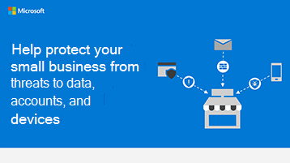

# Säkerhetsinformationsgrafik för småföretagSecurity info graphic for small businesses

**Sammanfattning:** Lär dig de grundläggande villkoren för de hot ditt företag står inför och vad du kan göra för att skydda dina data, konton och enheter.**Summary:** Learn the basic terms for the threats your business faces and what you can do to protect your data, accounts, and devices. Som administratör för Microsoft 365 för företag vidtar du åtgärder för att göra ditt företag säkrare och hjälper alla anställda att lära sig hur du skyddar dina affärsdata och enheter.As an admin for Microsoft 365 for business, take action to make your business more secure, and help every employee learn how to keep your business data and devices safe.

Länkarna för PowerPoint och PDF nedan kan laddas ned och skrivas ut i tabloidformat (kallas även redovisning, 11 x 17 eller A3).The links for PowerPoint and PDF below can be downloaded and printed in tabloid format (also known as ledger, 11 x 17, or A3).

[PDF](downloads/smbthreatprotection-infographic.pdf) | [PowerPoint](https://github.com/MicrosoftDocs/microsoft-365-docs-pr/raw/live/m365-democracy/microsoft-365/admin/downloads/smbthreatprotection-infographic.pptx)[PDF](downloads/smbthreatprotection-infographic.pdf) | [PowerPoint](https://github.com/MicrosoftDocs/microsoft-365-docs-pr/raw/live/m365-democracy/microsoft-365/admin/downloads/smbthreatprotection-infographic.pptx)
