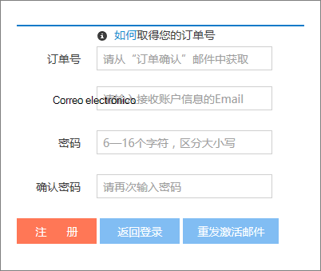
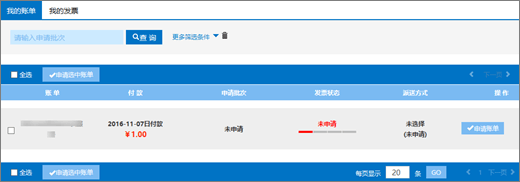
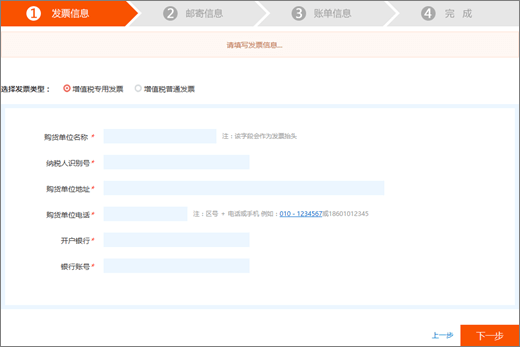
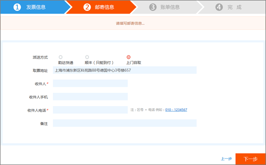
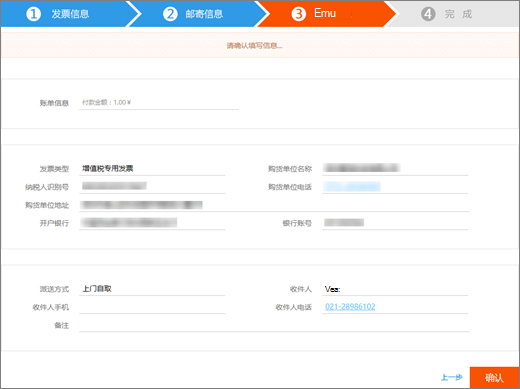
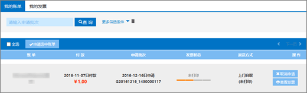
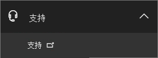
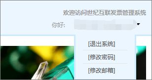
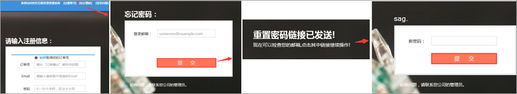

# Ansök om en Fapiao för Office 365 som drivs av 21VianetApply for a Fapiao for Office 365 operated by 21Vianet

> [!NOTE]
> Administrationscentret förändras.The admin center is changing. Om dina erfarenheter inte överensstämmer med uppgifterna som visas här kan du läsa mer i [Om det nya administrationscentret för Microsoft 365](https://docs.microsoft.com/microsoft-365/admin/microsoft-365-admin-center-preview?view=o365-21vianet&preserve-view=true).If your experience doesn't match the details presented here, see [About the new Microsoft 365 admin center](https://docs.microsoft.com/microsoft-365/admin/microsoft-365-admin-center-preview?view=o365-21vianet&preserve-view=true).

Du kan skicka din Fapiao-begäran till 21Vianet Fapiao-hanteringssystemet ungefär tre dagar efter att du har betalat.You can submit your Fapiao request to the 21Vianet Fapiao management system about three days after you have paid. När du skickar din Fapiao-begäran bearbetas den om två dagar.After you submit your Fapiao request, it will be processed in two days.
  

  
## Steg 1: Ansök om en FapiaoStep 1: Apply for a Fapiao

Det finns två sätt att använda för en Fapiao:There are two ways to apply for a Fapiao:
  
1. När du har gjort en betalning på Office 365 som drivs av 21Vianets webbplats får du en orderbekräftelse via e-post som innehåller ditt ordernummer och en länk till Fapiao-hanteringssystemet.After making a payment in the Office 365 operated by 21Vianet website, you'll receive an order confirmation email that contains your order number and a link to the Fapiao management system. Du kan använda länken i e-postmeddelandet för att skapa ett konto i <a href="https://go.microsoft.com/fwlink/p/?linkid=837466" target="_blank">21Vianet Fapiao-informationshanteringssystemet.</a>You can use the link in the email to create an account in the <a href="https://go.microsoft.com/fwlink/p/?linkid=837466" target="_blank">21Vianet Fapiao information management system</a>.

    EllerOr

2. Du kan ansöka om en Fapiao från <a href="https://go.microsoft.com/fwlink/p/?linkid=850627" target="_blank">administrationscentret.</a>You can apply for a Fapiao from the <a href="https://go.microsoft.com/fwlink/p/?linkid=850627" target="_blank">admin center</a>.

    
  
## Steg 2: Registrera dig med 21Vianet Fapiao-hanteringssystemetStep 2: Register with the 21Vianet Fapiao management system

> [!NOTE]
> Du kan använda samma e-postnamn och lösenord som ditt Office 365-konto, eller så kan du använda något annat.You can use the same email name and password as your Office 365 account, or you can use something different.
  
1. Gå till <a href="https://go.microsoft.com/fwlink/p/?linkid=837466" target="_blank">informationshanteringssystemet 21Vianet Fapiao.</a>Go to the <a href="https://go.microsoft.com/fwlink/p/?linkid=837466" target="_blank">21Vianet Fapiao information management system</a>.

2. I registreringsformuläret anger du ordernumret, e-postadressen och lösenordet och väljer **registrering.**In the registration form, enter your order number, email address, and password, then select **Registration**.

    
  
3. När registreringen är klar skickar systemet ett e-postmeddelande om aktivering till din e-postadress.After your registration is complete, the system will send an activation email message to your email address. Öppna e-postmeddelandet och klicka på länken för att aktivera ditt konto.Open the email message and select the link to activate your account.

## Steg 3: Skicka din faktura för en FapiaoStep 3: Submit your bill for a Fapiao

1. Logga in på <a href="https://go.microsoft.com/fwlink/p/?linkid=837465" target="_blank">Fapiao-hanteringssystemet.</a>Log in to the <a href="https://go.microsoft.com/fwlink/p/?linkid=837465" target="_blank">Fapiao management system</a>.

2. Välj faktureringsposten och välj **sedan Använd faktura.**Select the billing record, then select **Apply bill**.

    > [!NOTE]
    > Betalningssystemet finns på en tredjepartsplattform och tar tre dagar att synkronisera order- och betalningsposten.The payment system is on a third-party platform and takes three days to synchronize the order and payment record.
  
    
  
3. Välj typen Fapiao, ange den information som krävs och välj sedan **Nästa.**Select the Fapiao type, enter the required information, then select **Next**.

    
  
    > [!NOTE]
    > - För en vanlig moms fapiao behöver du bara ange köparens namn.For a normal VAT Fapiao, you only need to enter the buyer's name.
    > - Om det behövs kan du ansöka om en Fapiao med en annan rubrik.If necessary, you can apply for a Fapiao with different a title. Du kan dock bara använda en Fapiao-rubrik för en faktura i systemet.However, you can only apply one Fapiao title for one bill in the system. Om du vill dela upp Fapiao i olika belopp eller titlar skickar du <a href="https://portal.partner.microsoftonline.cn/Support/SupportOverview.aspx" target="_blank">din begäran i administrationscentret.</a>If you want to split the Fapiao into different amounts or titles, please <a href="https://portal.partner.microsoftonline.cn/Support/SupportOverview.aspx" target="_blank">submit your request in the admin center</a>.
    > - Nästa gång du söker efter en Fapiao visas den tidigare Fapiao-informationen automatiskt i systemet.The next time you apply for a Fapiao, the system automatically presents the previous Fapiao information.
    > - Om du behöver ett inköpscertifikat eller en återbetalning måste namnet på den som betalar och Fapiao-titeln matcha.If you need a purchase certificate or a refund, the payer name and the Fapiao title must match.

4. Välj en leveransmetod och ange distributionsinformationen.Select a shipping method and enter the mailing information. Du kan välja Yunda eller SF (fraktinsamlat).You can choose Yunda or SF (freight collect). Du kan också gå till 21Vianet Branch för Att skaffa Fapiao.You can also go to the 21Vianet Shanghai branch to get the Fapiao. väljer **du Nästa.**select **Next**.

    
  
    **Företagsadressen 21Vianet Branch Branch:****21Vianet Shanghai branch company address:**

    Pudong New Area Keynyckeln Road No.Shanghai, Pudong New Area Keyuan Road No. 88, Tyska center, byggnad 3, 65788, German Center, building 3, 657

    **Kontaktinformation:****Contact information:**

    Zhu qin 021-28986102Zhu qin qin 021-28986102

5. Kontrollera att informationen är korrekt och välj sedan **Bekräfta.**Verify that the information is correct, then select **Confirm**.

    
  
## Steg 4: Kontrollera programförloppetStep 4: Check application progress

Programmet överförs automatiskt till 21Vianet Service Center och slutförs om två arbetsdagar.Your application is automatically transmitted to the 21Vianet Service Center, and will be completed in two working days.
  
När du har skickat in din ansökan kan du när som helst kontrollera förloppet.After you submit the application, you can check the progress at any time. Vi uppdaterar statusen för din ansökan med kommentarer som Utfärdat **eller** **E-postat.**We will update the status of your application with remarks like **Issued** or **Mailed out**.
  

  
När Fapiao inte används visar systemet ett meddelande och anger den förväntade tiden för att utfärda Fapiao.When Fapiao is out of use, the system will display a notice, and will indicate the expected time to issue the Fapiao.
  

  
## Vanliga frågor och svarFAQs

### Vilka tjänster kan jag få från onlinesupporten?What services can I get from online support?

Du kan kontrollera förloppet för din Fapiao-begäran och ta reda på varför du inte har fått Fapiao.You can check the progress of your Fapiao request, and find out why you haven't received the Fapiao.
  
Om du vill ändra Fapiao-titeln skickar du Fapiao tillbaka till oss så visas Fapiao igen.If you want to change the Fapiao title, please send the Fapiao back to us and we will reissue the Fapiao. Du kan skicka begäran via <a href="https://portal.partner.microsoftonline.cn/Support/SupportOverview.aspx" target="_blank">administrationscentret.</a>You can submit the request through the <a href="https://portal.partner.microsoftonline.cn/Support/SupportOverview.aspx" target="_blank">admin center</a>.
  

  
### Hur ändrar jag min e-postadress och mitt lösenord för inloggning?How do I change my login email address and password?

1. Logga in på <a href="https://go.microsoft.com/fwlink/p/?linkid=837465" target="_blank">hanteringssystemet Fapiao och</a>välj sedan **Ändra e-postadress.**Log in to the <a href="https://go.microsoft.com/fwlink/p/?linkid=837465" target="_blank">Fapiao management system</a>, then select **Change email address**.

    
  
2. Om du har glömt ditt lösenord kan du återställa lösenordet med e-postadressen som du loggar in.If you forgot your login password, you can use your login email address to reset the password. Hanteringssystemet Fapiao skickar ett nytt lösenord till din e-postadress.The Fapiao management system will send a new password to your email address. Du kan använda det nya lösenordet för att logga in.You can use the new password to login.

    
  
3. Om du har glömt din inloggnings-e-postadress kontaktar du 21Vianets kundtjänst på (86) 400-089-0365.If you forgot your login email address, please contact 21Vianet customer service at (86) 400-089-0365.

### Hur hittar jag mitt order-ID?How do I find my order ID?

1. I [administrationscentret går](https://go.microsoft.com/fwlink/p/?linkid=850627)du till sidan  \> **Faktureringsfakturor & betalningar.**In the [admin center](https://go.microsoft.com/fwlink/p/?linkid=850627), go to the **Billing** \> **Bills & payments** page.

2. Leta reda på fakturan, välj att visa eller välj att ladda ned PDF-filen.Find the invoice you want, select to view, or choose to download the PDF.

### Vad händer om jag anger fel e-postadress när jag registrerar mig?What if I enter the wrong email address when I register?

Om du anger fel e-postadress när du registrerar dig får du inte aktiveringsmeddelandet.If you enter the wrong email address when you register, you won't receive the activation email. Registreringslänken i e-postmeddelandet upphör automatiskt efter 24 timmar.The registration link in the email will automatically expire after 24 hours. Du kan gå tillbaka till <a href="https://go.microsoft.com/fwlink/p/?linkid=837466" target="_blank">registreringssidan</a> och registrera dig igen med rätt e-postadress.You can return to the <a href="https://go.microsoft.com/fwlink/p/?linkid=837466" target="_blank">registration page</a> and register again with the correct email address.
  
### Vad händer om jag inte får något aktiveringsmeddelande via e-post?What if I don't receive an activation email?

Om du inte fått ett e-postmeddelande om kontoaktivering inom 24 timmar efter att du registrerat dig går du till <a href="https://go.microsoft.com/fwlink/p/?linkid=837466" target="_blank">21Vianet Fapiao Information Management System,</a>anger din e-postadress och väljer Skicka aktiveringsmeddelandet **igen.**If you don't receive an account activation email within 24 hours after you register, go to the <a href="https://go.microsoft.com/fwlink/p/?linkid=837466" target="_blank">21Vianet Fapiao information management system</a>, enter your email address, then select **Resend the activation email**. Systemet skickar e-postmeddelandet med kontoaktiveringen igen till din registrerade e-postadress.The system will resend the account activation email to your registered email address.
  

  
Om du fortfarande inte får ett aktiveringsmeddelande kan du kontakta 21Vianets kundtjänst på (86) 400-089-0365.If you still don't receive an activation email, please contact 21Vianet customer service at (86) 400-089-0365.