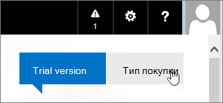

# Köp eller prova abonnemang för Office 365 som drivs av 21Vianet

> [!NOTE]
>  Den här artikeln gäller Office 365 som drivs av 21Vianet i Kina.

## Köp eller prova Office 365

Du kan köpa en prenumeration direkt, eller så kan du prova Office 365 i upp till 30 dagar. Om du gillar den kan du köpa utvärderings prenumerationen och behålla den domän, de data och den konfiguration du har registrerat i din utvärderings period.

1. Gå till [Jämför Office 365 för företag-abonnemang](https://go.microsoft.com/fwlink/p/?linkid=393691&amp;clcid=0x409) och välj namnet på det abonnemang du vill köpa. Välj sedan **Köp nu**.

2. Skapa ett konto genom att fylla i sidan **bara några få detaljer** .

3. Följ instruktionerna för att ställa in en 30-dagars prov period eller för att slutföra köpet.

## Köp din utvärderings prenumeration

1. [Logga in på Office 365](https://go.microsoft.com/fwlink/p/?linkid=513813) med ditt konto för arbetet eller skolan.

2. Om du inte redan är på startsidan så väljer du **Office 365** i det övre vänstra hörnet.

    

3. Klicka på **Köp** högst upp till höger på sidan under navigeringslisten.

    

4. På sidan **Köp prenumerationer** ser du olika planer som du kan köpa. Den plan du har testat har symbolen **Utvärderingsversion**.

    > [!IMPORTANT]
    > Om du köper ett annat abonnemang från din prov plan måste du tilldela dina licenser från utvärderings planen till det nya abonnemanget (innan respittiden för 90 dagar går ut efter det att utvärderings planen upphör) för att behålla dina data, konton och din konfiguration. Annars kommer du att förlora data, konton och konfiguration.

5. Välj prenumerationen du vill köpa och välj sedan **Köp nu**.

6. Följ stegen för att checka ut.

## Lägga till prenumerationer eller tillägg i ett befintligt Office 365-konto

1. Gå till sidan **fakturering** i [administrations centret](https://go.microsoft.com/fwlink/p/?linkid=850627) \> **Purchase services** .

2. Välj de tjänster som du vill köpa, Välj **köp**och välj sedan ta **bort nu**.

3. Följ instruktionerna för att slutföra köpet.

## Betalningsalternativ

Du kan betala för ditt abonnemang genom att:

- Fakturadeklaration

- Online-betalning med Alipay eller Kina UnionPay

Betalnings bevis kommer att tillhandahållas i form av fapiaos. Du kan skicka din fapiao-begäran till vårt [fapiao system](https://go.microsoft.com/fwlink/p/?LinkId=395314) om tre (3) dagar efter att du har betalat. Mer information finns i artikeln [om att använda en fapiao för Office 365 som drivs av 21Vianet](apply-for-a-fapiao.md).

> [!NOTE]
>  Internationella kredit kort accepteras inte.
