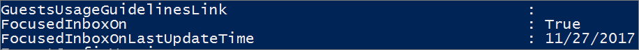

# <a name="configure-focused-inbox-for-everyone-in-your-organization"></a>Konfigurera Prioriterad inkorg för alla i organisationen

  Om du är ansvarig för att konfigurera hur e-post fungerar för ALLA i ett företag är den här artikeln för dig! Här förklaras det hur du anpassar eller inaktiverar den för ditt företag och här finns svar på [Vanliga frågor](#faq-for-focused-inbox).  <br/> Om du vill stänga av Prioriterad inkorg bara för dig själv läser du [Stänga av Prioriterad inkorg](https://support.microsoft.com/office/f714d94d-9e63-4217-9ccb-6cb2986aa1b2).  
   
If you want to be sure that your users receive business-specific email messages, for example, from HR or payroll, you can configure Focused Inbox so these messages reach the Focused view. You can also control whether users in your organization see the Focused Inbox in their mailbox.
  
## <a name="turn-focused-inbox-on-or-off-in-your-organization"></a>Aktivera eller inaktivera Prioriterad inkorg för din organisation

Du kan använda PowerShell för att aktivera eller inaktivera Prioriterad inkorg för alla i organisationen. Vill du göra detta i administrationscentret för Microsoft 365? Berätta gärna det för vårt tekniska team. **[Rösta här!](https://go.microsoft.com/fwlink/?linkid=862489)**
  
 **Stänga av Prioriterad inkorg**
  
The following PowerShell example turns Focused Inbox **Off** in your organization. However, it doesn't block the availability of the feature for your users. If they want, they can still re-enable Focused Inbox again on each of their clients. 
  
1. [Ansluta till Exchange Online med fjärr-PowerShell](https://go.microsoft.com/fwlink/p/?LinkId=396554).
    
2. You need to be assigned permissions before you can perform this procedure or procedures. To see what permissions you need, see the "Transport rules" entry in [Messaging policy and compliance permissions](https://go.microsoft.com/fwlink/p/?LinkId=829796).
    
3. Kör cmdlet **Get-OrganizationConfig**. 
    
 ``` PowerShell
Get-OrganizationConfig
 ```

4. Leta efter **FocusedInboxOn** för att visa den aktuella inställningen: 
    
    
  
5. Kör följande cmdlet om du vill inaktivera Prioriterad inkorg.
    
 ``` PowerShell
 Set-OrganizationConfig -FocusedInboxOn $false
 ```

6. Kör cmdlet **Get-OrganizationConfig** igen och så ser du att FocusedInboxOn anges till $false, vilket innebär att den har inaktiverats. 
    
 **Aktivera Prioriterad inkorg:**
  
- I steg 5 ovan kör du följande cmdlet om du vill aktivera Prioriterad inkorg.
    
 ``` PowerShell
 Set-OrganizationConfig -FocusedInboxOn $true
 ```

## <a name="what-do-users-see-after-i-turn-on-focused-inbox"></a>Vad ser användarna ser när jag aktiverar Prioriterad inkorg? 

Your users will see the Focused view only after they close and restart Outlook. When they restart Outlook, they'll see a Tip in the Outlook user interface giving them to the option to use the new Focused Inbox.
  

  
If you're switching from Clutter to Focused Inbox, they can decide to enable it ("Try it") or dismiss the feature. If the user has multiple (supported) clients, they can enable/disable Focused Inbox individually on each one. The tip looks like this:
  

  
When a user decides to start using Focused Inbox, Clutter gets disabled automatically. The Clutter folder gets converted into a standard folder, that allows the user to rename or delete it.
  
## <a name="turn-focused-inbox-on-or-off-for-specific-users"></a>Aktivera eller inaktivera Prioriterad inkorg för specifika användare

This example turns Focused Inbox **Off** for Tim Matthews in the Contoso organization. However, it doesn't block the availability of the feature to him. If his wants, he can still re-enable Focused Inbox again on each of his clients. 
  
1. [Ansluta till Exchange Online med fjärr-PowerShell](https://go.microsoft.com/fwlink/p/?LinkId=396554).
    
2. You need to be assigned permissions before you can perform this procedure or procedures. To see what permissions you need, see the "Transport rules" entry in the Messaging policy and compliance permissions topic.
    
3. Kör cmdleten **Get-FocusedInbox**, till exempel: 
    
 ``` PowerShell
 Get-FocusedInbox -Identity <tim@contoso.com>
 ```

4. Leta efter FocusedInboxOn för att visa den aktuella inställningen:
    
    
  
5. Kör följande cmdlet om du vill inaktivera Prioriterad inkorg:
    
 ``` PowerShell
 Set-FocusedInbox -Identity <tim@contoso.com> -FocusedInboxOn $false
 ```

6. ELLER, kör följande cmdlet om du vill aktivera den:
    
 ``` PowerShell
 Set-FocusedInbox -Identity <tim@contoso.com> -FocusedInboxOn $true
 ```

## <a name="use-the-ui-to-create-a-transport-rule-to-direct-email-messages-to-the-focused-view-for-all-your-users"></a>Använda gränssnittet till att skapa en transportregel som dirigerar e-postmeddelanden till vyn Prioriterad för alla användare

1. Gå till <a href="https://go.microsoft.com/fwlink/p/?linkid=2059104" target="_blank">administrationscentret för Exchange</a>.
    
2. Gå till **E-postflöde** \> **Regler**. Välj  och välj sedan **Skapa en ny regel**. 
    
3. När du är färdig med den nya regeln klickar du på **Spara** så att regeln börjar gälla. 
    
    I den följande bilden skickas alla meddelanden från ”Löneavdelningen” till den prioriterade inkorgen.
    
    
  
## <a name="use-powershell-to-create-a-transport-rule-to-direct-email-messages-to-the-focused-view-for-all-your-users"></a>Använda PowerShell till att skapa en transportregel som dirigerar e-postmeddelanden till vyn Prioriterad för alla användare

1. [Ansluta till Exchange Online med fjärr-PowerShell](https://go.microsoft.com/fwlink/p/?LinkId=396554).
    
2. You need to be assigned permissions before you can perform this procedure or procedures. To see what permissions you need, see the "Transport rules" entry in [Messaging policy and compliance permissions](https://go.microsoft.com/fwlink/p/?LinkId=829796).

3. Kör följande kommando om du vill skicka alla meddelanden från ”Löneavdelningen” till den prioriterade inkorgen.
    
 ``` PowerShell
 New-TransportRule -Name <name_of_the_rule> -From "Payroll Department" -SetHeaderName "X-MS-Exchange-Organization-BypassFocusedInbox" -SetHeaderValue "true"
 ```

> [!IMPORTANT]
> I det här exemplet är både ”X-MS-Exchange-Organization-BypassFocusedInbox” och ”true” skiftlägeskänsliga.
> Prioriterad inkorg respekterar X-headern som åsidosätter övrig e-post, så om du använder den här inställningen i Övrig e-post används den även i Prioriterad inkorg. Detaljerad information om syntax och parametrar finns i [New-TransportRule](https://go.microsoft.com/fwlink/p/?LinkId=830194).

### <a name="how-do-you-know-this-worked"></a>Hur vet du att det fungerade?

Du kan kontrollera meddelandehuvudena och se efter om e-post hamnar i Inkorgen på grund av att transportregeln för Prioriterad inkorg kringgås. Välj ett e-postmeddelande i en postlåda i organisationen som transportregeln för Prioriterad inkorg använts för. Om du tittar på meddelandehuvudet ska du se **X-MS-Exchange-Organization-BypassFocusedInbox: true**. Det här innebär att regeln fungerar. Läs mer om att hitta informationen i meddelandehuvudet i [Visa e-postmeddelandehuvud](https://go.microsoft.com/fwlink/p/?LinkId=822530). 
 
## <a name="turn-onoff-clutter"></a>Aktivera/inaktivera Övrig e-post
 
We've received reports that Clutter suddenly stopped working for some users. If this happens, you can enable it again for specific users. See [Configure Clutter for your organization](../email/configure-clutter.md).
 
## <a name="faq-for-focused-inbox"></a>Vanliga frågor och svar om Prioriterad inkorg

Här är svar på några vanliga frågor om Prioriterad inkorg. 

### <a name="can-i-control-how-i-roll-out-focused-inbox-in-my-organization"></a>Kan jag styra hur jag distribuerar Prioriterad inkorg i min organisation?

Yes. You can turn Focused Inbox on or off for your entire organization, or you can turn it on or off for specified users. See above.
  
### <a name="is-the-focused-inbox-feature-only-available-for-office-2016-clients"></a>Är funktionen Prioriterad inkorg ENDAST tillgänglig för Office 2016-klienter?

Ja, det är bara användare med Office 2016 som påverkas. Funktionen kommer inte att bakåtanpassas till Outlook 2013 eller tidigare.
  
### <a name="how-long-does-it-take-for-focused-inbox-changes-to-take-place-in-outlook"></a>Hur lång tid tar det för ändringar i Prioriterad inkorg att verkställas i Outlook?

När du aktiverar eller inaktiverar Prioriterad inkorg börjar inställningarna gälla när användarna stänger och startar om Outlook.
  
### <a name="what-happens-to-clutter-once-i-turn-on-focused-inbox"></a>Vad händer med Övrig e-post när jag aktiverar Prioriterad inkorg?

After switching, you'll no longer receive less actionable email in the Clutter folder. Instead, email will be split between the Focused and Other tabs in your inbox. The same algorithm that moved items to the Clutter folder now powers Focused Inbox, meaning that any emails that were set to move to Clutter will now be moved to Other. Any messages already in your Clutter folder will remain there until you decide to delete or move them.
  
Läs det här inlägget från [Tony Redmond](https://www.petri.com/author/tony-redmond), Microsoft MVP: [How the Focused Inbox Replaces Clutter Inside Office 365](https://www.petri.com/focused-inbox-office-365) (på engelska).
  
### <a name="can-i-keep-users-on-clutter-what-is-microsofts-recommendation-when-it-comes-to-using-clutter-vs-focused-inbox"></a>Kan jag låta användare behålla Övrig e-post? Vad rekommenderar Microsoft när det gäller Övrig e-post eller Prioriterad inkorg?

Yes, you can keep users on Clutter and disable Focused Inbox, however, eventually Clutter will be fully replaced with Focused Inbox so Microsoft's recommends moving to Focused Inbox now. To learn more about when you use Clutter with Exchange Online, see this blog post: [Update on Focused Inbox and our plans for Clutter](https://techcommunity.microsoft.com/t5/Outlook-Blog/Update-on-Focused-Inbox-and-our-plans-for-Clutter/ba-p/136448).
  
### <a name="should-i-disable-clutter-for-my-end-users-if-we-are-going-to-move-everyone-to-focused-inbox"></a>Bör jag inaktivera Övrig e-post för mina slutanvändare om alla så småningom ska byta till Prioriterad inkorg?

No. It's possible to disable Clutter for a mailbox explicitly by running the Set-Clutter cmdlet. However, if you do this, the mailbox owner will see messages that were previously redirected to the Clutter folder remain in the Inbox and they'll have to process those messages until their client is upgraded to a version that supports the Focused Inbox. It's therefore best not to disable Clutter until the upgraded clients are available.
  
### <a name="why-are-there-two-different-cmdlets-for-managing-focused-inbox"></a>Varför finns det två cmdletar för att hantera Prioriterad inkorg?

Det finns två lägen kopplade till Prioriterad inkorg.
  
- Läget **Organisationsnivå**: Prioriterad inkorg, samt en tillhörande tidsstämpel för senaste uppdatering. 
    
- Läget **Postlådenivå**: Prioriterad inkorg, samt en tillhörande tidsstämpel för senaste uppdatering. 
    
### <a name="how-does-outlook-decide-to-show-the-focused-inbox-experience-with-these-two-states"></a>Hur avgör Outlook vilken version av Prioriterad inkorg som ska visas med dessa två lägen?

Outlook decides to show the experience by choosing which cmdlet has the latest time stamp. By default, both time stamps are "null" and in this case, the feature is enabled.
  
### <a name="why-does-the-get-focusedinbox-cmdlet-return-true-when-ive-turned-focused-inbox-off-in-my-organization"></a>Varför returnerar cmdleten Get-FocusedInbox ”true” när jag har inaktiverat Prioriterad inkorg i min organisation?

There are two cmdlets for controlling Focused Inbox. When you run Get-FocusedInbox for a mailbox, it returns the mailbox level state of the feature. The experience in Outlook is chosen based on which cmdlet state was last modified.
  
### <a name="can-i-run-a-script-to-see-who-has-turned-on-focused-inbox"></a>Kan jag se vem som har aktiverat Prioriterad inkorg genom att köra ett skript?

No, and this is by design. Focused Inbox enablement is a client side setting, so all the cmdlet can do is tell you if the user's mailbox is eligible for the client experience. It is possible for it to be simultaneously enabled in some clients and disabled in others, for example, enabled in Outlook app and Outlook Mobile but disabled in Outlook on the web.
