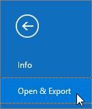
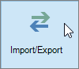

# Migrera e-post och kontakter till Microsoft 365

Importera eller kopiera e-post från Gmail eller en annan e-postleverantör till Microsoft 365.
  
 **Vill du ha hjälp med det här?**  [Kontakta Microsoft 365 för företagssupport](../contact-support-for-business-products.md) . 
  
Du måste använda en version av Outlook som är installerad på skrivbordet för den här uppgiften. Outlook ingår i de flesta Microsoft [365-abonnemang](https://go.microsoft.com/fwlink/p/?LinkId=723731).
  
### Importera från Gmail

Så här importerar du e-post, kontakter och kalender från Gmail till Outlook med Microsoft 365:
  
- [Importera Gmail till Outlook](https://support.office.com/article/20fdb8f2-fed8-4b14-baf0-bf04b9c44bf7.aspx)
    
- [Importera kontakter till Outlook](https://support.office.com/article/bb796340-b58a-46c1-90c7-b549b8f3c5f8.aspx)
    
- [Importera Google Kalender](https://support.office.com/article/098ed60c-936b-41fb-83d6-7e3786437330)
    
> [!VIDEO https://www.microsoft.com/videoplayer/embed/c1e45708-9a92-475b-910b-f5aa40614d92?autoplay=false]
  
### Importera från Outlook (skrivbord)

Så här exporterar du e-post, kontakter och kalendrar från Outlook till en PST-fil och importerar sedan filen till Outlook med Microsoft 365:
  
1. [Exportera e-post, kontakter och kalender](https://support.office.com/article/14252b52-3075-4e9b-be4e-ff9ef1068f91)
    
2. [Importera e-post, kontakter och kalender](https://support.office.com/article/431a8e9a-f99f-4d5f-ae48-ded54b3440ac)
    
Om du bara vill ha kontakter gör du så här:
  
1. [Exportera kontakter från Outlook](https://support.office.com/article/10f09abd-643c-4495-bb80-543714eca73f.aspx)
    
2. [Importera kontakter till Outlook](https://support.office.com/article/bb796340-b58a-46c1-90c7-b549b8f3c5f8.aspx)
    
Starta Processen genom att öppna Outlook och välja **Filöppna** \> ** &amp; ** \> **exportimport/export**.
  

  
## Visa andra e-postkonton i Outlook

Vill du bara se din e-post från en annan leverantör (som Gmail, Yahoo eller Live.com) i Outlook? Du behöver inte importera eller migrera. Du kan konfigurera Outlook eller Outlook Web App så att du kan komma åt dina andra konton från samma plats som microsoft 365-postlådan och skicka, ta emot och läsa e-post som skickas till dessa konton.
  
### Outlook (skrivbord)

Lägg till ett konto, till exempel ditt privata Gmail-konto, i Outlook.
  
- Öppna Outlook och gå sedan till \> **Filtilläggskonto**. **File**
    
Behöver du mer detaljerade steg? Se [Lägga till ett konto](https://support.office.com/article/6e27792a-9267-4aa4-8bb6-c84ef146101b).
  

  
## Flera postlådor: Administratörer kan massimport importera e-post, kontakter och kalendrar till Microsoft 365

Beroende på ditt källe-postsystem kan du välja mellan flera massmigreringsmetoder. Läs [olika sätt att migrera flera e-postkonton till Microsoft 365](https://support.office.com/article/0a4913fe-60fb-498f-9155-a86516418842) för att bestämma vilken metod som fungerar för dig. 
  

