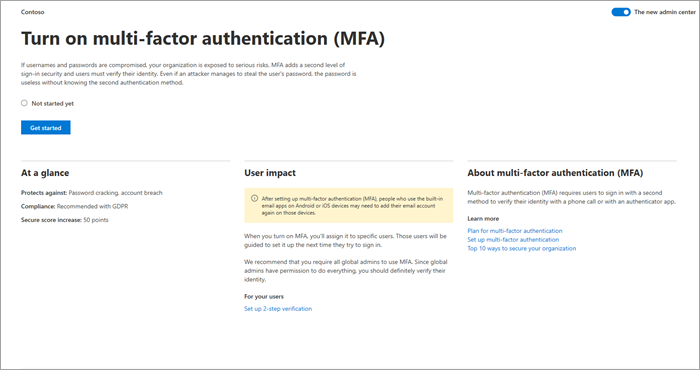

# Skillnaden mellan installations guiden och inställnings sidanDifference between the setup wizard and the Setup page

Microsoft 365 har två installations program:Microsoft 365 provides two setup experiences: 

- Första konfigurationen med installations guidenInitial setup using the setup wizard
- Pågående och avancerade inställningar med hjälp av sidan **konfiguration**Ongoing and advanced setup using the **Setup** page

I installations guiden får du en guidad genom gång för att konfigurera den grundläggande Microsoft 365-konfigurationen.The setup wizard provides a guided walkthrough for setting up the basic Microsoft 365 configuration. När du har slutfört den första installationen kan du gå till **inställnings** sidan för att slutföra installationen och konfigureringen av de tjänster som medföljer dina abonnemang.After you complete the initial setup, you can go to the **Setup** page to finish setting up and configuring the services that come with your subscriptions.

## Använd installations guiden för att slutföra inledande konfigurations uppgifterUse the setup wizard to complete initial setup tasks

Konfigurera ditt konto genom att gå till [administrations centret](https://go.microsoft.com/fwlink/p/?linkid=2024339), välja **Inställningar** i det vänstra navigerings fönstret och sedan välja **interaktiv installation** på **inställnings** sidan.To set up your account, go to the [admin center](https://go.microsoft.com/fwlink/p/?linkid=2024339), select **Setup** in the left navigation pane, and then select **Guided setup** on the **Setup** page.

Installations guiden vägleder dig på följande sätt:The setup wizard guides you through the following steps:

1. Installera Microsoft 365-programmen på datorn.Install the Microsoft 365 apps on your computer.

2. Välj och verifiera din domän, till exempel contoso.com.Choose and verify your domain, such as contoso.com.

3. Lägg till nya användare och tilldela licenser till dem så att de kan ladda ned och installera Microsoft 365-appar.Add new users and assign licenses to them so that they can download and install Microsoft 365 apps.

4. Anslut din domän.Connect your domain.

## Använda sidan konfiguration för att slutföra och hantera din konfigurationUse the Setup page to complete and manage your configuration

För att komma åt sidan **Inställningar** i [administrations centret](https://go.microsoft.com/fwlink/p/?linkid=2024339)väljer du **Inställningar** i navigerings fönstret.To access the **Setup** page in the [admin center](https://go.microsoft.com/fwlink/p/?linkid=2024339), select **Setup** in the navigation pane. Utifrån produkter som du har köpt, funktioner som du har konfigurerat och administratörs rollen, uppgifter och relaterad information från Microsoft 365 finns här.Based on products you've purchased, features you've set up, and your admin role, tasks and related information from across Microsoft 365 are surfaced here.

Den fullständiga listan över konfigurations uppgifter ordnas i logiska kategorier, inklusive de som du har slutfört i installations guiden.You'll see the complete list of setup tasks arranged in logical categories, including those that you completed in the setup wizard.

Välj **Visa** för en uppgift för att få en snabb överblick över informationen, till exempel aktivitets beskrivning, användarens påverkan, förutsättningar, ansträngning att implementera och säkerhets-och antagande statistik som hjälper dig att förstå konsekvenserna och konsekvenserna innan du fortsätter.Choose **View** for any task to get at-a-glance information, such as task description, user impact, prerequisites, effort to implement, and security and adoption statistics to help you understand consequences and impact before proceeding.

Du ser också aktivitetens status (**startat**, **inte påbörjat**, eller **slutfört**).You'll also see the status of the task (**Started**, **Not started yet**, or **Completed**). Om du arbetar med flera aktiviteter samtidigt, eller om det finns flera administratörer som arbetar med aktiviteter, kan du spåra slutförandet genom att se hur snabbt de är och vilka som kräver åtgärd.If you're multi-tasking, working on tasks over several days, or if there are multiple admins working on tasks, you can track completion by seeing at a glance which tasks have been completed and which ones still require attention. 

Om du vill ha till gång till omfattande artiklar om de funktioner som du installerar väljer du någon av länkarna för **Mer information** .For access to comprehensive articles about the features you're setting up, select any of the **Learn more** links. Mängden uppgifter är alltid här, så du kan återgå till **inställnings** sidan när som helst för att utforska resurserna.The collection of tasks is always here, so you can return to the **Setup** page at any time to explore resources further.

När du är redo att slutföra en aktivitet väljer du **komma igång** för att gå igenom konfigurations processen.When you're ready to complete a task, select **Get started** to walk through the configuration process. När du är klar med en uppgift ändras knappen **Kom igång** till knappen **Hantera** , vilket gör att du kan hantera uppgiften, efter behov.Once you complete a task, the **Get started** button changes to a **Manage** button, allowing you to manage the task, as needed.

