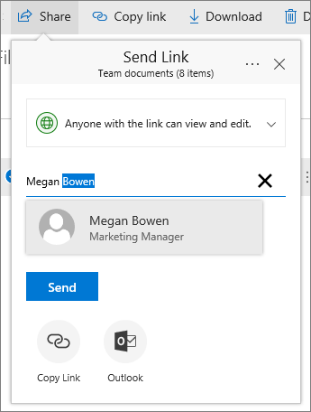
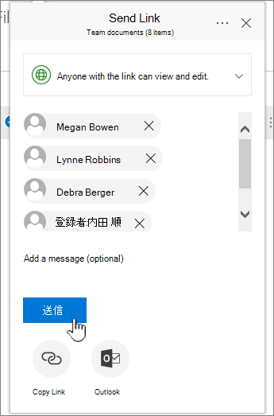
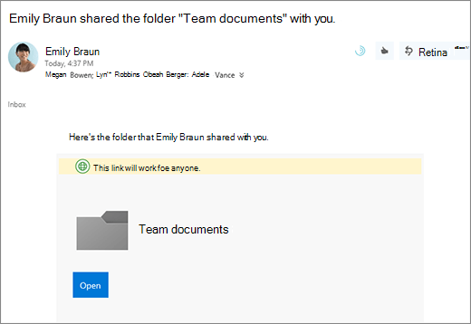

# Konfigurera fil lagring och delning i Microsoft 365

Ett av de bästa sätten att konfigurera fil lagring och delning för ditt företag är att använda OneDrive och en grupp webbplats tillsammans. Det här är bra om du har ett litet företag med några få anställda.

Titta på en kort video om att lagra filer i Microsoft 365-molnet.  

> [!VIDEO https://www.microsoft.com/videoplayer/embed/RE1FTHX] 

Om den här videon har hjälpt dig kan du ta en titt på den [fullständiga utbildningsserien för småföretag och nya användare av Microsoft 365](https://support.microsoft.com/office/6ab4bbcd-79cf-4000-a0bd-d42ce4d12816).

## "Microsoft 365 Document Storage and Management"

- OneDrive är avsett för individuell användning, med tillfällig delning av filer.

- En grupp webbplats är utformad för att du ska kunna dela och samar beta med filer regelbundet. En grupp webbplats är idealisk för att lagra filer som har delade ägarskap där flera personer äger filerna och kan samar beta på dem. Skapa ett Microsoft-team för att lägga till en grupp webbplats. Mer information finns i [skapa ett team i Teams](https://support.microsoft.com/office/174adf5f-846b-4780-b765-de1a0a737e2b).

Både OneDrive och grupp webbplatser ger dig åtkomst överallt åt dig och dina anställda.
  

  
Här är rekommendationer för vad du kan lagra på varje plats när du använder OneDrive och grupp webbplatser tillsammans:
  
||||
|:-----|:-----|:-----|
|**Lagringsplats**   |**Vad det används till**   |**Vad jag kan lagra här**   |
|**OneDrive**   |Att lagra innehåll i OneDrive är som att lagra filer på din dator. ingen annan kan enkelt komma åt dem.    Mer information finns i [Vad är OneDrive för företag?](https://support.microsoft.com/office/187f90af-056f-47c0-9656-cc0ddca7fdc2)   |Företagsfiler som andra gruppmedlemmar inte behöver samarbeta i eller ha tillgång till regelbundet.    |
|**SharePoint-gruppwebbplatser**   |Samarbete. När du skapar en Microsoft 365-grupp (till exempel i administrations centret för Microsoft 365 i Outlook eller genom att skapa ett team i Microsoft Teams) skapas en SharePoint-gruppwebbplats för gruppen. När du skapar en ny SharePoint-gruppwebbplats från start sidan för SharePoint eller från det nya administrations centret för SharePoint, skapas också en Microsoft 365-grupp. Mer information finns i [Vad är en SharePoint-gruppwebbplats?](https://support.microsoft.com/office/75545757-36c3-46a7-beed-0aaa74f0401e) och [skapa en grupp webbplats i SharePoint Online](https://support.microsoft.com/office/ef10c1e7-15f3-42a3-98aa-b5972711777d).    |Filer som har delade ägarskap. Vi rekommenderar separata grupp webbplatser för varje arbets enhet i organisationen. Om du till exempel vill hålla personal och ekonomiska dokument privata för en liten grupp skapar du en separat grupp webbplats.    |

> [!NOTE]
> SharePoint har också andra typer av webbplatser som du kan använda för ditt företag. Du kan använda [kommunikations webbplatser](https://support.microsoft.com/office/7fb44b20-a72f-4d2c-9173-fc8f59ba50eb) i intranätet för att publicera information till en bred publik. Och du kan använda [nav webbplatser](https://support.microsoft.com/office/fe26ae84-14b7-45b6-a6d1-948b3966427f) för att ansluta webbplatser på intranätet.
  
## Börja använda OneDrive och grupp webbplatsen

### Grupp medlemmar kan lagra sina egna filer på OneDrive

Alla personer i ditt företag som har en Microsoft 365-licens tilldelad (och SharePoint Online markerat) får moln lagring i OneDrive. De kan lagra affärsrelaterade filer här för åtkomst från vilken enhet som helst och de är bara tillgängliga för den användaren. De kan till exempel lagra utkast, mötesanteckningar eller manuskriptet till en demo som de ska leverera.
  
Anställda kan även dela OneDrive-filer och-mappar. Om en anställd är borta eller lämnar företaget kan andra komma åt delade filer som lagras i OneDrive-gruppmappen.
  
Så här kan varje person i teamet konfigurera OneDrive och dela filer.

1. Gå till <a href="https://portal.office.com/ " target="_blank">Microsoft 365-portalen</a>och logga in med ditt användar namn och lösen ord.

2. I Start programmet väljer du **OneDrive**.

3. I OneDrive kan grupp medlemmar lagra sina egna affärsrelaterade filer. Du kan dela antingen enskilda filer eller en hel mapp. Välj en fil eller mapp, högerklicka och välj sedan **dela**.

    
  
4. På sidan **Skicka länk** lämnar du standard alternativet **vem som helst med länken kan visa och redigera**.

    Skriv namn eller e-postadresser för team medlemmar som du vill ska ha till gång till mappen och Lägg till ett valfritt meddelande.

    Om du vill ha en egen kopia av e-postmeddelandet som skickas, lägger du till e-postadressen i listan.

    
  
5. När du har angett vem du vill dela med väljer du **Skicka**. E-postmeddelandet skickas omedelbart till personerna som du bjuder in.

    
  
6. Så här ser e-postmeddelandet ut. 

    
  
### Ladda upp filer till en grupp webbplats för samarbete online

Grupp webbplatser innehåller en plats där du kan lagra filer, som kallas dokument bibliotek.  
  
Så här lägger du till filer:
  
1. Välj **dokument** i den vänstra navigerings menyn på Start sidan för grupp webbplatsen. Då kommer du till ditt **Dokumentbibliotek**.
  
2. Medan du fortfarande är inloggad i Microsoft 365 kan du **Öppna Utforskaren i Windows från** aktivitets fältet eller annan plats. Gå till de filer du vill ladda upp till gruppwebbplatsen.

3. Markera de filer du vill ladda upp till grupp webbplatsen och dra dem till **dokument biblioteket**.
  
4. När du är klar har filerna lagrats både på gruppwebbplatsen och datorn.
  
5. Du kan ta bort filerna från datorn. I nästa steg ska du [synkronisera online-filer med din PC eller Mac](#sync-online-files-with-your-pc-or-mac)och skapa en ny plats för dessa filer på din dator.

    Om du har många filer eller stora filer att ladda upp till gruppwebbplatsen kan du läsa de här tipsen om att [ladda upp stora eller många filer till ett bibliotek](https://support.microsoft.com/office/da549fb1-1fcb-4167-87d0-4693e93cb7a0#__toc384119242).

    Om du behöver mer lagringsutrymme kan du läsa [Ändra lagringsutrymme för din prenumeration](../../commerce/add-storage-space.md).

### Synkronisera online-filer med din PC eller Mac

Nu när du har filer på gruppwebbplatsen kan du konfigurera dem så att de synkroniseras med PC eller Mac. På det sättet kan du arbeta med dina filer på din PC eller Mac i stället för att arbeta i Microsoft Edge, Chrome eller någon annan webbläsare. Det är också bra att ha en version av filerna synkroniserade på datorn när du behöver tillgång till en fil och inte är ansluten till Internet.
  
När du har konfigurerat filer för synkronisering med din dator synkroniseras de automatiskt när du är ansluten till Internet.
  
Så här synkroniserar du filer på gruppwebbplatsen med datorn:
  
1. Välj **dokument** i den vänstra navigerings menyn på Start sidan för grupp webbplatsen. Då kommer du till ditt dokument bibliotek.

    > [!TIP]
    > När du synkroniserar filer på grupp webbplatsen synkroniserar du alla fil bibliotek på webbplatsen, inte hela webbplatsen.
  
2. Välj **Synkronisera** för att synkronisera alla filer. Eller bläddra till den mapp som du vill synkronisera.

3. Om du uppmanas att växla appar väljer du **Ja**. I OneDrive utförs synkroniseringen.
  
4. Om du får en uppmaning om att **Konfigurera OneDrive** loggar du in med ditt arbets-eller skol konto.

    
  
5. Om du inte har synkroniserat OneDrive ännu kan du se **att det här är din OneDrive-mapp** . Kontrol lera sökvägen under **OneDrive-mappen är här**. Välj **ändra plats** om du vill använda en annan sökväg och välj sedan **Nästa**.

    
  
6. Filerna på grupp webbplatserna visas i det vänstra fönstret i Utforskaren under namnet på din organisation. Filerna i OneDrive visas under "OneDrive- \<Name of Organization\> "

    
  
7. Testa synkroniseringen genom att öppna en fil i teamets mapp på datorn. Gör en ändring och välj sedan **Spara**.

## Metodtips för fillagring och delning

Här är några tips om hur du får ut mesta möjliga av OneDrive eller SharePoint-gruppwebbplatsen.
  
### Rekommendationer om fillagring och samarbete för andra typer av småföretag

- En **mans** företag: Använd OneDrive för att lagra dina egna filer och dela dem med kunder i varje enskilt fall.

- **Samägare** : båda ägarna använder OneDrive och delar filer fram och tillbaka.

- **Företag med externa klienter eller partner som behöver åtkomst till filer** : skapa en ny grupp webbplats för att lagra och dela dokument som är avsedda för en viss kund. Konfigurera webbplatsen så att den endast tillåter åtkomst till den kunden. Då behöver du inte oroa dig för att en kund oavsiktligt får till gång till information som är avsedd för en annan kund.

### Hålla privata filer privata

När du sparar en fil på OneDrive är det bara tillgängligt för dig, såvida du inte delar den med andra. När du delar filer kan du välja att skapa en länk som kan vidarekopplas eller dela med bara vissa personer. Du kan även skapa separata mappar i OneDrive för olika ändamål, till exempel offentliga, personliga eller för enskilda projekt. Varje mapp kan delas med en annan person eller grupp eller inte delas alls.
  
Mer information om delning finns i [dela filer och mappar med Microsoft 365](https://support.microsoft.com/office/72f26d6c-bf9e-432c-8b96-e3c2437f5b65).
  
### Spåra hur mycket lagringsutrymme du har kvar

Information om hur mycket lagrings utrymme du har kvar i OneDrive finns i [Hantera din OneDrive för företag-lagring](https://support.microsoft.com/office/31519161-059C-4764-B6F8-F5CD29F7FE68).
  
### Vilka filer kan lagras på OneDrive och en grupp webbplats?

Även om du kan ladda upp nästan alla typer av filer tillåts inte vissa fil namn och tecken i fil namn. Mer information finns i [ogiltiga fil format och filtyper i OneDrive för företag](https://support.microsoft.com/office/64883A5D-228E-48F5-B3D2-EB39E07630FA).
  
### Aktivera eller inaktivera lagrings tjänster från tredje part

Du kan aktivera lagring från tredje part för dina användare i Microsoft 365 så att de kan lagra och dela dokument med tjänster som Dropbox, utöver OneDrive och grupp webbplatser. Det kan vara ett bra sätt att erbjuda tjänster som användarna kanske redan använder eller föredrar att använda för olika projekt. Om du inte vill att personer i organisationen ska kunna öppna filer i en tredjepartstjänst följer du dessa steg för att inaktivera funktionen.
  
> [!IMPORTANT]
> Lagring från tredje part är aktiverat som standard, så du måste utföra de här stegen direkt om du inte vill att de ska vara tillgängliga för användarna.
  
1. Logga in i <a href="https://go.microsoft.com/fwlink/p/?linkid=2024339" target="_blank">administrations centret</a>.

2. Gå till sidan **Inställningar** för \> <a href="https://go.microsoft.com/fwlink/p/?linkid=2053743" target="_blank">**organisations inställningar**</a> .

3. På fliken **tjänster** väljer du **Office på webben**.

4. Markera eller avmarkera kryss rutan om du vill aktivera eller inaktivera lagring av tredje **part.**

## Nästa steg

- [Anpassa din grupp webbplats för fil lagring och delning](customize-team-site.md). I den här stegvisa självstudieguiden får du se hur du kan dra nytta av fler funktioner för lagring och samarbete.

- **Konfigurera Office-appar på surfplattor och telefoner**. Du måste göra det här för att **Redigera** filer som lagras i OneDrive och på grupp webbplatser från din surfplatta eller telefon. Om du inte installerar Office-programmen för surfplatta eller telefon kan du Visa filerna, men inte redigera dem.

  - [Installera och konfigurera Office på en Android med Microsoft 365](https://support.microsoft.com/office/cafe9d6f-8b0c-4b03-b20a-12438a82a22d)

  - [Installera och konfigurera Office på en iPhone eller iPad med Microsoft 365](https://support.microsoft.com/office/9df6d10c-7281-4671-8666-6ca8e339b628)

  - [Konfigurera Office på en Windows Phone med Microsoft 365](https://support.microsoft.com/office/2b7c1b51-a717-45d6-90c9-ee1c1c5ee0b7)
