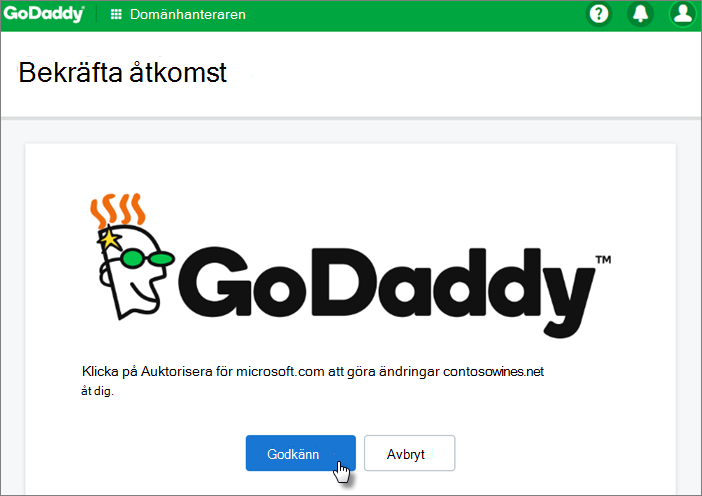

# Konfigurera Microsoft Business Standard

## Lägga till din domän för att personanpassa inloggning

När du köper Microsoft 365 Business Standard får du möjlighet att använda en domän som du äger eller köpa en under registreringen.

- Om du har köpt en ny domän när du registrerade dig kommer din domän att konfigureras, och du kan gå vidare till [Lägga till användare och tilldela licenser](#add-users-and-assign-licenses).

1. Logga in på [Administrationscenter för Microsoft 365](https://admin.microsoft.com) som global administratör. 

2. Starta guiden genom att välja **Gå till inställningar**.

3. På sidan **Installera Office-apparna** kan du välja att installera apparna på din egen dator.
    
4. Under steget **Lägg till domän** anger du domännamnet du vill använda (t.ex. contoso.com).

    > [!IMPORTANT]
    > Om du har köpt en domän under registreringen ser du inte steget **Lägg till en domän** här. Gå istället till [Lägg till användare](#add-users-and-assign-licenses).

    
4. Följ anvisningarna i guiden för att [Skapa DNS-poster på vilken DNS-värd som helst för Office 365](/office365/admin/get-help-with-domains/create-dns-records-at-any-dns-hosting-provider) som verifierar att du äger domänen. Om du vet vilken din domänvärd är kan du även se [Värdspecifika anvisningar](/office365/admin/get-help-with-domains/set-up-your-domain-host-specific-instructions).

    Om din värd är GoDaddy eller en annan värd som är aktiverad med [Domain Connect](/office365/admin/get-help-with-domains/domain-connect)är processen enkel och du blir automatiskt ombedd att logga in och låta Microsoft autentisera.

    

## Lägga till användare och tilldela licenser

Du kan lägga till användare i guiden eller så kan du [lägga till användare senare](../add-users/add-users.md) i administratörscentret. Om du har en lokal domänkontrollant kan du även lägga till användare med [Azure AD Connect](/azure/active-directory/hybrid/how-to-connect-install-express).

## Lägg till användare i guiden

Alla användare som du lägger till i guiden får automatiskt en Microsoft 365 Business Standard-licens.

1. Om ditt Microsoft 365 Business Standard-abonnemang har befintliga användare (till exempel om du använde Azure AD Connect), får du möjlighet att tilldela licenser till dem nu. Lägg till licenser till dem också.

2. Efter att ha lagt till användarna får du också möjlighet att dela autentiseringsuppgifter med de nya användarna som du har lagt till. Du kan välja att skriva ut, e-posta eller ladda ned.

## Koppla din domän

> [!NOTE]
> Om du väljer att använda .onmicrosoft-domänen, eller använde Azure AD Connect för att konfigurera användare, kommer du inte att se det här steget.
  
För att få igång tjänsten måste du uppdatera några poster hos din DNS-värd eller domänregistrator.
  
1. Installationsguiden identifierar normalt din domänregistrator och ger dig en länk till stegvisa instruktioner för att uppdatera dina NS-poster på registratorns webbplats. Om det inte gör det, [ ändra namnservrar för att konfigurera Office 365 med valfri domänregistrator](../get-help-with-domains/change-nameservers-at-any-domain-registrar.md). 

    - Om du har befintliga DNS-poster, t. ex. en befintlig webbplats, men din DNS-värd är aktiverad för [Domain Connect](/office365/admin/get-help-with-domains/domain-connect)väljer du **Lägga till poster för mig**. På sidan **Välj onlinetjänster** accepterar du alla standardinställningar och väljer **Nästa** och väljer **Auktorisera** på DNS-värdens sida.
    - Om du har befintliga DNS-poster med andra DNS-värdar (inte aktiverad för domänanslutning), ska du hantera dina egna DNS-poster för att se till att de befintliga tjänsterna fortsätter att vara anslutna. Mer information finns i [domängrunder](/office365/admin/get-help-with-domains/dns-basics).

2. Följ stegen i guiden så kommer e-postmeddelanden och andra tjänster att konfigureras åt dig.

    När registreringsprocessen är klar dirigeras du till administrationscentret, där du kommer att följa en guide för att installera Office-program, lägga till din domän, lägga till användare och tilldela licenser. När du har slutfört den första konfigurationen kan du använda **konfigurationssidan** i administrationscentret och fortsätta att installera och konfigurera tjänsterna som medföljer prenumerationerna.

    Mer information om installationsguiden för och administrationscentrets **konfigurationssida** finns i [Skillnaden mellan installationsguiden och sidan Konfigurera](o365-setup-wizard-and-setup-page.md).

## Slutför konfigureringen

### Konfigurera Outlook för e-post

1. Sök efter Outlook i Windows startmeny och välj det.

    (Om du använder en Mac öppnar du Outlook från verktygsfältet eller söker efter det med Finder.)

    Om du just installerat Outlook väljer du **Nästa** på välkomstsidan.

2. Välj **Arkiv** \> **Information** \> **Lägg till konto**.

3. Ange din Microsoft e-postadress och välj **Anslut**.

> [!VIDEO https://www.microsoft.com/videoplayer/embed/9fe86884-8a83-42cc-bca9-61a12e6dad31?autoplay=false]
  
Mer information finns i [Konfigurera Outlook för e-post](https://support.microsoft.com/office/f5bf0cd1-e1f3-4b0d-a022-ecab17efe86f).
  
### Importera e-post

Om du tidigare använde Outlook med ett annat e-postkonto kan du importera din tidigare e-post, kalender och dina tidigare kontakter till ditt nya Microsoft-konto.
  
1. **Exportera din gamla e-post**

    Välj **Arkiv** \> **Öppna &amp; Exportera** \> **Importera/Exportera** i Outlook.

    Välj **Exportera till en fil** och följ sedan anvisningarna för att exportera din Outlook-datafil (.pst) och undermappar.

2. **Importera din gamla e-post**

    Välj återigen **Arkiv** \> **Öppna &amp; Exportera** \> **Importera/Exportera** i Outlook.

    Den här gången väljer du **Importera från ett annat program eller en fil** och följer anvisningarna för att importera säkerhetskopian som du skapade när du exporterade din gamla e-post.

> [!VIDEO https://www.microsoft.com/videoplayer/embed/40f7df36-9e24-44e5-8791-e9ed0dd8fd21?autoplay=false]
  
Mer information finns i [Importera e-post med Outlook](https://support.microsoft.com/office/6a3771d4-4c1d-4a25-92a6-0b8e476335de).

Du kan också använda administrationscentret för Exchange för att importera alla användares e-postmeddelanden. Mer information finns i [migrera flera e-postkonton](/Exchange/mailbox-migration/mailbox-migration).
  
### Använda en offentlig webbplats

Microsoft 365 inkluderar inte en offentlig webbplats för ditt företag. Om du vill skapa en bör du överväga att använda en Microsoft-partner som GoDaddy eller WIX.
  
1. Från administrationscentret går du till **Resurser** och väljer **Offentlig webbplats**.

2. Välj **Mer information** under något av alternativen och registrera dig sedan med en webbplatspartner och använd deras verktyg för att konfigurera och utforma webbplatsen.

> [!VIDEO https://www.microsoft.com/videoplayer/embed/4839abc6-9323-4cbf-a79d-2907235f9ebb]

Se mer på [Använda en offentlig webbplats](https://support.microsoft.com/office/3325d50e-d131-403c-a278-7f3296fe33a9).