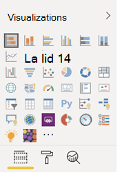

# Anpassa rapporter i Microsoft 365 användningsanalyser

Microsoft 365 användningsanalyser tillhandahåller en instrumentpanel i Power BI som ger insyn i hur användarna inför och använder Microsoft 365. Instrumentpanelen är bara en utgångspunkt för att interagera med användningsdata. Rapporterna kan anpassas för att ge en mer specialiserad insyn.
  
Du kan också använda Power BI Desktop för att anpassa rapporterna ytterligare genom att koppla dem till andra datakällor i syfte att få bättre insyn i verksamheten.
  
## Anpassa rapporter i webbläsaren

I följande två exemplen får du se hur du kan ändra en befintlig visualisering och skapa en ny visualisering.
  
### Ändra en befintlig visualisering

Det här exemplet visar hur du ändrar **fliken** Aktivering i **rapporten om aktivering/licensiering.** 
  
1. I rapporten **om aktivering/licensiering** väljer du **fliken** Aktivering.
    
2. Öppna redigeringsläget genom att välja **knappen** Redigera längst upp på  BI. 
    
    
  
3. Välj Duplicera den här **sidan längst upp till höger.**
    
    
  
4. Längst ned till höger väljer du något av de stapeldiagram som visar antalet användare som aktiverar baserat på operativsystemet, till exempel Android, iOS, Mac osv.
    
5. I området **Visualiseringar** till höger, för att ta bort **Mac Count** från det visuella objektet, väljer du **X** bredvid det.

        
    
### Skapa en ny visualisering

Följande exempel visar hur du skapar en ny visualisering för att spåra nya Yammer-användare på månadsbasis.
  
1. Gå till rapporten **Produktanvändning** i det vänstra navigeringsfältet och välj **fliken Yammer.**
    
2. Växla till redigeringsläge genom att  **Redigera**. 
    
3. Längst ned på sidan väljer du  för att skapa en ny sida.
  
4. I området **Visualiseringar** till höger väljer du det staplade **liggande stapeldiagrammet** (översta raden, först från vänster).

    
    
5. Markera den nedre högra delen av visualiseringen och dra för att göra den större.

6. I **området Fält** till höger expanderar du **tabellen** Kalender.

7. Dra **MonthName** till fältområdet direkt nedanför rubriken **Axel** i området **Visualiseringar**.
 
    
    
8. In the **Fields** area to the right, expand the **TenantProductUsage** table.

9. Dra **FirstTimeUsers** till området för fält direkt nedanför rubriken **Värde**.

10. Dra **Produkt** till området **Filter** direkt nedanför rubriken **Visuella nivåfilter**.

11. I området **Filtertyp** som visas markerar du kryssrutan **Yammer**.

    
  
12. Precis under listan med visualiseringar väljer du **ikonen Format** ikon för Format  BI.

13. Expandera rubriken och ändra värdet för **Rubriktext** till **First-Time Yammer Users by Month** (Förstagångsanvändare av Yammer per månad).
    
14. Ändra värdet för **textstorlek** till **12**.
    
15. Ändra rubriken på den nya sidan genom att redigera namnet på sidan längst ned till höger.

16.  Spara rapporten genom att klicka på **Läsvy** överst och sedan på **Spara**.
    
## Anpassa rapporterna i Power BI Desktop

För de flesta kunder räcker det att ändra rapporterna och diagramvisualiseringarna i Power BI Web. En del kan emellertid behöva koppla dessa data till andra datakällor för att få bättre insyn, beroende på vissa egenheter i den egna verksamheten. Om så är fallet kan de anpassa och skapa ytterligare rapporter med hjälp av Power BI Desktop. Du kan ladda ned [Power BI Desktop](https://go.microsoft.com/fwlink/p/?linkid=849797) kostnadsfritt. 
  
### Använda rapport-API:erna

Du kan börja genom att ansluta direkt till ODATA-rapport-API:erna från Microsoft 365 som driver rapporterna.
  
1. Gå till **Hämta data** \> **Andra** \> **ODATA-feed** \> **Anslut**.
    
2. I URL-fönstret skriver du "https:// <i></i> reports.office.com/pbi/v1.0/ \<tenantid\> "
    
    **OBS!** Rapport-API:erna är förhandsversioner och kan komma att ändras tills de går till produktion. 
  
    
  
3. Ange dina autentiseringsuppgifter som administratör för Microsoft 365 (organisation eller skola) för att autentisera dig för Microsoft 365 när du uppmanas att göra det.
    
    Mer information [om vem](usage-analytics.md#faq) som har behörighet att komma åt apprapporterna för införande av Microsoft 365 finns i Vanliga frågor och svar. 
    
4. När anslutningen har autentiserats visas navigatörsfönstret med de datauppsättningar som är tillgängliga för anslutning.
    
    Markera alla och välj **Läs in**.
    
    Då laddas data ned till din Power BI Desktop. Spara den här filen och börja sedan skapa de rapporter du behöver.
    
    
  
### Använda Microsoft 365 mall för användningsanalys

Du kan även använda mallfilen för Power BI som motsvarar Microsoft 365 användningsanalysrapporter som utgångspunkt när du ansluter till dessa data. Fördelen med att använda pbit-filen är att den redan har anslutningssträngen. Du kan också dra nytta av alla de anpassade åtgärder som skapas, utöver de data som det grundläggande schemat returnerar och bygga på dem ytterligare.
  
Du kan ladda ned Power BI-mallfilen från [Microsoft Download Center.](https://download.microsoft.com/download/7/8/2/782ba8a7-8d89-4958-a315-dab04c3b620c/Microsoft%20365%20Usage%20Analytics.pbit) När du har laddat ned Power BI-mallfilen följer du de här anvisningarna för att komma igång:
  
1. Öppna pbit-filen.
    
2. Ange ditt klientorganisations-ID i dialogrutan.
    
    
  
3. Ange dina autentiseringsuppgifter som administratör för att autentisera dig för Microsoft 365 när du uppmanas att göra det.
    
     om du vill ha mer information om vem som har åtkomst till användningsanalysrapporterna för Microsoft 365. 
    
    Så snart auktoriseringen är klar uppdateras alla data i Power BI-filen.
    
    Datainläsningen kan ta lite tid, men när den är klar kan du spara filen som en pbix-fil och fortsätta att anpassa rapporterna eller hämta in ytterligare en datakälla till den här rapporten.
    
4. Följ anvisningarna i dokumentationen för att [komma igång med Power BI](/power-bi/fundamentals/desktop-getting-started) så att du förstår hur du kan skapa rapporter, publicera dem i Power BI-tjänsten och dela med din organisation. Eventuellt krävs det ytterligare Power BI-licenser för att du ska kunna anpassa och dela. Mer detaljerad information finns i [vägledningen för licenser](https://go.microsoft.com/fwlink/p/?linkid=849803) för Power BI. 
