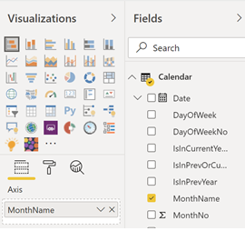

# Anpassa rapporter i Microsoft 365 användningsanalyser

::: moniker range="o365-21vianet"

> [!NOTE]
> Administrationscentret förändras. Om dina erfarenheter inte överensstämmer med uppgifterna som visas här kan du läsa mer i [Om det nya administrationscentret för Microsoft 365](https://docs.microsoft.com/microsoft-365/admin/microsoft-365-admin-center-preview?view=o365-21vianet).

::: moniker-end

Microsoft 365-användningsanalys innehåller en instrumentpanel i Power BI som ger insikter om hur användare använder och använder Microsoft 365. Instrumentpanelen är bara en utgångspunkt för att interagera med användningsdata. Rapporterna kan anpassas för att ge en mer specialiserad insyn.
  
Du kan också använda Power BI Desktop för att anpassa rapporterna ytterligare genom att koppla dem till andra datakällor i syfte att få bättre insyn i verksamheten.
  
## Anpassa rapporter i webbläsaren

I följande två exemplen får du se hur du kan ändra en befintlig visualisering och skapa en ny visualisering.
  
### Ändra en befintlig visualisering

I det här exemplet visas hur du ändrar fliken **Aktivering** i **aktiverings-/licensieringsrapporten.** 
  
1. Klicka på fliken Aktivering i **aktiverings-/licensieringsrapporten.** **Activation**
    
2. Ange redigeringsläget genom att klicka på knappen **Redigera** högst upp via  BI-knappen. 
    
    
  
3. Klicka på **Duplicera**den här sidan längst upp till höger .
    
    
  
4. Längst ner till höger, klicka på någon av stapeldiagrammen som visar antalet användare som aktiverar baserat på OS som Android, iOS, Mac, etc.
    
5. I området **Visualiseringar** till höger, för att ta bort **Mac Count** från det visuella, klicka på **X** bredvid den.

        
    
### Skapa en ny visualisering

Följande exempel visar hur du skapar en ny visualisering för att spåra nya Yammer-användare på månadsbasis.
  
1. Gå till rapporten **Produktanvändning** med den vänstra navigeringsfliken och klicka på fliken **Yammer.**
    
2. Växla till redigeringsläge genom att klicka på  **Redigera**. 
    
3. Längst ned på sidan klickar du på  för att skapa en ny sida.
  
4. Klicka på **stapeldiagrammet Staplat stapel (översta** raden, först från vänster) i området **Visualiseringar** till höger.

    
    
5. Klicka längst ned till höger i den visualiseringen och dra för att göra den större.

6. Expandera tabellen **Kalender** i området **Fält** till höger.

7. Dra **MonthName** till fältområdet direkt nedanför rubriken **Axel** i området **Visualiseringar**.
 
    
    
8. In the **Fields** area to the right, expand the **TenantProductUsage** table.

9. Dra **FirstTimeUsers** till området för fält direkt nedanför rubriken **Värde**.

10. Dra **Produkt** till området **Filter** direkt nedanför rubriken **Visuella nivåfilter**.

11. I området **Filtertyp** som visas markerar du kryssrutan **Yammer**.

    
  
12. Precis under listan över visualiseringar klickar du på ikonen **Formatformat**  .

13. Expandera rubriken och ändra värdet för **Rubriktext** till **First-Time Yammer Users by Month** (Förstagångsanvändare av Yammer per månad).
    
14. Ändra värdet för **textstorlek** till **12**.
    
15. Ändra rubriken på den nya sidan genom att redigera namnet på sidan längst ned till höger.

16.  Spara rapporten genom att klicka på **Läsvyn** överst och sedan **spara**.
    
## Anpassa rapporterna i Power BI Desktop

För de flesta kunder räcker det att ändra rapporterna och diagramvisualiseringarna i Power BI Web. En del kan emellertid behöva koppla dessa data till andra datakällor för att få bättre insyn, beroende på vissa egenheter i den egna verksamheten. Om så är fallet kan de anpassa och skapa ytterligare rapporter med hjälp av Power BI Desktop. Du kan ladda ned [Power BI Desktop](https://go.microsoft.com/fwlink/p/?linkid=849797) kostnadsfritt. 
  
### Använda rapport-API:erna

Du kan börja med att ansluta direkt till ODATA-rapporterings-API:erna från Microsoft 365 som driver dessa rapporter.
  
1. Gå till **Hämta data** \> **Andra** \> **ODATA-feed** \> **Anslut**.
    
2. I URL-fönstret anger du "https:// <i></i> reports.office.com/pbi/v1.0/ \<tenantid\> "
    
    **OBS:** De rapporterande API:erna är i förhandsversion och kan komma att ändras tills de tas i produktion. 
  
    
  
3. Ange dina administratörsautentiseringsuppgifter för Microsoft 365 (organisation eller skola) som du vill autentisera till Microsoft 365 när du uppmanas att göra det.
    
    Mer information om vem som får åtkomst till apprapporterna för Microsoft 365 Adoption-mallen finns i [vanliga frågor](usage-analytics.md#faq) och svar. 
    
4. När anslutningen har autentiserats visas navigatörsfönstret med de datauppsättningar som är tillgängliga för anslutning.
    
    Markera alla och klicka på **Ladda**.
    
    Då hämtas data till din Power BI Desktop. Spara filen. Sedan kan du börja skapa rapporterna som du behöver.
    
    
  
### Använda Microsoft 365 mall för användningsanalys

Du kan även använda mallfilen för Power BI som motsvarar Microsoft 365 användningsanalysrapporter som utgångspunkt när du ansluter till dessa data. Fördelen med att använda pbit-filen är att den redan har anslutningssträngen. Du kan också dra nytta av alla de anpassade åtgärder som skapas, utöver de data som det grundläggande schemat returnerar och bygga på dem ytterligare.
  
Du kan hämta Power BI-mallfilen från Microsofts nedladdningscenter från [Download Center](https://download.microsoft.com/download/7/8/2/782ba8a7-8d89-4958-a315-dab04c3b620c/Microsoft%20365%20Usage%20Analytics.pbit). När du har hämtat Power BI-mallfilen följer du de här anvisningarna för att komma igång:
  
1. Öppna pbit-filen.
    
2. Ange ditt klientorganisations-ID i dialogrutan.
    
    
  
3. Ange dina administratörsuppgifter som ska autentiseras till Microsoft 365 när du uppmanas att göra det.
    
     om du vill ha mer information om vem som har åtkomst till Microsoft 365-rapporterna för användningsanalys. 
    
    Så snart auktoriseringen är klar uppdateras alla data i Power BI-filen.
    
    Datainläsningen kan ta lite tid, men när den är klar kan du spara filen som en pbix-fil och fortsätta att anpassa rapporterna eller hämta in ytterligare en datakälla till den här rapporten.
    
4. Följ anvisningarna i dokumentationen för att [komma igång med Power BI](https://go.microsoft.com/fwlink/?linkid=849802) så att du förstår hur du kan skapa rapporter, publicera dem i Power BI-tjänsten och dela med din organisation. Eventuellt krävs det ytterligare Power BI-licenser för att du ska kunna anpassa och dela. Mer detaljerad information finns i [vägledningen för licenser](https://go.microsoft.com/fwlink/p/?linkid=849803) för Power BI. 
    

