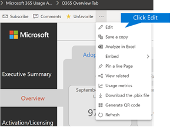

# Anpassa rapporter i Microsoft 365 användningsanalyser

Microsoft 365-användningsanalys tillhandahåller en instrumentpanel i Power BI som ger insikter om hur användare använder och använder Microsoft 365. Instrumentpanelen är bara en utgångspunkt för att interagera med användningsdata. Rapporterna kan anpassas för att ge en mer specialiserad insyn.
  
Du kan också använda Power BI Desktop för att anpassa rapporterna ytterligare genom att koppla dem till andra datakällor i syfte att få bättre insyn i verksamheten.
  
## Anpassa rapporter i webbläsaren

I följande två exemplen får du se hur du kan ändra en befintlig visualisering och skapa en ny visualisering.
  
### Ändra en befintlig visualisering

I det här exemplet visas hur du ändrar fliken **Aktivering** i rapporten **Aktivering/licensiering.** 
  
1. I rapporten **Aktivering/licensiering** klickar du på fliken **Aktivering.**
    
2. Ange redigeringsläget genom att klicka på **knappen** Redigera  knappen Ju mer sidknappen i Power BI-knappen. 
    
    
  
3. Klicka på **Duplicera den här sidan**längst upp till höger.
    
    
  
4. I nedre högra, klicka på någon av stapeldiagram som visar antalet användare aktivera baserat på OS som Android, iOS, Mac, etc.
    
5. Klicka på **X** **bredvid** det för att ta bort Mac Count från det visuella objektet för att ta bort **Mac Count** från det visuella objektet.

        
    
### Skapa en ny visualisering

Följande exempel visar hur du skapar en ny visualisering för att spåra nya Yammer-användare på månadsbasis.
  
1. Gå till **rapporten Produktanvändning** med vänster navigator och klicka på fliken **Yammer.**
    
2. Växla till redigeringsläge genom  Knappen Mer sida i Power BI och **Redigera**. 
    
3. Längst ned på sidan klickar du på  för att skapa en ny sida.
  
4. Klicka på **stapeldiagrammet Staplat stapeldiagram** i området **Visualiseringar** till höger (översta raden, först från vänster).

    
    
5. Klicka längst ned till höger i den visualiseringen och dra för att göra den större.

6. Expandera **tabellen Kalender** i området **Fält** till höger.

7. Dra **MonthName** till fältområdet direkt nedanför rubriken **Axel** i området **Visualiseringar**.
 
    
    
8. In the **Fields** area to the right, expand the **TenantProductUsage** table.

9. Dra **FirstTimeUsers** till området för fält direkt nedanför rubriken **Värde**.

10. Dra **Produkt** till området **Filter** direkt nedanför rubriken **Visuella nivåfilter**.

11. I området **Filtertyp** som visas markerar du kryssrutan **Yammer**.

    
  
12. Precis under listan över visualiseringar **Format** klickar i Power BI Visualizaions .

13. Expandera rubriken och ändra värdet för **Rubriktext** till **First-Time Yammer Users by Month** (Förstagångsanvändare av Yammer per månad).
    
14. Ändra värdet för **textstorlek** till **12**.
    
15. Ändra rubriken på den nya sidan genom att redigera namnet på sidan längst ned till höger.

16.  Spara rapporten genom att klicka på **Läsvy** överst och **spara**sedan .
    
## Anpassa rapporterna i Power BI Desktop

För de flesta kunder räcker det att ändra rapporterna och diagramvisualiseringarna i Power BI Web. En del kan emellertid behöva koppla dessa data till andra datakällor för att få bättre insyn, beroende på vissa egenheter i den egna verksamheten. Om så är fallet kan de anpassa och skapa ytterligare rapporter med hjälp av Power BI Desktop. Du kan ladda ned [Power BI Desktop](https://go.microsoft.com/fwlink/p/?linkid=849797) kostnadsfritt. 
  
### Använda rapport-API:erna

Du kan börja med att ansluta direkt till ODATA-rapporterings-API:erna från Microsoft 365 som driver dessa rapporter.
  
1. Gå till **Hämta data** \> **Andra** \> **ODATA-feed** \> **Anslut**.
    
2. I URL-fönstret anger<i></i>\<du "https:// reports.office.com/pbi/v1.0/ tenantid\>"
    
    **OBS:** Rapporterings-API:erna är i förhandsversion och kan komma att ändras tills de tas i produktion. 
  
    
  
3. Ange dina Microsoft 365-administratörsautentiseringsuppgifter (organisation eller skola) för att autentisera till Microsoft 365 när du uppmanas att göra det.
    
    Mer [FAQ](usage-analytics.md#faq) information om vem som får komma åt apprapporterna för användningsmallen för antagande av microsoft 365. 
    
4. När anslutningen har autentiserats visas navigatörsfönstret med de datauppsättningar som är tillgängliga för anslutning.
    
    Markera alla och klicka på **Ladda**.
    
    Då hämtas data till din Power BI Desktop. Spara filen. Sedan kan du börja skapa rapporterna som du behöver.
    
    
  
### Använda Microsoft 365 mall för användningsanalys

Du kan även använda mallfilen för Power BI som motsvarar Microsoft 365 användningsanalysrapporter som utgångspunkt när du ansluter till dessa data. Fördelen med att använda pbit-filen är att den redan har anslutningssträngen. Du kan också dra nytta av alla de anpassade åtgärder som skapas, utöver de data som det grundläggande schemat returnerar och bygga på dem ytterligare.
  
Du kan hämta Mallfilen för Power BI från Microsofts hämtningscenter från [Download center](https://download.microsoft.com/download/7/8/2/782ba8a7-8d89-4958-a315-dab04c3b620c/Microsoft%20365%20Usage%20Analytics.pbit). När du har hämtat Power BI-mallfilen följer du de här anvisningarna för att komma igång:
  
1. Öppna pbit-filen.
    
2. Ange ditt klientorganisations-ID i dialogrutan.
    
    
  
3. Ange dina administratörsuppgifter för att autentisera till Microsoft 365 när du uppmanas att göra det.
    
     mer information om vem som får komma åt microsoft 365-användningsanalysrapporterna. 
    
    Så snart auktoriseringen är klar uppdateras alla data i Power BI-filen.
    
    Datainläsningen kan ta lite tid, men när den är klar kan du spara filen som en pbix-fil och fortsätta att anpassa rapporterna eller hämta in ytterligare en datakälla till den här rapporten.
    
4. Följ anvisningarna i dokumentationen för att [komma igång med Power BI](https://go.microsoft.com/fwlink/?linkid=849802) så att du förstår hur du kan skapa rapporter, publicera dem i Power BI-tjänsten och dela med din organisation. Eventuellt krävs det ytterligare Power BI-licenser för att du ska kunna anpassa och dela. Mer detaljerad information finns i [vägledningen för licenser](https://go.microsoft.com/fwlink/p/?linkid=849803) för Power BI. 
    

