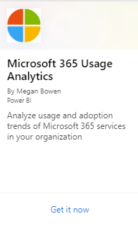

# Aktivera Microsoft 365 användningsanalyserEnable Microsoft 365 usage analytics

::: moniker range="o365-21vianet"

> [!NOTE]
> Administrationscentret förändras.The admin center is changing. Om din upplevelse inte stämmer överens med informationen som presenteras här läser du [Om det nya administrationscentret för Microsoft 365](https://docs.microsoft.com/microsoft-365/admin/microsoft-365-admin-center-preview?view=o365-21vianet).If your experience doesn't match the details presented here, see [About the new Microsoft 365 admin center](https://docs.microsoft.com/microsoft-365/admin/microsoft-365-admin-center-preview?view=o365-21vianet).

::: moniker-end

Microsoft 365-användningsanalys är också tillgängligt för Microsoft 365 US Government Community.Microsoft 365 usage analytics is also available for Microsoft 365 US Government Community.
  
## Steg för att aktivera Microsoft 365 användningsanalyserSteps to enable Microsoft 365 usage analytics

För att komma igång med Microsoft 365-användningsanalys måste du först göra data tillgängliga i Microsoft 365-administrationscentret och sedan starta mallappen i Power BI.To get started with Microsoft 365 usage analytics you must first make the data available in the Microsoft 365 admin center, then initiate the template app in Power BI.
  
### Hämta Power BIGet Power BI

Om du inte redan har Power BI kan du [registrera dig för Power BI Pro](https://go.microsoft.com/fwlink/p/?linkid=845347).If you don't already have Power BI, you can [sign up for Power BI Pro](https://go.microsoft.com/fwlink/p/?linkid=845347). Välj **Prova gratis** för att registrera dig för en utvärderingsversion eller Köp **nu** för att få Power BI Pro.Select **Try free** to sign up for a trial, or **Buy now** to get Power BI Pro.
  
  
Du kan också öppna **Produkter** och köpa en version av Power BI.You can also expand **Products** to buy a version of Power BI. 

> [!NOTE]
> Du behöver en Power BI Pro-licens för att installera, anpassa och distribuera en mallapp.You need a Power BI Pro license to install, customize, and distribute a template app. Mer information finns i [Förutsättningar](https://docs.microsoft.com/power-bi/service-template-apps-install-distribute?source=docs#prerequisites).For more information, please see [Prerequisites](https://docs.microsoft.com/power-bi/service-template-apps-install-distribute?source=docs#prerequisites).

Du behöver en Power BI Pro-licens för att dela ditt innehåll, och de personer du delar det med gör det också, eller så måste innehållet finnas på en arbetsyta med [en Premium-kapacitet.](https://docs.microsoft.com/power-bi/service-premium-what-is)You need a Power BI Pro license to share your content, and the people you share it with do too, or the content needs to be in a workspace in a [Premium capacity](https://docs.microsoft.com/power-bi/service-premium-what-is). 
  
### Aktivera mallappenEnable the template app

Om du vill aktivera mallappen måste du antingen vara global **administratör,** **rapportläsare,** **Exchange-administratör,** **Skype för företag-administratör**eller **SharePoint-administratör**.To enable the template app, you have to be either a **global administrator**, **report reader**, **Exchange administrator**, **Skype for Business administrator**, or **SharePoint administrator**. 
  
Mer information finns i [Om administratörsroller.](../add-users/about-admin-roles.md)See [About admin roles](../add-users/about-admin-roles.md) for more information. 
  
1. I administrationscentret går du till sidan **Rapporter** \> <a href="https://go.microsoft.com/fwlink/p/?linkid=2074756" target="_blank">Användning</a>.In the admin center, go to the **Reports** \> <a href="https://go.microsoft.com/fwlink/p/?linkid=2074756" target="_blank">Usage</a> page. 
    
2. Leta reda på Microsoft **365-användningsanalyskortet** på sidan **Användning** och välj **Kom igång**.On the **Usage** page, locate the **Microsoft 365 usage analytics** card, and select **Get started**.
    
3. På panelen Rapporter som öppnas anger du **Gör data tillgängliga för Microsoft 365-användningsanalys för Power BI** till **På** \> **Spara**.On the Reports panel that opens, set **Make data available to Microsoft 365 usage analytics for Power BI** to **On** \> **Save**. 
  
Det här initierar datainsamlingsprocessen och tar mellan 2 och 48 timmar att slutföra beroende på storleken på din klientorganisation. Knappen **Gå till Power BI** aktiveras (ej längre gråmarkerad) när datainsamlingen är klar.This initiates the data collection process and will complete in 2 to 48 hours depending on the size of your tenant. The **Go to Power BI** button will be enabled (no longer gray) when data collection is complete. 
    
### Initiera mallappenInitiate the template app

Om du vill starta mallappen måste du antingen vara global **administratör,** **rapportläsare,** **Exchange-administratör,** **Skype för företag-administratör**eller **SharePoint-administratör**.To initiate the template app, you have to be either a **global administrator**, **report reader**, **Exchange administrator**, **Skype for Business administrator**, or **SharePoint administrator**. 
  
1. Kopiera klient-ID:et och välj **Gå till Power BI**.Copy the tenant Id and select **Go to Power BI**.
    
2.  Logga in när du kommer till Power BI.When you get to Power BI, sign in. Välj Appar->Hämta appar på navigeringsmenyn.Select Apps->Get apps from the navigation menu.    
  
3. I fliken **Program** skriver du Microsoft 365 i sökrutan och väljer sedan **Microsoft 365 användningsanalyser** \> **Skaffa nu**.In the **Apps** tab, type Microsoft 365 in the search box and then select **Microsoft 365 usage analytics** \> **Get it now**.

    
    
4.  När appen är installerad.Once the app is installed. Klicka på panelen för att öppna den.Click on the tile to open it.

5.  Klicka på **Utforska app** om du vill visa appen med exempeldata.Click **Explore app** to view the app with sample data. Klicka på **Anslut** om du vill ansluta appen till organisationens data.Click **Connect** to connect the app to your organization’s data.

6.  När du har klickat på **Anslut**skriver du i det klient-ID som du kopierade \> i steg (1) **Nästa**på skärmen **Anslut till Microsoft 365 användningsanalys** .After clicking **Connect**, on the **Connect to Microsoft 365 usage analytics** screen, type in the tenant Id you copied in step (1) \> **Next**.
    
7. På nästa skärm väljer du **oAuth2** som **autentiseringsmetod** \> **Logga in**.On the next screen, select **oAuth2** as the **Authentication method** \> **Sign in**. Om du väljer någon annan autentiseringsmetod misslyckas anslutningen till mallappen.If you choose any other authentication method, the connection to the template app will fail.
    
    
  
8. När mallappen har instansierats är instrumentpanelen för användningsanalys i Microsoft 365 tillgänglig i Power BI på webben.Once the template app is instantiated the Microsoft 365 usage analytics dashboard will be available in Power BI on the web. Första inläsningen av instrumentpanelen tar 2 till 30 minuter.The initial loading of the dashboard will take between 2 to 30 minutes.
  
Sammanställningar på klientorganisationsnivån blir tillgängliga i alla rapporter.Tenant level aggregates will be available in all reports. **Information på användarnivå blir bara tillgänglig efter den 1:a eller 15:e dagen varje kalendermånad efter att du har gått med**.**User-level details will only become available after the 1st or 15th day of the calendar month after opting in**. Detta påverkar alla rapporter under Användaraktivitet (Se [Navigera och använda rapporterna i Microsoft 365-användningsanalys](navigate-and-utilize-reports.md) för tips om hur du visar och använder dessa rapporter).This will impact all reports under User Activity (See [Navigate and utilize the reports in Microsoft 365 usage analytics](navigate-and-utilize-reports.md) for tips on how to view and use these reports).
    
## Gör insamlade data anonymaMake the collected data anonymous

Du måste vara global administratör för att kunna anonymisera data som samlas in för alla rapporter.To make the data that is collected for all reports anonymous, you have to be a global administrator. Detta döljer identifierbar information som användar-, grupp- och webbplatsnamn i rapporter och i mallappen .This will hide identifiable information such as user, group and site names in reports and in the template app .
  
1. Gå till **inställningar** \> **Settings**för inställningar i administrationscentret och välj **Rapporter**under **Fliken Tjänster** .In the admin center, go to the **Settings** \> **Settings**, and under **Services** tab, choose **Reports**.
    
2. Välj **Rapporter**och välj sedan att **visa anonyma identifierare**.Select **Reports**, and then choose to **Display anonymous identifiers**. Den här inställningen tillämpas både på användningsrapporterna och på mallappen.This setting gets applied both to the usage reports as well as to the template app.
  
3. Välj **Spara ändringar**.Select **Save changes**.
