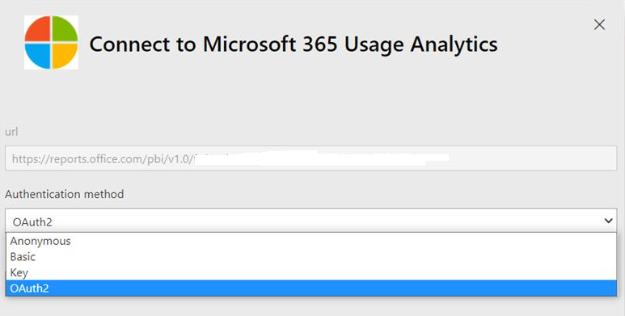

# Aktivera Microsoft 365 användningsanalyser

::: moniker range="o365-21vianet"

> [!NOTE]
> Administrationscentret förändras. Om dina erfarenheter inte överensstämmer med uppgifterna som visas här kan du läsa mer i [Om det nya administrationscentret för Microsoft 365](https://docs.microsoft.com/microsoft-365/admin/microsoft-365-admin-center-preview?view=o365-21vianet).

::: moniker-end

Microsoft 365 användnings analys är ännu inte tillgänglig för Microsoft 365 USA community.
  
## Steg för att aktivera Microsoft 365 användningsanalyser

För att komma igång med Microsoft 365 användnings analys måste du först göra data tillgängliga i administrations centret för Microsoft 365 och sedan starta programmet i Power BI.
  
### Hämta Power BI

Om du inte redan har Power BI kan du [Registrera dig för Power BI Pro](https://go.microsoft.com/fwlink/p/?linkid=845347). Välj **prova gratis** för att registrera dig för en utvärderings version eller **Köp nu** för att få Power BI Pro.
  
  
Du kan också öppna **Produkter** och köpa en version av Power BI. 

> [!NOTE]
> Du behöver en Power BI Pro-licens för att installera, anpassa och distribuera en mall. För mer information, se [förutsättningar](https://docs.microsoft.com/power-bi/service-template-apps-install-distribute?source=docs#prerequisites).

Om du vill dela dina data måste både du och de personer som du delar data med, ha en Power BI Pro-licens eller innehållet måste finnas på en arbets yta i en [Power BI premium-tjänst](https://docs.microsoft.com/power-bi/service-premium-what-is). 
  
### Aktivera programmet mall

Om du vill aktivera programmet mall måste du vara **Global administratör**.
  
Mer information finns i [om administratörs roller](../add-users/about-admin-roles.md) . 
  
1. I administrationscentret går du till sidan **Rapporter** \> <a href="https://go.microsoft.com/fwlink/p/?linkid=2074756" target="_blank">Användning</a>. 
    
2. På sidan **användning** letar du upp **Microsoft 365 användnings analys** kort och väljer **Kom igång**.
    
3. På panelen rapporter som öppnas ställer du in **data som är tillgängliga för Microsoft 365 användnings analys för Power BI** **på** \> **Spara**. 
  
Data insamlings processen slutförs i två till 48 timmar beroende på innehavarens storlek. Knappen **Gå till Power BI** aktiveras (ej längre gråmarkerad) när datainsamlingen är klar. 
    
### Starta programmet mall

För att starta programmet mall måste du vara antingen **Global administratör** , **rapport läsare** , **Exchange-administratör** , **Skype för företag-administratör** eller SharePoint- **administratör**. 
  
1. Kopiera klient-ID och välj **gå till Power BI**.
    
2.  När du kommer till Power BI loggar du in. **Välj sedan appar** -> **Get apps** från navigerings menyn.    
  
3. I fliken **Program** skriver du Microsoft 365 i sökrutan och väljer sedan **Microsoft 365 användningsanalyser** \> **Skaffa nu**.

    
    
4.  När programmet är installerat. Välj panelen för att öppna den.

5.  Välj **utforska app** för att Visa appen med exempel data. Välj **Anslut** för att koppla appen till organisationens data.

6.  Välj **Anslut** , på skärmen **anslut till Microsoft 365 användnings analys** och skriv sedan in klient-ID (utan tank streck) som du kopierade i steg (1) och välj **Nästa**.
    
7. På nästa skärm väljer du **OAuth2** som **autentiseringsmetod** \> **Sign in**. Om du väljer någon annan autentiseringsmetod kommer anslutningen till programmet att Miss lyckas.
    
    
  
8. När mallgalleriet har instansierats blir Microsoft 365 användnings analys instrument panelen tillgängliga i Power BI på webben. Första inläsningen av instrumentpanelen tar 2 till 30 minuter.
  
Aggregerade klient nivåer kommer att vara tillgängliga i alla rapporter efter vanligt i. **Uppgifter på användar nivå blir tillgängliga i femte nästa månad efter vanligt**. Detta påverkar alla rapporter under användar aktivitet (se [navigera och använda rapporterna i Microsoft 365 användnings analyser](navigate-and-utilize-reports.md) för tips om hur du visar och använder dessa rapporter).
    
## Gör insamlade data anonyma

Du måste vara global administratör för att kunna anonymisera data som samlas in för alla rapporter. Då döljs identifierbar information som användare, grupp och webbplats namn i rapporter och i mallfilen.
  
1. Gå till **Inställningar** i administrations centret \> **Org Settings** och välj **rapporter** på fliken **tjänster** .
    
2. Välj **rapporter** och välj sedan om du vill **Visa anonyma identifierare**. Denna inställning tillämpas både på användnings rapporterna och i programmet.
  
3. Välj **Spara ändringar**.
