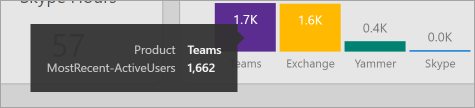

# Navigera och använda rapporter i Microsoft 365 användningsanalyser

::: moniker range="o365-21vianet"

> [!NOTE]
> Administrationscentret förändras. Om dina erfarenheter inte överensstämmer med uppgifterna som visas här kan du läsa mer i [Om det nya administrationscentret för Microsoft 365](https://docs.microsoft.com/microsoft-365/admin/microsoft-365-admin-center-preview?view=o365-21vianet&preserve-view=true).

::: moniker-end

Med instrumentpanelen får du en snabb översikt över de viktigaste användnings- och införandemätetalen. Genom att välja mätetriska värden på den högsta nivån kommer du åt rapporter som ger mer information och insikter. Varje flik i rapporten innehåller datavisualiseringar som är specifika för en aspekt av användning och införande för din organisation. De data som samlas in förklaras i rubriken på varje rapport och en panel visas som innehåller ytterligare information om visualiseringarna på rapportfliken som visas.

Här är några tips för att komma igång med rapporter:

- Använd navigeringsflikarna till vänster eller  på ett relaterat mått på sidan Sammanfattning för att navigera till varje rapport på översta nivån.

    

- Använd navigeringsflikarna högst upp i varje rapport på översta nivån för att navigera till olika rapporter på den nivån.

    

- Många rapporter innehåller ett utsnitt där du kan filtrera på produkten, AAD-attributet eller aktiviteten som du vill visa. Dessa kan vara antingen enkelval eller flerval.

    

    

- Hovra över datapunkter om du vill visa en bildtext som innehåller detaljer.

    

Den användare som skapar mallappen kan anpassa rapporten efter sina behov. Så här anpassar du mallappen:

- Välj **Redigera** rapport överst i rapporten.

    

- Skapa dina egna visualiseringar med hjälp av de underliggande [datauppsättningarna](usage-analytics-data-model.md).

- Använd PowerBI-skrivbordet för att lägga till egna datakällor.

Om du vill dela dina rapporter väljer du knappen Dela  högst upp på sidan.

Mer information om hur du kan anpassa rapporterna finns i [Anpassa rapporterna i Microsoft 365 användningsanalyser](customize-reports.md).

Du kan hitta massor av ytterligare information i Power BI hjälpdokumentationen:

- [Grundläggande begrepp i Power BI](https://docs.microsoft.com/power-bi/service-basic-concepts)

    Läs mer om instrumentpanel, datauppsättningar, rapporter och andra Power BI-begrepp.

- [Kom igång med Power BI](https://docs.microsoft.com/power-bi/service-get-started?wt.mc_id=O365_Reports_PBI_contentpack)

    Läs mer om grundläggande funktioner i Power BI. Hitta länkar till hur du använder Power BI Desktop.

- [Dela instrumentpaneler och rapporter](https://docs.microsoft.com/power-bi/service-share-dashboards)

    Lär dig att dela rapporter med kollegor eller personer utanför organisationen. Du kan också dela rapporten eller en filtrerad version av rapporten.
