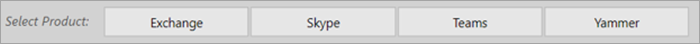

# Navigera och använda rapporter i Microsoft 365 användningsanalyserNavigate and utilize the reports in Microsoft 365 usage analytics

::: moniker range="o365-21vianet"

> [!NOTE]
> Administrationscentret förändras.The admin center is changing. Om dina erfarenheter inte överensstämmer med uppgifterna som visas här kan du läsa mer i [Om det nya administrationscentret för Microsoft 365](https://docs.microsoft.com/microsoft-365/admin/microsoft-365-admin-center-preview?view=o365-21vianet&preserve-view=true).If your experience doesn't match the details presented here, see [About the new Microsoft 365 admin center](https://docs.microsoft.com/microsoft-365/admin/microsoft-365-admin-center-preview?view=o365-21vianet&preserve-view=true).

::: moniker-end

Med instrumentpanelen får du en snabb översikt över de viktigaste användnings- och införandemätetalen.The dashboard provides you with a quick overview of the main usage and adoption metrics. Genom att välja mätetriska värden på den högsta nivån kommer du åt rapporter som ger mer information och insikter.By selecting the top-level metrics, you can access reports that provide more details and insights. Varje flik i rapporten innehåller datavisualiseringar som är specifika för en aspekt av användning och införande för din organisation.Each report tab contains data visualizations specific to an aspect of usage and adoption for your organization. De data som samlas in förklaras i rubriken på varje rapport och en panel visas som innehåller ytterligare information om visualiseringarna på rapportfliken som visas.The data collected is explained in the title of each report and a tile appears that contains further information about the visualizations on the report tab that you are viewing.

Här är några tips för att komma igång med rapporter:To get started with your reports, here are some tips:

- Använd navigeringsflikarna till vänster eller  på ett relaterat mått på sidan Sammanfattning för att navigera till varje rapport på översta nivån.Use the navigation tabs on the left or on a related metric on the **Executive Summary** page to navigate to each top-level report.

    

- Använd navigeringsflikarna högst upp i varje rapport på översta nivån för att navigera till olika rapporter på den nivån.Use the navigation tabs at the top of each top-level report to navigate to different reports within that level.

    

- Många rapporter innehåller ett utsnitt där du kan filtrera på produkten, AAD-attributet eller aktiviteten som du vill visa.Many reports contain a slicer where you can filter on the product, AAD attribute, or activity that you want to view. Dessa kan vara antingen enkelval eller flerval.These can be either single-select or multi-select.

    

    

- Hovra över datapunkter om du vill visa en bildtext som innehåller detaljer.Hover over data points to view a callout that contains details.

    

Den användare som skapar mallappen kan anpassa rapporten efter sina behov.The user who has instantiated the template app will have the ability to customize the report to their needs. Så här anpassar du mallappen:To customize the template app:

- Välj **Redigera** rapport överst i rapporten.Select **Edit report** at the top of the report.

    

- Skapa dina egna visualiseringar med hjälp av de underliggande [datauppsättningarna](usage-analytics-data-model.md).Create your own visuals by using the underlying [datasets](usage-analytics-data-model.md).

- Använd PowerBI-skrivbordet för att lägga till egna datakällor.Use PowerBI Desktop to bring in your own data sources.

Om du vill dela dina rapporter väljer du knappen DelaTo share your reports, just select the share button  högst upp på sidan.at the top of the page.

Mer information om hur du kan anpassa rapporterna finns i [Anpassa rapporterna i Microsoft 365 användningsanalyser](customize-reports.md).To learn how to customize the reports, see [Customizing the reports in Microsoft 365 usage analytics](customize-reports.md).

Du kan hitta massor av ytterligare information i Power BI hjälpdokumentationen:You can find lots of additional information in the Power BI help documentation:

- [Grundläggande begrepp i Power BIPower BI basic concepts](https://docs.microsoft.com/power-bi/service-basic-concepts)

    Läs mer om instrumentpanel, datauppsättningar, rapporter och andra Power BI-begrepp.Learn about dashboard, datasets, reports, and other Power BI concepts.

- [Kom igång med Power BIGet started with Power BI](https://docs.microsoft.com/power-bi/service-get-started?wt.mc_id=O365_Reports_PBI_contentpack)

    Läs mer om grundläggande funktioner i Power BI. Hitta länkar till hur du använder Power BI Desktop.Learn the basic functionality in Power BI. Find links to how to use Power BI Desktop.

- [Dela instrumentpaneler och rapporterShare dashboards and reports](https://docs.microsoft.com/power-bi/service-share-dashboards)

    Lär dig att dela rapporter med kollegor eller personer utanför organisationen.Learn how to share reports with your colleagues or people outside your organization. Du kan också dela rapporten eller en filtrerad version av rapporten.You can also share the report or a filtered version of the report.
