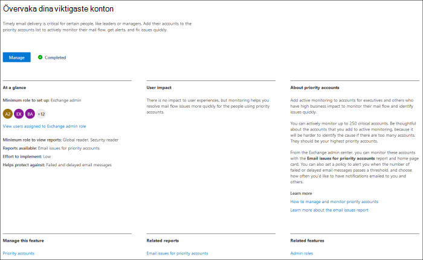
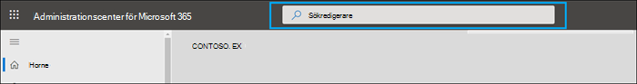
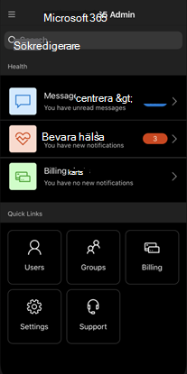
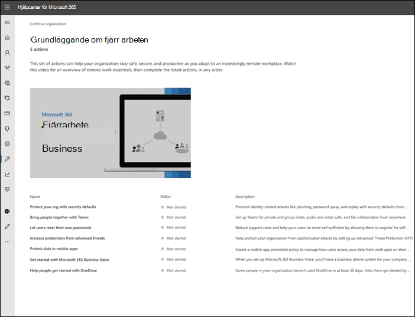
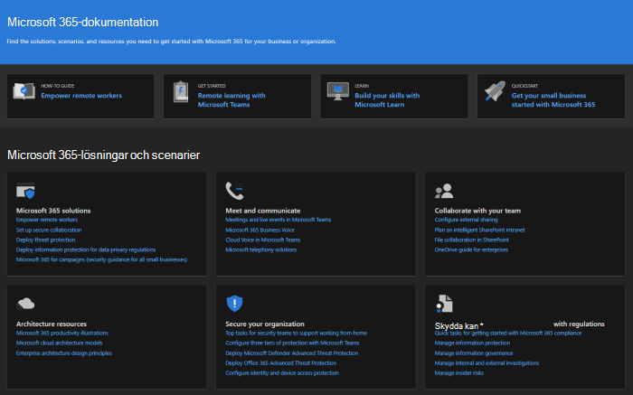
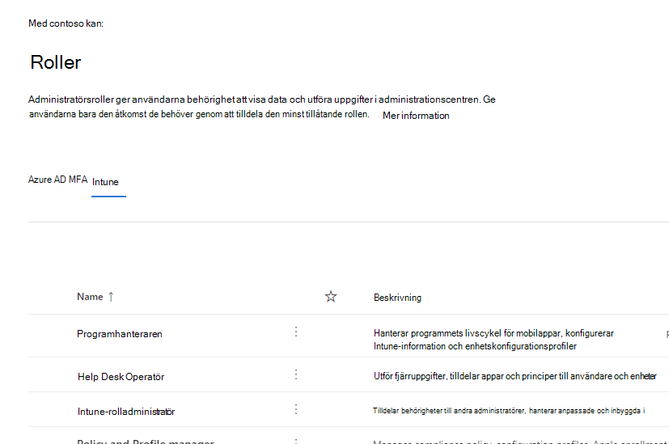
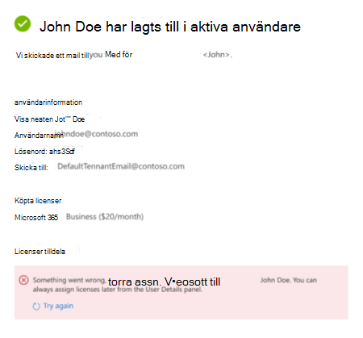
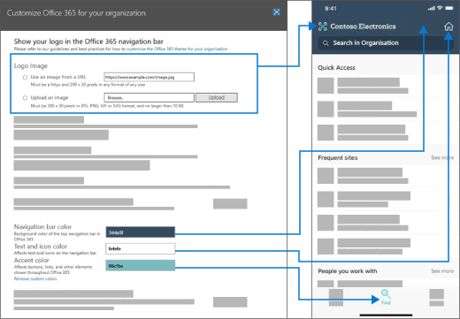

# Vad är nytt i administrationscentret för Microsoft 365

::: moniker range="o365-21vianet"

> [!NOTE]
> En del av informationen i den här artikeln kanske inte gäller för Office 365 som drivs av 21Vianet.

::: moniker-end

Vi lägger kontinuerligt till nya funktioner i administrationscentret för [Microsoft 365,](microsoft-365-admin-center-preview.md)åtgärdar problem som vi lär oss om och gör ändringar baserat på din feedback. Ta en titt nedan för att se vad som är tillgängligt för dig idag. Vissa funktioner distribueras i olika hastigheter för våra kunder. Om du inte ser en funktion ännu kan du prova att [lägga till dig själv i den riktade versionen.](manage/release-options-in-office-365.md)

Och om du vill veta vad som är nytt med andra Microsoft-molntjänster:

- [Vad är nytt i Azure Active Directory](https://docs.microsoft.com/azure/active-directory/fundamentals/whats-new)
- [Vad är nytt i administrationscentret för Exchange](https://docs.microsoft.com/Exchange/whats-new)
- [Vad är nytt i Microsoft Intune](https://docs.microsoft.com/mem/intune/fundamentals/whats-new)
- [Vad är nytt i Microsoft 365 efterlevnadscenter](https://docs.microsoft.com/Office365/SecurityCompliance/whats-new)
- [Nyheter i Microsoft 365 Defender](https://docs.microsoft.com/microsoft-365/security/mtp/whats-new)
- [Vad är nytt i administrationscentret för SharePoint](https://docs.microsoft.com/sharepoint/what-s-new-in-admin-center)
- [Office-uppdateringar](https://docs.microsoft.com/OfficeUpdates/)

## Ignite 2021 (mars)

Välkommen till Microsoft Ignite. Vi hoppas att du kunde delta i några av våra sessioner: [Microsoft Ignite 2021.](https://myignite.microsoft.com/sessions) Här är några av de saker vi pratar om på Ignite.
> [!NOTE]
> Alla funktioner blir inte tillgängliga för alla direkt. Om du inte ser de nya funktionerna kan du [ansluta till Riktad version.](manage/release-options-in-office-365.md)

### Meddelandecenter

Vi har moderniserat meddelandecentret för att hjälpa dig att hitta relevanta meddelanden och lagt till en mer flexibel läsupplevelse. Vi har lagt till en ny **tjänstkolumn** som hjälper dig att söka igenom vilken tjänst ett meddelande gäller för och filtrera meddelanden efter tjänst och andra metadata. Du kan markera ett meddelande som favorit för uppföljning, välja vilka kolumner som ska visas i meddelandelistan och navigera mellan meddelanden med knapparna Bakåt och Nästa. Vi har också förbättrat processen för att göra det enklare att ge feedback om inlägg i Meddelandecenter.

:::image type="content" source="../media/message-center.png" alt-text="Skärmbild: Startsidan för Meddelandecenter med inkorgen och meddelanden":::

Mer information om de nya funktionerna finns i Hantera [meddelanden i Meddelandecenter.](manage/manage-messages.md)

### Nya funktioner

Vi har gjort förbättringar i hur du ser "What's new"-funktionerna för användare i Office-apparna. Nu kan du se det omfattande innehållet i det nya fönstret Whats' som användarna kan se. Du kan också läsa mer om funktionen innan du bestämmer dig för att låta användarna veta om funktionen. For more info, check out [Manage which Office‎ features appear in What's New](manage/show-hide-new-features.md).

:::image type="content" source="../media/power-bi-whats-new2.png" alt-text="Skärmbild: En ny sida i Office-apparna som visar förbättringar i Power BI":::

## Ignite 2020 (augusti & september)

Välkommen till Microsoft Ignite – vår första ignite online. Vi hoppas att du kommer till en av våra sessioner: [Microsoft Ignite 2020 Sessionskatalog.](https://myignite.microsoft.com/sessions) Här är några av de saker vi kommer att prata om på Ignite.
> [!NOTE]
> Alla funktioner blir inte tillgängliga för alla direkt. Om du inte ser de nya funktionerna kan du [ansluta till Riktad version.](manage/release-options-in-office-365.md)

### Hantering av flera klientorganisationer

Vi har utvecklat en uppsättning funktioner för administratörer för flera innehavare som du för att få jobbet gjort snabbare och mer effektivt. Mer information finns i [Hantera flera klientorganisationsklienter.](multi-tenant/manage.md)

- **Dina klientorganisationar:** Växla snabbt mellan de klientorganisationar du hanterar.
- **Alla** klienter: En ny sida där du snabbt kan se hälsotillståndet för alla klientorganisationens tjänster, alla öppna tjänstförfrågningar, dina produkter och fakturering, rekommenderade konfigurationsuppgifter och antalet användare i klientorganisationen.
- **Konfiguration:** På sidan Inställningar för flera innehavare visas en listvy av inställningssidan, men ordnad för många klientorganisationar. Du kan se vilka funktioner som inte är påslagna, vilka uppgifter som är slutförda för alla klientorganisationar, aktiviteter som klientorganisationen fortfarande behöver slutföra. Den här vyn hjälper dig att hålla reda på införande av funktioner och att se till att de rekommenderade säkerhetsinställningarna alltid utförs.
- **Tjänstens** hälsa: Vyn Tjänstens hälsa visar dig om några incidenter eller rådgivning påverkar klientorganisationen. Där ser du även hur många av dina hanterade klientorganisationar som påverkas. Välj en incident för att få mer information på översiktsfliken och växla sedan till fliken Klientorganisation som påverkas för att öka detaljgranskningen och ge support för den klientorganisationen.
- **Postlådemigrering** mellan klientorganisationen är en ny tjänst, som nu är en offentlig förhandsversion, som gör att du kan flytta postlådor mellan klientorganisationen utan att behöva offboard och sedan registrera postlådor. 
- **Domändelning mellan klientorganisationen:** Du kan snart ansluta till en privat förhandsgranskning för funktioner som gör att du kan dela en domän mellan flera klientorganisationar. Om Contoso exempelvis hämtar Wingtip Toys kan Contoso dela domänen med Wingtip Toys så att personer i båda innehavarna kan använda "contoso.com" som e-postadresser.

### Övervaka dina viktigaste konton

Du kan övervaka och spåra misslyckade eller fördröjda e-postmeddelanden som skickas till användare med stor inverkan på verksamheten, t.ex. din VD. Du kan spåra prioritetskonton genom att lägga till användare i listan med prioriterade konton i administrationscentret för Microsoft 365. Lägg till chefer, ledare, chefer eller andra användare som har tillgång till känslig information med hög prioritet.

Prioritetskonton är endast tillgängliga för organisationer som uppfyller båda av följande krav:

- Office 365 E3 eller Microsoft 365 E3 eller Office 365 E5 eller Microsoft 365 E5.
- Minst 10 000 licenser och minst 50 månatliga aktiva Exchange Online-användare.

Du kan komma igång på två sätt:

- Gå till **Användare** och välj hantera prioriterade konton i menyn "fler åtgärder" **för** att lägga till användare i listan.
- Gå till **installationsprogrammet,** leta reda på den konfigurationsuppgift **som övervakar dina** viktigaste konton och välj sedan **Kom igång.**

Mer information om prioritetskonton finns i Övervaka [prioritetskonton.](https://docs.microsoft.com/microsoft-365/admin/setup/priority-accounts)

### Sök snabbare och få bättre resultat från valfri sida

Vi har börjat lansera en ny sökupplevelse för administrationscentret och vi kan inte vänta på att du provar det. 

- Sökrutan har flyttats till rubrikområdet där det står "Administrationscenter för Microsoft 365" så att du nu kan söka från valfri sida, inte bara från startsidan. Vi har till och med en genväg: **Alt+S.**
- Sökfunktionen är smartare och ger dig bättre resultat, ännu snabbare. Prova att skriva "2fa" för att komma igång.
- Sökresultaten är ordnade efter typ av objekt eller åtgärd som du kan vidta.
  - **Användare:** Välj användarens namn så kan du redigera användaren där. Om du väljer menyn "fler åtgärder" bredvid namnet kan du återställa deras lösenord. Du kan söka efter visningsnamn, efternamn, förnamn, användarnamn eller primär e-postadress och e-postalias. Men för att få en exakt matchning söker du efter primär e-postadress eller användarnamn.
  - **Grupper:** Redigera gruppen från valfri sida, lägg till medlemmar, tilldela ägare.
  - **Åtgärder:** Ungefär på samma sätt som du kan söka efter en användare och sedan återställa deras lösenord kan du också söka efter "återställa lösenord" från en sida och sedan återställa ett eller flera lösenord för användare.
  - **Navigering:** Resultat under Navigering kan snabbt hjälpa dig att komma till en sida i administrationscentret. Om du till exempel söker efter "roller" kommer du till sidan Roller för Azure AD-roller.
  - **Inställningar:** Sök efter inställningar som är relaterade till din organisation, de tjänster som du prenumererar på samt säkerhets- och sekretessinställningar. 
  - **Domäner:** Du hittar snabblänkar till domänerna och sedan kommer du till översikts- och hälsosidan för den domänen via länken.
  - **Dokumentation:** Om vi inte kan hitta ett resultat åt dig försöker vi hitta en del dokumentation som kan vara till hjälp. Det tar lite längre tid för den iordningräknade listan med artiklar att hitta en matchning, så vänta en sekund så att sökningen hittar resultaten. 
  - **Feedback:** Hittade du inte det du letade efter? Skicka feedback från Sök. Vi kommer att lägga till sökfunktioner för fler sidor och fler funktioner i administrationscentret.

### Microsoft 365 Admin-mobilapp

Med [mobilappen för Microsoft 365-administratörer,](https://www.microsoft.com/microsoft-365/business/manage-office-365-admin-app)som ingår i din prenumeration, kan du hantera Microsoft 365 från din mobila enhet så att du kan hålla dig borta från skrivbordet och utföra dagliga uppgifter. Faktum är att det finns över 90 funktioner i appen – och vi har just lagt till några fler:

- **Stöd för Microsoft Intunes** principer för hantering av mobilprogram och villkorsstyrd åtkomst: Du kan nu använda din personliga enhet för att hantera Microsoft 365 även om din organisation har aktiverat Intunes principer för hantering av mobilprogram och villkorsstyrd åtkomst.
- **Meddelanden i Meddelandecenter:** Aktivera aviseringar i Meddelandecenter **på**  >  **Inställningar-aviseringar** om du vill bli avisering om nya inlägg i Meddelandecenter. Via aviseringar vill vi se till att du håller dig informerad om viktig information och händelser i hela klientorganisationen.
- **Faktureringsaviseringar:** Du kan också aktivera faktureringsaviseringar på Inställningsaviseringar om du vill få faktureringsaviseringar på din enhet om en prenumeration upphör  >   att gälla.
- **Mörkt läge:** Välkommen till den mörka sidan av mobilappen. Det här var en av våra mest efterfrågade funktioner. Gå till **Inställningar**  >  **för teman** för att aktivera det.
- **Rapportera ett problem:** Du kan nu rapportera ett problem i appen eller visa problem som rapporterats av andra administratörer. Gå **till Tjänstens hälsa** om du vill kolla in det.

### Användningsrekommendationer för små och medelstora företag

Små och medelstora företag kan  få en rekommendation på startsidan om några av personerna i organisationen inte aktivt använder Teams, OneDrive eller Office-appar. När du ser rekommendationen kan du snabbt skicka e-post till microsoft-utbildning till inaktiva användare för att hjälpa dem att komma igång med programmet och för att se till att du får ut det fullständiga värdet från dina prenumerationer.

### Samling på distans

I oktober lägger vi till en samling för distansarbete som hjälper ägare av småföretag och deras personal att komma online och arbeta på distans.  **Inställningar för distansarbete är** en lista över alla funktioner som Microsoft rekommenderar för att säkert kunna arbeta på distans och samarbeta effektivt. Om några veckor kan du prova den i Installera remote **work**  >  **essentials.**

Mer information om hur du tillåter distansarbete och en praktisk webbadress som är lätt att komma ihåg och dela finns i [aka.ms/remote-business.](https://aka.ms/remote-business)

### Behöver du hjälp? flytta till fler administrationscenter

Vi tittar kontinuerligt på och uppdaterar innehåll och verktyg för att hålla koll på ändringar i produkten. Vi har nu många fler självbetjäningsverktyg som hjälper dig att lösa problem snabbt och effektivt. Här är några som nyligen har lagts till:

- Ändra begränsningsprincipen för Exchange-webbtjänsten
- Kontrollera status för Teams etablering och validering för specifika användare
- Åtgärda problem med DKIM-installationen
- Diagnostisera registreringsfel för Intune-användare

Och vi distribuerar den nya och förbättrade supportupplevelsen som du redan ser i administrationscentret för Microsoft 365 till några av de andra administrationscenterna. Administrationscenter för Teams administrationscenter för säkerhet och efterlevnad har redan den här nya upplevelsen. Och snart kommer **administrationscentret för Exchange,** administrationscentret för **SharePoint** **och Office.com** att uppdateras tillsammans med den nya hjälpupplevelsen för administratörer.

### Hantera ändringar med Microsoft Planner

I maj meddelade vi att du snart kommer att kunna synkronisera inlägg i Meddelandecenter i Microsoft Planner och nu är det tillgängligt för alla att använda.  Nu kan du skapa uppgifter från meddelanden, tilldela dem och spåra dem som ska slutföras. Första gången väljer du **Planner-synkronisering** och måste ansluta till rätt plan.

Mer information finns i den här artikeln och videon om du vill se hur det fungerar: Spåra [inlägg i meddelandecentret i Planner](https://docs.microsoft.com/Office365/Planner/track-message-center-tasks-planner)

### Dokumentation, utbildning och videoklipp

- Helt nytt och i tid för Microsoft Ignite –[Den virtuella hubben.](https://adoption.microsoft.com/virtual-hub/) Djupdykning i teknisk utbildning för IT-proffs och utvecklare. Hitta snabbt runt 20 nya videor som en del av #SIDETRACKED, namnet på Ignite-administratörsspåret i år.
- Vad är nytt i [Microsoft 365-videoserien:](https://www.youtube.com/watch?v=OVjb2lGJ4GU&t=2s) Den här månaden går vi in på nya funktioner i Whiteboard för Teams och på webben, hur du automatiserar användaretablering till Azure AD, nya Power Automate-utlösare och -åtgärder i Teams med mera. Och håll utkik efter nästa månad, där vi får en sammanfattning av allt det som händer på Ignite!
- Vi omarbetade microsoft [365-dokumentationssidan som](https://docs.microsoft.com/microsoft-365) fokuserar på lösningar först. Vi kommer att framhäva nya lösningar när de blir tillgängliga på den här sidan, så håll ett öga på det.

## Juli 2020

### Redo för Ignite 2020

När vi flyttar till Ignite-säsongen på Microsoft släpper vi inte lika många funktioner så att vi har mycket att prata om under våra sessioner.

Nästa uppdatering till den här artikeln blir på första dagen av vår första online-only Ignite. Och i år är det kostnadsfritt att delta! Kolla in den, skaffa dig: [Microsoft Ignite 2020.](https://www.microsoft.com/ignite)

### Dina produkter

Det har gjorts mycket arbete i hanteringen av prenumerationer för att göra sidan snabbare att läsa in, snabbare hitta det du letar efter och för att uppfylla webbtillgänglighetsstandarder[(WCAG 2.1 riktlinjer).](http://www.w3.org/TR/WCAG21/)

- **Tabelldesign:** Tabellen har omarbetats så att du kan gruppera liknande prenumerationer. Gå till **Fakturering**  >  **för dina produkter.**
- **Produktinformation:** Få mer information än någonsin om dina prenumerationer genom att välja produkten i listan.
- **Gör allt härifrån: Och** du behöver inte hoppa runt på flera sidor för att hantera en produkt. Om du till exempel behöver avbryta en prenumeration öppnas panelen för att göra åtgärden där.

### Domäner

Domänhantering kan vara komplicerat och vi har släppt en ny funktion för att göra det enklare. Gå till Inställningar > Domäner och välj sedan en domän för att få mer information om din domän och domänens hälsa.

:::image type="content" source="../media/MAC-WN-DomainDNS.PNG" alt-text="Sidan Med domäninformation för contoso.com":::

### Dokument, utbildning och videoklipp (juli 2020)

Vad är nytt i [Microsoft 365-videoserien:](https://youtu.be/m1Nu8WJgCDY) Den här månaden tar vi upp den nya Yammer-upplevelsen för webben och mobilen, hur du integrerar appen Yammer Communities för Microsoft Teams, nya princippaket för att stödja medarbetare i frontlinjen och chefer med mera.

## Juni 2020

### Håll dig ajour med den nya hanteringen i Office

För några månader sedan lade vi till en inställning som gör att du kan hantera meddelandena Vad är nytt som visas i en [användares Office-program.](#office-whats-new-management) Den här månaden släppte vi ett nytt startsidaskort som  hjälper dig att agera snabbt och hålla reda på alla nya meddelanden som du vill visa för användarna i organisationen.

### Dokument, utbildning och videor (juni)

- [Komma igång med Teams](https://support.microsoft.com/office/184f1aba-2f91-43f0-86e1-9fae607e24f6)

## Maj 2020

### Ny uppdateringskanal för Office

Den 12 maj meddelade vi att en ny uppdateringskanal för Office: Monthly Enterprise Channel är tillgänglig. Den här uppdateringskanalen ger användarna nya Office-funktioner en gång i månaden, den andra tisdagen i månaden.

Om du tillåter att användarna själv installerar Office från portalen kan du välja Månatlig företagskanal för dem. Det gör du genom att logga in på administrationscentret för Microsoft 365 och gå till **Visa** alla inställningar för organisationens inställningar Tjänster för  >   >    >    >  **nedladdning av Office-programvara.** Om du väljer En gång i månaden **(Månadskanal** för företag) konfigureras eventuella nya självinstallationer av Office till att använda Månatlig företagskanal.

I samband med utgivningen av Månatlig företagskanal kan vi också ändra namnen på de befintliga uppdateringskanalerna. Månadskanal byts till exempel namn till Aktuell kanal. De nya namnen verkställs den 9 juni 2020.

Mer information finns i Ändringar [för att uppdatera kanaler för Microsoft 365-appar.](https://docs.microsoft.com/DeployOffice/update-channels-changes)

### Nya administratörsroller

Vi har lagt till några nya Azure Active Directory-administratörsroller i administrationscentret för Microsoft 365.

- Rollen Hybrid identity admin ger användare behörighet att hantera molnetablerings- och autentiseringstjänster.
- Med rollen Nätverksadministratör kan användare hantera nätverksplatser och granska nätverksinsikter för Microsoft 365-programvara som tjänstprogram.
- Rollen Skrivaradministratör ger behörighet till att hantera alla aspekter av skrivare och skrivaranslutningar.
- Skrivarteknikern är en del av rollen Administratör för skrivare där dessa användare kan registrera och avregistrera skrivare samt uppdatera skrivarstatus.
Mer information om de här rollerna finns i [Om administratörsroller.](https://docs.microsoft.com/microsoft-365/admin/add-users/about-admin-roles)

### Exportera grupplista

Vi har hört från många administratörer att de behöver dela information om grupper och deras användning till personer som inte har tillgång till administrationscentret. Du kan nu exportera listan Grupper till en CSV-fil för granskningsändamål, vilket innebär att du kan kasta ut det gamla PowerShell-skriptet. Prova genom att gå till   >  **Grupper-grupper** och välja **Exportera grupper** i kommandofältet.

### Microsoft 365-center för lösningar och arkitektur

Den här månaden släppte vi en ny webbplats som kallas [https://docs.microsoft.com](https://docs.microsoft.com) [Microsoft 365-lösningen](https://docs.microsoft.com/microsoft-365/solutions/solution-architecture-center)och arkitekturcentret, som sammanför den tekniska vägledning du behöver för att förstå, planera och implementera integrerade Microsoft 365-lösningar för säkert och kompatibelt samarbete. I det här mitten hittar du:

- Vägledning för grundlösning
- Lösningar för arbetsbelastning och scenariovägledning
- Lösnings- och arkitektur illustrationer (affischerna!!!)
- Branschspecifik vägledning
- Designhuvudnamn för företagsarkitektur

### Dokument, utbildning och videor (maj)

- Vad är nytt i **Microsoft 365-videoserien:** Den här månaden tar vi upp den nya supportupplevelsen i Administrations- och efterlevnadscenter för Teams, Planner-integrering med Meddelandecenter och den nya 3x3-videolayouten i Microsoft Teams. 
- [Hjälphubben för administrationscentret för Microsoft 365](https://docs.microsoft.com/microsoft-365/admin/) har uppdaterats så att du snabbare hittar det du behöver. Och om du tittar på den sidan just nu har vi lagt till ett kort som informerar dig om viktiga uppdateringar och ändringar.

## April 2020

### Hantering av Intune-roller

[April 2020](#april-2020)

Vi gjorde det! Vi har tagit det andra steget mot en enhetlig rollupplevelse och du kan nu hantera Intune-roller i administrationscentret för Microsoft 365. Du kan också dra nytta av funktioner som möjligheten att söka efter roller och visa rollbehörigheter. Det innebär att du inte behöver två separata verktyg för att hantera roller för Microsoft 365 och Intune. När du loggar in i administrationscentret för Microsoft 365 ser du att det finns två pivoter på sidan Roller, en för Azure AD och en för Intune.

### Synkronisera inlägg i Meddelandecenter i Planner

Från och med maj kommer administratörer i den riktade versionen att se knappen "Planner-synkronisering" i meddelandecentret. Nu kan du spåra meddelanden som behöver åtgärder, välja vilken typ av meddelanden du vill spåra, tilldela meddelanden att spåra som uppgifter och tagga meddelanden för senare uppmärksamhet.

[Gå med i riktad version](manage/release-options-in-office-365.md) för att komma igång!

### "Behöver du hjälp?" lanseras i administrationscentret för Teams & säkerhets- och efterlevnadscenter

Administrationscentret för Teams, säkerhetscenter och efterlevnadscenter använder nu samma "Behöver du hjälp?" som används i administrationscentret för Microsoft 365 för att hitta hjälp och kontakta support. Vi har fått många feedback från administratörer som du vill ha samma nivå av hjälp och support och vi är glada att kunna ge dig den. Prova själv och ge oss feedback!

#### Behöver du chatt?

Vår supportagenter har arbetat hemifrån medan de fortfarande tar kundärenden och begränsningar på bandbredden på Internet medan man arbetar hemifrån kan påverka samtalskvaliteten. För att du ska kunna fortsätta ge support har vi lanserat supportalternativet livechatt för kommersiella kunder i administrationscentret för Microsoft 365.

När du skapar en tjänstförfrågan ser du nu chatt som ett alternativ, förutom telefon och e-post. Välj chatt som önskad kommunikationskanal och skapa begäran. När du har skapat din begäran kan du starta chatten när du är redo att chatta med Microsoft-agenter.

### Teams-uppdateringar

Med den ökade användningen av Teams har vi lagt till några funktioner som hjälper dig att hantera dem.

- Ett nytt rekommendationskort på startsidan för administrationscentret visar vilka användare som inte aktivt har använt Teams under 30 dagar. Du kan skicka ett e-postmeddelande med en utbildning till dessa användare så att de kan komma igång med Teams.
- **Samla människor med grupper:** Gå till installationsprogrammet för att se en ny sida som hjälper dig att aktivera Teams för licensierade användare och tillåta gäståtkomst, så att du kan arbeta med externa kunder i Teams. 
- Ett Microsoft Teams-kort är nu fäst som standard på din startsida. Det visar om Teams är aktiverat och om gäståtkomst tillåts. Du kan också kontrollera installationsstatus för nyligen licensierade Teams-användare och kontrollera om nätverksproblem kan påverka Teams-användare.
- Slutligen är Teams nu ett steg i det första set up-flödet om du har köpt en licens som innehåller Teams.

### Produktivitetspoäng

Produktivitetsresultatet ger insikter om hur användare använder Microsofts molntjänster och de teknikupplevelser som stöder dem. Poängen motsvarar organisationens resultat mot mått på personal- och teknikupplevelse och jämför resultatet med organisationer som ditt. Den här månaden introducerar vi följande nya begrepp till förhandsversionen:

- Trendvy över primära insikter på startsidan och kategoriinformationssidor – Slutpunktsanalys och Nätverksanslutningskategorier har lagts till i teknikupplevelsen
- Relevanta teknikupplevelseinsikter som visas i kategorierna Medarbetarupplevelse
- Ny kommunikationskategori som en del av personalupplevelse
- Användarinformation med metadata för organisationen i kategorierna Medarbetarupplevelse

Om du vill veta mer kan du läsa bloggen: Mät och förbättra [Microsoft 365-upplevelsen med Microsoft Productivity Score.](https://techcommunity.microsoft.com/t5/microsoft-365-blog/measure-and-improve-the-microsoft-365-experience-with-microsoft/ba-p/1348618) Produktivitetsresultatet är för närvarande i privat förhandsversion. [Gå med i den privata förhandsversionen av Productivity Score](https://aka.ms/productivityscorepreview) för att komma igång.

### Uppdateringar för grupper

Vi har två uppdateringar för Grupper den här månaden:

- Nu kan du redigera e-postadresser för Office 365-grupper (kallas även grupper i Outlook och snart kallas de Microsoft 365-grupper).
- Vi har lyssnat på din feedback och vi har lagt till tydligare felmeddelanden för varför du inte kan konvertera en grupp till ett Microsoft-team.

### Dokument, videor och utbildning (april)

Vad är nytt i **Microsoft 365-videoserien:** Den här månaden tar vi upp tips och resurser som hjälper småföretag att övergå till distansarbete, bland annat hur man distribuerar Microsoft Teams, resurser för distansutbildning för att hålla kontakten med kunder och partner samt det nya Microsoft 365 Business Voice-abonnemanget. [Vad är nytt i Microsoft 365](https://go.microsoft.com/fwlink/p/?linkid=2118096)

#### För dina användare

- [Schemalägga ett möte](https://support.microsoft.com/office/c61b4f61-ee62-4a06-8bf7-0a1cd302700a)
- [Ansluta till ett Teams-möte](https://support.microsoft.com/office/078e9868-f1aa-4414-8bb9-ee88e9236ee4)
- [Skapa ett organisationsteam](https://support.microsoft.com/office/037bb27a-bcc9-48fe-8d72-44d9482420a3)
- [Skapa ett team med gäster](https://support.microsoft.com/office/11fbb083-52ee-434d-8c6e-63711fdafac7)
- [Gå med i ett team som gäst](https://support.microsoft.com/office/928d1eef-61e2-49ec-b754-c2fe86b34824)
- [Skapa en grupp-e-postadress](https://support.microsoft.com/office/ded875f9-a9de-437f-b559-2ae4f235bb2b)

#### För administratörer och företagsägare

- [Ge ditt småföretag möjlighet att arbeta på distans](https://support.microsoft.com/office/9b91a85a-39b4-40a6-a590-0f9bea0ba8e6)
- [Driva ett småföretag på distans](https://support.microsoft.com/office/9ac1a0f1-789b-4143-b954-5821d5d89298)
- [Registrera dig för Microsoft Business Basic](https://support.microsoft.com/office/9ac1a0f1-789b-4143-b954-5821d5d89298)
- [Konfigurera tvåfaktors inloggning](https://support.microsoft.com/office/9ac1a0f1-789b-4143-b954-5821d5d89298)

## Mars 2020

### Aktuell feedbackkorrigering: Förbättra "lägga till användartillförlitlighet" för licensiering

Vi har fått många synpunkter från administratörer om hur svårt det är att tilldela licenser när användare läggs till. Vi har gjort den första uppdateringen av den här korrigeringen och vi har migrerat till en mer tillförlitlig tjänst bakom kulisserna för att bearbeta dessa begäranden. Och om något går fel får du nu ett felmeddelande där du kan försöka igen.

### Startsida för Microsoft Teams

Med uppringning av Teams användning får vissa organisationer ett fäst instrumentpanelskort som gör teams mer lätt att hitta. Kortet innehåller även länkar till utbildning och dokument som hjälper din organisation övergå till distansarbete. Gå bara till startsidan **för** att se det nya kortet.

### Anpassa organisationens tema för SharePoint-mobilappen

Med hjälp av administrationscentret för Microsoft 365 kan du nu anpassa organisationens tema i SharePoint-mobilappen för iOS- och SharePoint-mobilappen för Android. Den här funktionen ger enkelt en mobil intranätappupplevelse som kan matcha SharePoint Online för anställda när de är på språng. Temaanpassning inkluderar logotypbild, färg på navigeringsfältet, text- och ikonfärger och accentfärger som gör det enkelt att känna igen.

### Förbättringar i guiden Lägg till en grupp

När administratörer skapade en ny grupp – och gjorde den till ett team samtidigt, kunde de tilldela ägare som inte har en licens som innehåller Teams. Och det skapade problem. Vi har uppdaterat guideflödet för att verifiera att ägare har en Teams-licens och om de inte har alternativet att omvandla gruppen till ett team inaktiveras.

### Microsoft 365-erbjudanden för små och medelstora företag

Vi vet att det här är ett meddelande för nästa månad, men vi vill vara säkra på att du är förberedd.

Från och med den 21 april gör vi ändringar som är relaterade till våra Office 365-prenumerationer för små och medelstora företag – och till Office 365 ProPlus. Dessa produkter kommer nu att använda Microsoft 365-varumärket.

De nya produktnamnen verkställs den 21 april 2020. Det här är bara en ändring av produktnamnet och det finns inga pris- eller funktionsändringar för stunden.

|Aktuellt namn |Nytt namn  |
|---------|---------|
|Office 365 Business Essentials     |   Microsoft 365 Business Basic      |
|Office 365 Business Premium     |    Microsoft 365 Business Standard     |
|Microsoft 365 Business     |    Microsoft 365 Business Premium     |
|Office 365 Business     |    Microsoft 365-applikationer för affärsverksamhet       |
|Office 365 ProPlus    |   Microsoft 365-appar för företag      |

### Videor, utbildning och dokument

Vad är nytt i [Microsoft 365-webbserien:](https://go.microsoft.com/fwlink/p/?linkid=2118096)I den här månadens avsnitt visar vi Microsoft Teams 3-årsminne och täcker in nya funktioner, bland annat förbättrad ljudkvalitet i onlinemöten, riktad kommunikation för firstline-chefer med Shifts-appen, Teams och Skype-konsumentkompatibilitet med mera.

## Februari 2020

### Aktuell feedbackkorrigering: Byta till flera organisationer

Vi har fått många feedback från partners och administratörer om utmaningarna med att hantera flera Microsoft-molntjänster. En av våra första funktioner för hantering av flera organisationer är Organisationsväxling, som gör att du kan växla mellan de organisationer som du hanterar med bara 2 klick.
> [!TIP]
> Du behöver inte göra något för att få organisationsbytet att visas så länge du är partner för minst en organisation.

1. Välj organisationsnamnet i administrationscentret för Microsoft 365.

2. I organisationsväxeln väljer du den organisation du vill hantera.

Det var helt rätt!!!

### Grupper

Några ändringar i gruppområdet den här månaden:

- **Sortera efter gruppnamn:** Du kan sortera grupplistan i alfabetisk ordning genom att välja **kolumnen Gruppnamn.**
- **Återställa borttagna Microsoft 365-grupper:** Du behöver inte längre gå till administrationscentret för Exchange för att återställa borttagna Microsoft 365-grupper. Gå till **Grupper i administrationscentret för Microsoft 365** \> **Grupper** \> **som tagits bort** \> (välj en grupp i listan) \> **Gruppen Återställ.** Den återställer gruppen till grupplistan **och återställer** gruppens e-post, konversationer, anteckningsbok, filer och kalender.

### Videor, utbildning och dokument (februari)

- Nyheter i **Microsoft 365-videoserien:** Den här månaden fokuserar vi på anpassade sökfunktioner för SharePoint Online, hanteringsfunktionen "Nyheter" i Office där du kan visa eller dölja specifika funktioner för slutanvändare via hjälpfönstret i programmet, de senaste säkerhets- och efterlevnadsuppdateringarna i Yammer med mera. Här är det senaste avsnittet: [Nyheter i Microsoft 365](https://go.microsoft.com/fwlink/p/?linkid=2118096)

- **Docs move:** We combined the Office 365 admin web articles with the Microsoft 365 content and you might've noticed the new URL. Den här artikeln var till exempel lagrad på: **docs.microsoft.com/Office365/Admin/whats-new-in-preview,** men URL:en är nu: **docs.microsoft.com/microsoft-365/admin/whats-new-in-preview.** Om du har bokmärkt sidor bör du uppdatera länkarna. Men innehållslänkar omdirigeras till den nya innehållsplatsen.

## Januari 2020 - Gott Nytt år

> [!NOTE]
> Visste du att det finns en nyhet [i Microsoft 365-videoserien](https://go.microsoft.com/fwlink/p/?linkid=2118096) på YouTube? Där framhävs de senaste funktionerna som vi distribuerat till användarna. Varje månad länkar vi till det senaste avsnittet i avsnittet [Videor, utbildning och dokument.](#videos-training-and-docs)     Här är det senaste avsnittet: [Nyheter i Microsoft 365](https://go.microsoft.com/fwlink/p/?linkid=2118096)

### Mörkt läge

När vi först distribuerade mörkt läge var det bara tillgängligt på startsidan. Mörkt läge är nu slut i förhandsgranskningsläge och finns i riktad version på de flesta sidor i administrationscentret.

1. Först måste du aktivera Riktad version: Gå till inställningar för **organisationsprofilens** inställningar \>  \>  \> **för inställningar.**
1. Om du sedan vill aktivera mörkt läge går du **till startsidan** och väljer knappen **Mörkt** läge. (Den finns bredvid **sökfältet** och den här **artikelns nya** länk.)
1. För alla sidor med mörkt läge är knappen högst upp på sidan, bredvid växlingsknappen **i det nya administrationscentret.**

### Ny hantering för Office

Administratörer vill ha kontroll över hur Microsoft kommunicerar "Vad är nytt" till sina användare i Office-apparna – och du har nu den kontrollen. Gå till **Inställningar** \> **för Office, förhandsversion av ny hantering.** Välj en funktion för att visa dess  information och välj sedan knappen Dölj för användare om du inte vill att dina användare ska se ett specifikt meddelande om "vad är nytt". Din organisation kanske väntar på att meddela användarna om en funktion tills alla i organisationen har utbildning om den.

Den här funktionen släpptes först som förhandsversion i november, men det har finnas några funktionsuppdateringar som du bör känna till: Nya uppdateringar av förhandsversionen av [Office](https://techcommunity.microsoft.com/t5/microsoft-365-blog/office-what-s-new-management-preview/ba-p/1020438)

### Partner

Howdy, Partners! (Det gick inte att hjälpa mig själv.) Vi har även en uppdatering för dig den här månaden. Det finns en ny funktion som gör att partner kan ge CSP-kunder möjlighet  att acceptera sitt Microsoft-kundavtal (MCA) i avsnittet Faktureringskonton i administrationscentret. I den här nya upplevelsen:

1. Kunden får en e-postinbjudan med en länk för att acceptera partnerrelationen och partnerrelationen.
2. När kunden har loggar in kan de visa och godkänna behörigheterna mca och partner – direkt från administrationscentret.

### Resurspostlådor

Listan Resurspostlådor har uppdaterats till det nya formatet. I administrationscentret för Microsoft 365 går du till  \> **Resursrum & utrustning.**

### Videor, utbildning och dokument (januari)

Ta en titta på utbildning för administratörer för småföretag som vi släppte i januari:

- [Skapa din företagswebbplats](https://support.microsoft.com/office/3325d50e-d131-403c-a278-7f3296fe33a9)
- [Hitta svar och hjälp](https://support.microsoft.com/office/7f681212-c649-4a3e-a43b-32b1d1e58988)
- [Få hjälp eller support](https://support.microsoft.com/office/18948a4c-3eb1-4b30-b1bc-a4cc29eb7655)
- [Ta bort en användare](https://support.microsoft.com/office/6bcdad7b-732a-4260-997a-8c176bc3d9d6)
- [Välj en Microsoft-prenumeration](https://support.microsoft.com/office/b9f7c78e-430f-4117-89ec-2eeb1dced2ca)
- [Översikt över Microsoft 365 för företagssäkerhet](https://support.microsoft.com/office/3274b159-a825-46d7-9421-7d6e209389d1)
