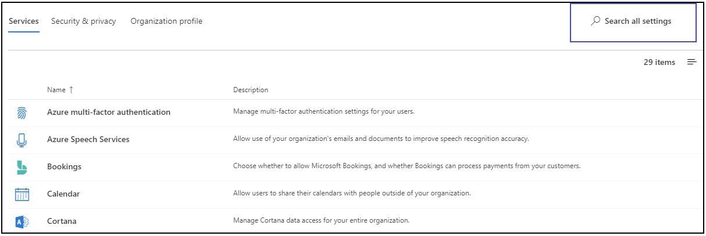
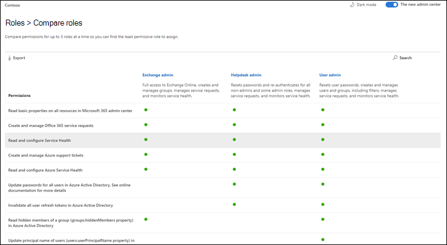
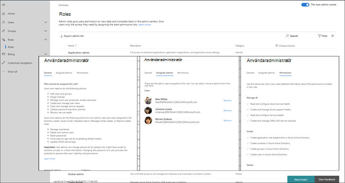
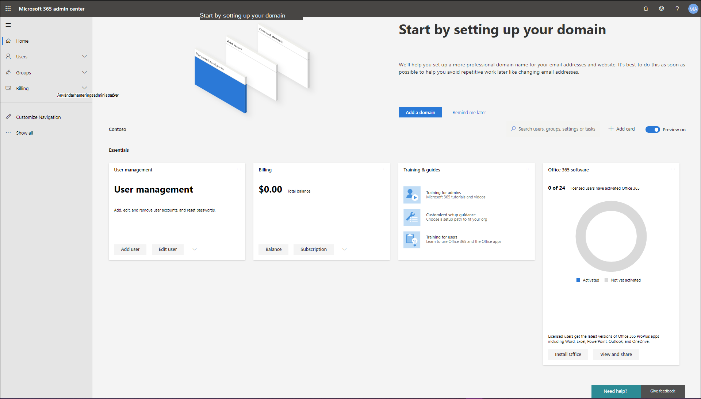

# Nyheter i administrationscentret för Microsoft 365What's new in the Microsoft 365 admin center

Vi lägger kontinuerligt till nya funktioner [i Microsoft 365-administrationscentret,](microsoft-365-admin-center-preview.md)åtgärdar problem som vi lär oss om och gör ändringar baserat på din feedback.We're continuously adding new features to [the Microsoft 365 admin center](microsoft-365-admin-center-preview.md), fixing issues we learn about, and making changes based on your feedback. Ta en titt nedan för att se vad som är tillgängligt för dig idag.Take a look below to see what's available for you today. Vissa funktioner rullas ut i olika hastigheter till våra kunder.Some features get rolled out at different speeds to our customers. Om du inte ser någon funktion ännu [kan du prova att lägga till dig själv i riktad version](manage/release-options-in-office-365.md).If you aren't seeing a feature yet, [try adding yourself to targeted release](manage/release-options-in-office-365.md).

> [!IMPORTANT]
> **"Classic" admin center pensionering med början i mars****"Classic" admin center retirement starting in March**  
När du loggar in på admin.microsoft.com går du nu till det nya administrationscentret varje gång.When you sign-in to admin.microsoft.com, you'll now go to the new admin center every time. Och i mars kommer vi att börja inaktivera möjligheten att byta tillbaka till det klassiska administrationscentret.And in March, we will start disabling the ability to switch back to the classic admin center. För nu kan du fortfarande växla tillbaka, men som det nya admin-centret kommer till paritet (och överstiger det) kommer vi att stänga av växeln för alla organisationer.For now, you can still switch back, but as the new admin center comes to parity (and exceeds it) we will turn off the switch for all organizations.    *Senast uppdaterad: 2 mars 2020**Last updated: March 2, 2020*

Och om du är intresserad av vad som är nytt i andra admin centers:And if you're interested in what's new in other admin centers:

- [Nyheter i Microsoft 365 compliance centerWhat's new in the Microsoft 365 compliance center](https://docs.microsoft.com/Office365/SecurityCompliance/whats-new)
- [Nyheter i administrationscentret för SharePointWhat's new in the SharePoint admin center](https://docs.microsoft.com/sharepoint/what-s-new-in-admin-center)

## Februari 2020February 2020

### Dagens Feedback Fix: Flera organisationer switcherFeatured Feedback Fix: Multi-organization switcher

Vi fick mycket feedback från partner och administratörer om utmaningarna med att hantera flera Microsoft-molnorgan.We received a lot of feedback from partners and admins about the challenges of managing multiple Microsoft cloud orgs. En av våra första multi-org hanteringsfunktioner är **organisationen switcher**, som låter dig ändra mellan de orgörer som du hanterar på bara 2 klick.One of our first multi-org management features is the **Organization switcher**, which lets you change between the orgs that you manage in just 2 clicks.
> [!TIP]
> Du behöver inte göra något för att göra organisationen växlare visas så länge du är partner för posten för minst en organisation.You don't have to do anything to make the organization switcher appear as long as you are the Partner of record for at least one organization.

1. Välj organisationsnamnet i administrationscentret för Microsoft 365.In the Microsoft 365 admin center, select the org name.

2. Välj den organisation som du vill hantera i organisationsväxeln.In the organization switcher, select the org you want to manage.

Det är bokstavligen det!!!That's literally it!!!

### GrupperGroups

Ett par förändringar i gruppen området denna månad:A couple of changes in the groups area this month:

- **Sortera efter gruppnamn**: Du kan sortera grupplistan alfabetiskt genom att välja kolumnen **Gruppnamn.****Sort by group name**: You can sort the groups list alphabetically, by selecting the **Group name** column.
- **Återställ borttagna Microsoft 365-grupper**: Du behöver inte längre gå till Administrationscentret för Exchange för att återställa borttagna Microsoft 365-grupper.**Restore deleted Microsoft 365 groups**: You don't have to go to the Exchange admin center anymore to restore  deleted Microsoft 365 groups. Gå till **Microsoft 365 administrationscenter** \> **Grupper** \> **borttagna grupper** \> (välj en grupp i listan) \> Återställ **grupp**.Go to **Microsoft 365 admin center** \> **Groups** \> **Deleted groups** \> (select a group from the list) \> **Restore group**. Gruppen återställs till listan **Grupper** och återställer gruppens e-post, konversationer, anteckningsbok, filer och kalender.It'll restore the group back to the **Groups** list and restore the group's email, conversations, notebook, files, and calendar.

### Videor, utbildning och dokumentVideos, training, and docs

- **Nyheter i Microsoft 365-videoserien**: Den här månaden fokuserar vi på anpassade sökfunktioner för SharePoint Online, hanteringsfunktionen "Nyheter" för Office som gör att du kan visa eller dölja specifika funktioner från slutanvändare via hjälpfönstret i appen, de senaste säkerhets- och efterlevnadsuppdateringarna i Yammer med mera.**What's new in Microsoft 365 video series**: This month, we're focused on custom search capabilities for SharePoint Online, the Office "What's New" management feature that lets you show or hide specific features from end-users via the in-app help pane, the latest security and compliance updates in Yammer, and more. Här är det senaste avsnittet: [Nyheter i Microsoft 365](https://go.microsoft.com/fwlink/p/?linkid=2118096)Here's the latest episode: [What's New in Microsoft 365](https://go.microsoft.com/fwlink/p/?linkid=2118096)

- **Dokument flytta:** Vi kombinerade webbartiklarna för Office 365-administratörer med Microsoft 365-innehållet och du kanske har lagt märke till den nya webbadressen.**Docs move**: We combined the Office 365 admin web articles with the Microsoft 365 content and you might've noticed the new URL. Den här artikeln användes till exempel på: **docs.microsoft.com/Office365/Admin/whats-new-in-preview**, men webbadressen är nu: **docs.microsoft.com/microsoft-365/admin/whats-new-in-preview**.For example, this article used to be hosted at: **docs.microsoft.com/Office365/Admin/whats-new-in-preview**, but the URL is now: **docs.microsoft.com/microsoft-365/admin/whats-new-in-preview**. Om du har bokmärkta sidor bör du uppdatera dina länkar. Innehållslänkar omdirigeras dock till den nya innehållsreporäntan.If you've bookmarked pages, you should update your links; however, content links will be redirected to the new content repo.

## Januari 2020 - Gott Nytt ÅrJanuary 2020 - Happy New Year

> [!NOTE]
> Visste du att det finns en [Vad är nytt i Microsoft 365](https://go.microsoft.com/fwlink/p/?linkid=2118096) videoserie på YouTube?Did you know that there's a [What's New in Microsoft 365](https://go.microsoft.com/fwlink/p/?linkid=2118096) video series on YouTube? Den belyser de senaste funktionerna som vi har distribuerat till användarna.It highlights the latest features that we've rolled out to users. Varje månad börjar vi länka till det senaste avsnittet i avsnittet [Videor, utbildning och dokument.](#videos-training-and-docs)Every month, we'll start linking to the latest episode in the [Videos, training, and docs](#videos-training-and-docs) section.     Här är det senaste avsnittet: [Nyheter i Microsoft 365](https://go.microsoft.com/fwlink/p/?linkid=2118096)Here's the latest episode: [What's New in Microsoft 365](https://go.microsoft.com/fwlink/p/?linkid=2118096)

### Mörkt lägeDark mode

När vi först rullade ut mörkt läge, var det bara tillgänglig på hemsidan.When we first rolled out dark mode, it was only available on the Home page. Mörkt läge är nu på förhandsvisning och är i Riktad utgåva över de flesta sidor i administrationscentret.Dark mode is now out of preview and is in Targeted release across most pages in the admin center.

1. Först måste du aktivera Inställningar För att släppa **in** \> **Settings** \> **organisationsprofilen** \> **.**First, you'll need to turn on Targeted Release: Go to **Settings** \> **Settings** \> **Organization profile** \> **Release preferences**.
1. Och sedan slå på mörkt läge, gå till **startsidan** och välj sedan knappen **Mörkt läge.**And then to turn on dark mode, go to the **Home** page, and then select the **Dark mode** button. (Det är **bredvid sökfältet** och den här artikeln är **Vad är ny** länk.)(It's next to the **Search** field and this article's **What's new** link.)
1. För alla sidor som har mörkt läge tillgängligt är knappen högst upp på sidan bredvid Den nya admin center-växlingsknappen. **The new admin center**For any page that has dark mode available, the button is at the top of the page, next to **The new admin center** toggle.

### Office Vad är ny hanteringOffice What's New management

Administratörer vill ha kontroll över hur Microsoft kommunicerar "Nyheter" till sina användare i Office-apparna – och du har nu den kontrollen.Admins want control over how Microsoft communicates "What's New" to their users in the Office apps - and you now have that control. Gå till **Inställningar** \> **Office Nyheter Hantering Preview**.Go to **Settings** \> **Office What's New management Preview**. Välj en funktion för att visa dess information, och sedan kan du välja knappen **Dölj från användare** om du inte vill att användarna ska se ett visst "nyheter"-meddelande.Select a feature to view its details, and then you can select the **Hide from users** button if you don't want your users to see a particular "what's new" message. Din organisation kanske till exempel väntar på att få veta om en funktion tills alla i organisationen har tränats på den.For example, your organization might be waiting to let users know about a feature until everyone in your org is trained on it.

Den här funktionen släpptes först för att förhandsgranska i november, men det har gjorts några funktionsuppdateringar som du bör känna till om: [Office What's New management preview-uppdateringar nu tillgängliga](https://techcommunity.microsoft.com/t5/microsoft-365-blog/office-what-s-new-management-preview/ba-p/1020438)This feature was first released to preview in November, but there have been a few feature updates that you should know about: [Office What's New management preview updates now available](https://techcommunity.microsoft.com/t5/microsoft-365-blog/office-what-s-new-management-preview/ba-p/1020438)

### PartnerPartners

Tjena, Partners!Howdy, Partners! (Kunde inte hjälpa mig själv.) Vi har en uppdatering för dig den här månaden också.(Couldn't help myself.) We've got an update for you this month, as well. Det finns en ny funktion som gör det möjligt för partner att ge CSP-kunder möjlighet att acceptera sitt Microsoft-kundavtal (MCA) i avsnittet **Faktureringskonton** i administrationscentret.There's a new feature that allows Partners to give CSP customers the option to accept their Microsoft Customer Agreement (MCA) in the **Billing accounts** section of the admin center. I denna nya erfarenhet:In this new experience:

1. Kunden får ett e-postmeddelande med en länk för att acceptera partnerrelationen och MCA.The customer receives an invitation email with a link to accept the partner relationship and the MCA.
2. När kunden har loggat in kan de visa och acceptera MCA- och partnerbehörigheterna – direkt från administrationscentret.After the customer signs in, they can view and accept the MCA and partner permissions - right from the admin center.

### ResurspostlådorResource mailboxes

Listan Resurspostlådor har uppdaterats till det nya formatet.The Resource mailboxes list has been updated to the new style. Gå till **Resursrum & utrustning**i administrationscentret **för** \> Microsoft 365 .In the Microsoft 365 admin center, go to **Resources** \> **Rooms & equipment**.

### Videor, utbildning och dokument (januari)Videos, training, and docs (January)

Kolla in small business admin utbildning som vi släppte i januari:Check out the small business admin training that we released in January:

- [Skapa din företagswebbplatsCreate your business website](https://support.office.com/article/3325d50e-d131-403c-a278-7f3296fe33a9)
- [Hitta svar och hjälpFind answers and help](https://support.office.com/article/7f681212-c649-4a3e-a43b-32b1d1e58988)
- [Få hjälp eller supportGet help or support](https://support.office.com/article/18948a4c-3eb1-4b30-b1bc-a4cc29eb7655)
- [Ta bort en användareDelete a user](https://support.office.com/article/6bcdad7b-732a-4260-997a-8c176bc3d9d6)
- [Välj en Microsoft-prenumerationChoose a Microsoft subscription](https://support.office.com/article/b9f7c78e-430f-4117-89ec-2eeb1dced2ca)
- [Översikt över Microsoft 365 för företagssäkerhetOverview of Microsoft 365 for business security](https://support.office.com/article/3274b159-a825-46d7-9421-7d6e209389d1)

## November och december 2019November and December 2019

Vi kombinerar november och december nyheter eftersom efter Ignite vi hade mycket få meddelanden att göra.We're combining November's and December's news because after Ignite we had very few announcements to make. Vi ses i det nya året!See you in the new year!

### Ändra från kreditkort till fakturabetalningChange from credit card to invoice payment

Vi har börjat distribuera möjligheten att ändra din betalningsmetod från kreditkort till en faktura.We've starting to roll out the ability to change your payment method from credit card to an invoice. Gå till **Faktureringsprodukter** \> **& tjänster,** välj en prenumeration och välj sedan länken **Redigera** bredvid kreditkortsbetalningen.Go to **Billing**\> **Products & services**, select a subscription, and then select the **Edit** link next to the credit card payment.

Vill du läsa mer om det?Want to read more about it? [Ändra från kreditkort eller bankkonto till fakturaChange from credit card or bank account to invoice](../commerce/billing-and-payments/change-payment-method.md#change-from-credit-card-or-bank-account-to-invoice)

### Global läsareGlobal reader

Vi nämnde den globala läsarrollen i [oktober 2019 - Ignite Edition](#october-2019---ignite-edition), men eftersom det rullar ut mer allmänt, låt oss diskutera några detaljer:We mentioned the Global reader role in the [October 2019 - Ignite Edition](#october-2019---ignite-edition), but as it's rolling out more broadly, let's discuss some details:

- Rollen Global läsare är den skrivskyddade motsvarigheten till rollen Global administratör.The Global reader role is the read-only counterpart to the Global admin role. Den globala läsaren kan se allt som den globala administratören har behörighet att göra.The Global reader can see everything that the Global admin has permission to do.
- Med några få undantag, till exempel vissa efterlevnads- och säkerhetsfunktioner, har globala läsare åtkomst till alla Microsofts molnadministrationscenter som din organisation har licens att använda.With a few exceptions, like some compliance and security features, Global readers have access to view all of the Microsoft cloud admin centers that your org is licensed to use.
- Tilldela rollen Global läsare till användare som behöver den för planering, granskningar och undersökningar.Assign the Global reader role to users who need it for planning, audits, and investigations.
- Du kan också kombinera den globala läsarrollen med en annan roll som har färre behörigheter.You can also combine the global reader role with another role that has fewer permissions. En småföretagare kan till exempel tilldelas rollerna **För global faktureringsadministratör** + **Global så** att de kan betala räkningarna och hålla koll på ändringar i sin molnorganisation.For example, a small business owner might be assigned the **Billing admin** + **Global reader** roles so that they can pay the bills and stay on top of changes to their cloud organization.
- Globala läsare kan gå till vilken sida som helst i administrationscentret för Microsoft 365.Global readers can go to any page in the Microsoft 365 admin center. När de öppnar en redigerbar sida visas en varning högst upp där de talar om för dem att de inte har behörighet att spara ändringar och att spara-knappen inaktiveras.When they open an editable page,  there will be a warning at the top telling them that they don't have permission to save changes, and the save button will be disabled.

Vi vill gärna få din feedback om den globala läsarrollen och någon av de rollbaserade behörigheter som du vill se i framtiden.We'd love to get your feedback about the global reader role and any of the role-based permissions that you'd like to see in the future. [Ge feedback för rollbaserade behörigheterGive feedback for role-based permissions](https://office365.uservoice.com/forums/273493-office-365-admin/suggestions/10115430-have-a-consistent-experience-when-assigning-admin)

### Sidan Nya inställningarNew Settings page

**Organisationsprofilen** **Security & sekretess**och **&-tilläggssidor** har alla kombinerats till en sida med tre lodräta flikar.The **Organization profile**, **Security & privacy**, and **Services & add-ins** pages have all been combined into one page with 3 vertical tabs. Och det bästa - från en enda plats, kan du nu söka efter alla inställningar.And the best part -- from one single location, you can now search for all settings.

### Utbildning & DocsTraining & Docs

Detta avsnitt är en ny funktion i den här artikeln, där vi börjar länka till ny utbildning och dokumentation som vi tror att du kommer att finna intressant.This section is a new feature of this article, where we'll start linking to new training and documentation that we think you will find interesting.

I november släppte vi en hel del utbildningsvägar till [Microsoft Learn](https://docs.microsoft.com/learn/) webbplats för att hjälpa IT-proffs lära sig om och få utbildning på Microsoft 365.In November, we released quite a few learning paths to [Microsoft Learn](https://docs.microsoft.com/learn/) website to help IT pros learn about and get trained on Microsoft 365. Kolla in dem:Check them out:

- [Grunderna i Microsoft 365Microsoft 365 fundamentals](https://docs.microsoft.com/learn/paths/m365-fundamentals/)
- [Utöka grunderna i OfficeExtend Office fundamentals](https://docs.microsoft.com/learn/paths/extend-office-fundamentals/)
- [Microsoft 365 – Modernisera företagsdistributionen med Windows 10 och Microsoft 365 Apps för företagMicrosoft 365 - Modernize your enterprise deployment with Windows 10 and Microsoft 365 Apps for enterprise](https://docs.microsoft.com/learn/paths/m365-getmodern/)
- [Hantera företagsdistributionen med Microsoft 365Manage your enterprise deployment with Microsoft 365](https://docs.microsoft.com/learn/paths/manage-enterprise-deployment-m365/)
- [Uppgradera Microsoft Office för IT i stor skalaUpgrade Microsoft Office for IT at scale](https://docs.microsoft.com/learn/paths/m365-office-for-it/)
- [Leverera fjärrskrivbord och appar från Azure med Windows Virtual DesktopDeliver remote desktops and apps from Azure with Windows Virtual Desktop ](https://docs.microsoft.com/learn/paths/m365-wvd/)
- [Modernisera din arbetsplats med Microsoft 365 och Surface for BusinessModernize your workplace with Microsoft 365 and Surface for Business](https://docs.microsoft.com/learn/paths/modernize-workplace-with-m365-and-surface/)
- [Skydda identitet och åtkomst med Microsoft 365Protect identity and access with Microsoft 365](https://docs.microsoft.com/learn/paths/m365-identity/)
- [Skydda företagsinformation med Microsoft 365Protect enterprise information with Microsoft 365](https://docs.microsoft.com/learn/paths/m365-information-protection/)
- [Hantera säkerhet med Microsoft 365Manage security with Microsoft 365](https://docs.microsoft.com/learn/paths/m365-security-management/)
- [Försvara dig mot hot mot Microsoft 365 och Microsofts hotskyddDefend against threats with Microsoft 365 and Microsoft threat protection](https://docs.microsoft.com/learn/paths/m365-security-threat-protection/)
- [Hantera samarbete med Microsoft TeamsManage team collaboration with Microsoft Teams](https://docs.microsoft.com/learn/paths/m365-manage-team-collaboration/)
- [Samarbeta med SharePoint i Microsoft 365Collaborate with SharePoint in Microsoft 365](https://docs.microsoft.com/learn/paths/m365-teams-sharepoint/)

## Oktober 2019 - Ignite EditionOctober 2019 - Ignite Edition

Välkommen till Ignite Edition av Nyheter i Microsoft 365 admin center!Welcome to the Ignite Edition of the What's new in the Microsoft 365 admin center! Naturligtvis är detta inte en komplett lista över meddelanden, men här är några höjdpunkter.Of course, this isn't a complete list of announcements, but here are a few highlights. Kolla också in Ignite bloggar för mer bra info om utgåvor:Also, check out the Ignite blogs for more great info about releases:

- [ADMIN – Säkerhets-, produktivitets- och nätverksförbättringar för Microsoft 365](https://techcommunity.microsoft.com/t5/Microsoft-365-Blog/ADMIN-Security-Productivity-and-Network-Enhancements-for/ba-p/964019).[ADMIN - Security, Productivity, and Network Enhancements for Microsoft 365](https://techcommunity.microsoft.com/t5/Microsoft-365-Blog/ADMIN-Security-Productivity-and-Network-Enhancements-for/ba-p/964019).
- [Nyheter i Microsoft Teams - Ignite 2020](https://techcommunity.microsoft.com/t5/Microsoft-Teams-Blog/What-s-New-in-Microsoft-Teams-Ignite-2019/ba-p/937025).[What's New in Microsoft Teams - Ignite 2020](https://techcommunity.microsoft.com/t5/Microsoft-Teams-Blog/What-s-New-in-Microsoft-Teams-Ignite-2019/ba-p/937025).

### Rollbaserad åtkomstkontrollRole-based access control

Det har skett en hel del förändringar för roller i admin center sedan vi började rulla ut i juni:There have been a lot of changes for Roles in the admin center since we started rolling out in June:

- **Jämför roller** - Välj upp till tre roller för att jämföra behörigheterna för var och en.**Compare roles** - Select up to 3 roles to compare the permissions for each one. Detta hjälper dig att hitta den minst tillåtande roll att tilldela till användare.This will help you find the least permissive role to assign to users. Gå till **Roller,** använd kryssrutan flera markerar i den första kolumnen för att välja upp till tre roller och välj sedan **Jämför roller**.Go to **Roles**, use the multi-select checkbox in the first column to choose up to 3 roles, and then select **Compare roles**.

    

- **Favoriter** - Du kan lägga till en stjärna i dina favorit- eller mest använda roller, så att du enkelt kan hitta dem genom att sortera kolumnen eller skapa ett filter.**Favorites** - You can add a star to your favorite or most-used roles, so that you can easily find them by sorting the column or creating a filter.
- **Aktiva användare** > **Hantera roller** - Detta har uppdaterats för att anpassa sig till ändringarna i Roller.**Active users** > **Manage roles** - This has been updated to align with the changes in Roles. Precis som med listan Roller har vi begränsat standardlistan med roller till de mest användbara, men du kan se alla roller genom att expandera **Visa alla efter kategori**.As with the Roles list, we've scoped the default list of roles to the most useful, but you can see all roles by expanding **Show all by category**.
- **Global läsare roll** - Du bad om det!**Global reader role** - You asked for it! Du har det!You got it! Den [globala läsaren](add-users/about-admin-roles.md#roles-available-in-the-microsoft-365-admin-center) roll!The [Global reader](add-users/about-admin-roles.md#roles-available-in-the-microsoft-365-admin-center) role!

### Rapportera ett problemReport an issue

Tjänstens hälsotillstånd har uppdaterats till det nya formatet och om du påverkas av ett problem som inte visas på instrumentpanelen för tjänstens hälsotillstånd kan du **rapportera ett problem** så att Microsoft vet.Service health has been updated to the new style and if you are impacted by an issue that is not showing up on your Service health dashboard, you can **Report an issue** to let Microsoft know. Gå till > **Hälsotjänstens hälsa**. **Health**Go to **Health** > **Service health**.

### "Viral" abonnemang"Viral" subscriptions

Som du vet kan användare aktivera kostnadsfria prenumerationer på en myriad av produkter som Power BI och App Connect.As you know, users can turn on free subscriptions to a myriad of products like Power BI and App Connect. Du kan nu se de "virala prenumerationer" som användarna har försökt med.You can now see the "viral subscriptions" that your users have been trying. Gå till **Faktureringsprodukter** > **& tjänster**.Go to **Billing** > **Products & services**. Välj filtret **Kontotyp** på fliken Prenumerationer om du vill visa de användarköpta prenumerationerna.Select the **Account type** filter on the subscriptions tab to see the user-purchased subscriptions. Om det behövs kan du nu ta bort dessa prenumerationer från ditt konto.If needed, you now have the ability to remove these subscriptions from your account.

### AnvändarmallarUser templates

Med mallar kan du enkelt lägga till många användare genom att spara och återanvända de delade inställningarna för dessa användare.Templates allow you to easily add many users by saving and reusing the shared settings for these users. Du kan spara värden för roller, tilldelade licenser, kontaktinformation, plats med mera.You can save values for roles, licenses assigned, contact information, location, and more. När du använder mallen för att skapa en ny användare får de automatiskt det sparade värdet för dessa inställningar.When you use the template to create a new user, they will automatically get the saved value for these settings. Gå till **Aktiva användare och** > **Active users**välj sedan **Användarmallar** för att prova det.Go to **Users** > **Active users**, and then select **User templates** to try it out.

### Office "Nyheter" hantering (Preview)Office "What's New" management (Preview)

När en viktig Office-funktion släpps till ett Office-program får användarna ett "Nyheter"-kort för att lära sig mer om den nya funktionen.When an important ‎Office‎ feature is released to an Office app, users will get a "What's new" card to learn about the new feature. Om du inte vill att användarna ska se kortet kan du dölja det.If you don't want users to see the card, you can hide it. Du kan också välja när du vill att användarna ska se kortet genom att visa det.You can also choose when you'd like users to see the card by showing it. Gå till **Inställningar** > **Office Nyheter-hantering** för att kolla upp det.Go to **Settings** > **Office What's New management** to check it out.

### Ändring av SharePoint-URLSharePoint URL change

Tekniskt sett är detta inte Microsoft 365 admin center nyheter att berätta, men vi är så glada att vi ville se till att du ser denna nyhet:Technically, this isn't the Microsoft 365 admin center's news to tell, but we're so excited we wanted to make sure you see this news:
> [!IMPORTANT]
> Nu kan du komma till administrationscentret för SharePoint med en vanlig URL:[https://admin.microsoft.com/SharePoint](https://admin.microsoft.com/SharePoint)You can now get to YOUR SharePoint admin center with a regular URL: [https://admin.microsoft.com/SharePoint](https://admin.microsoft.com/SharePoint)

Mer information finns [i Nyheter i Administrationscentret för SharePoint](https://docs.microsoft.com/sharepoint/what-s-new-in-admin-center)For more info, see [What's new in the SharePoint admin center](https://docs.microsoft.com/sharepoint/what-s-new-in-admin-center)

## September 2019September 2019

Vi ökar för några spännande funktionsreleaser på Ignite 2019, så vi presenterar bara några nya funktioner som släpptes i september.We are ramping up for some exciting feature releases at Ignite 2019, so we're only announcing a few new features that were released in September. Men håll ögonen öppna för nästa månads artikel, kommer det att publiceras på den första dagen av Ignite!But stay tuned for next month's article, it'll be published on the first day of Ignite!

### Dagens Feedback Fix - Alternativet att konvertera den borttagna användarens postlåda till en delad postlåda är tillbakaFeatured Feedback Fix – The option to convert the deleted user's mailbox to a shared mailbox is back

Vi hörde din feedback högt och tydligt och vi tog tillbaka möjligheten att ge någon annan tillgång till en raderad användares brevlåda genom att konvertera den till en **delad brevlåda.**We heard your feedback loud and clear and we brought back the ability to give someone else access to a deleted user's mailbox by converting it to a **shared mailbox**. Om du lägger tillbaka det här i guiden ta bort användare kan du bestämma vad du ska göra med data:Adding this back to the delete user wizard lets you decide what to do with the data:

- E-post: Ge någon annan åtkomst till den borttagna användarens postlåda genom att konvertera den till en delad postlåda.Email: Give someone else access to the deleted user's mailbox by converting it to a shared mailbox.
- Filer: Spara deras OneDrive-filer och ge någon annan åtkomst.Files: Save their OneDrive files and give someone else access.
- Behörigheter: Ta bort behörigheter om andra har åtkomst till den här postlådan.Permissions: Remove permissions if others had access to this mailbox.
- Alias: Ta bort e-postalias så att de kan användas för en annan användare direkt.Aliases: Remove email aliases so they are available to use for another user right away.

### Inledande installationInitial setup

Det har skett en uppdatering av en annan av våra första installationsguider: Microsoft 365 för företag.There's been an update to another of our initial setup wizards: Microsoft 365 for business. Stegen har effektiviserats och vi har flyttat två av de inställda uppgifterna till inställningssidan:The steps have been streamlined and we've moved two of the set up tasks into the Setup page:

- **Säkra Windows 10-datorer** – konfigurera principer för att bättre skydda dina Windows 10-enheter från virus, skadlig kod och attacker från hackare.**Secure Windows 10 computers** - set up policies to better protect your Windows 10 devices from viruses, malware, and attacks by hackers.
- **Installera Office automatiskt** – När du aktiverar detta och användarna har anslutit sina datorer till Microsoft 365 Business uppdateras deras datorer automatiskt till de senaste Office-programmen – och håller dig uppdaterad.**Automatically install Office** - When you turn this on and users have connected their PCs to Microsoft 365 Business, their computers will automatically update to the latest Office apps - and stay up to date.

## Augusti 2019August 2019

### FaktureringBilling

Vi har några uppdateringar för fakturering och prenumerationer den här månaden:We've got some updates for billing and subscriptions this month:

- Enhetsbaserade prenumerationer: Du kan tilldela eller ta bort tilldelning av **Office 365 ProPlus for Education-licenser (enhet)** till enheter i Microsoft 365-administrationscentret.Device-based subscriptions: You can assign or unassign **Office 365 ProPlus for Education (device)** licenses to devices in the Microsoft 365 admin center. **Office 365 ProPlus for Education (enhet)** är en tilläggslicens som gör att du kan tilldela en licens till en enhet.**Office 365 ProPlus for Education (device)** is an add-on license that will lets you to assign a license to a device. Gå till **Faktureringsprodukter** > **& tjänster** för att hitta och köpa licensen.Go to **Billing** > **Products & services** to find and purchase the license.
- Användarbaserad licenshantering: Vi har uppdaterat hur du tilldelar licenser i **Aktiva** > **användare** till det nya formatet.User-based license management: We've updated how you assign licenses in **Users** > **Active users** to the new style. Mer information finns i:For more information, see:
  - [Tilldela licenser till användareAssign licenses to users](manage/assign-licenses-to-users.md)
  - [Ta bort tilldelningen av licenser från användareUnassign licenses from users](manage/remove-licenses-from-users.md)

### Uppdateringar av installationssidanSetup page updates

Installationsprogrammet har nu kategorier och avsnitt, inklusive avsnittet **Rekommenderas för dig** där vi på ett intelligent sätt föreslår nästa steg när det gäller att aktivera funktioner och konfigurera din organisation.Setup now has categories and sections, including a **Recommended for you** section where we intelligently suggest your next step in turning on features and setting up your organization. Vi har också lagt till en ny funktion för att konfigurera:We've also added a new feature to set up:

- **Office Advanced Threat Protection** – Om din organisation har licens att använda Office ATP och du inte har konfigurerat den eller aktiverat den ännu visas den här sidan.**Office Advanced Threat Protection** - If your org is licensed to use Office ATP and you haven't configured it or turned it on yet, you'll see this page. Gå till **installationsprogrammet** för att prova det.Go to **Setup** to try it out.

### Rapportera ett problem (augusti)Report an issue (August)

Om du påverkas av ett problem som inte visas på instrumentpanelen för tjänstens hälsa, kommer funktionen **Rapportera ett problem** att ge dig ett snabbt och enkelt sätt att meddela oss.If you are impacted by an issue that is not showing up on your Service health dashboard, the **Report an issue** feature will provide you with a quick and easy way to let us know. Gå till > **Hälsotjänstens hälsa**. **Health**Go to **Health** > **Service health**.

## Juli 2019July 2019

### MeddelandecenterMessage center

Message center har uppdaterats till den nya designen och det ser fantastiskt!The Message center has been updated to the new design and it looks amazing!

- Nu kan du visa **meddelanden efter status**.You can now view **Messages by status**. Välj bara en av flikarna: **Alla aktiva meddelanden,** **Hög prioritet,** **Olästa meddelanden**och Avvisade **meddelanden**.Just select one of the tabs: **All active messages**, **High importance**, **Unread messages**, and **Dismissed messages**.
- Du kan också filtrera efter kategori **Datasekretess,** **Planera för ändring,** **Förhindra eller åtgärda problem**och Håll dig **informerad** om meddelandekategorier.You can also filter by category **Data privacy**, **Plan for change**, **Prevent or fix issues**, and **Stay informed** message categories.
- Markera ett meddelande i listan och du har några alternativ i kommandofältet: **Stäng**, **Markera som läst** eller Markera som **oläst**eller **Dela**.Select a message from the list and you have a few options in the command bar: **Dismiss**, **Mark as read** or **Mark as unread**, or **Share**.
- Och när du öppnar ett meddelande har du ännu fler alternativ:And when you open a message, you have even more options:
  - Kopiera en länk till meddelandet till Urklipp för att spara det till senare eller dela det med kollegor.Copy a link of the message to your clipboard to save it for later or to share it with colleagues.
  - Markera meddelanden som **lästa** eller **olästa**.Mark messages as **Read** or **Unread**.
  - Ge feedback om ett meddelande genom att välja **Gilla** eller **Ogilla**, ett feedbackfönster öppnas där du uppmanas att ge specifik feedback om vad du gillade eller inte gillade med det här meddelandet.Give feedback about a message by selecting **Like** or **Dislike**, a feedback pane opens asking you to provide specific feedback on what you liked or didn't like about this message.

### Intelligens för navigeringsfönstretNavigation pane intelligence

 Navigeringsfönstret kommer nu ihåg dina senaste åtgärder och visar fönstret i det senaste läget som du lämnade det i.The navigation pane now remembers your last actions and shows you the pane in the last state that you left it in. Det kommer också att göra ofta använda objekt synliga som standard.It will also make frequently used items visible by default.

### Inledande inställning & sidan InstallationsprogrammetInitial setup & the Setup page

Vi har några spännande förändringar som hjälper dig att konfigurera din organisation.We've got some exciting changes to help you get your organization set up. Först och främst, låt oss diskutera skillnaden mellan **inställning** och **inställningssidan**.First off, let's discuss the difference between **setup** and the **Setup page**. **I installationsprogrammet** hänvisas till den första installationsguiden som du använde för att läsa in dem i Microsofts onlinetjänster.**Setup** refers to the initial setup wizard that you used to onboard to Microsoft's online services. Det innehåller vanligtvis tre specifika steg: **Anslut en domän,** **Lägg till användare**och Ladda ned **Office-programmen**.That usually includes three specific steps: **Connect a domain**, **Add users**, and **Download the Office apps**. **Inställningssidan** är den sida i administrationscentret som har rekommenderat att konfigurera uppgifter för att säkerställa att du får ut mesta av dina prenumerationer, som att aktivera funktioner som du har köpt licenser för.The **Setup page** is the page in the admin center that has recommended set up tasks to ensure that you're getting the most out of your subscriptions - like turning on features you've purchased licenses for.

- **Installationsprogrammet** – Den första installationsguiden har uppdaterats för **Microsoft 365 för** företagsprenumerationer.**Setup** - The initial setup wizard has been updated for **Microsoft 365 for business** subscriptions. Den här nya designen hjälper nya organisationer att ta sig igenom guiden snabbare och med större framgång.This new design will help new organizations get through the wizard faster and with greater success.
- **Inställningssida** - På **inställningssidan** kan du slutföra konfigurationen och säkra de tjänster som med sig med dina prenumerationer.**Setup page** - The **Setup** page helps you finish setting up and securing the services that come with your subscriptions. Du kan också se avvisade rekommendationer på **inställningssidan.**You can also see any dismissed recommendations on the **Setup** page. Om du vill se om den är tillgänglig för dina prenumerationer ännu går du till**installationsprogrammet**för **Microsoft 365 admin center** > .To see if it's available for your subscriptions yet, go to the **Microsoft 365 admin center** > **Setup**.

### Fakturering & prenumerationerBilling & subscriptions

- **Produkttyp** för programvara - Du kan nu visa programvaruprodukter som köpts via en Molntjänstleverantör (CSP).**Software** product type - You can now view software products purchased through a Cloud Service Provider (CSP). Om du vill se dina nedladdningar och nycklar går du till **fliken Faktureringsprodukter** > **& tjänster.** > **Software**To see your downloads and keys, go to **Billing** > **Products & services** > **Software** tab.
- Du kan visa moderna Azure-produkter och -tjänster från Microsoft 365-administrationscentret, oavsett om du har köpt dem från Microsoft eller en tredjepartsleverantör.You can view Modern Azure products and services from the Microsoft 365 admin center, whether you purchased them from Microsoft or a third-party provider. Exempel på moderna Azure-produkter ingår:Examples of Modern Azure products included:
  - Reserverade virtuella azure-instanserAzure Reserved Virtual Instances
  - Azure-supportplanerAzure Support Plans
  - Fördelar för Azure Hybrid-användning (AHUB)Azure Hybrid Use Benefits (AHUB)
  - Hantera programManage Applications
  - EnhetstjänsterDevice Services
  - Azure-prenumerationerAzure Subscriptions

### Förenkla multifaktorautentiseringSimplify multi-factor authentication

Administratörer har åtkomst till känslig information i organisationen.Admins have access to sensitive information in your organization. Kräv att alla administratörer använder multifaktorautentisering när du loggar in.Require all admins to use multi-factor authentication when signing in. Den nya guiden hjälper dig att få det gjort med bara ett steg.The new wizard helps you get it done with just one step. Prova det genom att gå till **Installationsprogrammet** > **För att stärka inloggningssäkerheten**.To try it out, go to **Setup** > **Strengthen sign-in security**.

### AnvändareUsers

**Sidorna Borttagna användare** och **gästanvändare** har uppdaterats till det nya formatet.The **Deleted users** and **Guest users** pages were updated to the new style.

- **Gästanvändare**: Du lägger till gästanvändare genom att bjuda in dem att visa eller dela filer från SharePoint eller OneDrive.**Guest users**: You add guest users by inviting them to view or share files from SharePoint or OneDrive. Du kan visa gästanvändare från **användare av Användare.** > **Guest users**You can view guest users from **Users** > **Guest users**.
- **Borttagna användare**: På den uppdaterade sidan **Borttagna användare** kan du utföra alla åtgärder som du kan i det äldre administrationscentret, men nu lägger du till och tar bort kolumner.**Deleted users**: On the updated **Deleted users** page, you can do all the actions that you could in the older admin center, but now you add and remove columns. Och vi har många kolumnalternativ att välja mellan.And we have a lot of column options to choose from. I själva verket är det samma kolumner som du kan välja på sidan **Aktiva användare.**In fact, it's the same columns that you can choose on the **Active users** page.

## Juni 2019June 2019

### Begäran om erbjuden feedback - Mörkt lägeFeatured feedback request - Dark mode

Visa admin center i mörkt läge är i förhandsvisning!Viewing the admin center in dark mode is in preview! Du kan bara testa det på **startsidan** just nu.You can test it out on the **Home** page only right now. På **startsidan** finns knappen **Mörkt läge** i kommandofältet bredvid länken **Nyheter.**On the **Home** page, the **Dark mode** button is in the command bar next to the **What's new** link.

### Hantering av rollerRoles management

I slutet av juni började vi lansera nya sätt att hantera administratörsroller.At the end of June we started rolling out new way to manage admin roles. När den är tillgänglig för **Roles** > dig går du till**Roller**.When it's available for you, go to **Roles** > **Roles**. Tills dess, ta en titt - det är häftigt!Until then, take a look - it's awesome!
    

Den här nya upplevelsen gör det enklare att se vem som har administratörsbehörighet och tilldela roller som ger rätt åtkomstnivå till administratörerna.This new experience makes it easier to see who has admin permissions and to assign roles that grant the right level of access to your admins. Och vi har också lagt till fler roller från Azure AD så att du inte slösar tid på att gå till flera administrationscenter.And we also added more roles from Azure AD so that you don't waste time going to multiple admin centers.
Vad mer kan du göra här?What else can you do here?

- Exportera en lista över alla administratörer i organisationen som har tilldelats Azure Active Directory-roller i Microsoft 365.Export a list of all admins in your org who are assigned Azure Active Directory roles in Microsoft 365.  
- Visa alla administratörer som tilldelats en viss roll, lägg till eller ta bort administratörer från en viss roll, sök efter roller efter namn och nyckelord och lär dig mer om vad varje roll tillåter en användare att göra.View all admins assigned to a specific role, add or remove admins from a specific role, search for roles by name and keyword, and learn more about what each role allows a user to do.
- Sök snabbt efter en viss roll och skapa filter.Quickly search for a specific role and create filters.

### BetalningsmetodPayment method

Vi har uppdaterat hur du betalar för dina prenumerationer.We've updated how you pay for your subscriptions. Gå till > **Faktureringsfakturor & betalningsmetoder** > **.** **Billing**Go to **Billing** > **Bills & payments** > **Payment methods**. Du kan se dina betalningsmetoder i en listvy.You can see your payment methods in a list view. Markera ett objekt i listan om du vill ta bort det, redigera det och se enkelt vilken prenumeration som betalningsmetoden är kopplad till.Select any item in the list to remove it, edit it, and easily see which subscription that payment method is associated with.

## Maj 2019May 2019

### Mays skisserat fix - Case känslighetMay's featured fix - Case sensitivity

När du nu söker efter delade postlådor, kontakter, resurser och postlådebehörigheter behöver dina söktermer inte vara skiftlägeskänsliga.Now when you search for shared mailboxes, contacts, resources, and mailbox permissions, your search terms don't have to be case-sensitive.

**Användar- och grupphantering** Den här månaden uppdaterade vi **Blockera användare,** **Återställ lösenord,** **kontaktlistvy,** **listvy grupper** och **gruppernas** informationssidor till det nya administratörscenterformatet.**User and group management** This month, we updated **Block user**, **Reset password**, **Contacts** list view, **Groups** list view, and the **Groups** details pages to the new admin center style.

- Med den nya **grupplistevyn** får du rikare data om dina grupper och du kan anpassa hur du ser dina data – och grupplistan kommer ihåg hur du vill se dina data.With the new **Groups** list view, you get richer data about your groups, and you can customize the way you see your data -- and the groups list remembers how you want to see your data. Du kan till exempel nu filtrera efter **Grupper med teams** för att se om dina grupper ingår i ett team och du kan lägga till kolumnen **Teams-status.**For example, you can now filter on **Groups with Teams** to see if your groups are part of a Team and you can add the **Teams status** column.
- Grupplistan för också med oss alla förbättringar vi gjort i listupplevelsen inom användarhantering, inklusive snabbåtgärder och det kontextuella kommandofältet.The groups list also brings with it all the improvements we made to the list experience in user management, including quick actions and the contextual command bar.

**Rekommendationer****Recommendations** 
Du kan se en ny rekommendation pop-up i ditt admin center - vi har precis lagt till 4 nya.You might see a new recommendation pop-up in your admin center - we just added 4 new ones. Naturligtvis ser du bara rekommendationer om vi tror att det kommer att gynna din organisation.Of course, you'll only see recommendations if we think it will benefit your organization. Men vänta inte tills vi visar dig rekommendationen - du kan lägga till den från kortbiblioteket.But don't wait until we show you the recommendation - you can add it from the card library.

- **Lösenordsutgången** - Vi rekommenderar att lösenorden ställs in **på Aldrig upphör att gälla**.**Password expiry** - We recommend that passwords get set to **Never expire**. Och om din organisation har en annan inställning kan du bara se den här rekommendationen.And if your org has a different setting, you might just see this recommendation.
- **För många globala administratörer** - Eftersom att ha för många globala administratörer är ett säkerhetshot, om du har fler än 4 globala administratörer, ser du den här rekommendationen.**Too many global admins** - Because having too many global admins is a security threat, if you have more than 4 global admins, you'll see this recommendation. Vi föreslår att användarna bara får den åtkomst de behöver för att få jobbet gjort.We suggest giving users only the access they need to get their job done.
- **Intune enhetsskydd** – Om dina licenser innehåller Intune och vi upptäcker att du antingen inte har konfigurerat Intune eller registrerat dina enheter rekommenderar vi att du skapar en Intune-princip för att skydda organisationens filer när användare kommer åt dem från sina mobila enheter.**Intune device protection** - If your licenses include Intune and we detect that you either haven't finished setting up Intune or enrolled your devices, we'll recommend that you create an Intune policy to protect your organization's files when users access them from their mobile devices.
- **Få månatliga Office-funktionsuppdateringar** – Vi har fått feedback från våra mycket små kunder om att användarna blir lyckligare när de får månatliga Office-funktionsuppdateringar.**Get monthly Office feature updates** - We've gotten feedback from our very small customers that when they get monthly Office feature updates, their users are  happier. Så om du är ett mycket litet företag och du för närvarande får dina Office-funktionsuppdateringar var sjätte månad visas den här rekommendationen.So, if you're a very small business and you're currently get your Office feature updates every six months, you'll see this recommendation.

**Inställningar****Settings**  
När det gäller inställningar har det skett en hel del förändringar.As for settings, there have been quite a few changes. Mestadels, bara uppdatera de befintliga inställningarna till den nya admin center stil.Mostly, just updating the existing settings to the new admin center style. När vi går framåt och lägger till nya inställningar som du aldrig har sett förut börjar vi nämna dem här.As we're moving forward and add new settings that you've never seen before, we'll start mentioning them here. Och vi har en helhet inställning att meddela: **Modern autentisering**.And we've got one-whole setting to announce: **Modern authentication**. Ja, det finns en ny inställning för att aktivera **modern autentisering!**Yes, there is a new setting to turn on **Modern authentication**! Om du vill checka ut går du till **Inställningarstjänster** > **& tillägg** > **Modern autentisering**.To check it out, go to **Settings** > **Services & add-ins** > **Modern authentication**.

## April 2019April 2019

Saker och ting ser bra ut för admin center.Things are looking great for the admin center. Vi har läst din feedback och förslag, svara på de flesta av dem, och verkligen ta allt du har att säga till hjärtat.We've been reading your feedback and suggestions, answering most of them, and really taking all you have to say to heart. Naturligtvis är vi fortfarande gör arbetet för att se till att allt är upp till paritet med den gamla admin center.Of course, we're still doing the work to make sure everything is up to parity with the old admin center. Och kom ihåg - när vi rullar ut nya funktioner, kanske du inte får det direkt.And please remember - as we roll out new features, you might not get it right away.

### Aktuell funktion - Lägg till användareFeatured feature - Add users

För april presenterar vi guiden **Lägg till användare** som hjälper dig... vänta på det ... lägga till användare.For April, we're featuring the **Add user** wizard that walks you through...wait for it...adding users. Det är ett steg för steg att lägga till användarens grundläggande information som e-post och visningsnamn, tilldela en licens och en roll, lägga till deras kontaktinformation och sedan granska användarens konto innan du genomför.It's a step-by-step to add the user's basic info like email and display name, assigning a license and a role, adding their contact information, and then reviewing the user's account before you commit. **Varför gjorde vi den här ändringen?****Why did we make this change?** Vi hörde din feedback om att du inte gillade den nästan oändliga bläddra för att lägga till användare i den tidigare upplevelsen.We heard your feedback that you didn't like the nearly infinite scroll to add users in the previous experience.
    

Det finns två sätt att kolla upp det:There are two ways you can check it out:  

1. På **startsidan** väljer du **Lägg till användare** på **användarhanteringskortet.**From the **Home** page, select **Add user** from the **User management** card. Guiden öppnas där, så att du inte behöver navigera från något arbete du gör på **startsidan.**The wizard opens right there, so you don't have to navigate from any work you're doing on the **Home** page.
2. Gå till **Aktiva användare och** > **Active users**välj sedan Lägg **till användare** i kommandofältet.Go to **Users** > **Active users**, and then select **Add user** from the command bar.
  

Vi har gjort några fler ändringar i **användarhantering,** här är en snabb lista:We've made a few more changes to **user management**, here's a quick list:

- Fönstret **Hantera roller** har uppdaterats till det nya formatet och är tillgängligt.The **Manage roles** pane has been updated to the new style and is accessible. Vi har också uppdaterat **användarrutorna Blockera** användare och Ta **bort användare** till det nya formatet.We've also updated the **Block user** and **Delete user** panes to the new style.
- **Hantera produktlicenser** som ändrats i kommandofältet.**Manage product licenses** changed position in the command bar.
- Det är nu enklare att ändra en användares foto.Changing a user's photo is now easier. I **Aktiva användare** väljer du en användare och **ändrar** sedan foto under bilden.In **Active users** select a user, and then **Change photo** under their picture.

### Men vänta!But wait! Det finns merThere's more

- Det finns en ny inställningsbanner på **startsidan** som du ser om du inte har slutfört konfigurationsstegen, till exempel lägga till en domän, lägga till användare och hämta Office-programmen.There's a new setup banner on the **Home** page that you'll see if you haven't finished the set up steps, like adding a domain, adding users, and downloading the Office apps.
- **Fönstret Grupplista** och information har uppdaterats till det nya formatet.The **Group** list and details pane have been updated to the new style. Gå till **Grupper** > **grupper** om du vill visa ändringarna.Go to **Groups** > **Groups** to view the changes.
  - På tal om grupper har vi också lagt till en **Microsoft Teams-flik** i informationsfönstret för grupper där du kan förvandla en Microsoft 365-grupp till ett team.Speaking of groups, we've also added a **Microsoft Teams** tab to the groups details pane where you can turn any Microsoft 365 group into a Team. Om du vill "teamifiera" en grupp väljer du en Microsoft 365-grupp i listan väljer du fliken **Microsoft Teams** och sedan **skapa team**.To "teamify" a group select any Microsoft 365 group from the list, select the **Microsoft Teams** tab, and then **Create Team**. Om gruppen redan är ett team får du en länk för att hantera den från **administrationscentret för Teams**.If the group is already a Team, you'll get a link to manage it from the **Teams admin center**.
  - Slutligen kan du lägga till **Teams-statusen** i **grupplistan.**Finally, you can add the **Teams status** to the **groups** list. Välj kolumner**Status** >  **Choose columns** > **Spara**i kolumnrubriken .On the column header, select **Choose columns** > **Teams status** > **Save**.
- **Nya begränsade administratörsroller** – Vi har släppt några nya administratörsroller så att du bara kan ge användarna den åtkomst de behöver.**New limited admin roles** - We've release some new admin roles so that you can give users only the access they need.
  - **Kaizala admin**: Användare i den här rollen har behörighet att utföra alla hanteringsuppgifter inom Microsoft Kaizala, inklusive att skapa och hantera användare i Kaizala-katalogen, hantera Kaizala-grupper, hantera åtgärdskort och anslutningsappar och skapa tjänstförfrågningar.**Kaizala admin**: Users in this role have permission to perform all management tasks within Microsoft Kaizala, including create and manage users in Kaizala directory, manage Kaizala groups, manage action cards and connectors, and create service requests.
  - **Sökadministratör:** Användare i den här rollen har fullständig åtkomst till alla hanteringsfunktioner för Microsoft Search i administrationscentret för Microsoft 365.**Search admin**: Users in this role have full access to all Microsoft Search management features in the Microsoft 365 admin center. Sökadministratörer kan delegera rollerna Sökadministratör och Sökredigerare till användare och skapa och hantera innehåll, till exempel bokmärken, Q-&A-objekt och platser.Search admins can delegate the Search admin and Search editor roles to users, and create and manage content, like bookmarks, Q&A items, and locations. Dessutom kan dessa användare visa meddelandecentret, övervaka tjänstens hälsotillstånd och skapa tjänstförfrågningar.Additionally, these users can view the Message center, monitor service health, and create service requests.
  - **Sökredigerare**: Användare i den här rollen kan skapa, hantera och ta bort innehåll för Microsoft Search i microsoft 365-administrationscentret, inklusive bokmärken, Q-&A-objekt och platser.**Search editor**: Users in this role can create, manage, and delete content for Microsoft Search in the Microsoft 365 admin center, including bookmarks, Q&A items, and locations.
- Det finns en bonanza av **Billing** förändringar denna månad ...There's a bonanza of **Billing** changes this month...
  - Du kan nu uppdatera CVV för befintliga kreditkort utan att behöva ta bort det och lägga till den igen.You can now update the CVV for existing credit cards without having to delete it and add it again. Du kan uppdatera CVV genom att gå till **Bills** > **Betalningsmetoder**.You can update the CVV by going to **Bills** > **Payment methods**.
    - Vi har gjort det enklare att hitta dina **fakturor** och förstå eventuella faktureringsproblem som ditt konto kan ha.We've made it easier to locate your **Invoices** and understand any billing issues your account may be having. Och nu kan du se dina räkningar i webbläsaren istället för att behöva ladda ner PDF.And now you can see your Bills in the web browser instead of having to download the PDF. Gå till > **Fakturor**. **Bills**Go to **Bills** > **Invoices**.
    - På sidan **Produkter & tjänster** sammanställer vi nu din prenumerationsinformation om du har flera prenumerationer av samma typ.On the **Products & services** page, we now aggregate your subscription information if you've got multiple subscriptions of the same type.

## Mars 2019 - Vi har officiellt släppt admin-centretMarch 2019 - We've officially released the admin center

Tja, om du missade spännande nyheter, vi har officiellt släppa den nya och förbättrade Microsoft 365 admin center!Well, if you missed the exciting news, we've officially release the new and improved Microsoft 365 admin center! Här är blogginlägget där vi meddelade det: [Den nya Microsoft 365 admin center finns idag](https://techcommunity.microsoft.com/t5/Microsoft-365-Blog/The-new-Microsoft-365-admin-center-available-today/ba-p/377870).Here's the blog post where we announced it: [The new Microsoft 365 admin center available today](https://techcommunity.microsoft.com/t5/Microsoft-365-Blog/The-new-Microsoft-365-admin-center-available-today/ba-p/377870). För mars kommer vi att förlita sig på blogginlägg för dig att kolla in de funktioner som släppts - plus, du kan också läsa inlägget för de funktioner som får släppas inom en snar framtid, vilket vi inte får göra i kärninnehåll.For March, we'll rely on the blog post for you to check out the features released - plus, you can also read the post for the features that are getting released in the near future, which we're not allowed to do in core content.
    
Vi har en ändring av området **fakturering & prenumerationer** som vi vill nämna.We do have one change to the **Billing & subscriptions** area that we'd like to mention. Jag menar, ni trodde inte att vi var klara med att förbättra det, eller hur?I mean, y'all didn't think we were done with improving it, did you? För det är vi inte!Because we're not! Faktum är att den här månaden har vi lagt till möjligheten att hantera dina partnerrelationer i > **faktureringsfaktureringskonton.** **Billing**In fact, this month we added added the ability to manage your partner relationships to **Billing** > **Billing accounts**. Härifrån kan du granska dina partnerrelationer över Advisor, CSP och Indirekta återförsäljare.From here you can review your partner relationships across Advisor, CSP, and Indirect resellers. Du kan också acceptera nya partnerrelationsförfrågningar, inklusive delegerade administratörsbehörigheter.You can also accept new partner relationship requests, including delegated admin permissions.

Som alltid är din feedback viktig för oss, så håll det kommer!As always, your feedback is important to us, so keep it coming! På en sida i administrationscentret kan du ge feedback genom att välja **Ge feedback** längst ned till höger, bredvid Behöver **du hjälp?**On any page in the admin center, you can give feedback by selecting **Give feedback** in the bottom-right, next to **Need help?**

## Februari 2019 - Fakturering & Prenumerationer EditionFebruary 2019 - Billing & Subscriptions Edition

Den här månaden kommer vi att fokusera på alla förbättringar vi har gjort på de områden som kärleksfullt kallas "Fakturering och prenumerationer".This month, we're going to focus on all the improvements we've made to the areas affectionately referred to as "Billing and subscriptions". Förr i tiden, du förmodligen inte hänvisa till dessa saker kärleksfullt, men vi tror att du kommer nu ...In the past, you probably didn't refer to those things affectionately, but we think you will now...

- **Betalningsmetoder** – Vi har hört din feedback om att det var svårt att uppdatera din betalningsmetod och vi har gjort en hel del ändringar kring den.**Payment methods** - We heard your feedback that updating your payment method was difficult and we've made a lot of changes around it. Gå till**Betalningsmetoder för** **fakturering** > .Go to **Billing** > **Payment methods**. Du kan enkelt se dina betalningsmetoder, som ditt Visa-kort, och vilken prenumeration det är kopplat till.You can easily see your payment methods, like your Visa card, and which subscription it is associated with. I listan över betalningsmetoder väljer du menyn **Mer** (3 små punkter bredvid utgångsdatumet) och väljer sedan **Visa prenumerationer**.In your list of payment methods, select the **More** menu (3 little dots next to the expiration date), and then select **View subscriptions**. Du kan också redigera och ta bort dina betalningsmetoder med menyn **Mer.**You can also edit and delete your payment methods using the **More** menu.
- **Faktureringskonto** – Riktade versionskunder ser först den nya sidan för faktureringskonto och sedan distribuerar vi den till hela världen.**Billing account** - Targeted release customers will see the new Billing account page first and then we'll roll it out to world-wide. När den är tillgänglig för dig går du till > **Faktureringsfaktureringskontot**. **Billing**When it's available for you, go to **Billing** > **Billing account**. Vad kan du göra på den nya sidan för faktureringskonto?What can you do on the new billing account page? Jag är glad att du frågade:I'm glad you asked:
  - Uppdatera adressen och annan kontaktinformation i organisationsprofilen direkt från den här sidan.Update the address and other contact information in your organizational profile directly from this page. Du behöver inte gå till Profilen **Inställningar** > **Organisation**, om du inte vill.You don't have to go to **Settings** > **Organization profile**, unless you want to.
  - Och vi gör livet enklare för direkt- eller volymlicensieringskunder, du kan acceptera och granska kundavtal från **faktureringskonton.**And we're making life easier for Direct or Volume licensing customers, you can accept and review customer agreements from **Billing accounts**. Du kan också ansluta till andra organisationer så att du kan länka samman orgs för att dela licenser och resurser.You can also connect with other orgs allowing you to link the orgs together to share licenses and resources.
- Vi har också gjort några mindre förbättringar och buggfixar:We've also done a few smaller enhancements and bug fixes:
  - Återaktivera en prenumeration med en fakturabetalningReactivate a subscription with an Invoice payment
  - Redigera tjänstens användningsadress för dina prenumerationerEdit the service usage address for your subscriptions
  - Och på sidan Lagerinformation har vi lagt till några meddelandeförbättringar, vi länkar dig till den faktiska sidan där du kan utföra arbetet och det finns fler åtgärder på lagerinformationskortet.And on the Inventory details page, we've added some notification enhancements, we link you to the actual page where you can do the work, and there are more actions on the inventory details card. Gå till Information om > **faktureringsfakturor** > **på** en faktura. **Billing**Go to **Billing** > **Bills** > **View details** on any invoice.

## Januari 2019 - Gott Nytt ÅrJanuary 2019 - Happy New Year

- Lägg fortfarande till i **Services &-tillägg** – Vi har uppdaterat fler av **sidorna Inställningar > tjänster & tillägg.**Still adding in **Services & add-ins** - We've updated more of the **Settings > Services & add-ins** pages. Prova integrerade appar eller rapporter för att se det senaste.Try Integrated Apps or Reports to see the latest.
- **Söker du efter förbättringar?****Searching for improvements?** Titta inte längre än **sökrutan** i kommandofältet.Look no further than the **Search** box in the command bar. Den har uppdaterats så att du kan söka efter uppgifter.It's been updated to let you search for tasks. Försök till exempel med "återställning av lösenord" eller "lägg till en användare".For example, try "password reset" or "add a user".

### Senaste feedbackfix – licenser och apparFeatured Feedback Fix - Licenses and apps

Vi kombinerade om **licenser och appar** i fönstret användarinformation baserat på din feedback.We re-combined **Licenses and apps** in the user details pane based on your feedback. Vi separerade inledningsvis de två funktionerna för att ge utrymme för detaljer om alla licens och alla appmöjligheter.We initially separated the two features to provide space for the details of all license and all app possibilities. Vi hörde från dig att separera licenser och appar i två fönster rutor lagt förvirring.We heard from you that separating licenses and apps into two panes added confusion. Vi lyssnade och förde licenser och appar ihop till en flik igen. Nu kan du se till att en app är inaktiverad i alla licenser som tilldelats en användare i en ruta.We listened, and brought licenses and apps back together into one tab. Now you can make sure that an app is turned off in all licenses assigned to a user in one pane. Mjölk och kakor.Milk and cookies. Licenser och appar.Licenses and apps. Vi fattar nu.We get it now.

Kolla in det: **Användare > aktiva användare > redigera** eller lägga till användare > licenser och **appar**Check it out: **Users > Active users > Edit** or **Add user > Licenses and Apps**
