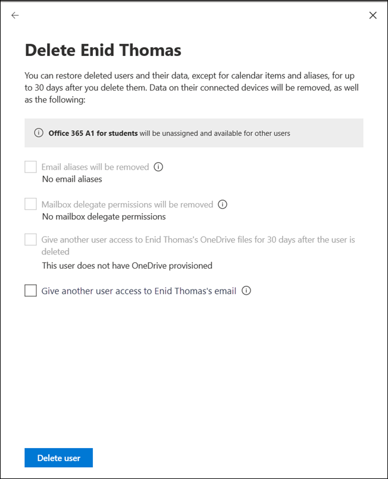

# Nyheter i administrationscentret för Microsoft 365

::: moniker range="o365-21vianet"

> [!NOTE]
> En del av informationen i den här artikeln kanske inte gäller för Office 365 som drivs av 21Vianet.

::: moniker-end

Vi lägger kontinuerligt till nya funktioner [i Microsoft 365-administrationscentret,](microsoft-365-admin-center-preview.md)åtgärdar problem som vi lär oss om och gör ändringar baserat på din feedback. Ta en titt nedan för att se vad som finns tillgängligt för dig idag. Vissa funktioner rullas ut i olika hastigheter till våra kunder. Om du inte ser någon funktion ännu [kan du prova att lägga till dig själv i riktad version](manage/release-options-in-office-365.md).

> [!IMPORTANT]
> **"Classic" admin center pensionering med början i mars**  
När du loggar in på administrationscentret för Microsoft 365 går du nu till det nya administrationscentret varje gång. Och i mars började vi inaktivera möjligheten att byta tillbaka till det klassiska administrationscentret. För nu kan du fortfarande växla tillbaka, men som det nya admin-centret kommer till paritet (och överstiger det) kommer vi att stänga av växeln för alla organisationer.    *Senast uppdaterad: 11 maj 2020*

Och om du vill veta vad som är nytt med andra Microsoft-molntjänster:

- [Nyheter i Azure Active Directory](https://docs.microsoft.com/azure/active-directory/fundamentals/whats-new)
- [Nyheter i administrationscentret för Exchange](https://docs.microsoft.com/Exchange/whats-new)
- [Nyheter i Microsoft Intune](https://docs.microsoft.com/mem/intune/fundamentals/whats-new)
- [Nyheter i Microsoft 365 compliance center](https://docs.microsoft.com/Office365/SecurityCompliance/whats-new)
- [Nyheter i Microsoft Hotskydd](https://docs.microsoft.com/microsoft-365/security/mtp/whats-new)
- [Nyheter i administrationscentret för SharePoint](https://docs.microsoft.com/sharepoint/what-s-new-in-admin-center)
- [Office-uppdateringar](https://docs.microsoft.com/OfficeUpdates/)

## Maj 2020

### Ny uppdateringskanal för Office

Den 12 maj meddelade vi att det finns en ny uppdateringskanal för Office: Monthly Enterprise Channel. Den här uppdateringskanalen ger användarna nya Office-funktioner en gång i månaden, den andra tisdagen i månaden.

Om du tillåter användarna att själv installera Office från portalen kan du välja Månadsvis företagskanal för dem. Det gör du genom att logga in på administrationscentret för Microsoft 365 och gå till **Visa alla**inställningar  > **Settings**  >  **Hämtningsinställningar**  >  **För**  >  **Office-programhämtningsinställningar .** Om du väljer **En gång i månaden (Monthly Enterprise Channel)** konfigureras alla nya självinstallationer av Office för att använda Monthly Enterprise Channel.

I samband med lanseringen av Monthly Enterprise Channel reviderar vi även namnen på de befintliga uppdateringskanalerna. Månadskanal byter till exempel namn till Aktuell kanal. De nya namnen träder i kraft den 9 juni 2020.

Mer information finns i [Ändringar i uppdateringskanaler för Microsoft 365 Apps](https://docs.microsoft.com/DeployOffice/update-channels-changes).

### Nya administratörsroller

Vi har lagt till några nya Azure Active Directory-administratörsroller i Administrationscentret för Microsoft 365.

- Hybrid identitetsadministratör roll ger användarna behörighet att hantera molnetablering och autentiseringstjänster.
- Med rollen Nätverksadministratör kan användare hantera nätverksplatser och granska nätverksinsikter för Microsoft 365 Software as a Service-appar.
- Rollen skrivaradministratör ger behörighet att hantera alla aspekter av skrivare och skrivaranslutningar.
- Skrivarteknikern är en delmängd av rollen Skrivaradministratör där dessa användare kan registrera och avregistrera skrivare och uppdatera skrivarstatus.
Mer information om dessa roller finns i [Om administratörsroller](https://docs.microsoft.com/microsoft-365/admin/add-users/about-admin-roles).

### Lista över exportgrupper

Vi har hört från många administratörer att de behöver dela information om grupper och deras användning till personer som inte har åtkomst till administratörscentren. Du kan nu exportera grupplistan till en CSV-fil för granskningsändamål, vilket innebär att du kan kasta ut det gamla PowerShell-skriptet. Prova det går du **Groups**till  >  **Gruppergrupper**och väljer sedan **Exportera grupper** i kommandofältet.

### Microsoft 365-center för lösningar och arkitektur

Just den här månaden släppte vi en ny webbplats på [https://docs.microsoft.com](https://docs.microsoft.com) microsoft [365-lösnings- och arkitekturcenter](https://docs.microsoft.com/microsoft-365/solutions/solution-architecture-center), som samlar den tekniska vägledning du behöver för att förstå, planera och implementera integrerade Microsoft 365-lösningar för säkert och kompatibelt samarbete. I det här centret hittar du:

- Vägledning för grundläggande lösning
- Arbetsbelastningslösningar och scenariovägledning
- Lösnings- och arkitekturillustrationer (Affischerna!!!)
- Branschspecifik vägledning
- Huvudmän för företagsarkitekturdesign

### Dokument, utbildning och videor

- **Nyheter i Microsoft 365 videoserie:** Den här månaden täcker vi den nya supportupplevelsen i Teams admin och Security and Compliance Centers, Planner-integrering med Message Center och den nya 3x3-videolayouten i Microsoft Teams. [Nyheter i Microsoft 365](https://go.microsoft.com/fwlink/p/?linkid=2118096)
- [Hjälphubben för administrationscentret för Microsoft 365](https://docs.microsoft.com/microsoft-365/admin/) har uppdaterats så att du snabbare kan hitta det du behöver. Och om du går titta på den sidan just nu, har vi lagt till ett kort för att informera dig om viktiga uppdateringar och ändringar.

## April 2020

### Hantering av Intune-roller

[April 2020](#april-2020)

Vi klarade det! Vi har tagit det andra steget mot en enhetlig rollupplevelse och du kan nu hantera Intune-roller i Microsoft 365-administrationscentret. Du kan också utnyttja funktioner som möjligheten att söka efter roller och visa rollbehörigheter. Det innebär att du inte behöver två separata verktyg för att hantera roller för Microsoft 365 och Intune. När du loggar in på administrationscentret för Microsoft 365 ser du att det finns två pivoter på sidan Roller, en för Azure AD och en för Intune.

:::image type="content" source="../media/MAC-WN-IntuneRoles.png" alt-text="Sidan Roller med intune-pivoten markerad":::

### Synkronisera inlägg i Meddelandecenter till Planner

Från och med maj, administratörer som är i Riktad release kommer att börja se "Planner synkronisering" knappen i meddelandecentret. Du kan nu spåra meddelanden som behöver åtgärd, välja vilken typ av meddelanden du vill spåra, tilldela meddelanden att spåra som uppgifter och tagga meddelanden för senare uppmärksamhet.

[Gå med riktad release](manage/release-options-in-office-365.md) för att komma igång!

### "Behöver du hjälp?" lanserades i Teams administrationscenter & säkerhets- och efterlevnadscenter

Administrationscentret Teams, säkerhetscentret och efterlevnadscentret använder nu samma "Behöver du hjälp?" som microsoft 365-administrationscentret använder för att hitta hjälp och kontakta support. Vi har fått mycket feedback från administratörer som du ville ha samma nivå av hjälp och support och vi är glada att få det till dig. Prova det och ge oss din feedback!

#### Behöver du chatta?

Våra supportagenter har arbetat hemifrån samtidigt som de tar kundfall och begränsningar på internetbandbredd medan du arbetar hemifrån kan påverka kundernas samtalskvalitet. För att fortsätta stödja dig har vi lanserat livechattsupportalternativ för kommersiella kunder i Microsoft 365 admin center.

När du skapar en tjänstförfrågan ser du nu chatt som ett alternativ, förutom telefon och e-post. Välj chatt som en önskad kommunikationskanal och skapa begäran. När du har skapat begäran kan du starta chatten när du är redo att chatta med Microsoft-agenter.

### Uppdateringar av team

Med den ökade användningen av Teams har vi lagt till några funktioner som hjälper dig att hantera dem.

- Ett nytt rekommendationskort på startsidan för administrationscentret visar vilka användare som inte aktivt har använt Teams på 30 dagar. Du kan skicka ett utbildningsmeddelande till dessa användare för att komma igång med Teams.
- **Samla personer med team:** Gå till **installationsprogrammet** för att se en ny sida som hjälper dig att aktivera Teams för licensierade användare och ge gäståtkomst, så att du kan arbeta med externa kunder i Teams.
- Ett Microsoft Teams-kort fästs nu som standard på startsidan. Den visar om Teams är aktiverat och om gäståtkomst är tillåten. Du kan också kontrollera inställningsstatusen för nyligen licensierade Teams-användare och kontrollera om nätverksproblem kan påverka Teams-användare.
- Slutligen är Teams nu ett steg i det första inrättandet av flödet om du har köpt en licens som innehåller Teams.

### Produktivitetspoäng

Produktivitetspoäng ger insikter om hur användarna använder Microsofts molntjänster och de teknikupplevelser som stöder dem. Poängen återspeglar organisationens resultat mot mått på medarbetar- och teknikupplevelse och jämför dina poäng med organisationer som din. Den här månaden introducerar vi följande nya koncept för förhandsversionen:

- Trendvy över primära insikter på startsidan och kategoriinformationssidor -Endpoint Analytics och Nätverksanslutningskategorier som lagts till i Teknikupplevelsen
- Relevant insight för teknikupplevelse som visas i kategorier för medarbetarupplevelse
- Kategorin Ny kommunikation som en del av medarbetarerfarenhet
- Användarinformation med organisationsmetadata i kategorier med medarbetare

Om du vill veta mer kan du kolla in bloggen: [Mät och förbättra Microsoft 365-upplevelsen med Microsofts produktivitetspoäng](https://techcommunity.microsoft.com/t5/microsoft-365-blog/measure-and-improve-the-microsoft-365-experience-with-microsoft/ba-p/1348618). Produktivitetspoängen är för närvarande i privat förhandsversion. [Gå med i den privata förhandsversionen av produktivitetspoängen](https://aka.ms/productivityscorepreview) för att komma igång.

### Gruppera uppdateringar

Vi har två uppdateringar för grupper den här månaden:

- Du kan nu redigera e-postadresser för Office 365-grupper (Kallas även grupper i Outlook och snart kallas Microsoft 365-grupper).
- Vi har hört din feedback och vi har lagt till tydligare felmeddelanden för varför du inte kan konvertera en grupp till ett Microsoft-team.

### Dokument, videor och utbildning (april)

**Nyheter i Microsoft 365-videoserien**: Den här månaden täcker vi tips och resurser för att hjälpa småföretag att gå över till fjärrarbete, inklusive hur du distribuerar Microsoft Teams, utbildningsresurser för fjärrarbete för att hålla kontakten med kunder och partner och den nya Microsoft 365 Business Voice-planen. [Nyheter i Microsoft 365](https://go.microsoft.com/fwlink/p/?linkid=2118096)

#### För dina användare

- [Schemalägga ett möte](https://support.microsoft.com/office/c61b4f61-ee62-4a06-8bf7-0a1cd302700a)
- [Gå med i ett Teams-möte](https://support.microsoft.com/office/078e9868-f1aa-4414-8bb9-ee88e9236ee4)
- [Skapa ett organisationsomfattande team](https://support.microsoft.com/office/037bb27a-bcc9-48fe-8d72-44d9482420a3)
- [Skapa ett team med gäster](https://support.microsoft.com/office/11fbb083-52ee-434d-8c6e-63711fdafac7)
- [Gå med i ett team som gäst](https://support.microsoft.com/office/928d1eef-61e2-49ec-b754-c2fe86b34824)
- [Skapa en grupp-e-postadress](https://support.microsoft.com/office/ded875f9-a9de-437f-b559-2ae4f235bb2b)

#### För administratörer och företagare

- [Ge ditt småföretag ett distansarbete](https://support.microsoft.com/office/9b91a85a-39b4-40a6-a590-0f9bea0ba8e6)
- [Driva ett litet avlägset företag](https://support.microsoft.com/office/9ac1a0f1-789b-4143-b954-5821d5d89298)
- [Registrera dig för Microsoft Business Basic](https://support.microsoft.com/office/9ac1a0f1-789b-4143-b954-5821d5d89298)
- [Ställa in inloggning med två faktorer](https://support.microsoft.com/office/9ac1a0f1-789b-4143-b954-5821d5d89298)

## Mars 2020

### Dagens Feedback Fix: Förbättra "lägg till användare" tillförlitlighet för licensiering

Vi fick mycket feedback från administratörer om hur svårt det är att tilldela licenser när du lägger till användare. Vi har gjort den första uppdateringen av den här korrigeringsfilen och vi har migrerat till en mer tillförlitlig tjänst bakom kulisserna för att bearbeta dessa begäranden. Och om något går fel får du nu ett felmeddelande som gör att du kan försöka igen.

:::image type="content" source="../media/MAC-WN-ImprovedLicensing.png" alt-text="Lägg till sidan med användarbekräftelse med felet.":::

### Startsidakort för Microsoft Teams

Med uptick i Teams användning, vissa organisationer kommer att få en fäst instrumentpanel kort som gör att slå teams på mer upptäckbara. Kortet har också länkar till utbildning och dokument för att hjälpa din organisation övergången till fjärrarbete. Gå bara till **hemsidan** för att se det nya kortet.

:::image type="content" source="../media/MAC-WN-TeamsCard.PNG" alt-text="Startsidakort för Microsoft Teams":::

### Anpassa organisationens SharePoint-mobilapptema

Med hjälp av administrationscentret för Microsoft 365 kan du nu anpassa organisationens tema i SharePoint-mobilappen för iOS och SharePoint-mobilappen för Android. Den här funktionen ger bekvämt en mobil intranätappupplevelse som kan matcha din SharePoint Online för anställda när de är på språng. Temaanpassning omfattar logotypbilden, navigeringsfältets färg, text- och ikonfärger samt accentfärger, vilket gör det enkelt att igenkänna.

:::image type="content" source="../media/MAC-WN-CustThemeSP.png" alt-text="Diagram som mappar administratörscenterinställningarna till mobilappen.":::

### Förbättringar av guiden Lägg till en grupp

När administratörer skapade en ny grupp – och gjorde den till ett team samtidigt, kan de tilldela ägare som inte har en licens som innehåller Teams. Och det skapade lite huvudvärk. Vi har uppdaterat guideflödet för att verifiera att ägare har en Teams-licens och om de inte gör det för att göra gruppen till ett team är inaktiverat.

### Microsoft 365-erbjudanden för små och medelstora företag

Vi vet att detta är ett tillkännagivande för nästa månad, men vi vill se till att du är förberedd.

Från och med den 21 april gör vi ändringar relaterade till våra Office 365-prenumerationer för små och medelstora företag – och till Office 365 ProPlus. Dessa produkter kommer nu att använda varumärket Microsoft 365.

De nya produktnamnen träder i kraft den 21 april 2020. Detta är en ändring av produktnamnet bara, och det finns inga pris- eller funktionsändringar just nu.

|Aktuellt namn |Nytt namn  |
|---------|---------|
|Office 365 Business Essentials     |   Microsoft 365 Business Basic      |
|Office 365 Business Premium     |    Microsoft 365 Business Standard     |
|Microsoft 365 Business     |    Microsoft 365 Business Premium     |
|Office 365 Business     |    Microsoft 365-applikationer för affärsverksamhet       |
|Office 365 ProPlus    |   Microsoft 365-appar för företag      |

### Videor, utbildning och dokument

[Nyheter i Microsoft 365 webbserie:](https://go.microsoft.com/fwlink/p/?linkid=2118096)I den här månadens avsnitt lyfter vi fram 3-årsjubileet av Microsoft Teams och täcker nya funktioner, inklusive förbättrad ljudkvalitet i onlinemöten, riktad kommunikation för förstalinechefer med Shifts-appen, Teams och Skypes konsumentinteroperabilabilabilabila sig med mera.

## Februari 2020

### Dagens Feedback Fix: Flera organisationer switcher

Vi fick mycket feedback från partner och administratörer om utmaningarna med att hantera flera Microsoft-molnorgan. En av våra första multi-org hanteringsfunktioner är **organisationen switcher**, som låter dig ändra mellan de orgörer som du hanterar på bara 2 klick.
> [!TIP]
> Du behöver inte göra något för att göra organisationen växlare visas så länge du är partner för posten för minst en organisation.

1. Välj organisationsnamnet i administrationscentret för Microsoft 365.

2. Välj den organisation som du vill hantera i organisationsväxeln.

Det är bokstavligen det!!!

### Grupper

Ett par förändringar i gruppen området denna månad:

- **Sortera efter gruppnamn**: Du kan sortera grupplistan alfabetiskt genom att välja kolumnen **Gruppnamn.**
- **Återställ borttagna Microsoft 365-grupper**: Du behöver inte längre gå till Administrationscentret för Exchange för att återställa borttagna Microsoft 365-grupper. Gå till **Microsoft 365 admin center** \> **Grupper** \> **borttagna grupper** \> (välj en grupp i listan) \> **Återställ grupp**. Gruppen återställs till listan **Grupper** och återställer gruppens e-post, konversationer, anteckningsbok, filer och kalender.

### Videor, utbildning och dokument (februari)

- **Nyheter i Microsoft 365-videoserien**: Den här månaden fokuserar vi på anpassade sökfunktioner för SharePoint Online, hanteringsfunktionen "Nyheter" för Office som gör att du kan visa eller dölja specifika funktioner från slutanvändare via hjälpfönstret i appen, de senaste säkerhets- och efterlevnadsuppdateringarna i Yammer med mera. Här är det senaste avsnittet: [Nyheter i Microsoft 365](https://go.microsoft.com/fwlink/p/?linkid=2118096)

- **Dokument flytta:** Vi kombinerade webbartiklarna för Office 365-administratörer med Microsoft 365-innehållet och du kanske har märkt den nya webbadressen. Den här artikeln användes till exempel på: **docs.microsoft.com/Office365/Admin/whats-new-in-preview**, men webbadressen är nu: **docs.microsoft.com/microsoft-365/admin/whats-new-in-preview**. Om du har bokmärkta sidor bör du uppdatera dina länkar. Innehållslänkar omdirigeras dock till den nya innehållsreporäntan.

## Januari 2020 - Gott Nytt År

> [!NOTE]
> Visste du att det finns en [Vad är nytt i Microsoft 365](https://go.microsoft.com/fwlink/p/?linkid=2118096) videoserie på YouTube? Den belyser de senaste funktionerna som vi har distribuerat till användarna. Varje månad börjar vi länka till det senaste avsnittet i avsnittet [Videor, utbildning och dokument.](#videos-training-and-docs)     Här är det senaste avsnittet: [Nyheter i Microsoft 365](https://go.microsoft.com/fwlink/p/?linkid=2118096)

### Mörkt läge

När vi först rullade ut mörkt läge, var det bara tillgänglig på hemsidan. Mörkt läge är nu på förhandsvisning och är i Riktad utgåva över de flesta sidor i administrationscentret.

1. Först måste du aktivera Inställningar För att **Settings** släppa in en \> **Settings** \> **Organization profile** \> **profilversion**.
1. Och sedan slå på mörkt läge, gå till **startsidan** och välj sedan knappen **Mörkt läge.** (Det är **bredvid sökfältet** och den här artikeln är **Vad är ny** länk.)
1. För alla sidor som har mörkt läge tillgängligt är knappen högst upp på sidan bredvid **Det nya administrationscentret.**

### Office Nyheter-hantering

Administratörer vill ha kontroll över hur Microsoft kommunicerar "Nyheter" till sina användare i Office-apparna – och du har nu den kontrollen. Gå till **Inställningar** \> **Office Nyheter Management Preview**. Välj en funktion för att visa dess information, och sedan kan du välja knappen **Dölj från användare** om du inte vill att användarna ska se ett visst "nyheter"-meddelande. Din organisation kanske till exempel väntar på att få veta om en funktion tills alla i organisationen har tränats på den.

Den här funktionen släpptes först för att förhandsgranska i november, men det har gjorts några funktionsuppdateringar som du bör känna till om: [Office What's New management preview uppdateringar nu tillgängliga](https://techcommunity.microsoft.com/t5/microsoft-365-blog/office-what-s-new-management-preview/ba-p/1020438)

### Partner

Tjena, Partners! (Kunde inte hjälpa mig själv.) Vi har en uppdatering för dig den här månaden också. Det finns en ny funktion som gör det möjligt för partner att ge CSP-kunder möjlighet att acceptera sitt Microsoft-kundavtal (MCA) i avsnittet **Faktureringskonton** i administrationscentret. I denna nya erfarenhet:

1. Kunden får ett e-postmeddelande med en länk för att acceptera partnerrelationen och MCA.
2. När kunden har loggat in kan de visa och acceptera MCA- och partnerbehörigheterna – direkt från administrationscentret.

### Resurspostlådor

Listan Resurspostlådor har uppdaterats till det nya formatet. Gå till **Resources** \> **Resursrum & utrustning i**administrationscentret för Microsoft 365 .

### Videor, utbildning och dokument (januari)

Kolla in small business admin utbildning som vi släppte i januari:

- [Skapa din företagswebbplats](https://support.microsoft.com/office/3325d50e-d131-403c-a278-7f3296fe33a9)
- [Hitta svar och hjälp](https://support.microsoft.com/office/7f681212-c649-4a3e-a43b-32b1d1e58988)
- [Få hjälp eller support](https://support.microsoft.com/office/18948a4c-3eb1-4b30-b1bc-a4cc29eb7655)
- [Ta bort en användare](https://support.microsoft.com/office/6bcdad7b-732a-4260-997a-8c176bc3d9d6)
- [Välj en Microsoft-prenumeration](https://support.microsoft.com/office/b9f7c78e-430f-4117-89ec-2eeb1dced2ca)
- [Översikt över Microsoft 365 för företagssäkerhet](https://support.microsoft.com/office/3274b159-a825-46d7-9421-7d6e209389d1)

## November och december 2019

Vi kombinerar november och december nyheter eftersom efter Ignite vi hade mycket få meddelanden att göra. Vi ses i det nya året!

### Ändra från kreditkort till fakturabetalning

Vi har börjat distribuera möjligheten att ändra din betalningsmetod från kreditkort till en faktura. Gå till **Fakturering** \> **Dina produkter,** välj en prenumeration och välj sedan länken **Redigera** bredvid kreditkortsbetalningen.

Vill du läsa mer om det? [Ändra från kreditkort eller bankkonto till faktura](../commerce/billing-and-payments/change-payment-method.md)

### Global läsare

Vi nämnde den globala läsarrollen i [oktober 2019 - Ignite Edition](#october-2019---ignite-edition), men eftersom det rullar ut mer allmänt, låt oss diskutera några detaljer:

- Rollen Global läsare är den skrivskyddade motsvarigheten till rollen Global administratör. Den globala läsaren kan se allt som den globala administratören har behörighet att göra.
- Med några få undantag, till exempel vissa efterlevnads- och säkerhetsfunktioner, har globala läsare åtkomst till alla Microsofts molnadministrationscenter som din organisation har licens att använda.
- Tilldela rollen Global läsare till användare som behöver den för planering, granskningar och undersökningar.
- Du kan också kombinera den globala läsarrollen med en annan roll som har färre behörigheter. En småföretagare kan till exempel tilldelas rollerna **För global faktureringsadministratör**  +  **global** så att de kan betala räkningarna och hålla koll på ändringar i sin molnorganisation.
- Globala läsare kan gå till vilken sida som helst i administrationscentret för Microsoft 365. När de öppnar en redigerbar sida visas en varning högst upp där de säger att de inte har behörighet att spara ändringar och att spara-knappen inaktiveras.

Vi vill gärna få din feedback om den globala läsarrollen och någon av de rollbaserade behörigheter som du vill se i framtiden. [Ge feedback för rollbaserade behörigheter](https://office365.uservoice.com/forums/273493-office-365-admin/suggestions/10115430-have-a-consistent-experience-when-assigning-admin)

### Sidan Nya inställningar

**Organisationsprofilen** **Security & sekretess**och **&-tilläggssidorna för tjänster** har alla kombinerats till en sida med tre lodräta flikar. Och det bästa - från en enda plats, kan du nu söka efter alla inställningar.

### Utbildning & Docs

Detta avsnitt är en ny funktion i den här artikeln, där vi börjar länka till ny utbildning och dokumentation som vi tror att du kommer att finna intressant.

I november släppte vi en hel del utbildningsvägar till [Microsoft Learn](https://docs.microsoft.com/learn/) webbplats för att hjälpa IT-proffs lära sig om och få utbildning på Microsoft 365. Kolla in dem:

- [Grunderna i Microsoft 365](https://docs.microsoft.com/learn/paths/m365-fundamentals/)
- [Utöka grunderna i Office](https://docs.microsoft.com/learn/paths/extend-office-fundamentals/)
- [Microsoft 365 – Modernisera företagsdistributionen med Windows 10 och Microsoft 365 Apps för företag](https://docs.microsoft.com/learn/paths/m365-getmodern/)
- [Hantera företagsdistributionen med Microsoft 365](https://docs.microsoft.com/learn/paths/manage-enterprise-deployment-m365/)
- [Uppgradera Microsoft Office för IT i stor skala](https://docs.microsoft.com/learn/paths/m365-office-for-it/)
- [Leverera fjärrskrivbord och appar från Azure med Windows Virtual Desktop](https://docs.microsoft.com/learn/paths/m365-wvd/)
- [Modernisera din arbetsplats med Microsoft 365 och Surface for Business](https://docs.microsoft.com/learn/paths/modernize-workplace-with-m365-and-surface/)
- [Skydda identitet och åtkomst med Microsoft 365](https://docs.microsoft.com/learn/paths/m365-identity/)
- [Skydda företagsinformation med Microsoft 365](https://docs.microsoft.com/learn/paths/m365-information-protection/)
- [Hantera säkerhet med Microsoft 365](https://docs.microsoft.com/learn/paths/m365-security-management/)
- [Försvara dig mot hot mot Microsoft 365 och Microsofts hotskydd](https://docs.microsoft.com/learn/paths/m365-security-threat-protection/)
- [Hantera samarbete med Microsoft Teams](https://docs.microsoft.com/learn/paths/m365-manage-team-collaboration/)
- [Samarbeta med SharePoint i Microsoft 365](https://docs.microsoft.com/learn/paths/m365-teams-sharepoint/)

## Oktober 2019 - Ignite Edition

Välkommen till Ignite Edition av Nyheter i Microsoft 365 admin center! Naturligtvis är detta inte en komplett lista över meddelanden, men här är några höjdpunkter. Kolla också in Ignite bloggar för mer bra info om utgåvor:

- [ADMIN – Säkerhets-, produktivitets- och nätverksförbättringar för Microsoft 365](https://techcommunity.microsoft.com/t5/Microsoft-365-Blog/ADMIN-Security-Productivity-and-Network-Enhancements-for/ba-p/964019).
- [Nyheter i Microsoft Teams - Ignite 2020](https://techcommunity.microsoft.com/t5/Microsoft-Teams-Blog/What-s-New-in-Microsoft-Teams-Ignite-2019/ba-p/937025).

### Rollbaserad åtkomstkontroll

Det har skett en hel del förändringar för roller i admin center sedan vi började rulla ut i juni:

- **Jämför roller** - Välj upp till tre roller för att jämföra behörigheterna för var och en. Detta hjälper dig att hitta den minst tillåtande roll att tilldela till användare. Gå till **Roller,** använd kryssrutan flera markerar i den första kolumnen för att välja upp till tre roller och välj sedan **Jämför roller**.

    

- **Favoriter** - Du kan lägga till en stjärna i dina favorit- eller mest använda roller, så att du enkelt kan hitta dem genom att sortera kolumnen eller skapa ett filter.
- **Aktiva användare**  >  **Hantera roller** - Detta har uppdaterats för att anpassa sig till ändringarna i Roller. Precis som med listan Roller har vi scoped standardlistan med roller till de mest användbara, men du kan se alla roller genom att expandera **Visa alla efter kategori**.
- **Global läsare roll** - Du bad om det! Du har det! Den [globala läsaren](add-users/about-admin-roles.md) roll!

### Rapportera ett problem

Tjänstens hälsotillstånd har uppdaterats till det nya formatet och om du påverkas av ett problem som inte visas på instrumentpanelen för tjänstens hälsotillstånd kan du **rapportera ett problem** så att Microsoft vet. Gå **Health**till  >  **hälsotjänstens hälsa**.

### "Viral" abonnemang

Som du vet kan användare aktivera kostnadsfria prenumerationer på en myriad av produkter som Power BI och App Connect. Du kan nu se de "virala prenumerationer" som användarna har försökt med. Gå till **Fakturering**  >  **Dina produkter**. Välj filtret **Kontotyp** på fliken Prenumerationer om du vill visa de användarköpta prenumerationerna. Om det behövs kan du nu ta bort dessa prenumerationer från ditt konto.

### Användarmallar

Med mallar kan du enkelt lägga till många användare genom att spara och återanvända de delade inställningarna för dessa användare. Du kan spara värden för roller, tilldelade licenser, kontaktinformation, plats med mera. När du använder mallen för att skapa en ny användare får de automatiskt det sparade värdet för dessa inställningar. Gå **Users**till  >  **Aktiva användare**och välj sedan **Användarmallar** för att prova det.

### Office "Nyheter" hantering (Preview)

När en viktig Office-funktion släpps till ett Office-program får användarna ett "Nyheter"-kort för att lära sig mer om den nya funktionen. Om du inte vill att användarna ska se kortet kan du dölja det. Du kan också välja när du vill att användarna ska se kortet genom att visa det. Gå till **Inställningar**  >  **Office Nyheter-hantering** för att kolla upp det.

### Ändring av SharePoint-URL

Tekniskt sett är detta inte Microsoft 365 admin center nyheter att berätta, men vi är så glada att vi ville se till att du ser dessa nyheter:
> [!IMPORTANT]
> Nu kan du komma till administrationscentret för SharePoint med en vanlig WEBBADRESS:[https://admin.microsoft.com/SharePoint](https://admin.microsoft.com/SharePoint)

Mer information finns [i Nyheter i Administrationscenter för SharePoint](https://docs.microsoft.com/sharepoint/what-s-new-in-admin-center).

## September 2019

Vi ökar för några spännande funktionsreleaser på Ignite 2019, så vi presenterar bara några nya funktioner som släpptes i september. Men håll ögonen öppna för nästa månads artikel, kommer det att publiceras på den första dagen av Ignite!

### Dagens Feedback Fix - Alternativet att konvertera den borttagna användarens postlåda till en delad postlåda är tillbaka

Vi hörde din feedback högt och tydligt och vi tog tillbaka möjligheten att ge någon annan tillgång till en raderad användares brevlåda genom att konvertera den till en **delad brevlåda.** Om du lägger tillbaka det här i guiden ta bort användare kan du bestämma vad du ska göra med data:

- E-post: Ge någon annan åtkomst till den borttagna användarens postlåda genom att konvertera den till en delad postlåda.
- Filer: Spara deras OneDrive-filer och ge någon annan åtkomst.
- Behörigheter: Ta bort behörigheter om andra har åtkomst till den här postlådan.
- Alias: Ta bort e-postalias så att de kan användas för en annan användare direkt.

### Inledande installation

Det har skett en uppdatering av en annan av våra första installationsguider: Microsoft 365 för företag. Stegen har effektiviserats och vi har flyttat två av de inställda uppgifterna till inställningssidan:

- **Säkra Windows 10-datorer** – konfigurera principer för att bättre skydda dina Windows 10-enheter från virus, skadlig kod och attacker från hackare.
- **Installera Office automatiskt** – När du aktiverar detta och användarna har anslutit sina datorer till Microsoft 365 Business uppdateras deras datorer automatiskt till de senaste Office-programmen – och håller dig uppdaterad.

## Augusti 2019

### Fakturering

Vi har några uppdateringar för fakturering och prenumerationer den här månaden:

- Enhetsbaserade prenumerationer: Du kan tilldela eller ta bort tilldelning av **Microsoft 365 Apps for Education -licenser (enhet)** till enheter i Microsoft 365-administrationscentret. **Microsoft 365 Apps for Education (enhet)** är en tilläggslicens som gör att du kan tilldela en licens till en enhet. Gå till **Fakturering**  >  **Dina produkter** för att hitta och köpa licensen.
- Användarbaserad licenshantering: Vi har uppdaterat hur du tilldelar licenser i **Aktiva**  >  **användare** till det nya formatet. Mer information finns i:
  - [Tilldela licenser till användare](manage/assign-licenses-to-users.md)
  - [Ta bort tilldelningen av licenser från användare](manage/remove-licenses-from-users.md)

### Uppdateringar av installationssidan

Installationsprogrammet har nu kategorier och avsnitt, inklusive avsnittet **Rekommenderas för dig** där vi på ett intelligent sätt föreslår nästa steg när det gäller att aktivera funktioner och konfigurera din organisation. Vi har också lagt till en ny funktion för att konfigurera:

- **Office Advanced Threat Protection** – Om din organisation har licens att använda Office ATP och du inte har konfigurerat den eller aktiverat den ännu visas den här sidan. Gå till **installationsprogrammet** för att prova det.

### Rapportera ett problem (augusti)

Om du påverkas av ett problem som inte visas på instrumentpanelen för tjänstens hälsa, kommer funktionen **Rapportera ett problem** att ge dig ett snabbt och enkelt sätt att meddela oss. Gå **Health**till  >  **hälsotjänstens hälsa**.

## Juli 2019

### Meddelandecenter

Meddelandecentret har uppdaterats till den nya designen och det ser fantastiskt ut!

- Du kan nu visa **meddelanden efter status**. Välj bara en av flikarna: **Alla aktiva meddelanden,** **Hög prioritet,** **Olästa meddelanden**och Avvisade **meddelanden**.
- Du kan också filtrera efter kategori **Datasekretess,** **Planera för ändring,** **Förhindra eller åtgärda problem**och Håll dig **informerad** om meddelandekategorier.
- Markera ett meddelande i listan och du har några alternativ i kommandofältet: **Stäng**, **Markera som läst** eller Markera som **oläst**eller **Dela**.
- Och när du öppnar ett meddelande har du ännu fler alternativ:
  - Kopiera en länk till meddelandet till Urklipp för att spara det till senare eller dela det med kollegor.
  - Markera meddelanden som **lästa** eller **olästa**.
  - Ge feedback om ett meddelande genom att välja **Gilla** eller **Ogilla**, ett feedbackfönster öppnas där du uppmanas att ge specifik feedback om vad du gillade eller inte gillade med det här meddelandet.

### Intelligens för navigeringsfönstret

 Navigeringsfönstret kommer nu ihåg dina senaste åtgärder och visar fönstret i det senaste läget som du lämnade det i. Det kommer också att göra ofta använda objekt synliga som standard.

### Inledande inställningar & sidan Inställningar

Vi har några spännande förändringar som hjälper dig att konfigurera din organisation. Först och främst, låt oss diskutera skillnaden mellan **inställning** och **inställningssidan**. **I installationsprogrammet** hänvisas till den första installationsguiden som du använde för att läsa in dem i Microsofts onlinetjänster. Det innehåller vanligtvis tre specifika steg: **Anslut en domän,** **Lägg till användare**och Ladda ned **Office-programmen**. **Inställningssidan** är den sida i administrationscentret som har rekommenderat att konfigurera uppgifter för att säkerställa att du får ut mesta av dina prenumerationer , som att aktivera funktioner som du har köpt licenser för.

- **Installationsprogrammet** – Den första installationsguiden har uppdaterats för **Microsoft 365 för** företagsprenumerationer. Den här nya designen hjälper nya organisationer att ta sig igenom guiden snabbare och med större framgång.
- **Inställningssida** - På **inställningssidan** kan du slutföra konfigurationen och säkra de tjänster som med sig med dina prenumerationer. Du kan också se avvisade rekommendationer på **inställningssidan.** Om du vill se om den är tillgänglig för dina prenumerationer ännu går du till installationsprogrammet för **Microsoft 365 admin center**  >  **Setup**.

### Fakturering & prenumerationer

- **Produkttyp** för programvara - Du kan nu visa programvaruprodukter som köpts via en Molntjänstleverantör (CSP). Om du vill se dina nedladdningar och nycklar går du till fliken **Fakturering**  >  **av dina**  >  **produkter.**
- Du kan visa Moderna Azure-produkter och -tjänster från Microsoft 365-administrationscentret, oavsett om du har köpt dem från Microsoft eller en tredjepartsleverantör. Exempel på moderna Azure-produkter ingår:
  - Reserverade virtuella instanser i Azure
  - Azure-supportplaner
  - Fördelar för Azure Hybrid-användning (AHUB)
  - Hantera program
  - Enhetstjänster
  - Azure-prenumerationer

### Förenkla multifaktorautentisering

Administratörer har åtkomst till känslig information i organisationen. Kräv att alla administratörer använder multifaktorautentisering när du loggar in. Den nya guiden hjälper dig att få det gjort med bara ett steg. Prova det genom att **Setup**gå till  >  **Installationsprogrammet För att stärka inloggningssäkerheten**.

### Användare

**Sidorna Borttagna användare** och **gästanvändare** har uppdaterats till det nya formatet.

- **Gästanvändare**: Du lägger till gästanvändare genom att bjuda in dem att visa eller dela filer från SharePoint eller OneDrive. Du kan visa gästanvändare från **Användare**  >  **Gästanvändare**.
- **Borttagna användare**: På den uppdaterade sidan **Borttagna användare** kan du utföra alla åtgärder som du kan i det äldre administrationscentret, men nu lägger du till och tar bort kolumner. Och vi har många kolumnalternativ att välja mellan. I själva verket är det samma kolumner som du kan välja på sidan **Aktiva användare.**

## Juni 2019

### Begäran om erbjuden feedback - Mörkt läge

Visa admin center i mörkt läge är i förhandsgranskning! Du kan bara testa det på **startsidan** just nu. På **startsidan** finns knappen **Mörkt läge** i kommandofältet bredvid länken **Nyheter.**

### Hantering av roller

I slutet av juni började vi lansera nya sätt att hantera administratörsroller. När den är tillgänglig för **Roles**dig går du till  >  **Roller**. Tills dess, ta en titt - det är häftigt!
    

Den här nya upplevelsen gör det enklare att se vem som har administratörsbehörighet och tilldela roller som ger rätt åtkomstnivå till administratörerna. Och vi har också lagt till fler roller från Azure AD så att du inte slösar tid på att gå till flera administrationscenter.
Vad mer kan du göra här?

- Exportera en lista över alla administratörer i organisationen som har tilldelats Azure Active Directory-roller i Microsoft 365.  
- Visa alla administratörer som tilldelats en viss roll, lägg till eller ta bort administratörer från en viss roll, sök efter roller efter namn och nyckelord och lär dig mer om vad varje roll tillåter en användare att göra.
- Sök snabbt efter en viss roll och skapa filter.

### Betalningsmetod

Vi har uppdaterat hur du betalar för dina prenumerationer. Gå **Billing**till  >  **Faktureringsfakturor & betalningsmetoder**  >  **Payment methods**. Du kan se dina betalningsmetoder i en listvy. Markera ett objekt i listan om du vill ta bort det, redigera det och se enkelt vilken prenumeration som betalningsmetoden är kopplad till.

## Maj 2019

### Mays skisserat fix - Case känslighet

När du nu söker efter delade postlådor, kontakter, resurser och postlådebehörigheter behöver dina söktermer inte vara skiftlägeskänsliga.

**Användar- och grupphantering** Den här månaden uppdaterade vi **Blockera användare,** **Återställ lösenord,** **kontaktlistvy,** **listvy grupper** och gruppernas informationssidor till det nya administratörscenterformatet. **Groups**

- Med den nya **grupplistevyn** får du rikare data om dina grupper och du kan anpassa hur du ser dina data – och grupplistan kommer ihåg hur du vill se dina data. Du kan till exempel nu filtrera på **Grupper med teams** för att se om dina grupper ingår i ett team och du kan lägga till kolumnen **Teams-status.**
- Grupplistan för också med oss alla förbättringar vi gjort i listupplevelsen inom användarhantering, inklusive snabbåtgärder och det kontextuella kommandofältet.

**Rekommendationer** 
Du kan se en ny rekommendation pop-up i ditt admin center - vi har precis lagt till 4 nya. Naturligtvis ser du bara rekommendationer om vi tror att det kommer att gynna din organisation. Men vänta inte tills vi visar dig rekommendationen - du kan lägga till den från kortbiblioteket.

- **Lösenordsutgången** - Vi rekommenderar att lösenord ställs in **på Aldrig upphör att gälla**. Och om din organisation har en annan inställning kan du bara se den här rekommendationen.
- **För många globala administratörer** - Eftersom att ha för många globala administratörer är ett säkerhetshot, om du har fler än 4 globala administratörer, ser du den här rekommendationen. Vi föreslår att användarna bara får den åtkomst de behöver för att få jobbet gjort.
- **Intune enhetsskydd** – Om dina licenser innehåller Intune och vi upptäcker att du antingen inte har konfigurerat Intune eller registrerat dina enheter rekommenderar vi att du skapar en Intune-princip för att skydda organisationens filer när användare kommer åt dem från sina mobila enheter.
- **Få månatliga Office-funktionsuppdateringar** – Vi har fått feedback från våra mycket små kunder om att användarna blir lyckligare när de får månatliga Office-funktionsuppdateringar. Så om du är ett mycket litet företag och du för närvarande får dina Office-funktionsuppdateringar var sjätte månad visas den här rekommendationen.

**Inställningar**  
När det gäller inställningar har det skett en hel del förändringar. Mestadels, bara uppdatera befintliga inställningar till den nya admin center stil. När vi går framåt och lägger till nya inställningar som du aldrig har sett förut börjar vi nämna dem här. Och vi har en helhet inställning att meddela: **Modern autentisering**. Ja, det finns en ny inställning för att aktivera **modern autentisering!** Om du vill checka ut går du till **Settings**  >  **Inställningarstjänster & tillägg**  >  **Modern autentisering**.

## April 2019

Saker och ting ser bra ut för admin center. Vi har läst din feedback och förslag, svara på de flesta av dem, och verkligen ta allt du har att säga till hjärtat. Naturligtvis gör vi fortfarande arbetet för att se till att allt är upp till paritet med den gamla admin center. Och kom ihåg - när vi rullar ut nya funktioner, kanske du inte får det direkt.

### Aktuell funktion - Lägg till användare

För april presenterar vi guiden **Lägg till användare** som hjälper dig... vänta på det ... lägga till användare. Det är ett steg för steg att lägga till användarens grundläggande information som e-post och visningsnamn, tilldela en licens och en roll, lägga till deras kontaktinformation och sedan granska användarens konto innan du genomför. **Varför gjorde vi den här ändringen?** Vi hörde din feedback om att du inte gillade den nästan oändliga skriftrullen för att lägga till användare i den tidigare upplevelsen.
    

Det finns två sätt att kolla upp det:  

1. På **startsidan** väljer du **Lägg till användare** på **användarhanteringskortet.** Guiden öppnas där, så att du inte behöver navigera från något arbete du gör på **startsidan.**
2. Gå till **Aktiva**  >  **användare**och välj sedan Lägg **till användare** i kommandofältet.
  

Vi har gjort några fler ändringar i **användarhantering,** här är en snabb lista:

- Fönstret **Hantera roller** har uppdaterats till det nya formatet och är tillgängligt. Vi har också uppdaterat **användarrutorna Blockera** användare och Ta **bort användare** till det nya formatet.
- **Hantera produktlicenser** som ändrats i kommandofältet.
- Det är nu enklare att ändra en användares foto. I **Aktiva användare** väljer du en användare och **ändrar** sedan foto under bilden.

### Men vänta! Det finns mer

- Det finns en ny inställningsbanner på **startsidan** som du ser om du inte har slutfört konfigurationsstegen, till exempel lägga till en domän, lägga till användare och hämta Office-programmen.
- **Fönstret Grupplista** och information har uppdaterats till det nya formatet. Gå till **Grupper**  >  **grupper** om du vill visa ändringarna.
  - På tal om grupper har vi också lagt till en **Microsoft Teams-flik** i informationsfönstret för grupper där du kan förvandla en Microsoft 365-grupp till ett team. Om du vill "teamifiera" en grupp väljer du en Microsoft 365-grupp i listan väljer du fliken **Microsoft Teams** och sedan **skapa team**. Om gruppen redan är ett team får du en länk för att hantera den från **administrationscentret för Teams**.
  - Slutligen kan du lägga till **Teams-statusen** i **grupplistan.** Välj Välj kolumner **Choose columns**  >  **Teams-status**  >  **Spara**i kolumnrubriken .
- **Nya begränsade administratörsroller** – Vi har släppt några nya administratörsroller så att du bara kan ge användarna den åtkomst de behöver.
  - **Kaizala admin**: Användare i den här rollen har behörighet att utföra alla hanteringsuppgifter inom Microsoft Kaizala, inklusive att skapa och hantera användare i Kaizala-katalogen, hantera Kaizala-grupper, hantera åtgärdskort och anslutningsappar och skapa tjänstförfrågningar.
  - **Sökadministratör:** Användare i den här rollen har fullständig åtkomst till alla hanteringsfunktioner för Microsoft Search i administrationscentret för Microsoft 365. Sökadministratörer kan delegera rollerna Sökadministratör och Sökredigerare till användare och skapa och hantera innehåll, till exempel bokmärken, Q-&A-objekt och platser. Dessutom kan dessa användare visa meddelandecentret, övervaka tjänstens hälsotillstånd och skapa tjänstförfrågningar.
  - **Sökredigerare**: Användare i den här rollen kan skapa, hantera och ta bort innehåll för Microsoft Search i microsoft 365-administrationscentret, inklusive bokmärken, Q-&A-objekt och platser.
- Det finns en bonanza av **Billing** förändringar denna månad ...
  - Du kan nu uppdatera CVV för befintliga kreditkort utan att behöva ta bort det och lägga till den igen. Du kan uppdatera CVV genom att gå till **Bills**  >  **Betalningsmetoder**.
    - Vi har gjort det enklare att hitta dina **fakturor** och förstå eventuella faktureringsproblem som ditt konto kan ha. Och nu kan du se dina räkningar i webbläsaren istället för att behöva ladda ner PDF. Gå **Bills**till  >  **Fakturor**.
    - På sidan **Dina produkter** sammanställer vi nu din prenumerationsinformation om du har flera prenumerationer av samma typ.

## Mars 2019 - Vi har officiellt släppt admincentret

Tja, om du missade spännande nyheter, vi har officiellt släppa den nya och förbättrade Microsoft 365 admin center! Här är blogginlägget där vi meddelade det: [Den nya Microsoft 365 admin center finns idag](https://techcommunity.microsoft.com/t5/Microsoft-365-Blog/The-new-Microsoft-365-admin-center-available-today/ba-p/377870). För mars kommer vi att förlita sig på blogginlägg för dig att kolla in de funktioner som släppts - plus, du kan också läsa inlägget för de funktioner som får släppas inom en snar framtid, vilket vi inte får göra i kärninnehåll.
    
Vi har en ändring av området **Fakturering & prenumerationer** som vi vill nämna. Jag menar, ni trodde inte att vi var klara med att förbättra det, eller hur? För det är vi inte! Faktum är att den här månaden har vi lagt till möjligheten att hantera dina partnerrelationer **på**  >  **faktureringskonton.** Härifrån kan du granska dina partnerrelationer över Advisor, CSP och Indirekta återförsäljare. Du kan också acceptera nya partnerrelationsförfrågningar, inklusive delegerade administratörsbehörigheter.

Som alltid är din feedback viktig för oss, så fortsätt komma! På en sida i administrationscentret kan du ge feedback genom att välja **Ge feedback** längst ned till höger, bredvid Behöver **du hjälp?**

## Februari 2019 - Fakturering & Prenumerationer Edition

Den här månaden kommer vi att fokusera på alla förbättringar vi har gjort på de områden som kärleksfullt kallas "Fakturering och prenumerationer". Förr i tiden, du förmodligen inte hänvisa till dessa saker kärleksfullt, men vi tror att du kommer nu ...

- **Betalningsmetoder** – Vi har hört din feedback om att det var svårt att uppdatera din betalningsmetod och vi har gjort en hel del ändringar kring den. Gå **Billing**till  >  **Betalningsmetoder för**fakturering . Du kan enkelt se dina betalningsmetoder, som ditt Visa-kort, och vilken prenumeration det är kopplat till. I listan över betalningsmetoder väljer du menyn **Mer** (3 små punkter bredvid utgångsdatumet) och väljer sedan **Visa prenumerationer**. Du kan också redigera och ta bort dina betalningsmetoder med menyn **Mer.**
- **Faktureringskonto** – Riktade utgivningskunder ser först den nya sidan för faktureringskonto och sedan distribuerar vi den till hela världen. När den är tillgänglig för dig går du till **Billing**  >  **Faktureringsfaktureringskontot**. Vad kan du göra på den nya sidan för faktureringskonto? Jag är glad att du frågade:
  - Uppdatera adressen och annan kontaktinformation i organisationsprofilen direkt från den här sidan. Du behöver inte gå till Profilen **Inställningar**  >  **Organisation**, om du inte vill.
  - Och vi gör livet enklare för direkt- eller volymlicensieringskunder, du kan acceptera och granska kundavtal från **faktureringskonton.** Du kan också ansluta till andra organisationer så att du kan länka samman orgs för att dela licenser och resurser.
- Vi har också gjort några mindre förbättringar och buggfixar:
  - Återaktivera en prenumeration med en fakturabetalning
  - Redigera tjänstens användningsadress för dina prenumerationer
  - Och på sidan Lagerinformation har vi lagt till några meddelandeförbättringar, vi länkar dig till den faktiska sidan där du kan utföra arbetet och det finns fler åtgärder på lagerinformationskortet. Gå **Billing**till Information om  >  **Bills**  >  **faktureringsfakturor visa** på en faktura.

## Januari 2019 - Gott Nytt År

- Lägg fortfarande till i **Services & tillägg** – Vi har uppdaterat fler av sidorna Inställningar > tjänster & **tillägg.** Prova integrerade appar eller rapporter för att se det senaste.
- **Söker du efter förbättringar?** Titta inte längre än **sökrutan** i kommandofältet. Den har uppdaterats så att du kan söka efter uppgifter. Försök till exempel med "återställning av lösenord" eller "lägg till en användare".

### Senaste feedbackkorrigering - Licenser och appar

Vi kombinerade om **licenser och appar** i fönstret användarinformation baserat på din feedback. Vi separerade inledningsvis de två funktionerna för att ge utrymme för detaljer om alla licens och alla appmöjligheter. Vi hörde från dig att separera licenser och appar i två fönster rutor lagt förvirring. Vi lyssnade och förde licenser och appar ihop till en flik igen. Nu kan du se till att en app är inaktiverad i alla licenser som tilldelats en användare i en ruta. Mjölk och kakor. Licenser och appar. Vi fattar nu.

Kolla in det: **Användare > aktiva användare > redigera** eller lägga till användare > licenser och **appar**
