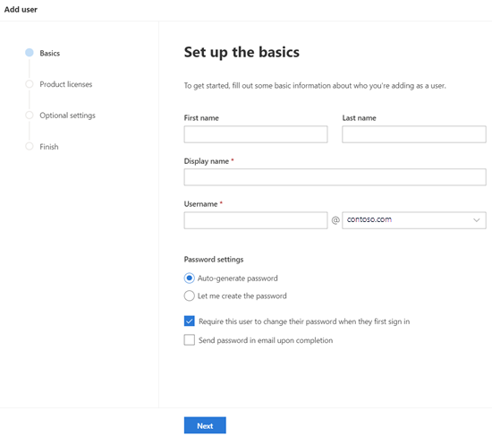

# Nyheter i administrations centret för Microsoft 365

::: moniker range="o365-21vianet"

> [!NOTE]
> En del av informationen i den här artikeln kanske inte gäller för Office 365 som drivs av 21Vianet.

::: moniker-end

Vi lägger till nya funktioner kontinuerligt i [administrations centret för Microsoft 365](microsoft-365-admin-center-preview.md), åtgärdar problem vi lär dig och gör ändringar baserat på din feedback. Ta en titt nedan för att se vad som är tillgängligt för dig idag. Vissa funktioner är uppkopplade med olika hastigheter till våra kunder. Om du inte ser en funktion ännu kan du [försöka med att lägga till dig själv i mål versionen](manage/release-options-in-office-365.md).

Och om du vill veta vad som är nytt med andra moln tjänster från Microsoft:

- [Nyheter i Azure Active Directory](https://docs.microsoft.com/azure/active-directory/fundamentals/whats-new)
- [Nyheter i administrations centret för Exchange](https://docs.microsoft.com/Exchange/whats-new)
- [Nyheter i Microsoft Intune](https://docs.microsoft.com/mem/intune/fundamentals/whats-new)
- [Nyheter i Microsoft 365 Compliance Center](https://docs.microsoft.com/Office365/SecurityCompliance/whats-new)
- [Nyheter i Microsoft Hotskydd](https://docs.microsoft.com/microsoft-365/security/mtp/whats-new)
- [Nyheter i administrations centret för SharePoint](https://docs.microsoft.com/sharepoint/what-s-new-in-admin-center)
- [Office-uppdateringar](https://docs.microsoft.com/OfficeUpdates/)

## Juli 2020

### Förbereder dig för 2020

När vi rör sig in i säsongen hos Microsoft släpps vi inte så många funktioner så att vi kan prata om under våra sessioner. 

Nästa uppdatering av den här artikeln kommer att vara samma dag som det första Online-Only. Och det här året är det gratis att delta! Kolla in det, få registrera dig: [Microsoft är 2020](https://www.microsoft.com/ignite).

### Dina produkter

Det har skett mycket arbete med abonnemangs hanteringen för att det ska gå snabbare att läsa in och hitta det du letar efter och att möta webb acessibility standarder (reglerna i[WCAG 2,1](http://www.w3.org/TR/WCAG21/)).

- **Tabell design**: tabellen har omarbetats så att du kan gruppera liknande abonnemang. Gå till **fakturering**  >  **av dina produkter**.
- **Produkt information**: få mer information än någonsin dina abonnemang genom att välja produkten i listan.
- **Gör allt**härifrån: och du behöver inte gå till flera sidor för att hantera en produkt. Om du till exempel behöver avbryta ett abonnemang öppnas panelen för att utföra åtgärden.

### Domäner

Domän hanteringen kan vara komplicerad och vi har publicerat en ny funktion som gör det enklare. Gå till inställningar > domäner och välj sedan en domän för att få mer information om domänen och domänens hälsa.

:::image type="content" source="../media/MAC-WN-DomainDNS.PNG" alt-text="Sidan Domains information för contoso.com":::

### Dokument, utbildningar och videoklipp

[Nyheter i Microsoft 365](https://youtu.be/m1Nu8WJgCDY) Video Series: den här månaden täcker vi den nya Yammer-upplevelsen för webben och mobil, hur du integrerar programmet Yammer-communities för Microsoft Teams, nya policy paket för att stödja firstline-arbetare och-chefer.

## Juni 2020

### Håll kontakten med Office vad är nytt Management

För några månader sedan har vi lagt till en inställning som låter dig hantera de [nyheter som visas i en användares Office-appar](#office-whats-new-management). Den här månaden släppte vi ett nytt start-kort som hjälper dig att snabbt och håll koll på de **Nyheter** du vill visa för användarna i organisationen.

### Dokument, utbildningar och videoklipp (juni)

- [Komma igång med Teams](https://support.microsoft.com/office/184f1aba-2f91-43f0-86e1-9fae607e24f6)

## Maj 2020

### Ny uppdaterings kanal för Office

Den 12 maj har vi meddelat att det finns en ny uppdaterings kanal för Office: månatlig företags kanal. Den här uppdateringen förser användarna med nya Office-funktioner en gång i månaden, den andra tisdagen i månaden.

Om du tillåter att användarna själv installerar Office från portalen kan du välja en månad för företags kanalen för dem. Det gör du genom att logga in på administrations centret för Microsoft 365 och gå till **Visa alla**  > **Inställningar**  >  **organisations inställnings**  >  **Services**  >  **Inställningar för Office-program**. Om du väljer en **gång i månaden (månatlig företags kanal)** konfigureras eventuella nya själv installationer av Office för att använda månads vis företags kanal.

Med utgångs datumet för en månads vis företags kanal ändrar vi också namnen på de befintliga uppdaterings kanalerna. Om du till exempel byter månads kanal till aktuell kanal. De nya namnen börjar gälla den 9 juni 2020.

Mer information finns i avsnittet [ändra kanaler för Microsoft 365-appar](https://docs.microsoft.com/DeployOffice/update-channels-changes).

### Nya administratörs roller

Vi har lagt till några nya Azure Active Directory-administratörs roller i administrations centret för Microsoft 365.

- Med rollen som hybrid identitets administratör får användare tillstånd att hantera moln konfiguration och autentiseringstjänst.
- Med rollen nätverks administratör kan användarna hantera nätverks platser och granska nätverks insikter för Microsoft 365-programmet som tjänst program.
- Rollen som administratör för administratörer ger behörighet att hantera alla aspekter av skrivare och skrivar anslutningar.
- Skrivar teknikern är en del av skrivar administratörs rollen där användarna kan registrera och avregistrera skrivare samt uppdatera skrivar status.
Mer information om de här rollerna finns i [om administratörs roller](https://docs.microsoft.com/microsoft-365/admin/add-users/about-admin-roles).

### Exportera grupp lista

Vi har hört många administratörer om att de behöver dela information om grupper och deras användning för personer som inte har åtkomst till administrations centret. Du kan nu exportera listan grupper till en CSV-fil för granskning, vilket innebär att du kan spara det gamla PowerShell-skriptet. Gå till **gruppen grupper**  >  **Groups**och välj sedan **Exportera grupper** från kommando fältet om du vill prova.

### Microsoft 365-center för lösningar och arkitektur

I den här månaden släppte vi en ny webbplats [https://docs.microsoft.com](https://docs.microsoft.com) som heter [Microsoft 365-lösning och-arkitektur Center](https://docs.microsoft.com/microsoft-365/solutions/solution-architecture-center)och som sammanfattar de tekniska rikt linjer som behövs för att förstå, planera och implementera integrerade Microsoft 365-lösningar för säkert och kompatibelt samarbete. I den här Center:

- Grundläggande lösnings råd
- Rikt linjer för hantering och scenario
- Lösningar och arkitektur illustrationer (affisch!!!)
- Branschledande råd
- Företags arkitektur

### Dokument, utbildningar och videoklipp (kan)

- **Nyheter i microsoft 365 Video Series**: den här månaden täcker vi den nya support upplevelsen i Teams administration och säkerhet och efterlevnad, Planner-integrering med meddelande Center och den nya 3x3-videolayouten i Microsoft Teams. 
- Sidan [Hjälp Hub för Microsoft 365 Admin Center](https://docs.microsoft.com/microsoft-365/admin/) har uppdaterats för att hjälpa dig att hitta det du behöver. Och om du tittar på den sidan just nu har vi lagt till ett kort som informerar dig om viktiga uppdateringar och ändringar.

## April 2020

### Hantering av Intune-roller

[April 2020](#april-2020)

Nu har vi gjort det! Vi har tagit det andra steget till en enhetlig roll upplevelse och du kan nu hantera Intune-roller i administrations centret för Microsoft 365. Du kan också använda funktioner som att söka efter roller och Visa roll behörigheter. Det innebär att du inte behöver två olika verktyg för att hantera roller för Microsoft 365 och Intune. När du loggar in på administrations centret för Microsoft 365 ser du att det finns två pivoteror på sidan roller, en för Azure AD och en för Intune.

### Synkronisera meddelande Center inlägg i Planner

Om du startar i kan administratörer som är i mål versionen se knappen "Planner syncing" i meddelande Center. Du kan nu spåra meddelanden som behöver åtgärdas, välja den typ av meddelanden som du vill spåra, tilldela meddelanden för att spåra aktiviteter och märka meddelanden.

[Anslut till riktad version](manage/release-options-in-office-365.md) !

### "Behöver du hjälp?" lanseras i administrations centret för team & säkerhets-och efterlevnadsprinciper

Administrations centret för Teams, säkerhets Center och efterlevnadsprinciper använder nu samma "Jag behöver hjälp?". den funktion som Microsoft 365 Admin Center använder för att hitta hjälp och kontakta supporten. Vi har fått massor av feedback från administratörer som du vill ha samma nivå på hjälp och support och vi är glada att du får dig. Pröva själv och ge oss dina synpunkter!

#### Vill du ha chatt?

Våra support agenter har arbetat hemifrån samtidigt som de tar emot kund ärenden och begränsningar för Internet-bandbredden medan du arbetar hemifrån kan påverka kvaliteten på kundernas samtal. För att du ska kunna fortsätta med supporten har vi lanserat alternativet Live chatt-support för kunder i Microsoft 365 Admin Center.

När du skapar en tjänst förfrågan visas nu chatt som ett alternativ, utöver telefon och e-post. Välj chatt som önskad kommunikations kanal och skapa en begäran. När du har skapat begäran kan du starta chatten när du är redo att chatta med Microsoft-agenter.

### Teams-uppdateringar

Med ökad användning av Teams har vi lagt till några funktioner som hjälper dig att hantera dem.

- Ett nytt rekommendations kort på Start sidan för administrations centret visar vilka användare som inte aktivt har använt team i 30 dagar. Du kan skicka ett e-postmeddelande till dessa användare för att få dem igång med Teams.
- **Samla ihop personer med grupper**: gå till **installations programmet** och se en ny sida som hjälper dig att aktivera Teams för licensierade användare och för att tillåta gäst åtkomst så att du kan arbeta med externa kunder i Teams.
- Ett Microsoft Teams-kort är nu fäst som standard på Start sidan. Det visar om Teams är aktiverat och om gäst åtkomst tillåts. Du kan också kontrol lera konfigurations statusen för de nya licensierade teamens användare och kontrol lera om nätverks problem kan påverka team användarna.
- Slutligen är team nu ett steg i det första inställnings flödet om du har köpt en licens som omfattar Teams.

### Produktivitets Poäng

Produktivitets poäng ger insikter om hur personer använder Microsofts moln tjänster och de teknik funktioner som har stöd för dem. Poängen återspeglar organisationens prestanda i förhållande till anställda och teknik och jämför poängen med organisationer som dina egna. Den här månaden presenterar vi följande nya koncept för förhands granskningen:

- Trenden för primära insikter på Start sidan och kategori informations sidor – slut punkts analyser och kategorier för nätverks anslutningar som läggs till i teknik upplevelsen
- Relevant teknik upplevelse som visas i kategorier för kategorin anställda
- Ny kommunikations kategori som en del av den anställdes erfarenhet
- Användar information med organisatoriska metadata i kategorierna för kategorin anställda

Om du vill veta mer kan du läsa mer i bloggen: [mäta och förbättra microsoft 365-upplevelsen med Microsoft produktivitets Poäng](https://techcommunity.microsoft.com/t5/microsoft-365-blog/measure-and-improve-the-microsoft-365-experience-with-microsoft/ba-p/1348618). Produktivitets poängen är för närvarande i privat för hands version. [Gå med i produktivitets poängen för privat förhands granskning](https://aka.ms/productivityscorepreview) för att komma igång.

### Grupp uppdateringar

Det finns två uppdateringar för grupper den här månaden:

- Du kan nu redigera e-postadresser för Office 365-grupper (kallas även grupper i Outlook och snart kallas Microsoft 365 Groups).
- Vi har hört med din feedback och vi har lagt till fel meddelande om att det inte går att konvertera en grupp till ett Microsoft-team.

### Dokument, videoklipp och utbildning (april)

**Nyheter i Microsoft 365-videoserien**: den här månaden får vi tips och resurser för att hjälpa mindre företag att övergå till fjärran slutna arbeten, inklusive hur du kan lansera Microsoft Teams, arbets utbildning för fjärr arbeten för att hålla kontakten med kunder och partners samt det nya abonnemanget för Microsoft 365 Business-tjänsten. [Nyheter i Microsoft 365](https://go.microsoft.com/fwlink/p/?linkid=2118096)

#### För användarna

- [Schemalägga ett möte](https://support.microsoft.com/office/c61b4f61-ee62-4a06-8bf7-0a1cd302700a)
- [Ansluta till ett Teams-möte](https://support.microsoft.com/office/078e9868-f1aa-4414-8bb9-ee88e9236ee4)
- [Skapa ett organisations team](https://support.microsoft.com/office/037bb27a-bcc9-48fe-8d72-44d9482420a3)
- [Skapa ett team med gäster](https://support.microsoft.com/office/11fbb083-52ee-434d-8c6e-63711fdafac7)
- [Gå med i ett team som gäst](https://support.microsoft.com/office/928d1eef-61e2-49ec-b754-c2fe86b34824)
- [Skapa en grupp-e-postadress](https://support.microsoft.com/office/ded875f9-a9de-437f-b559-2ae4f235bb2b)

#### För administratörer och företags ägare

- [Lär dig mer om småföretag med fjärrarbete](https://support.microsoft.com/office/9b91a85a-39b4-40a6-a590-0f9bea0ba8e6)
- [Köra ett litet fjärran slut](https://support.microsoft.com/office/9ac1a0f1-789b-4143-b954-5821d5d89298)
- [Registrera dig för Microsoft Business Basic](https://support.microsoft.com/office/9ac1a0f1-789b-4143-b954-5821d5d89298)
- [Konfigurera en inloggning med två faktorer](https://support.microsoft.com/office/9ac1a0f1-789b-4143-b954-5821d5d89298)

## Mars 2020

### Åtgärds korrigering: förbättra "Lägg till användare" tillförlitlighet för licensiering

Vi har fått massor av feedback från administratörer om hur mycket det är att tilldela licenser när de lägger till användare. Vi har gjort den första uppdateringen för den här korrigeringen och vi har migrerat till en mer pålitlig bakom-scener-tjänsten för att behandla dessa förfrågningar. Och om något går fel får du ett fel meddelande som gör att du kan försöka igen.

### Start sidan för Microsoft Teams

Med uppräkningen av team användningen får vissa fritt ett fäst instrument panels kort som gör det lättare att hitta Teams. Kortet har också länkar till utbildning och dokument som underlättar din organisation över gång till fjärran sluten arbete. Gå till **Start** sidan för att se det nya kortet.

### Anpassa organisationens tema för SharePoint-mobilappen

Med administrations centret för Microsoft 365 kan du nu anpassa organisationens tema i SharePoint-mobilappen för iOS-och SharePoint-mobilappar för Android. Den här funktionen har bekvämt en program upplevelse för mobil intranät som kan matcha din SharePoint Online för anställda i farten. Anpassning av tema innehåller logo typ bild, bakgrunds färg, text-och ikon färger och tilläggs färger, vilket gör det lätt att känna igen.

### Förbättringar av guiden "Lägg till en grupp"

När administratörer har skapat en ny grupp – och gjort det till en grupp samtidigt kan de tilldela ägare som inte har en licens som innehåller Teams. Och som har skapat några problem. Vi har uppdaterat guide flödet för att kontrol lera att ägarna har en team licens och om de inte har möjlighet att aktivera gruppen i ett team.

### Microsoft 365-utbud för små och medel stora företag

Vi vet att det här är ett meddelande till nästa månad, men vi vill se till att du är för beredd.

Från och med den 21 april gör vi ändringar relaterade till våra Office 365-abonnemang för små och medel stora företag – och till Office 365 ProPlus. Dessa produkter kommer nu att använda Microsoft 365 varumärket.

De nya produkt namnen träder i kraft den 21 april 2020. Det här är endast en ändring av produkt namnet och det finns inga ändringar för prissättning eller funktion.

|Aktuellt namn |Nytt namn  |
|---------|---------|
|Office 365 Business Essentials     |   Microsoft 365 Business Basic      |
|Office 365 Business Premium     |    Microsoft 365 Business Standard     |
|Microsoft 365 Business     |    Microsoft 365 Business Premium     |
|Office 365 Business     |    Microsoft 365-applikationer för affärsverksamhet       |
|Office 365 ProPlus    |   Microsoft 365-appar för företag      |

### Videoklipp, utbildning och dokument

[Nyheter i Microsoft 365 Web Series](https://go.microsoft.com/fwlink/p/?linkid=2118096): i den här månadens avsnitt markerar vi tre minuters dag med Microsoft Teams och täcker de nya funktionerna, inklusive förbättrad ljud kvalitet i onlinemöten, riktad kommunikation för firstline-cheferna med arbets pass och Skype-klient och annat.

## Februari 2020

### Korrigering för feedback: flera organisationer växlaren

Vi har tagit emot mycket feedback från partners och administratörer om utmaningarna att hantera flera Microsoft Cloud-fritt. En av våra första multi-org Management-funktioner är **organisationens växlaren**, där du kan ändra mellan de fritt som du hanterar med bara två klick.
> [!TIP]
> Du behöver inte göra något för att organisationens växlaren ska visas så länge du är partner av Record för minst en organisation.

1. I administrations centret för Microsoft 365 väljer du organisationens namn.

2. I organisationens växlaren väljer du den organisation som du vill hantera.

Det är verkligen det!!!

### Grupper

Några ändringar i området grupper den här månaden:

- **Sortera efter grupp namn**: du kan sortera grupp listan i alfabetisk ordning genom att välja kolumnen **grupp namn** .
- **Återställ borttagna microsoft 365-grupper**: du behöver inte gå till administrations centret för Exchange längre för att återställa borttagna Microsoft 365-grupper. Gå till **Microsoft 365 Admin Center** \> **grupper** \> **borttagna grupper** \> (Välj en grupp från listan) \> **Återställ grupp**. Den återställer gruppen till listan **grupper** och återställer gruppens e-post, konversationer, antecknings bok och kalender.

### Videoklipp, utbildning och dokument (februari)

- **Nyheter i Microsoft 365-videoserien**: den här månaden fokuserar vi på anpassade Sök funktioner för SharePoint Online, Office "Nyheter"-funktionen som gör att du kan visa eller dölja särskilda funktioner för slutanvändare via Hjälp fönstret i appen, de senaste säkerhets-och efterföljandekrav i Yammer och mycket mer. Här är det senaste avsnittet: [Nyheter i Microsoft 365](https://go.microsoft.com/fwlink/p/?linkid=2118096)

- **Dok flyttar**: Vi kombinerade webb artiklarna för Office 365-administratörer med Microsoft 365-innehållet och du kanske har märkt den nya webb adressen. Den här artikeln används till exempel för att hållas på: **docs.Microsoft.com/Office365/admin/Whats-New-in-Preview**, men URL-adressen är nu: **docs.Microsoft.com/Microsoft-365/admin/Whats-New-in-Preview**. Om du har bok märken kan du uppdatera dina länkar; innehålls länkar kommer att omdirigeras till det nya innehållet repo.

## Januari 2020 – gott nytt år

> [!NOTE]
> Visste du att det finns något [nytt i Microsoft 365](https://go.microsoft.com/fwlink/p/?linkid=2118096) Video Series på YouTube? Det markerar de senaste funktionerna som vi har gjort för användare. Varje månad börjar vi länka till den senaste delen i avsnittet [videoklipp, utbildning och dokument](#videos-training-and-docs) .     Här är det senaste avsnittet: [Nyheter i Microsoft 365](https://go.microsoft.com/fwlink/p/?linkid=2118096)

### Mörkt läge

När vi först utlöste mörkt läge är det bara tillgängligt på Start sidan. Mörkt läge är nu borta från förhands granskning och är i mål versionen på de flesta sidor i administrations centret.

1. Först måste du aktivera mål versionen: gå till **Inställningar** \> **Inställningar** \> **organisationens** inställningar för \> **versions**hantering.
1. Och sedan aktivera mörkt läge går du till **Start** sidan och väljer sedan knappen **mörkt läge** . (Det ligger bredvid **Sök** fältet och den här **artikeln Nyheter.** )
1. För alla sidor med mörkt läge visas knappen längst upp på sidan bredvid **den nya administrations Center** .

### Nyheter i Office

Administratörer vill kontrol lera hur Microsoft kommunicerar med "Nyheter" för användarna i Office-apparna-och att du har den kontrollen. Gå till **Inställningar** för att \> **förhands granskning av hanteringen**. Välj en funktion för att visa dess uppgifter och sedan kan du välja knappen **Dölj från användare** om du inte vill att användarna ska kunna se ett visst meddelande om "Nyheter". Din organisation kan till exempel vänta på att användarna ska veta om en funktion innan alla i organisationen är utbildade på den.

Denna funktion släpptes först för förhands granskning i november, men det finns några funktions uppdateringar som du bör känna till: [Office och nyheter för förhands granskning av hantering finns nu tillgängliga](https://techcommunity.microsoft.com/t5/microsoft-365-blog/office-what-s-new-management-preview/ba-p/1020438)

### Parterna

Howdy, partners! (Hjälp mig själv.) Vi har också en uppdatering för dig den här månaden. Det finns en ny funktion som gör att partners kan ge CSP-kunderna möjligheten att acceptera sina Microsoft Customer Agreement (MCA) i avsnittet **fakturerings konton** i administrations centret. I den här nya versionen:

1. Kunden får en inbjudan via e-post med en länk för att acceptera partner relationen och MCA.
2. När kunden loggar in kan de Visa och acceptera MCA-och partner behörigheter-direkt från administrations centret.

### Resurs post lådor

Listan resurs post lådor har uppdaterats till det nya formatet. I administrations centret för Microsoft 365 går du till **resurserrum** \> **& utrustning**.

### Videoklipp, utbildning och dokument (januari)

Ta en titt på den utbildning för Small Business admin som vi släppte i januari:

- [Skapa din företags webbplats](https://support.microsoft.com/office/3325d50e-d131-403c-a278-7f3296fe33a9)
- [Hitta svar och hjälp](https://support.microsoft.com/office/7f681212-c649-4a3e-a43b-32b1d1e58988)
- [Få hjälp eller support](https://support.microsoft.com/office/18948a4c-3eb1-4b30-b1bc-a4cc29eb7655)
- [Ta bort en användare](https://support.microsoft.com/office/6bcdad7b-732a-4260-997a-8c176bc3d9d6)
- [Välj ett Microsoft-abonnemang](https://support.microsoft.com/office/b9f7c78e-430f-4117-89ec-2eeb1dced2ca)
- [Översikt över Microsoft 365 för företag – säkerhet](https://support.microsoft.com/office/3274b159-a825-46d7-9421-7d6e209389d1)

## November och december 2019

Vi kombinerar november och den som är i december när vi har gjort det några få meddelanden att ringa. Se det nya året!

### Ändra från kredit kort till faktura betalning

Vi har börjat slå ut möjligheten att ändra din betalnings metod från kredit kort till en faktura. Gå till **fakturering** \> **av dina produkter**, Välj en prenumeration och välj sedan **Redigera** -länken bredvid kredit korts betalningen.

Vill du läsa mer om det? [Ändra från kreditkort eller bankkonto till faktura](../commerce/billing-and-payments/change-payment-method.md)

### Global läsare

Vi nämnde den globala läsarens roll i [2019-tändnings versionen från oktober](#october-2019---ignite-edition), men eftersom den lanseras mer brett kan vi diskutera vissa uppgifter:

- Rollen global läsare är den skrivskyddade motparten till rollen som global administratör. Den globala läsaren kan se allting som den globala administratören har behörighet att göra.
- Med några få undantag, till exempel vissa funktioner för efterlevnad och säkerhet, har globala läsare åtkomst att visa alla Microsoft Cloud admin-Centers som din organisation har tillstånd att använda.
- Tilldela den globala läsare rollen till användare som behöver den för planering, granskning och undersökningar.
- Du kan också kombinera rollen global läsare med en annan roll med färre behörigheter. En ägare till en småföretag kan till exempel tilldelas rollen som global läsare för **fakturerings administratör**,  +  **Global reader** så att de kan betala räkningar och hålla koll på ändringar i sin moln organisation.
- Globala läsare kan gå till alla sidor i administrations centret för Microsoft 365. När de öppnar en redigerbar sida visas en varning högst upp om att de inte har behörighet att spara ändringar och att knappen Spara är avaktiverad.

Vi vill gärna få feedback om rollen global läsare och vilken av de rollbaserade behörigheter som du vill se i framtiden. [Ge feedback om rollbaserade behörigheter](https://office365.uservoice.com/forums/273493-office-365-admin/suggestions/10115430-have-a-consistent-experience-when-assigning-admin)

### Sidan nya inställningar

**Organisations profilen**, **säkerhets & integritet**och **tjänster & tilläggs** sidor har kombinerats till en sida med tre lodräta flikar. Och den bästa delen – från en enda plats kan du nu söka efter alla inställningar.

### Utbildning & dokument

Det här avsnittet är en ny funktion i den här artikeln där vi börjar länka till ny utbildning och dokumentation som vi tror att du kommer att hitta intressant.

I november gav vi ut ett par Sök vägar till [Microsofts](https://docs.microsoft.com/learn/) webbplats för att hjälpa IT-teknik att lära sig mer om och bli utbildad på Microsoft 365. Kolla in dem:

- [Microsoft 365 fundament ALS](https://docs.microsoft.com/learn/paths/m365-fundamentals/)
- [Utöka Office fundament ALS](https://docs.microsoft.com/learn/paths/extend-office-fundamentals/)
- [Microsoft 365-modernisera din företags distribution med Windows 10-och Microsoft 365-appar för företag](https://docs.microsoft.com/learn/paths/m365-getmodern/)
- [Hantera din företags distribution med Microsoft 365](https://docs.microsoft.com/learn/paths/manage-enterprise-deployment-m365/)
- [Uppgradera Microsoft Office för IT på skala](https://docs.microsoft.com/learn/paths/m365-office-for-it/)
- [Leverera fjärr skrivbord och appar från Azure med virtuellt Windows-skrivbord ](https://docs.microsoft.com/learn/paths/m365-wvd/)
- [Modernisera din arbets plats med Microsoft 365 och Surface for Business](https://docs.microsoft.com/learn/paths/modernize-workplace-with-m365-and-surface/)
- [Skydda identitet och åtkomst med Microsoft 365](https://docs.microsoft.com/learn/paths/m365-identity/)
- [Skydda företags information med Microsoft 365](https://docs.microsoft.com/learn/paths/m365-information-protection/)
- [Hantera säkerhet med Microsoft 365](https://docs.microsoft.com/learn/paths/m365-security-management/)
- [Försvara dig mot hot med Microsoft 365 och Microsoft Threat Protection](https://docs.microsoft.com/learn/paths/m365-security-threat-protection/)
- [Hantera grupp samarbete med Microsoft Teams](https://docs.microsoft.com/learn/paths/m365-manage-team-collaboration/)
- [Samar beta med SharePoint i Microsoft 365](https://docs.microsoft.com/learn/paths/m365-teams-sharepoint/)

## Oktober 2019-tändnings utgåva

Välkommen till den inbränningde versionen av nyheterna i administrations centret för Microsoft 365! Det här är självklart ingen fullständig lista över meddelanden, men här är några markeringar. Kolla också in bloggerna för mer information om utgåvor:

- [Administratör – säkerhet, produktivitet och nätverks förbättringar för Microsoft 365](https://techcommunity.microsoft.com/t5/Microsoft-365-Blog/ADMIN-Security-Productivity-and-Network-Enhancements-for/ba-p/964019).
- [Nyheter i Microsoft Teams-tänd 2020](https://techcommunity.microsoft.com/t5/Microsoft-Teams-Blog/What-s-New-in-Microsoft-Teams-Ignite-2019/ba-p/937025).

### Rollbaserad åtkomstkontroll

Det har skett många ändringar för roller i administrations centret sedan vi startade i juni:

- **Jämför roller** – Välj upp till 3 roller för att jämföra behörigheter för var och en. Detta hjälper dig att hitta den minst tillåtna rollen att tilldela användare. Gå till **roller**, Använd kryss rutan Markera flera i den första kolumnen för att välja upp till 3 roller och välj sedan **Jämför roller**.

    

- **Favoriter** – du kan lägga till en stjärna till dina favorit-eller mest använda roller så att du enkelt kan hitta dem genom att sortera kolumnen eller skapa ett filter.
- **Aktiva användare**  >  **Hantera roller** – den här har uppdaterats så att den justeras efter roll ändringarna. Precis som med listan roller har vi begränsat standard listan med roller till den mest användbara, men du kan se alla roller genom att expandera **Visa alla efter kategori**.
- **Global läsare** – du bad om det! Du fick den! Rollen [global läsare](add-users/about-admin-roles.md) !

### Rapportera ett problem

Tjänstens hälsa har uppdaterats till det nya formatet och om du påverkas av ett problem som inte visas på din instrument panel för tjänste hälsa kan du **rapportera ett problem** så att Microsoft vet. Gå till **hälso**  >  **tjänstens status**.

### "Virus"-abonnemang

Som du vet kan användarna aktivera gratis abonnemang till en myriad av produkter som Power BI och app Connect. Nu kan du se "virus abonnemangen" som användarna har försökt med. Gå till **fakturering**  >  **av dina produkter**. Välj filtret **konto typ** på fliken abonnemang för att se de abonnemang som användaren har köpt. Om det behövs kan du nu ta bort dessa abonnemang från ditt konto.

### Användarmallar

Med mallar kan du enkelt lägga till många användare genom att spara och återanvända de delade inställningarna för dessa användare. Du kan spara värden för roller, licenser, kontakt information, plats med mera. När du använder mallen för att skapa en ny användare kommer de automatiskt att få det sparade värdet för dessa inställningar. Gå till **användare**  >  **aktiva användare**och välj sedan **användarmallar** för att prova.

### Office "Nyheter", hantering (för hands version)

När en viktig Office-funktion släpps i en Office-app får användarna ett "Nyheter"-kort för att lära sig mer om den nya funktionen. Om du inte vill att användarna ska kunna se kortet kan du dölja det. Du kan också välja när du vill att användarna ska se kortet genom att visa det. Gå till **Inställningar**  >  **Office What's New management** för att checka ut det.

### SharePoint URL-ändring

Tekniskt är det här inte Microsoft 365 admin Centers nyheter för att berätta, men vi är så glada att vi ville se att du ser dessa nyheter:
> [!IMPORTANT]
> Nu kan du gå till administrations centret för SharePoint med en vanlig URL-adress: [https://admin.microsoft.com/SharePoint](https://admin.microsoft.com/SharePoint)

Mer information finns i [Nyheter i administrations centret för SharePoint](https://docs.microsoft.com/sharepoint/what-s-new-in-admin-center).

## September 2019

Vi håller på att öka för lite spännande funktions utgåvor för 2019, så vi presenterar bara några nya funktioner som släpptes i september. Men håll koll på nästa månads artikel kommer att publiceras på den första dagen med antändt!

### Fix feedback – alternativet att konvertera den borttagna användarens post låda till en delad post låda är tillbaka

Vi hörde din feedback och klar och vi har återinfört möjligheten att ge någon annan åtkomst till en borttagen användares post låda genom att omvandla den till en **delad post låda**. Om du lägger till detta i guiden ta bort användare kan du bestämma vad du vill göra med data:

- E-post: ge någon annan åtkomst till den borttagna användarens post låda genom att konvertera den till en delad post låda.
- Filer: Spara OneDrive-filer och ge någon annan åtkomst till dem.
- Behörigheter: ta bort behörigheter om andra hade åtkomst till post lådan.
- Alias: ta bort e-postalias så att de kan användas för en annan användare direkt.

### Första installationen

Det finns en uppdatering av de första installations guiderna: Microsoft 365 för företag. Stegen är strömlinjeformade och vi har flyttat två av konfigurations uppgifterna till inställnings sidan:

- **Skydda Windows 10-datorer** -konfigurera principer för att bättre skydda dina Windows 10-enheter mot virus, skadlig program vara och attacker från hackare.
- **Installera automatiskt Office** – när du aktiverar detta och användare har anslutit sina datorer till Microsoft 365 Business, uppdateras deras datorer automatiskt till de senaste Office-programmen-och hållas uppdaterade.

## Augusti 2019

### Fakturering

Det finns några uppdateringar för fakturering och prenumerationer den här månaden:

- Enhets prenumerationer: du kan koppla eller ta bort **Microsoft 365-appar för utbildnings-(enhet)** licenser till enheter i administrations centret för Microsoft 365. **Microsoft 365-appar för utbildning (enhet)** är en tilläggs licens som gör att du kan tilldela en licens till en enhet. Gå till **fakturering**  >  **av dina produkter** för att hitta och köpa licensen.
- Användarspecifik licens hantering: vi har uppdaterat hur du tilldelar licenser för **användare**  >  **aktiva användare** till det nya formatet. Mer information finns i:
  - [Tilldela licenser till användare](manage/assign-licenses-to-users.md)
  - [Ta bort tilldelningen av licenser från användare](manage/remove-licenses-from-users.md)

### Uppdateringar av installations Sidan

Nu har du kategorier och avsnitt, inklusive en **Rekommenderad för dig** -avsnitt, som vi föreslår nästa steg för att aktivera funktioner och konfigurera organisationen. Vi har också lagt till en ny funktion för att konfigurera:

- **Avancerat skydd för Office** -om din organisation är licensierad för att använda Office ATP och du inte har konfigurerat eller aktiverat det ännu visas den här sidan. Gå till **installations programmet** och pröva.

### Rapportera ett problem (augusti)

Om du påverkas av ett problem som inte visas på din instrument panel för tjänste hälsa ger **du ett snabbt** och enkelt sätt att berätta för oss. Gå till **hälso**  >  **tjänstens status**.

## Juli 2019

### Meddelandecenter

Meddelande Center har uppdaterats till den nya designen och det är fantastiskt.

- Nu kan du Visa **meddelanden efter status**. Välj bara en av flikarna: **alla aktiva meddelanden**, **hög prioritet**, **olästa meddelanden**och **meddelanden som stängts**av.
- Du kan också filtrera efter kategori **data sekretess**, **Planera för ändring**, **förhindra eller åtgärda problem**och **hålla välinformerade** meddelande kategorier.
- Välj ett meddelande i listan och det finns några alternativ i kommando fältet: **Ignorera**, **Markera som läst** eller **Markera**som oläst eller **dela**.
- Och när du öppnar ett meddelande har du ännu fler alternativ:
  - Kopiera en länk till ett meddelande till Urklipp för att spara den senare eller dela den med kollegor.
  - Markera meddelanden som **lästa** eller **olästa**.
  - Ge feedback om ett meddelande genom att välja **gilla** eller **gilla**visas en feedback-ruta där du ombeds att ange specifik information om vad du gillade eller inte gillar det här meddelandet.

### Intelligens i navigerings fönstret

 Navigerings fönstret kommer nu att uppdatera dina senaste åtgärder och visar fönstret i det senaste tillståndet som du lämnade det i. Det gör att ofta använda objekt visas som standard.

### Första installationen & sidan konfiguration

Vi har några spännande ändringar som hjälper dig att komma igång med din organisation. Vi ska först diskutera skillnaden mellan **installations programmet** och **inställnings sidan**. **Installations programmet** refererar till den första installations guiden som du använde för att hantera Microsofts online tjänster. Som vanligt vis inkluderar tre specifika steg: **ansluta en domän**, **lägga till användare**och **Ladda ned Office-apparna**. **Sidan konfiguration** är den sida i administrations centret som rekommenderas att konfigurera uppgifter för att se till att du får ut mesta möjliga av dina abonnemang – som att aktivera funktioner som du har köpt licenser för.

- **Konfiguration** – installations guiden har uppdaterats för **Microsoft 365 för företag** -prenumerationer. Den nya designen hjälper nya organisationer att gå igenom guiden snabbare och med större framgång.
- **Inställnings sida** – **installations** sidan hjälper dig att slutföra konfigurationen och säkra tjänsterna som medföljer dina abonnemang. Du kan också se eventuella eventuella rekommendationer på **installations** sidan. Om du vill se om det är tillgängligt för dina prenumerationer kan du gå till installations programmet för **Microsoft 365 Admin Center**  >  **Setup**.

### Fakturering & abonnemang

- **Program varu** typ – du kan nu visa program varor som köpts via en moln tjänst leverantör (CSP). Om du vill se dina nedladdningar och nycklar går **du till**  >  fliken**produkt**  >  **program** .
- Du kan visa moderna Azure-produkter och-tjänster från Microsoft 365 Admin Center, oavsett om du köpte dem från Microsoft eller en tredjepartsleverantör. Exempel på moderna Azure-produkter:
  - Virtuella Azure reserverade instanser
  - Support abonnemang för Azure
  - Funktioner för Azure Hybrid användning (AHUB)
  - Hantera program
  - Enhets tjänster
  - Azure-abonnemang

### Förenkla multifaktorautentisering

Administratörer har till gång till känslig information i organisationen. Kräv multifaktorautentisering för alla administratörer när de loggar in. Med den nya guiden får du hjälp med ett enda steg. Om du vill prova går du till **Konfigurera**för att  >  **förstärka inloggnings säkerhet**.

### Användare

Sidorna **borttagna användare** och **gäst användare** uppdaterades till det nya formatet.

- **Gäst användare**: du lägger till gäst användare genom att bjuda in dem att visa eller dela filer från SharePoint eller OneDrive. Du kan visa gäst användare från **användare**  >  **gäst användare**.
- **Borttagna användare**: på sidan uppdaterade **borttagna användare** kan du göra alla åtgärder som du kan använda i det äldre administrations centret, men du lägger till och tar bort kolumner. Och vi har många olika kolumn alternativ att välja mellan. I själva verket är det samma kolumner som du kan välja på sidan **aktiva användare** .

## Juni 2019

### Aktuell feedback-framställningen

Att Visa administrations centret i mörkt läge är i förhands granskning! Du kan bara testa det på **Start** sidan just nu. På **Start** sidan är knappen **mörk läge** i kommando fältet bredvid länken **Nyheter** .

### Hantera roller

Vid slutet av juni började vi att lyfta fram det nya sättet att hantera administratörs roller. Gå till **roll**roller när det är tillgängligt för dig  >  **Roles**. Och sedan ta en titt – det är toppen!
    

Denna nya upplevelse gör det enklare att se vem som har administratörs behörigheter och att tilldela roller som ger rätt åtkomst till din administratör. Dessutom har vi lagt till fler roller från Azure AD så att du inte slösar tid på att gå till flera administrativa Center.
Vad mer kan du göra?

- Exportera en lista över alla administratörer i organisationen som har tilldelats Azure Active Directory-roller i Microsoft 365.  
- Visa alla administratörer som är tilldelade till en viss roll, lägga till eller ta bort administratörer från en viss roll, Sök efter roller efter namn och nyckelord och Läs mer om vad varje roll gör det möjligt för en användare att göra.
- Sök snabbt efter en viss roll och skapa filter.

### Betalnings metod

Vi har uppdaterat hur du betalar för dina abonnemang. Gå till **fakturerings**  >  **räkningar &**  >  **betalnings metoder**. Du kan se betalnings metoderna i en listvy. Markera ett objekt i listan för att ta bort det, redigera det och enkelt se vilken prenumeration som betalnings metoden är kopplad till.

## Maj 2019

### Kanske är den lösnings känslig

När du söker efter delade post lådor, kontakter, resurser och Mailbox-behörigheter behöver dina sökord inte vara Skift läges känsliga.

**Hantera användare och grupper** Den här månaden har vi uppdaterat **blockering av användare**, **Återställ lösen ord**, **kontakt** **lista, listvy och** **grupp** informations sidor till det nya administratörs Center.

- Med den nya listan med listvyer får du bättre information om dina grupper, och du kan anpassa hur du ser dina data, **och listan grupper** är till hjälp när du vill visa dina data. Du kan till exempel filtrera efter **grupper med Teams** för att se om dina grupper är en del av ett team och du kan lägga till kolumnen **team status** .
- Med grupp listan får du också all den förbättring som vi har gjort i list upplevelsen i användar hantering, inklusive snabb åtgärder och det kontextbaserade kommando fältet.

**Anvisningar** 
Det kan hända att du ser en ny rekommendations popup i administrations centret – vi har lagt till bara 4 nya. Självklart visas bara rekommendationer om vi tror att det kommer att få din organisation. Men vänta tills vi visar dig rekommendationen – du kan lägga till den från kortet.

- **Lösen ordet upphör att gälla** -vi rekommenderar att lösen ord blir inställda på att **aldrig utgå**. Om din organisation har en annan inställning kanske du bara kan se den här rekommendationen.
- **För många globala administratörer** -eftersom för många globala administratörer är ett säkerhetshot, om du har fler än 4 globala administratörer ser du den här rekommendationen. Vi föreslår att bara ge användarna den åtkomst de behöver för att få jobbet gjort.
- **Intune-enhetens skydd** – om dina licenser inkluderar Intune och vi upptäcker att du inte har konfigurerat Intune eller registrerat dina enheter rekommenderar vi att du skapar en Intune-princip för att skydda organisationens filer när användare får åtkomst till dem från sina mobila enheter.
- **Hämta månads uppdateringar för Office-funktioner** – vi har feedback från våra väldigt små kunder som när de får månatliga Office-funktioner, är deras användare presenten glädjer. Om du är ett mycket litet företag och du för närvarande får dina Office-funktioner uppdateringar var sjätte månad ser du den här rekommendationen.

**Inställningar**  
Precis som för inställningar har det gjorts några ändringar. För det mesta är det bara att uppdatera de befintliga inställningarna till det nya administratörs Center. När vi flyttar framåt och lägger till nya inställningar som du aldrig har sett börjar vi att nämna dem här. Och vi har en enda inställning för att tillkännage: **modern verifikation**. Ja, det finns en ny inställning för att aktivera **modern inloggning**! Om du vill checka ut det går du till **inställnings**  >  **tjänster & moderna plugin-program**  >  **Modern authentication**.

## April 2019

Saker är fantastiska för administrations centret. Vi har läst din feedback och dina förslag, som svarar på de flesta av dem och verkligen har allt du behöver för att prata. Självklart gör vi fortfarande jobbet för att se till att allting fungerar som det ska med det gamla administrations centret. Och kom ihåg-när vi har lanserat nya funktioner kanske du inte får den direkt.

### Aktuell funktion – Lägg till användare

För april, vi använder guiden **Lägg till användare** som hjälper dig genom... vänta... lägga till användare. Det är en steg-för-steg-att lägga till användarens grundläggande info, till exempel e-post och visnings namn, tilldela en licens och en roll, lägga till deras kontakt information och sedan granska användarens konto innan du genomför. **Varför har vi gjort den här ändringen?** Vi hörde gärna att du inte gillar den nästan oändligt för att lägga till användare i den föregående versionen.
    

Det finns två sätt att kontrol lera det:  

1. Välj **Lägg till användare** från **användar hanterings** kortet på **Start** sidan. Guiden öppnas, så du behöver inte navigera bland något arbete som du gör på **Start** sidan.
2. Gå till **användare**  >  **aktiva användare**och välj sedan **Lägg till användare** i kommando fältet.
  

Vi har gjort några fler ändringar i **användar hanteringen**, här är en snabb lista:

- Fönstret **hantera roller** har uppdaterats till det nya formatet och kan nås. Vi har också uppdaterat gruppen **Blockera användare** och **ta bort användare** till det nya formatet.
- **Hantera ändrade produkt licenser** i kommando fältet.
- Att ändra en användares foto är nu enklare. I **aktiva användare** väljer du en användare och **ändrar sedan fotot** under deras bild.

### Men vänta! Det finns mer

- Det finns en ny installations banderoll på **Start** sidan som du ser om du inte har slutfört inställningen för att lägga till en domän, lägga till användare och ladda ned Office-apparna.
- **Grupp** listan och informations fönstret har uppdaterats till det nya formatet. Gå till **gruppen grupper**  >  **Groups** för att visa ändringarna.
  - Med att gruppera grupper har vi också lagt till en **Microsoft Teams** -flik i fönstret med grupp information där du kan förvandla en Microsoft 365-grupp till ett team. Om du vill "teamify" en grupp markerar du en Microsoft 365-grupp i listan, väljer fliken **Microsoft Teams** och sedan **Skapa team**. Om gruppen redan är ett team får du en länk som hanterar den från **administrations centret för Teams**.
  - Slutligen kan du lägga till **status för team** i listan **grupper** . I kolumn rubriken väljer du **Välj kolumner**  >  **Teams status**  >  **Spara**.
- **Nya begränsade administratörs roller** – vi har släppt några nya administratörs roller så att du enkelt kan ge användarna den åtkomst de behöver.
  - **Kaizala administratör**: användare i den här rollen har behörighet att utföra alla hanterings uppgifter i Microsoft Kaizala, inklusive att skapa och hantera användare i Kaizala-katalogen, hantera Kaizala-grupper, hantera åtgärds kort och ansluta och skapa tjänst förfrågningar.
  - **Sök administratör**: användarna i den här rollen har fullständig åtkomst till alla funktioner för Microsoft Search Management i administrations centret för Microsoft 365. Sök administratörer kan delegera rollerna Sök administratör och Sök redigerare till användare och skapa och hantera innehåll, till exempel bok märken, Q&ett objekt och platser. Dessa användare kan dessutom Visa meddelande Center, övervaka tjänstens hälsa och skapa tjänst förfrågningar.
  - **Sökredigeraren**: användare i den här rollen kan skapa, hantera och ta bort innehåll för Microsoft Search i Microsoft 365 Admin Center, inklusive bok märken, Q&ett objekt och platser.
- Det finns en Bonanza av **fakturerings** ändringarna den här månaden...
  - Du kan nu uppdatera CVV för befintliga kredit kort utan att behöva ta bort och lägga till den igen. Du kan uppdatera CVV genom att gå till **räkningar**  >  **Payment methods**.
    - Vi har gjort det enklare att hitta dina **fakturor** och förstå eventuella fakturerings problem. Och nu kan du se dina räkningar i webbläsaren i stället för att behöva ladda ned PDF-filen. Gå till **Bills**  >  **faktura fakturor**.
    - På sidan **dina produkter** sammanställer vi prenumerations informationen om du har flera prenumerationer av samma typ.

## Mars 2019 – vi har officiellt släppt administrations centret

Om du har missat de spännande nyheterna har vi officiellt släppt de nya och förbättrade administrations centret för Microsoft 365! Här är det blogg inlägg där vi presenterade det: [det nya administrations centret för Microsoft 365](https://techcommunity.microsoft.com/t5/Microsoft-365-Blog/The-new-Microsoft-365-admin-center-available-today/ba-p/377870). För mars, förlitar vi dig på att du kan ta en titt på de funktioner som släppts – plus att du även läser inlägget för funktionerna som släpps snart, vilket vi inte har tillstånd att göra i grundläggande innehåll.
    
Vi har en ändring i området **fakturerings & abonnemang** som vi vill nämna. Jag betyder att y'all inte hade gjort det för att förbättra det, visste du? Vi är inte! I verkligheten lade vi till möjligheten att hantera dina partner relationer till **fakturerings**  >  **konto**. Härifrån kan du granska partner relationer mellan rådgivare, KRYPTOGRAFIPROVIDER och indirekt åter försäljare. Du kan också acceptera nya partner relationer, inklusive delegerade administratörs behörigheter.

Som alltid är dina synpunkter viktiga för oss, så låt den komma! På valfri sida i administrations centret kan du ge feedback genom att välja **ge feedback** längst ned till höger och sedan behöver du **Hjälp?**

## Februari 2019-fakturering & abonnemang

Den här månaden ska vi fokusera på alla förbättringar vi gjort i områdena även kallas "fakturering och prenumeration". Förr i tiden refererade du antagligen inte till dem även, men vi tror att du kommer att nu...

- **Betalnings sätt** -vi hörde din feedback att det var svårt att uppdatera din betalnings metod och vi har gjort många ändringar. Gå till **Billing**  >  **betalnings metoder**för fakturering. Du kan enkelt se dina betalnings metoder, till exempel kortet Visa och vilken prenumeration det är associerat med. I listan med betalnings metoder väljer du menyn **mer** (3 små punkter bredvid utgångs datumet) och väljer sedan **Visa prenumerationer**. Du kan också redigera och ta bort dina betalnings metoder med menyn **mer** .
- **Fakturerings konto** – mål release kunder kommer att se det nya kontot för fakturerings konto först och sedan lyfter vi ut det till hela världen. När det är tillgängligt för dig går **du till fakturerings**  >  **konto**. Vad kan du göra på sidan nytt fakturerings konto? Jag är glad att du bad:
  - Uppdatera adress och annan kontakt information i din organisations profil direkt från den här sidan. Du behöver inte gå till **Inställningar**  >  **organisations profil**om du inte vill.
  - Och vi gör livet lättare för kunder med direkt-eller volym licens kan du acceptera och granska kund avtal från **fakturerings konton**. Du kan också ansluta till andra fritt för att länka fritt tillsammans för att dela licenser och resurser.
- Vi har också gjort några mindre förbättringar och fel korrigeringar:
  - Återaktivera ett abonnemang med en faktura betalning
  - Redigera tjänst användnings adressen för dina abonnemang
  - Och på sidan lager information har vi lagt till vissa funktioner för aviseringar, vi länkar dig till den faktiska sidan där du kan göra jobbet och det finns fler åtgärder på kortet lager information. Gå till **faktura**  >  **räkningar**  >  **Visa information** om en faktura.

## Januari 2019 – gott nytt år

- Lägger fortfarande till **tillägg i tjänster &** tillägg – vi har uppdaterat fler **inställningar > tjänster & tillägg** . Prova integrerade appar och rapporter för att se de senaste.
- **Vill du söka efter förbättringar?** Sök inte längre än **sökrutan i** kommando fältet. Det har uppdaterats för att du ska kunna söka efter uppgifter. Pröva till exempel "Återställ lösen ord" eller "Lägg till en användare".

### Korrigering av aktuella feedback – licenser och appar

Vi har återinfört **licenser och appar** i fönstret användar information baserat på din feedback. Vi hade ursprungligen avdelat de två funktionerna för att tillhandahålla utrymme för information om alla program för licenser och funktioner. Vi hörde att du avgränsade licenser och appar till två rutor som har lagt till förvirring. Vi lyssnar och gjorde licenser och appar tillbaka till en flik. Nu kan du se till att ett program är inaktiverat i alla licenser som har tilldelats en användare i ett fönster. Mjölk och cookies. Licenser och appar. Vi skaffar det nu.

Kolla in det: **användare > aktiva användare > redigera** eller **lägga till användare > licenser och appar**
