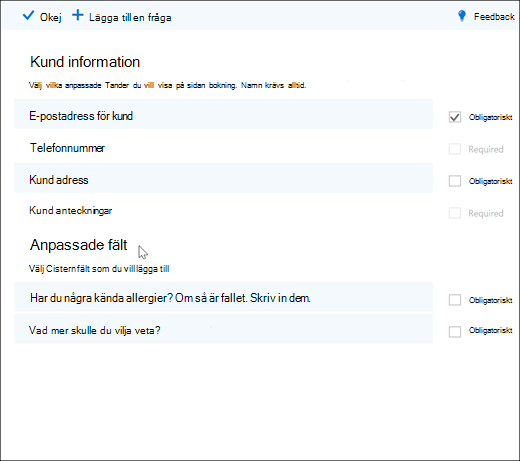
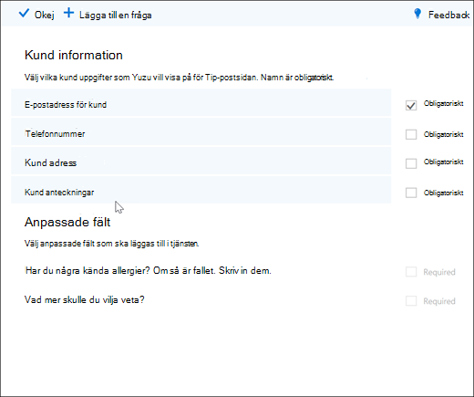
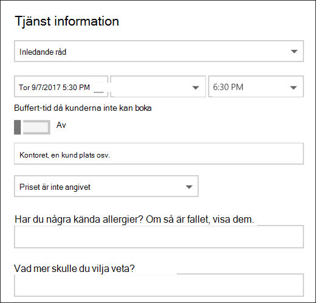

# Lägga till anpassade och nödvändiga frågor på boknings sidan

Med hjälp av bokningar kan du skapa frågor för att be dina kunder om att de bokar avtalade tider. Du kan också välja vilka frågor som krävs.

Du kopplar frågorna till en tjänst så att varje tjänst kan ha olika uppsättningar frågor. Ett hår stylist kan till exempel be kunder som bokar ett hår avtalad tid om de har kända allergier för blekande och nyanser. Då kan du och dina kunder Spara tid när de anländer till den avtalade tiden.

Kunderna ser de anpassade frågorna när de skapar den avtalade tiden på boknings sidan. Personalen ser de anpassade frågorna när de skapar en ny bokning från kalendern kalender eller när du visar en befintlig avtalad tid. Alla dina frågor sparas i en huvud lista så att du inte behöver återskapa samma frågor för varje tjänst. Du kan också välja om frågor är obligatoriska eller valfria.

> [!NOTE]
> Kundernas svar på frågorna kan ses när du tittar på deras avtalade tider i kalender.

Mer information om hur du anpassar och anpassar boknings sidan finns i [Anpassa din boknings sida](customize-booking-page.md).

## Lägga till anpassade frågor för dina tjänster

1. Logga in på Microsoft 365 och gå till **bokningar**.

1. Gå till **tjänster** och redigera en befintlig tjänst eller **Lägg till en tjänst**.

1. Rulla ned till området **anpassade fält** och välj sedan **ändra**.

   Vi har redan lagt till grundläggande kund information frågor: e-post, telefonnummer, kund adress och kund anteckningar. Första gången du gör det är frågorna för kund information markerade i grått. Det innebär att användaren kan se den här frågan. Om du väljer frågan försvinner markerings rutan runt den och din kund kommer inte att bli tillfrågad om den frågan.

   I det här exemplet har telefonnummer och kund anteckningar stängts av och vi har skapat två nya anpassade frågor att fråga.

   

1. Om du vill göra frågan obligatorisk markerar du kryss rutan **obligatoriskt** . Din kund kommer inte att kunna slutföra bokningen förrän de har besvarat de frågor som krävs.

1. Om du vill skapa en egen fråga väljer du **Lägg till en fråga** längst upp på panelen. Skriv frågan och välj sedan **Spara**.

1. Klicka på frågan för att aktivera den. En markerad ruta visas runt den och frågan är aktive rad.

1. Klicka på **OK** högst upp på sidan och **Spara sedan tjänsten**.

Bokningarna sparar alla dina anpassade frågor i en huvud lista så att du enkelt kan lägga till frågor för varje tjänst utan att behöva skriva samma frågor flera gånger. Om du till exempel öppnar en annan tjänst visas den fråga som du skapade för den första tjänsten i avsnittet anpassade fält, men den få vara inaktive rad. Klicka på frågan så att en markerad rektangel visas och att frågan är aktive rad.

I det här exemplet kan du se att de frågor som lagts till för den första tjänsten är tillgängliga för den här tjänsten. Alla frågor som du skapar för den här tjänsten är tillgängliga för alla tjänster.

   

Om du redan har publicerat din boknings sida behöver du inte göra något annat. Kunderna kan se frågorna nästa gång de följer med dig. Om du inte har publicerat din boknings sida ännu går du till **sidan bokning** från Outlook på webben och väljer sedan **Spara och publicera**.

> [!WARNING]
> Du kan också ta bort frågor från huvud listan. Om du tar bort en fråga kommer den att tas bort från varje tjänst. Vi rekommenderar att du inaktiverar frågan genom att välja den för att se till att du inte påverkar några andra tjänster. Du kan se att en fråga är avaktiverad om den inte omges av en markerad rektangel.

## Kund upplevelse

När dina kunder gör en avtalad tid med dig, visas de grundläggande kund uppgifterna i avsnittet **lägga till information** . Alla anpassade frågor som du lägger till visas i avsnittet **Ange ytterligare information** .

## Personal upplevelse

När dina kunder bokar en avtalad tid med dig kommer personalen att se frågorna och kundernas svar i boknings kalendern. Visa den **genom att gå till** \> **kalender** och öppna en avtalad tid.

