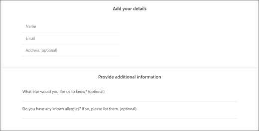

# Lägg till anpassade och nödvändiga frågor till bokningssidan

Med Bookings kan du skapa frågor för att ställa dina kunder när de gör bokningsbokningar. Du kan också välja vilka frågor som krävs.

Du kopplar frågorna till en tjänst, så att varje tjänst kan ha olika uppsättning frågor. En hårstylt kan exempelvis fråga kunder som bokar en avtalad tid med hårfärg om de har kända allergier på nyanser eller utserer. På så sätt kan du och dina kunder spara tid när de kommer till den avtalade tiden.

Kunderna kommer att se de anpassade frågorna när de skapar sin avtalade tid på bokningssidan. Personalen kommer att se de anpassade frågorna när de skapar en ny bokning från Bookings-kalendern eller när de visar en befintlig avtalad tid. Bookings sparar alla dina frågor i en huvudlista så att du inte behöver skapa samma frågor för varje tjänst på nytt. Du kan också välja om frågor krävs eller är valfria.

> [!NOTE]
> Du ser kundens svar på frågorna när du tittar på deras avtalade tid i bokningskalendern.

Mer information om hur du anpassar och anpassar din bokningssida finns på [Anpassa din bokningssida.](customize-booking-page.md)

## Lägga till anpassade frågor till dina tjänster

1. Logga in på Microsoft 365 och gå till **Bookings.**

1. Gå till **Tjänster och** redigera en befintlig tjänst eller Lägg till **en tjänst.**

1. Rulla ned till **avsnittet Anpassade** fält och välj sedan **Ändra**.

   Vi har redan lagt till några grundläggande frågor om kundinformation: e-post, telefonnummer, kundadress och kundanteckningar. Första gången du gör detta markeras frågorna om kundinformation i grått. Det innebär att användaren kommer att se den här frågan. Om du väljer frågan försvinner markeringsrutan runt den och kunden kommer inte att tillfrågas om den frågan.

   I det här exemplet har telefonnummer och kundanteckningar inaktiverats och vi har skapat två nya anpassade frågor att ställa.

   

1. För att göra frågan obligatorisk markerar du **kryssrutan** Obligatorisk. Kunden kan inte slutföra boknings efter att han eller hon har besvarat de frågor som krävs.

1. Om du vill skapa en anpassad fråga **väljer du Lägg till** en fråga högst upp i panelen. Skriv din fråga och välj sedan **Spara**.

1. Aktivera frågan genom att klicka på den. En markerad ruta visas runt den och frågan aktiveras.

1. Klicka **på** OK högst upp på sidan och sedan **på Spara tjänsten.**

Bookings sparar alla dina anpassade frågor i en huvudlista så att du enkelt kan lägga till frågor till varje tjänst utan att behöva ange samma frågor flera gånger. Om du till exempel öppnar en annan tjänst, visas frågan du skapade för den första tjänsten i avsnittet Anpassade fält, men det vill sig vara inaktiverat. Klicka på frågan så att en markerad rektangel visas och frågan aktiveras.

I det här exemplet kan du se att frågorna som har lagts till för den första tjänsten är tillgängliga för den här tjänsten. Alla frågor som du skapar för den här tjänsten blir tillgängliga för alla tjänster.

   

Om din bokningssida redan är publicerad behöver du inte göra något mer. Kunderna kommer att se frågorna nästa gång de bokar in dig. Om din bokningssida inte har publicerats än går du till bokningssidan från sidan Outlook på webben och väljer **Spara och publicera.** 

> [!WARNING]
> Du kan också ta bort frågor från huvudlistan. Men om du tar bort en fråga tas den bort från alla tjänster. Vi rekommenderar att du inaktiverar frågan genom att välja den för att säkerställa att du inte påverkar några andra tjänster. Du kan se att en fråga är inaktiverad om den inte omges av en markerad rektangel.

## Kundupplevelse

När dina kunder bokar en tid med dig visas frågor om grundläggande kundinformation i **avsnittet Lägg till information.** Alla anpassade frågor som du lägger till finns **i avsnittet Ange ytterligare information.**

## Personalupplevelse

När dina kunder bokar ett möte med dig ser din personal frågorna och kundens svar i bokningskalendern. Du visar den  genom att gå till \> **Bookings-kalendern och** sedan öppna en avtalad tid.

