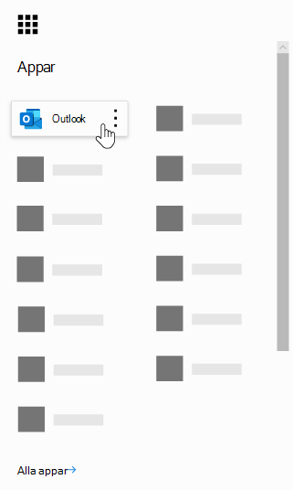
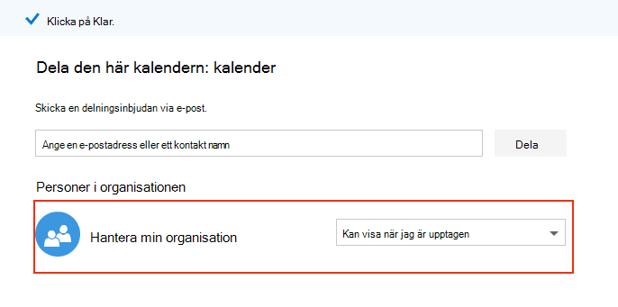
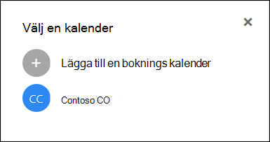

# Vanliga frågor och svar om Microsoft-bokningar

## Allmänt

### Vad är Microsoft-bokningar?

Microsoft-bokningar är en Microsoft 365-app som gör det enkelt att schemalägga och hantera avtalade tider. Bokningar incudes en webbaserad boknings kalender och integreras med Outlook för att optimera personalens kalender, vilket ger kunderna flexibilitet att boka en tid som passar dem bäst. Automatiska e-postaviseringar minskar inga-program och organisationer sparar tid med minskad återkommande schemaläggning. Med hjälp av bokningar kan du enkelt hålla avtalade tider via Skype eller Microsoft Teams och det hjälper dig att hantera daglig schemaläggning via programmet program i Teams. Med inbyggd möjlighet att anpassa är bokningarna utformad för att möta behoven hos flera delar av organisationen.

### Hur använder jag Microsoft-bokningar?

Bokningar är en online tjänst så du behöver inte ladda ner något. Gå bara till program väljaren i Microsoft 365-webbupplevelsen. Administratörer kan även använda appen program för att vara uppdaterad med den senaste informationen om kunder och deras avtalade tider.

### Vem har åtkomst till Microsoft-bokningar?

Bokningar är tillgängliga och aktiva som standard för Microsoft 365 Business Premium, A3, A5, E3 och E5 kunder i hela världen. Bokningar är också tillgängliga i Office 365 som drivs av 21Vianet.

### Ser mina kunder min personliga eller företags kalender?

Kunderna ser bara den kalender som du publicerar online för de tjänster, tider och personal du väljer att registrera.

### Hur kommer användarna åt programmet program vara?

Alla som har en licens för Microsoft 365 Business Premium, A3, A5, E3, E5 eller har lagts till som anställd i antingen administratörs-eller visnings programs roller kan komma åt bokningar i program väljaren i Microsoft 365 webb miljö. Det finns också en Companion-app för iOS och Android.

### Kan jag använda bokningar på min egen webbplats?

Ja. Vi tillhandahåller ett sätt för att bädda in kalender kalendrar på webbplatsen via en iFrame. Länk inbäddnings kod finns på fliken **boknings sida** i programmet program.

### Kan jag använda bokningar även om jag inte har en webb sida för företaget?

Ja. Vi tillhandahåller en länk till din boknings sida på fliken **boknings sida** i webb programmet. Du behöver bara ange länken till dina kunder eller klienter och de kommer att se den senaste tillgängliga informationen för ditt företag. Alternativt kan du dela boknings sidan i ett socialt medium eller till och med använda funktionen bädda in för att hantera den i en iFrame. Du kan också kontrol lera vilka som har åtkomst till sidan genom att inaktivera indexering av direkt sökmotorer och begränsa åtkomsten till bara dem i organisationen.

### Kan IT-avdelningen kontrol lera om slutanvändare kan komma åt bokningar?

Bokningar finns i Business Premium, M365 a3/A5 och E3/E5 klient organisationer som standard, men administratörer kan inaktivera funktionen i Microsoft 365 Admin Center om de väljer. Gör det genom att [följa de här instruktionerna](turn-bookings-on-or-off.md).

Om en kund vill inaktivera åtkomst till bokningar för vissa kvalificerade licenser i sin klient organisation kan de antingen använda en grup princip för att begränsa licenser eller implementera en OWA-postlåda som begränsar vem som kan skapa nya kalender kalendrar.

Om du använder en princip för OWA-postlådan för att inaktivera åtkomst till bokningar, kommer alla användare att ha en boknings licens, men när de försöker komma åt programmet kommer de bara att lyckas om de är en del av principen eller om de har lagts till i en befintlig boknings kalender som personal. Information [här](turn-bookings-on-or-off.md) i avsnittet "Tillåt endast valda användare att skapa kalender kalendrar".

### Är bokningar anpassningsbara?

Ja, bokningarna är anpassningsbara och kan användas i olika situationer. När du skapar en boknings kalender kan många aspekter av den webbaserade tids planerings sidan, din företags information, dina tjänste typer och schemaläggnings principer anpassas.

### Finns alla funktioner i det ursprungliga webb programmet i Microsoft Teams?

En lättviktig version av bokningar är nu tillgänglig som ett program i Teams. Hitta den första aviseringen [här](https://www.microsoft.com/microsoft-365/blog/2020/03/06/empowering-care-teams-with-new-tools-in-microsoft-365/). Det finns en djupgående länk-funktionalitet som kan visas i webbappen och efter installation är det dags för dags att använda bokningar utan att behöva lämna team. Informationen flödar över flera plattformar.

### Är det bara att boka ett företag eller en företags tjänst?

Bokningar är en perfekt lösning för både företags-och småföretags kunder i olika branscher. Använd exempel:

- Finansiella tjänster
    - uppslag
    - Bank-och försäkrings tjänster
    - moms registreringar

- Personalavdelningen
    - kandidat intervjuer
    - Onboarding
    - stöd för förmåner
    - utbildning och seminarier

- Sjukvård
    - patient besök
    - samarbete mellan leverantörer
    - försäkring rådfrågar

- Statliga & offentliga sektorn
    - domstols förhör och försök
    - offentliga tjänster
    - avtalade tider för avdelningar

- Utbildning – K-12
    - konferenser med överordnad lärare
    - Skol stadens Hall
    - besök på elev-rådgivning

- Utbildning--högre ed
    - Kontors tid
    - undervisning
    - elev tjänster
    - examens registrering

- Detaljhandel
    - assisterad shopping
    - entreprenörs planering
    - design tjänster

- Allmänna företags-och småföretags behov
    - kund-och klient möten
    - teknisk support
    - juridisk granskning
    - enheter

## Priser och licenser

### Hur skaffar jag Microsoft-bokningar?

Bokningar finns i Microsoft 365 för kunder med licenserna Business Premium, A3, A5, E3 och E5 tillsammans med en app för iOS och Android. Bokningar är inte tillgängliga som en fristående app. Outlook Web App eller Outlook på webben måste vara aktiverat för att du ska kunna använda bokningar eftersom det lagrar data i Outlook.

En boknings licens ger full funktionalitet för produkten, inklusive att skapa och hantera kalendrar. Det gör det möjligt för användarna att visa och redigera befintliga kalendrar, när dessa användare läggs till som personal i en administratörs-eller visnings roll.

### Måste jag migrera mitt e-postkonto från min nuvarande leverantör till Microsoft 365?

Du kan behålla din nuvarande leverantör, men alla meddelanden skickas till e-postmeddelandet som används i ditt Microsoft 365-konto.

### Kan mina anställda använda bokningar utan ett Microsoft 365-konto?

Ja. Du kan lägga till din personal med ett e-postmeddelande och de kommer att få e-postbekräftelsen och kalender inbjudan när någon gör en bokning för en avtalad tid.

### Kan jag skapa fler än en kalender under samma Microsoft 365-konto och växla mellan dem?

Ja. Du kan skapa och hantera mer än en kalender med ett konto. Du kan växla mellan dem med cirkumflex bredvid företags namnet i webb programmet.

### Vad händer om min organisation har blandade licenser med F1/F3, E1 och E3/E5?

Vi erkänner att många organisationer har en blandning av Microsoft 365-licensiering. Till exempel kan en kund ha M365 E3-licenser för anställda i sitt huvud kontor, men M365 E1-licenser (eller F1-eller F3) för sina anställda.

I det här exemplet har huvud gruppen anställda med M365 E3-licens full till gång till bokningar, vilket innebär att de kan skapa nya kalendrar, redigera inställningar, lägga till personal, publicera en boknings sida, skapa och hantera avtalade tider i kalendern och hämta rapporter.

De som lagrar en anställd med E1/F1/F3-licenser, eller utan licenser, kan fortfarande läggas till som personal i kalendrar i en gäst roll och sedan boka för avtalade tider och de får bekräftelse via e-post när de har bokats. De kan fortfarande bokas under de tillgängliga/schemalagda timmarna som visas på fliken personal. De bookable tiderna för kalender tillgänglighet efter deras inställda timmar och service tider.

Butiks Personalen kommer också att visas som otillgänglig i bokningarna om en avtalad tid redan har schemalagts vid den tidpunkten via webb programmet. Avtalade tider som bokas via bokningar visas som upptagna i en personal medlems kalender i bokningar. Personal som har en aktive rad licens kan fortfarande ha sin personliga kalender som påverkar deras tillgänglighet i bokningarna, förutsatt att de är inom samma klient organisation.

Personer i gäst rollen kan visa den information kunden har lämnat i skapa den första avtalade tiden. Till exempel, om butiken som är bokad för den avtalade tiden måste ringa kunden före den avtalade tiden får de till gång till den information kunden tillhandahåller under schemaläggningen. Personal medlemmen som är bokad kommer att ha till gång till all information som visas i bekräftelse-e-postmeddelandet, samt. ICS-händelsen (till exempel kund telefonnumret).

Personer i gäst rollen har inte möjligheten att komma åt webb programmet för bokningar för att ändra inställningar eller Visa och hantera avtalade tider (Lägg till, Avbryt och schemalägga). De kan dock göra avtalade tider åt kunder via självbetjänings sidan på samma sätt som en kund gör en avtalad tid.

Vi rekommenderar att du licensierar en företags chef eller administratör för varje butik med en boknings licens för att konfigurera och hantera sidor och avtalade tider. Resten av personalen kommer då att arbeta med den anställde med bokningar för att omplanera eller annullera en bokning.

## Produkt funktioner

### Var visas kalendrar i min Microsoft 365-klient organisation? * *

Varje ny boknings kalender skapar en motsvarande post låda i Exchange, samt en tillhör ande post i Azure Active Directory (AAD), där posten visas som en olicensierad användare.

### Kan jag ta bort en tidigare skapad kalender?

Du måste ta bort den associerade post lådan i Exchange för att kunna ta bort en kalender.

### Om jag skapar en kalender och någon annan har till gång till bokningar kan han eller hon se min kalender?

De enda personer som har till gång till kalender kalendrar som du skapar (via Web App) är alla som har lagts till som personal, i antingen administratörs-eller visnings rollen. Klient organisationer kan se en lista över alla post lådor i Exchange och AAD.

### Är video konferens möten integrerade i programmet bokningar?

Onlinemöten är tillgängliga i bokningar när du använder Skype-eller Microsoft Teams-klienter. Onlinemöten kan aktive ras på tjänst nivå och den Mötes klient du väljer (Skype eller teams) blir den som är inställd som standard för personal medlemmar. Om du vill ansluta till onlinemöten har varje ny avtalad tid en unik Mötes länk kopplad till den avtalade tiden och dessutom är det enkelt att gå med e-postalternativ.

### Hur fungerar schemaläggnings princip?

En inställning som kallas för **maximal ledtid** bestämmer det längstaste i förväg (mätt i dagar) då en bokning kan göras. Det måste vara minst 24 timmar mellan den **minsta produktions tiden** (den minsta produktions tiden, i timmar, för bokningar och annulleringar) och maximal ledtid. Maximal ledtid kan anges till en dag om den minsta ledtiden är inställd på 0 timmar, vilket i det här fallet innebär att en kund kan annullera en bokning fram till den tidpunkt då den startas och kunderna kan bara schemalägga bokningar om den avtalade tiden sker inom följande dag.

:::image type="content" source="media/bookings-faq-scheduling.png" alt-text="Schemaläggning i bokningar":::

### Hur fungerar det med olika tids zoner?

Alla tider är i arbets tids zonen (din lokala tidszon) som standard. Det innebär att alla inställningar du konfigurerar för en kalender, till exempel arbets tid, visas i den här tids zonen. Självbetjänings sidan har möjlighet att visa alla tider för avtalade tider i tids zonen för slutanvändare, som kan stängas av om du vill.Om **Visa inte tids luckor i affärs tids zonen** är avmarkerad på fliken sida med flikar visas tids luckor i sina egna lokala tids zoner.

:::image type="content" source="media/bookings-faq-region.png" alt-text="Inställningar för region och tidszon":::

Det finns ingen möjlighet att ställa in tidszon för personal i bokningar. Tids zonen för personalen och därmed kontors tid är i affärs tids zonen.

### Kan e-postaviseringar skickas som klient organisationens domän namn?

E-postadresserna kontrol leras och hanteras på nivån Microsoft 365-inställningar och beror på domänens konfigurations inställningar där. Mer information finns [här](https://docs.microsoft.com/powershell/module/exchange/mail-flow/get-accepteddomain?view=exchange-ps).

### Är det möjligt att skicka SMS-meddelanden beroende på en annan tjänst eller specifik konfiguration?

SMS-meddelanden är för närvarande tillgängliga i Nord Amerika och ett Skype-eller Twilio-konto används för SMS-leverans.

### Hur kan de avtalade tider visas i en persons kalender?

Bekräftelsen på bokningen skickas till både tjänste leverantörens och mottagarens inkorgar. Bekräftelse meddelandet innehåller en *. ICS-fil, som sedan kan läggas till i användarens kalender med all relevant information om avtalade tider.

### Vilken utlösare är tjänste leverantör eller personal och kund e-post?

E-postmeddelanden utlöses baserat på Inställningar på fliken tjänster i webb programmet. En bokning som görs av kunden på Self Service-sidan, eller på fliken Kalender i webb programmet bokningar, utlöser en bekräftelse och/eller en påminnelse via e-post. Samma sak inträffar när någon gör ändringar i bokningen via knappen **Hantera bokning** i bekräftelse-e-postmeddelandet eller i webb programmet. Påminnelse meddelanden skickas vid en viss tids period före en avtalad tid, enligt beskrivningen på fliken tjänster i webb programmet.

### Kan jag boka avtalade tider i klass rummet som är 1: många i stället för 1:1?

Ja, vi har en grupp funktioner som gör att flera personer kan boka samma avtalade tider (till exempel för en tränings klass). Denna funktion beskrivs i detalj [här](https://techcommunity.microsoft.com/t5/microsoft-bookings-blog/microsoft-bookings-now-supports-online-meetings-and-group/ba-p/1214120).

### Kan kalendrar förbli avpublicerade (inte publikt), men är ändå tillgängliga för avsedda användare?

Ja. Det finns en kryss ruta på fliken boknings sida i webb programmet: **Kräv ett Microsoft 365-eller Office 365-konto från min organisation till bok**. Om du markerar den här kryss rutan begränsas åtkomst för självbetjäning till bara de som är inom din klient organisation. Det går bara att få åtkomst till de personer som har lagts till som personal på sidan med administratörs-eller visnings roller.

:::image type="content" source="media/bookings-faq-access-ctrl.png" alt-text="Åtkomst kontroll för boknings sida i bokningar":::

### Hur ofta uppdateras start sidan?

De senaste data som är kopplade till start sidan hämtas när webb programmet laddas. Mer information om vilken typ av information som spåras av bokningar finns i [artikeln om stöd](metrics-and-activity-tracking.md).

### Kan jag stänga av e-postaviseringar för timeout?

Inspelning av ledig tid i webb programmet i bokningar kommer alltid att utlösa ett e-postmeddelande till personalen. Om en anställds medlemmar förvirrar över meddelandet rekommenderar vi att du lägger till mer information i antecknings rutan eller rubriken för tid för att få bättre underrättelse om vad som händer på administratörs sidan.

### Kan kalendrarna klonas eller dubbleras och de kan vara templatized för enkel skalning?

Det går för närvarande att duplicera sidor med hjälp av PowerShell. Processen ska använda Graph API för att få information om post lådan och sedan använda dessa uppgifter för att skapa en ny post låda. API-dokumentation finns [här](https://docs.microsoft.com/graph/api/resources/booking-api-overview?view=graph-rest-beta).

### Vilken rapportering är tillgänglig i bokningar?

Alla personal som tilldelats administratörs rollen kan ladda ned ett tabbavgränsade värde (. TSV) med alla bokningar gjorda under de senaste 120 dagarna. Boknings rapporter kan laddas ned. TSV-formuläret från fliken Start på sidan bokningar. Boknings-API: t kan också användas för att samla in dessa data för mer anpassade och specifika ändamål.

### Är det möjligt att bara dela en tjänst på självbetjänings sidan åt gången?

Ja, du kan antingen skapa separata kalender kalendrar för varje tjänst, eller så kan du gå till fliken tjänster, redigera en tjänst och högst upp på sidan Visa ett alternativ för att dela en URL-adress för just den tjänsten.

### Vilka alternativ finns det för att bädda in ett godkännande formulär eller upplysning om en avtalad tid?

Vi rekommenderar att du aktiverar kryss rutan för **godkännande av kund data användning** på sidan bokning och anpassar formuleringen för att korrekt förmedla organisationens upplysningar om eller medgivande. Ett annat alternativ är att lägga till ett anpassat fält i tjänsten som innehåller en länk till medgivande formuläret och begära att kunderna bekräftar att de har slutfört formuläret innan de kan fortsätta att göra en avtalad tid. Du kan också lägga till URL-adressen till medgivande formuläret som ytterligare anteckningar i e-postmeddelanden och påminnelser, men detta förhindrar inte att användare bokar en avtalad tid.

### Vilka ändringar kan göras för personal urvals funktionen på sidan självbetjänings bokning?

Möjligheten för kunder att välja specifika personalen när du boka kan tas bort helt genom att avmarkera kryss rutan **Tillåt kunder att välja en specifik person för boknings** alternativet på sidan bokning eller tjänster. Bokningarna tilldelar automatiskt en tillgänglig personal medlem till bokningen baserat på tillgängligheten för personalen.

### Kan bokningar hantera flera samtidiga boknings förfrågningar och självbetjänings sidor?

Bokning kan stödja en stor mängd besökare och bokningar samtidigt. Om sidan upplever en mycket stor volym av trafiken får användarna ett fel meddelande om att det är upptaget. Tillgängligheten för avtalade tider uppdateras när sidan läses in samt när en bokning görs. Om flera personer försöker boka samma avtalade tider på en gång, kommer endast en person åt gången att skicka ett meddelande till de andra potentiella kunderna och ber dem att hitta en annan tid.

## Sekretess

### Var lagras uppgifter i bokningarna?

Bokningar är en Microsoft 365-app, vilket innebär att alla data lagras i Microsoft 365-plattformen och i Exchange. Bokningarna följer alla principer för data lagring som har angetts av Microsoft, som är samma principer följt av alla Office-program. I bokningarna används delade post lådor i Exchange för att lagra uppgifter om kunder, personal, tjänster och avtalade tider. Efterlevnadsprinciper för delade post lådor i Exchange gäller även för post lådor. Alla kunduppgifter (inklusive information från kundernas uppgifter när bokningar) samlas in i bokningar och lagras i appen, och sparas därför i Exchange. I Microsoft-bokningarna används samma principer som i Microsoft 365, som du kan hitta [här.](https://www.microsoft.com/online/legal/v2/?docid=22&langid=en-us)

### Finns det något sätt att centralt hantera kalendrar för alla användare?

Varje boknings kalender underhålls oberoende. Det finns ingen övrig annan vy än den nedrullningsbara listan Sök när du har klickat på text markören på Start sidan.

### Hur autentiseras användare?

Till gång till webb programmet bokningar inbegriper att verifiera via den vanliga Azure Active Directory-autentiseringsprocessen (AAD). Självbetjänings sidan kan göras tillgänglig för alla som har länken webb sida. Men när alternativet **Kräv att ett Microsoft 365-eller Office 365-konto från min organisation** till bok inställning är markerat är sidan begränsat för användning inom Microsoft 365-klient organisationen (med hjälp av AAD-identifiering).

:::image type="content" source="media/bookings-faq-access-ctrl.png" alt-text="Åtkomst kontroll för boknings sida i bokningar":::

### Lämnar kunddata av produktions systemet någon anledning?

Ja, eftersom det är en del av Exchange är det möjligt att använda API: er i Graph och Exchange Web Services (EWS) för kunderna för att ladda ner sina egna uppgifter.

### Är det möjligt att anpassa e-postadresser för kund svar?

Du kan ange vilken e-postadress kunderna skickar sina svar till. Den här inställningen finns på fliken **företags information** . Post lådans namn kan också ändras i Exchange genom att byta namn på vanliga Exchange-postlådor.

### Vi skulle vilja för kunden att acceptera våra villkor under boknings processen. Är det möjligt?

Den här funktionen finns redan för GDPR efterlevnad. Boknings sidan har ett fält för anpassat medgivande, direkt under avsnittet publicerings information. Markera rutan och skriv ett eget anpassat medgivande meddelande så visas det som ett obligatoriskt fält på Self Service-sidan. Det datum och den tid då kunden beviljar medgivande kommer att registreras.

Det här avsnittet innehåller inte stöd för RTF-format, men det går att lägga till länkar i avsnittet företags information och då visas det under medgivande.

### Hur kan bokningar-associerade post lådor i Exchange identifieras?

Med följande kommando kan du hämta information om alla post lådor och användare som har till gång till dem.

`Get-Mailbox -RecipientTypeDetails SchedulingMailbox -ResultSize:Unlimited | Get-MailboxPermission |Select-Object Identity,User,AccessRights | Where-Object {($\_.user -like '\*@\*')}`

## Tekniska frågor

### Om en användare schemalägger en avtalad tid för en tjänst som består av ett onlinemöte, hur tar de emot Microsoft Teams-länken till mötet om de lämnar fältet för den valfria e-postadressen tomma?

Om systemet inte har någon e-postinformation för kunden är det inte möjligt att bekräfta att e-posten skickas till kunden, och därför kommer de inte att få en team länk. Lösningen är att ange e-postadressen som ett obligatoriskt fält, som du kan göra på fliken tjänster i bokningarna. Observera att när du skapar en ny tjänst i en bokföring är fältet för kund-e-post angivet som ett obligatoriskt fält som standard.

### Hur är personal tilldelad till avtalade tider när "alla" är markerad, eller när kunder inte har möjlighet att välja en personal medlem för den avtalade tiden?

Personalen tilldelas slumpmässigt i dessa scenarier, från alla tjänste medlemmar som är tillgängliga vid tiden för den avtalade tiden. För närvarande finns det inget sätt att säkerställa en lika stor fördelning av slumpmässigt tilldelade avtalade tider för alla medlemmar i personalen, eller för att koppla antalet avtalade tider till varje personal medlem. Om det finns en belastnings utjämning som måste göras för varje anställd efter ett antal slumpmässiga tilldelningar kan du utföra den manuellt på fliken Kalender på sidan bokningar.

### Hur kan användarna avanmäla SMS-meddelanden om de redan har valt tidigare?

När en avtalad tid med SMS-textmeddelanden är aktive rad uppmanas kunderna att markera kryss rutan opt in varje gång de bokar. Kunder kan även svara direkt på SMS-meddelandet (SMS-leverantören) som indikerar att meddelandena upphör, och sedan skickas inga ytterligare texter till det telefonnumret. Om kunden inte väljer att ta emot SMS från leverantören, inte längre från själva bokningarna, får de inga meddelanden i framtiden, även när de vanligt från sidan bokningar.

## Felsökning

### Den här personal medlemmens kalender kan inte synkroniseras

Om du får fel meddelandet "det går inte att synkronisera den här personal medlemmens kalender", innehåller det här avsnittet flera fel söknings procedurer som hjälper dig att lösa problemet.

> [!NOTE]
> Bokningar är som standard aktiverade för kunder som har Microsoft 365 Business Standard, Microsoft 365 a3 eller Microsoft 365 A5. Bokningar är också tillgängliga för kunder som har Office 365 Enterprise E3 och Office 365 Enterprise, E5, men det är inaktiverat som standard. Kom igång genom att läsa [få till gång till Microsoft-bokningar](get-access.md). Om du vill aktivera eller inaktivera uppslagning kan du läsa [Aktivera och inaktivera en organisation](turn-bookings-on-or-off.md).

Om du letar efter information om hur du synkroniserar personalens kalender kan du läsa [lägga till personal i bokningar](add-staff.md). Se till att informationen **i kalendern påverkar tillgängligheten** på sidan **personal information** .

### Personal medlemmen måste ändra sina kalender behörigheter

För att anteckningarna ska synkroniseras korrekt med personalens kalendrar måste alla medlemmar dela sin kalender. Varje medlem måste följa dessa instruktioner för att dela sin egen kalender.

1. Logga in på Microsoft 365 och välj sedan **Outlook** från Start programmet.

   

1. Välj **dela** kalender högst upp på sidan \> **Calendar**.

   

1. I avsnittet **personer i din organisation** väljer du List rutan bredvid **min organisation**och väljer sedan **Visa när jag är upptagen**.

> [!NOTE]
> Med den här inställningen kan du dela med dig av dina ledig/upptagen-uppgifter med bokningar och andra användare i organisationen. Den innehåller inte någon annan information, till exempel vilken typ av avtalad tid du har schemalagt, vem du har schemalagt avtalad tiden med eller platsen.

   

1. Välj **klar**.

### Vi kan inte hitta personal medlemmar i vår organisation

Om en anställd har lämnat företaget och tagit bort dem från din Microsoft 365-eller Office 365-organisation måste du ändå ta bort denna användare från bokningarna så att de inte visas i kalendern och för att förhindra att kunder bokar avtalade tider med dem.

1. Logga in på Microsoft 365 och gå sedan till **boknings** \> **personal**.

1. Placera mus pekaren över namnet på personal medlemmen. **Redigera** och **ta bort** ikoner visas till höger om kolumnen **telefon** .

1. Välj ikonen **ta bort** .

1. Välj **OK**i bekräftelse rutan.

> [!NOTE]
> Om du har fler än en boknings kalender måste du ta bort användaren från alla.

Om du vill kontrol lera om du har fler än en kalender väljer du pilen i den nedrullningsbara List rutan bredvid företagets namn och väljer sedan **Öppna**. Om du bara har en kalender visas bara alternativet för att lägga till en boknings kalender. Det här exemplet visar att det finns en andra kalender med namnet "contoso CO".

   

### Det finns ett synkroniseringsfel som vi inte kan identifiera

Det här är ett tillfälligt fel och det uppstår vanligt vis på grund av en instabil Internet anslutning. Dessa problem brukar lösas efter några minuter.

Om du fortfarande får det här felet efter en längre tid eller om du ser det ofta kan du kontakta supporten.

## Ytterligare resurser

  - [Microsoft-bokningar expanderar tillgänglighet i företags bloggen](https://techcommunity.microsoft.com/t5/microsoft-bookings-blog/microsoft-bookings-expands-availability-in-enterprises/ba-p/1214065)

  - [Så här fungerar Microsoft-bokningar](https://support.office.com/article/microsoft-bookings-69c45b78-6de4-4f28-9449-cdcc18b7ae45)

  - [Börja använda Microsoft-bokningar](get-access.md)

  - [Aktivera eller inaktivera Microsoft-bokningar](turn-bookings-on-or-off.md)

  - [Lägga till användare individuellt eller i bulk](https://docs.microsoft.com/microsoft-365/admin/add-users/add-users?view=o365-worldwide.)

  - [Lägga till personal i bokningar](add-staff.md)

  - [API-komponenter som ska automatiseras efter att mallen har definierats](https://docs.microsoft.com/graph/api/bookingbusiness-post-bookingbusinesses)

  - [URL till kalender för att Visa](https://outlook.office.com/bookings/calendar)

  - [Principer för efterlevnadsprinciper](https://docs.microsoft.com/microsoft-365/compliance/gdpr-dsr-office365?view=o365-worldwide#bookings)

  - [Anpassa och publicera boknings sidan](customize-booking-page.md)

  - [Konfiguration av klient post lådor](https://docs.microsoft.com/powershell/module/exchange/mail-flow/get-accepteddomain?view=exchange-ps)

  - [Grupp bokningar](https://techcommunity.microsoft.com/t5/microsoft-bookings-blog/microsoft-bookings-now-supports-online-meetings-and-group/ba-p/1214120)

  - [Boknings mått och aktivitets spårning](metrics-and-activity-tracking.md)

  - [M365 offentlig översikt](https://www.microsoft.com/microsoft-365/roadmap?filters=&searchterms=bookings)

  - Skicka feedback via [UserVoice](https://outlook.uservoice.com/forums/314907-microsoft-bookings/suggestions/39505261-365-admins-should-have-full-access-to-all-bookings)
