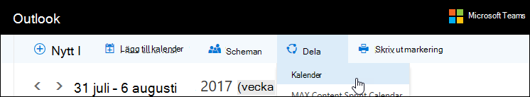

# Vanliga frågor och svar om Microsoft BookingsMicrosoft Bookings Frequently Asked Questions

## AllmäntGeneral

### Vad är Microsoft Bookings?What is Microsoft Bookings?

Microsoft Bookings är en Microsoft 365-app som gör det enkelt att schemalägga och hantera möten.Microsoft Bookings is a Microsoft 365 app that makes scheduling and managing appointments easy. Bookings innehåller en webbaserad bokningskalender och integreras med Outlook för att optimera personalens kalender, så att dina kunder kan boka en tid som passar dem bäst.Bookings includes a Web-based booking calendar and integrates with Outlook to optimize your staff’s calendar, giving your customers flexibility to book a time that works best for them. Automatiska e-postmeddelanden minskar antalet program inte visas, och organisationer sparar tid med en minskning av återkommande schemaläggningsuppgifter.Automated notification emails reduce no-shows, and organizations save time with a reduction in repetitive scheduling tasks. Med Bookings kan du enkelt genomföra virtuella möten via Skype eller Microsoft Teams och hjälper dig att hantera den dagliga schemaläggningen via bookings-appen i Teams.Bookings helps you easily conduct virtual appointments via Skype or Microsoft Teams, and helps you manage day-to-day scheduling via the Bookings app in Teams. Med inbyggd anpassningsförmåga har Bookings utformats för att tillgodose behoven hos flera delar av organisationen.With built-in ability to customize, Bookings is designed to meet the needs of multiple parts of any organization.

### Hur använder jag Microsoft Bookings?How do I use Microsoft Bookings?

Bookings är en onlinetjänst så du behöver inte ladda ned något.Bookings is an online service, so you don't need to download anything. Gå bara till app-väljaren i Microsoft 365 på webben.Just go to the app chooser within the Microsoft 365 Web experience. Administratörer kan också använda Bookings-kompletterande app för att hålla sig informerad om den senaste informationen om kunder och deras avtalade tider.Administrators can also use the Bookings companion app to stay current with the latest information about customers and their appointments.

### Vem har tillgång till Microsoft Bookings?Who has access to Microsoft Bookings?

Bookings är tillgängligt och aktivt som standard för kunder i Microsoft 365 Business Premium, Microsoft 365 Business Standard, A3, A5, E3 och E5 över hela världen.Bookings is available and active by default for Microsoft 365 Business Premium, Microsoft 365 Business Standard, A3, A5, E3, and E5 customers worldwide. Bookings finns även i Office 365 som drivs av 21Vianet.Bookings is also available in Office 365 operated by 21Vianet.

### Kommer mina kunder att se min personliga kalender eller företagskalender?Will my customers see my personal or business calendar?

Kunderna kan bara se den Bookings-kalender som du publicerar online för de tjänster, tider och personal som du väljer att registrera.Your customers will only see the Bookings calendar that you publish online for the services, times, and staff that you choose to register.

### Hur ändrar jag ett bookbart attribut under Hantera personal?How do I change a bookable attribute under Manage staff?

När anställda lades till fick de ett e-postmeddelande för att acceptera eller avvisa begäran.When staff members were added, they would have received an email to accept or reject the request. De kan öppna samma e-postmeddelande och välja Avvisa så att de inte kan bokas.They can open the same email and select "Reject" to make them so that they aren't bookable. Det finns för närvarande inget sätt att växla detta från appen.We currently do not have a way to toggle this from inside the app.

### Hur får slutanvändarna åtkomst till bookings-appen?How do end users access the Bookings app?

Alla som har licens för Microsoft 365 Business Premium, Microsoft 365 Business Standard, A3, A5, E3, E5 eller läggs till som anställd i administratörs- eller visningsrollerna kan komma åt Bookings i app-väljaren i Microsoft 365-webbupplevelsen.Anyone who is licensed for Microsoft 365 Business Premium, Microsoft 365 Business Standard, A3, A5, E3, E5, or is added as a staff member in either the Administrator or Viewer roles can access Bookings in the app chooser within the Microsoft 365 Web experience. Det finns även en medföljande app för iOS och Android.There is also a companion app available for iOS and Android.

### Kan jag använda Bookings på min egen webbplats?Can I use Bookings in my own Web site?

Ja.Yes. Vi tillhandahåller ett sätt för dig att bädda in din Bookings-kalender på din webbplats via en iFrame.We provide a way for you to embed your Bookings calendar in your site via an iFrame. Länk med inbäddningskod finns på **fliken för sidan** Bookings i appen Bookings.Link embedding code is located in the **Bookings page** tab within the Bookings app.

### Kan jag använda Bookings även om jag inte har en webbsida för mitt företag?Can I use Bookings even if I don’t have a Web page for my business?

Ja.Yes. Vi tillhandahåller en länk till din bokningssida på **fliken Bokning** i webbappen.We provide a link to your booking page within the **Booking page** tab in the Web app. Du behöver bara ge den länken till dina kunder eller klienter så ser de den senaste tillgänglighetsinformationen för ditt företag.You just need to provide that link to your customers or clients, and they will see the latest availability information for your business. Alternativt kan du dela bokningssidan i sociala medier eller använda inbäddningsfunktionen för att lagra den i en iFrame.Alternatively, you can share the booking page in social media or even use the embed feature to host it in an iFrame. Du kan också styra vem som kan komma åt sidan genom att inaktivera direktindexering av sökmotor och begränsa åtkomsten till endast de inom organisationen.You also have the ability to control who can access the page by disabling direct search engine indexing and restricting access to only those within your organization.

### Kan IT-avdelningen styra om slutanvändare kan komma åt Bookings?Can our IT department control whether end users can access Bookings?

Bookings finns för klientorganisationen Microsoft 365 Business Premium, Microsoft 365 Business Standard, M365 A3/A5 och E3/E5 som standard, men administratörer kan inaktivera det i administrationscentret för Microsoft 365 om de vill.Bookings is available in Microsoft 365 Business Premium, Microsoft 365 Business Standard, M365 A3/A5 and E3/E5 tenants by default, but administrators can turn it off in the Microsoft 365 admin center if they choose. Följ de här [anvisningarna om du vill göra det.](turn-bookings-on-or-off.md)To do so, [follow these instructions](turn-bookings-on-or-off.md).

Om en kund vill inaktivera åtkomsten till Bookings för vissa kvalificerade licenser i klientorganisationen kan de antingen använda en grupprincip för att begränsa licenser eller implementera en OWA-postlådeprincip som begränsar vem som kan skapa nya Bookings-kalendrar.If a customer wants to disable access to Bookings for certain eligible licenses in their tenant, they can either use a group policy to restrict licenses or implement an OWA Mailbox policy that will restrict who is able to create new Bookings calendars.

Om du använder en OWA-postlådeprincip för att inaktivera åtkomsten till Bookings har alla användare en licens för Bookings, men när de försöker komma åt appen lyckas de bara om de är en del av principen eller om de har lagts till i en befintlig Bookings-kalender som personal.If you use an OWA Mailbox policy to disable access to Bookings, all users will have a Bookings license, however when they attempt to access the app, they will only be successful if they are part of the policy or if they have been added to an existing Bookings calendar as staff. Information [här](turn-bookings-on-or-off.md) i avsnittet "Tillåt endast vissa användare att skapa bookings-kalendrar".Details [here](turn-bookings-on-or-off.md) in the “Allow only selected users to create Bookings calendars” section.

### Är Bookings anpassningsbar?Is Bookings customizable?

Ja, Bookings är anpassningsbart och kan användas för olika scenarier.Yes, Bookings is customizable and can be used for various scenarios. När du ska konfigurera en kalender i Bookings kan många aspekter av den webbaserade schemaläggningssidan, din företagsinformation, personalinformation, tjänsttyper och schemaläggningsprinciper anpassas.When setting up a Bookings calendar, many aspects of the Web-based scheduling page, your business information, staff details, service types, and scheduling policies can be customized.

### Finns alla funktioner i den ursprungliga Bookings-webbappen tillgänglig i Microsoft Teams?Is all the functionality of the original Bookings Web app available in Microsoft Teams?

En lätt version av Bookings finns nu som en app i Teams.A lightweight version of Bookings is now available as an app in Teams. Det första meddelandet är [här](https://www.microsoft.com/microsoft-365/blog/2020/03/06/empowering-care-teams-with-new-tools-in-microsoft-365/).The initial announcement is [here](https://www.microsoft.com/microsoft-365/blog/2020/03/06/empowering-care-teams-with-new-tools-in-microsoft-365/). Det finns djupa länkfunktioner för att komma ut i webbappen, och efter installationen kan den dagliga användningen av Bookings göras utan att lämna Teams.There is deep link functionality to pop out in the Web app, and after setup, day-to-day use of Bookings can be done without ever leaving Teams. Information flödar över plattformar.Information flows across platforms.

### Är Bookings ett litet företagserbjudande eller ett Enterprise-erbjudande eller både och?Is Bookings a small business offering or an Enterprise offering or both?

Bookings är en idealisk lösning för både företags- och småföretagkunder i olika branscher.Bookings is an ideal solution for both Enterprise and small business customers, across various industries. Användningsfall omfattar:Use cases include:

- Finansiella tjänsterFinancial services
    - samrådconsultations
    - bank- och försäkringstjänsterbanking and insurance services
    - skattedeklarationtax filings

- PersonalavdelningenHuman resources (HR)
    - kandidatintervjuercandidate interviews
    - onboardingonboarding
    - hjälp om förmånerbenefits assistance
    - utbildning och seminariertraining and seminars

- SjukvårdHealthcare
    - patientbesökpatient visits
    - provider-to-provider-samarbeteprovider-to-provider collaboration
    - insurance consultsinsurance consults

- Myndigheter & offentlig sektorGovernment & Public Sector
    - domstolsförhandling och domstolsföre rättcourt hearings and trials
    - offentliga tjänsterpublic services
    - avtalade tider på avdelningendepartment appointments

- Education -- K-12Education -- K-12
    - föräldrarmötenparent-teacher conferences
    - school town hallschool town hall
    - besök hos studentrådgivarestudent-counselor visits

- Education – Högre EdEducation -- Higher Ed
    - kontorstidoffice hours
    - ingtutoring
    - elevtjänsterstudent services
    - registrera dig för provexam sign-up

- DetaljhandelRetail
    - assisterad shoppingassisted shopping
    - schemaläggning av leverantörercontractor scheduling
    - designtjänsterdesign services

- Allmänna behov för företag och småföretagGeneral Enterprise and small business needs
    - kund- och kundmötencustomer and client meetings
    - teknisk supporttech support
    - juridisk granskninglegal reviews
    - anläggningarfacilities

## Priser och licenserPricing and licensing

### Hur får jag Microsoft Bookings?How do I get Microsoft Bookings?

Bookings finns i Microsoft 365 för kunder med licenser för Microsoft 365 Business Premium, Microsoft 365 Business Standard, A3, A5, E3 och E5 samt en app för iOS och Android.Bookings is available in Microsoft 365 for customers with Microsoft 365 Business Premium, Microsoft 365 Business Standard, A3, A5, E3, and E5 licenses, along with an iOS and Android companion app. Bookings är inte tillgängligt som en fristående app.Bookings isn't available as a standalone app. Outlook Web App eller Outlook på webben måste vara aktiverade för att du ska kunna använda Bookings, eftersom det lagrar data i Outlook.Outlook Web App or Outlook on the web must be enabled to use Bookings, as it stores data within Outlook.

En Bookings-licens ger tillgång till alla funktioner i produkten, inklusive att skapa och hantera kalendrar.A Bookings license provides full functionality to the product, including creating and managing calendars. Det gör det också möjligt för användare att visa och redigera befintliga kalendrar när dessa användare läggs till som personal med en administratörs- eller visningsroll.It also enables the ability for users to view and edit existing calendars, when those users are added as staff in an Administrator or Viewer role.

### Måste jag migrera mitt e-postkonto från min nuvarande leverantör till Microsoft 365?Do I need to migrate my email account from my current provider to Microsoft 365?

Du kan behålla din nuvarande leverantör, men Bookings skickar alla aviseringar till e-postadressen som används i ditt Microsoft 365-konto.You can keep your current provider, but Bookings will send all notifications to the email used in your Microsoft 365 account.

### Kan mina anställda använda Bookings utan ett Microsoft 365-konto?Can my employees use Bookings without a Microsoft 365 account?

Ja.Yes. Du kan lägga till din personal med valfri e-postadress så att de fortfarande får e-postbekräftelsen och kalenderbjudningar när någon bokar en tid med dem.You can add your staff with any email, and they will still get the email confirmation and the calendar invite when someone books an appointment with them.

### Kan jag skapa mer än en Bookings-kalender under samma Microsoft 365-konto och växla mellan dem?Can I create more than one Bookings calendar under the same Microsoft 365 account and switch between them?

Ja.Yes. Du kan skapa och hantera mer än en Bookings-kalender med ett konto.You can create and manage more than one Bookings calendar with one account. Du kan växla mellan dem med hjälp av caret bredvid namnet på företaget i bookings-webbappen.You can switch between them using the caret next to the business name in the Bookings Web app.

### Vad händer om min organisation har blandade licenser med F1/F3, E1 och E3/E5?What if my organization has mixed licenses with F1/F3, E1, and E3/E5?

Vi känner igen att många organisationer har en blandning av Microsoft 365-licensiering.We recognize that many organizations have a mixture of Microsoft 365 licensing. En kund kan till exempel ha M365 E3-licenser för anställda på huvudkontoret, men M365 E1-licenser (eller F1- eller F3-licenser) för de anställda i butiken.For example, a customer may have M365 E3 licenses for employees in their headquarters, but M365 E1 (or F1 or F3) licenses for their store employees.

I det här exemplet har huvudkontorsanställda med en M365 E3-licens fullständig åtkomst till Bookings, vilket innebär att de kan skapa nya kalendrar, redigera inställningar, lägga till personal, publicera en bokningssida, skapa och hantera avtalade tider i kalendern och hämta rapporter.In this example, the headquarters employees with an M365 E3 license have full access to Bookings, which means they can create new calendars, edit settings, add staff, publish a booking page, create and manage appointments within the calendar, and pull reports.

De här butiksanställda med E1/F1/F3-licenser, eller utan licenser, kan fortfarande läggas till som personal i kalendrar med gästroll och bokas sedan för avtalade tider, och de får bekräftelsemeddelanden när de är bokade.Those store employees with E1/F1/F3 licenses, or with no licenses, can still be added as staff to calendars in a Guest role and then booked for appointments, and they will receive confirmation emails when they are booked. De kan fortfarande bokas under de tillgängliga/schemalagda timmarna som visas på personalfliken. Tillgänglighet i kalendern i Bookings begränsar bokningsbara tider efter deras ange timmar och servicetimmar.They can still be booked during their available/scheduled hours as listed in the staff tab. The Bookings calendar availability constrains bookable times by their set hours and service hours.

Anställda i Store visas också som ej tillgängliga i Bookings om en avtalad tid redan har schemalagts via bookings-webbappen vid den tidpunkten.The store employees will also display as unavailable in Bookings if an appointment has already been scheduled at that time through the Bookings Web app. Bokade tider via Bookings återspeglar den bokade tiden i en anställds kalender i Bookings.Appointments booked via Bookings will reflect as busy on a staff member's calendar within Bookings. Personal som har en licens som inte är en Bookings-aktiverad licens kan fortfarande påverka sin personliga kalenders tillgänglighet i Bookings, förutsatt att de finns inom samma klientorganisation.Staff with a non-Bookings enabled license can still have their personal calendar impact their availability in Bookings, provided they are within the same tenant.

Personer med rollen Gäster kan visa den information som kunden angav när den avtalade tiden skapades.People in the Guests role can view any of the information the customer has provided within the initial appointment creation. Om till exempel butiksrepresentanten som är bokad för den avtalade tiden krävs för att ringa kunden innan den avtalade tiden, har de tillgång till den information som kunden tillhandahåller under schemaläggningsprocessen.For example, if the store representative who is booked for the appointment is required to call the customer prior to the appointment, they will have access to the information the customer provides during the scheduling process. Den anställda som har bokat har tillgång till all information som visas i e-postbekräftelsen och .ics-kalenderhändelsen (t.ex. kundens telefonnummer om det har angetts).The staff member who is booked will have access to all information that appears in the confirmation email, and the .ics calendar event (such as the customer phone number if it was entered).

Personer med gästrollen kan inte komma åt Bookings-webbappen för att ändra inställningar eller visa och hantera avtalade tider (lägga till, avbryta och omboka).People in the Guest role will not have the ability to access the Bookings Web app to change settings or to view and manage appointments (add, cancel, and reschedule). Däremot kan de avtala tider åt kunder på sidan Självbetjäning, på samma sätt som en kund gör en avtalad tid.However, they can make appointments on behalf of customers using the Self-service page, in the same way that a customer would make an appointment.

Vi rekommenderar att du licensierar en business manager eller administratör för varje butik med en Bookings-berättigad licens för att konfigurera och hantera sidor och avtalade tider.We recommend licensing a business manager or administrator of each store with a Bookings-eligible license to set up and manage pages and appointments. Resten av personalen arbetar sedan med den anställda som licensieras med Bookings för att boka om eller avbryta en bokning.The rest of the staff would then work with the employee licensed with Bookings to reschedule or cancel a booking.

## ProduktfunktionerProduct features

### Var visas Bookings-kalendrar i min Microsoft 365-klientorganisation?\*\*Where do Bookings calendars show up in my Microsoft 365 tenant?\*\*

Varje ny Bookings-kalender skapar en motsvarande postlåda i Exchange, samt en relaterad post i Azure Active Directory (AAD), där posten visas som en olicensierad användare.Each new Bookings calendar creates a corresponding mailbox in Exchange, as well as a related entry in Azure Active Directory (AAD), where the entry is listed as an unlicensed user.

### Kan jag ta bort en tidigare skapad Bookings-kalender?Can I delete a previously created Bookings calendar?

Om du vill ta bort en Bookings-kalender måste du ta bort den associerade postlådan i Exchange.To delete a Bookings calendar, you must delete the associated mailbox in Exchange.

### Om jag skapar en kalender och någon annan har tillgång till Bookings, skulle de då kunna se min kalender?If I create a calendar and someone else has access to Bookings, would they be able to see my calendar?

De enda personer som har åtkomst till Bookings-kalendrar som du skapar (via webbappen) är alla som har lagts till som personal, antingen som administratör eller som tittarroll.The only people who have access to Bookings calendars that you create (through the Web app) is anyone who has been added as staff, in either an Administrator or Viewer role. Administratörer för klientorganisationen kommer att kunna se en lista över alla Bookings-postlådor i Exchange och AAD.Tenant admins will be able to see a list of all Bookings mailboxes in Exchange and AAD.

### Är videokonferensmöten integrerade i bookings-appen?Are video conferencing meetings integrated into the Bookings app?

Onlinemöten är tillgängliga i Bookings när Skype- eller Microsoft Teams-klienter används.Online meetings are available within Bookings when using the Skype or Microsoft Teams clients. Onlinemöten kan aktiveras på servicenivå och den mötesklient du väljer (Skype eller Teams) är den som standardinställning för en bokad anställd.Online meetings can be enabled at the service-level, and the meeting client you choose (Skype or Teams) will be the one set by default for a booked staff member. För att ansluta till onlinemötena kommer varje ny avtalad tid att ha en unik möteslänk kopplad till den avtalade tiden och dessutom finns enkla anslutningsalternativ i händelsen och i bekräftelsemeddelanden.To join the online meetings, each new appointment will have a unique meeting link attached to the appointment, and in addition, easy join options are included in the event and in confirmation emails.

### Hur fungerar schemaläggningsprincipen?How does scheduling policy work?

En inställning **med namnet Maximal ledtid** bestämmer den längst i förväg (mäts i dagar) som en bokning kan göras.A setting called **Maximum lead time** determines the farthest in advance (measured in days) that a booking can be made. Det måste finnas minst 24 timmar mellan Min ledtid **(minsta** ledtid, i timmar, för bokningar och avbokningar) och Maximal ledtid.There must be at least 24 hours between **Minimum lead time** (the minimum lead time, in hours, for bookings and cancellations) and Maximum lead time. Maximal ledtid kan anges till en dag om Minsta ledtid är inställd på 0 timmar, vilket i det här fallet innebär att en kund kan avbryta en bokning fram till den tidpunkt då den startar, och kunder kan bara schemalägga bokningar om den avtalade tiden inbeställts inom nästa dag.Maximum lead time can be set to one day if Minimum lead time is set to 0 hours, which in this case means a customer can cancel a booking up until the time that it starts, and customers can only schedule bookings if the appointment is within the next day.

:::image type="content" source="media/bookings-faq-scheduling.png" alt-text="Schemaläggning i Bookings":::

### Hur fungerar Bookings i olika tidszoner?How does Bookings work across time zones?

Alla tider ligger inom företagstidszonen (din lokala tidszon) som standard.All times are in the business time zone (your local time zone) by default. Alla inställningar som du konfigurerar för en Bookings-kalender, till exempel arbetstid, visas i den här tidszonen.Any setting that you configure for a Bookings calendar, such as working hours, will appear in this time zone. Självbetjäningssidan har möjlighet att visa alla tider för avtalade tider i slutanvändarens tidszon, och du kan stänga av den om du vill.The Self-service page has the ability to display all the appointment times in the end-user's time zone, which can be turned off if desired. Om **Visa alltid tider i** tidszonen för företag är avmarkerat på fliken För bookings sida, kommer personer som besöker sidan att se tider i sina egna lokala tidszoner.If **Always show time slots in business time zone** remains unchecked on the Bookings page tab, then people visiting the page will see time slots in their own local time zones.

:::image type="content" source="media/bookings-faq-region.png" alt-text="Regionsinställningar och tidszonsinställningar för Bookings":::

Det finns ingen bestämmelse om att ange tidszon för personal i Bookings.There is no provision to set time zone for staff in Bookings. Personalens tidszon, och därmed arbetstid, kommer att finnas i tidszonen för verksamheten.Staff time zone, and thus business hours, will be in the business time zone.

### Kan e-postaviseringar skickas som klientdomännamn?Can email notifications be sent as the tenant domain name?

E-postadresserna kontrolleras och hanteras på inställningsnivå i Microsoft 365 och är beroende av domänkonfigurationsinställningarna där.The email addresses are controlled and managed at the Microsoft 365 settings level and depend on the domain configuration settings there. Mer information finns [här](/powershell/module/exchange/get-accepteddomain).More information can be found [here](/powershell/module/exchange/get-accepteddomain).

### Är möjligheten att skicka SMS-meddelanden beroende på en annan tjänst eller specifik konfiguration?Is the ability to send SMS messages dependent on a different service or specific configuration?

SMS-meddelanden är för närvarande tillgängliga i Nordamerika och ett Skype- eller Twilio-konto används för SMS-leverans.SMS messages are currently available in North America, and a Skype or Twilio account will be used for SMS delivery.

### Hur kan Bookings avtalade tider visas i en persons kalender?How can Bookings appointments show up on a person’s calendar?

Bekräftelsen för bokning skickas till både tjänsteleverantörens och kundens inkorgar.The confirmation of the booking is sent to both the service provider’s and customer’s inboxes. Bekräftelsemeddelandet innehåller den bifogade filen \*.ics, som sedan kan läggas till i användarens kalender med all relevant information om avtalade tider.The confirmation email contains an \*.ics file attachment, which can then be added to the user’s calendar with all relevant appointment details.

### Vad utlöser tjänstleverantör eller personal och kund-e-post?What triggers service provider or staff and customer emails?

E-postmeddelanden skickas baserat på inställningar på fliken Tjänster i webbappen Bookings.Emails are triggered based on settings in the Services tab in the Bookings Web app. Om du gör en bokning på sidan Självbetjäning, eller på fliken Kalender i webbappen För Bookings, skickas en bekräftelse och/eller ett e-postmeddelande med en påminnelse.A booking made by the customer on the Self-service page, or on the Calendar tab in the Bookings Web app, will trigger a confirmation and/or a reminder email. Samma sak händer när någon gör en ändring i bokningsbokningen via knappen Hantera **bokning** i e-postbekräftelsen eller i webbappen.The same thing will happen when someone makes a change to the booking via the **Manage booking** button in the confirmation email or within the Web app. E-postmeddelanden om påminnelser skickas vid en angiven tidsperiod före en avtalad tid, enligt beskrivningen på fliken Tjänster i bookings-webbappen.Reminder emails are sent at a specified time period prior to an appointment, as detailed in the Services tab in the Bookings Web app.

### Kan jag boka avtalade tider i klassrumsformat som är 1:many i stället för 1:1?Can I book classroom-style appointments that are 1:many instead of 1:1?

Ja, vi har en gruppbokningsfunktion som gör att flera personer kan boka samma avtalade tid samtidigt (till exempel för en träningsklass).Yes, we have a group bookings functionality that allows multiple people to book the same appointment at the same time (such as for a fitness class). Den här funktionen beskrivs i detalj [här](https://techcommunity.microsoft.com/t5/microsoft-bookings-blog/microsoft-bookings-now-supports-online-meetings-and-group/ba-p/1214120).This functionality is described in detail [here](https://techcommunity.microsoft.com/t5/microsoft-bookings-blog/microsoft-bookings-now-supports-online-meetings-and-group/ba-p/1214120).

### Kan kalendrar vara opublicerade (inte offentliga) men fortfarande tillgängliga för angivna användare?Can calendars remain unpublished (not public-facing) but still accessible to designated users?

Ja.Yes. Det finns en kryssruta på fliken Bokningssida i webbappen: Kräv ett **Microsoft 365- eller Office 365-konto** från min organisation för att boka .There is a check box on the Booking page tab in the Web app: **Require a Microsoft 365 or Office 365 account from my organization to book**. Om du markerar den här kryssrutan begränsas självbetjäningssidans åtkomst till bara de som finns i klientorganisationen.Selecting this check box restricts Self-service page access to only those that are within your tenant. Bookings-kalendern som finns i webbappen för att skapa och hantera kan bara nås av de personer som har lagts till som personal på sidan med administratörs- eller visningsroller.The Bookings calendar that sits within the Web app for creation and management can only be accessed by those individuals added as staff to the page with Administrator or Viewer roles.

:::image type="content" source="media/bookings-faq-access-ctrl.png" alt-text="Åtkomstkontroll för bokningssida i Bookings":::

### Hur ofta uppdateras startsidan?How frequently does the Home page update?

De senaste data som är länkade till startsidan hämtas när webbappen läses in.The latest data linked to your Home page is retrieved  whenever the Web app is loaded. Mer information om vilken typ av information som spåras i Bookings finns i den här [supportartikeln.](metrics-and-activity-tracking.md)For further details on the type of information tracked by Bookings, see this [support article](metrics-and-activity-tracking.md).

### Kan jag inaktivera e-postaviseringar för ledigt?Can I turn off the email notifications for Time Off?

Om du spelar in ledigt i bookingswebbappen utlöses alltid ett e-postmeddelande med aviseringen till personalen.Recording Time Off within the Bookings Web app will always trigger a notification email to staff members. Om någon personal är förvirrad över meddelandet rekommenderar vi att du lägger till mer information i anteckningarna eller rubriken på stiden för att bättre informera personalen om vad som händer på administratörssidan.If any staff members are confused about the notification, we recommend you add more detail in the notes or title of the Time Off notification, to better inform staff about what is occurring on the admin side.

### Kan bookings-kalendrar klonas eller kopieras, och kan de läggas till för enkel skalning?Can Bookings calendars be cloned or duplicated, and can they be templatized for easy scaling?

Processen skulle vara att använda Graph API för att få information om postlådan och sedan använda informationen för att skapa en ny postlåda.The process would be to use the Graph API to get mailbox details, and then use those details to create a new mailbox. API-dokumentationen [finns här.](/graph/api/resources/booking-api-overview?view=graph-rest-beta)API documentation is [here](/graph/api/resources/booking-api-overview?view=graph-rest-beta).

### Vilken rapportering finns tillgänglig i Bookings?What reporting is available in Bookings?

All Bookings-personal som har tilldelats rollen Administratör kan ladda ned tabbavgränsade värden (. TSV-fil med alla bokningar som gjorts de senaste 120 dagarna.All Bookings staff assigned to the Administrator role can download a tab-separated values (.TSV) file with all bookings made in the past 120 days. Bookings-rapporter kan hämtas i . TSV-formulär på fliken Start på sidan Bookings.Bookings reports can be downloaded in .TSV form from the Home tab of the Bookings page. Bookings API kan även användas för att samla in dessa data för mer anpassade och specifika syften.The Bookings API can also be used to collect this data for more customized and specific purposes.

### Går det att dela endast en tjänst åt gången på självbetjäningssidan?Is it possible to share only one service on the Self-service page at a time?

Ja, du kan antingen skapa separata Bookings-kalendrar för varje tjänst eller så kan du gå till fliken Tjänster, redigera en tjänst och högst upp på sidan visas ett alternativ för att dela en URL-adress endast för den specifika tjänsten.Yes, you can either create separate Bookings calendars for each service, or you can go to the Services tab, edit a service, and at the top of the page you will see an option to share a URL only for that specific service.

### Vilka alternativ finns för att bädda in ett medgivandeformulär eller lämna ut information för bokning av en avtalad tid?What options are available for embedding a consent form or disclosure for those booking an appointment?

Vi rekommenderar att du aktiverar kryssrutan för **medgivande** för kunddataanvändning på bokningssidan och anpassar texten så att organisationens informations- eller medgivandekrav förmedlas på rätt sätt.We recommend enabling the **Customer data usage consent** check box in the Booking page and customizing the wording to properly convey your organization's disclosure or consent requirements. Ett annat alternativ är att lägga till ett anpassat fält i tjänsten som innehåller en länk till medgivandeformuläret, och att kunderna måste bekräfta att de har slutfört formuläret innan de kan fortsätta med att skapa en avtalad tid.Another option is to add a custom field to the service that includes a link to the consent form, and require customers to confirm that they have completed the form before they can proceed with making an appointment. Du kan också lägga till URL-adressen till medgivandeformuläret som ytterligare anteckningar i bekräftelse och e-postpåminnelser, men det hindrar inte användare från att boka en avtalad tid.You can also add the consent form URL as additional notes in confirmation and reminder emails, but this will not prevent users from booking an appointment.

### Vilka ändringar kan göras av funktionen för val av personal på sidan Självbetjäning för bokning?What changes can be made to the staff selection capability on the Self-service booking page?

Kundernas möjlighet att välja specifika personal vid bokning kan tas bort helt och hållet genom att avmarkera alternativet Tillåt kunder att välja en specifik **person** för bokningsalternativet på sidan Bokning eller i avsnittet Tjänster.The ability for customers to select specific staff members when booking can be removed completely by de-selecting the **Allow customers to choose a specific person for the booking** option from the Booking page or the Services section. Bookings tilldelar automatiskt en tillgänglig anställd slumpmässigt till bokning baserat på personaltillgänglighet.Bookings will automatically assign an available staff member at random to the booking, based on staff availability.

### Kan Bookings stödja många samtidiga bokningsförfrågningar och självbetjäningssidan besök?Can Bookings support many concurrent booking requests and Self-service page visits?

Bokning kan hantera ett stort antal besökare och bokningar samtidigt.Booking can support a large quantity of visitors and bookings at one time. Om sidan upplever en mycket stor trafikvolym får användarna felmeddelandet "servern upptagen".If the page experiences a very large volume of traffic, users will receive a “server busy” error. Tillgängligheten för avtalade tider uppdateras när sidan läses in, samt när en bokning görs.Appointment availability is updated when the page is loaded, as well as when a booking is made. Om flera personer försöker boka samma avtalade tid samtidigt, låter Bookings bara en person boka den tiden och ge ett meddelande till andra potentiella kunder och uppmana dem att hitta en annan tid.If multiple people are trying to book the same appointment at one time, Bookings will only let one person book that time and give a notification message to the other potential customers, and prompt them to find a different time.

## SekretessPrivacy

### Var lagras bookings-data?Where is Bookings data stored?

Bookings är en Microsoft 365-app, vilket innebär att alla data lagras i Microsoft 365-plattformen och i Exchange.Bookings is a Microsoft 365 app, meaning all data is stored within the Microsoft 365 platform and in Exchange. Bookings följer alla principer för datalagring som anges av Microsoft, vilket är samma policy som alla Office-appar följer.Bookings follows all data storage policies that are set by Microsoft, which are the same policies that all Office apps follow. Bookings använder delade postlådor i Exchange för att lagra kund-, personal-, service- och avtalad tidsinformation.Bookings uses shared mailboxes in Exchange to store customer, staff, service, and appointment details. Efterlevnadsprinciper för delade postlådor i Exchange gäller även för Bookings-postlådor.Compliance policies for shared mailboxes in Exchange also apply for Bookings mailboxes. Alla kunddata (inklusive information från kunder vid bokning) lagras i Bookings och lagras i appen, vilket innebär att den lagras i Exchange.All customer data (including information provided by customers when booking) is captured in Bookings and is stored within the app, thus it is stored within Exchange. Microsoft Bookings använder samma policyer som används av Microsoft 365, som du hittar [här.](https://www.microsoft.com/online/legal/v2/?docid=22&langid=en-us)Microsoft Bookings uses the same policies used by Microsoft 365, which you can find [here.](https://www.microsoft.com/online/legal/v2/?docid=22&langid=en-us)

### Finns det något sätt att hantera bookings-kalendrar centralt för alla användare?Is there a way to centrally manage Bookings calendars for all users?

Varje Bookings-kalender underhålls oberoende av varandra.Each Bookings calendar is maintained independently. Det finns ingen konsoliderad vy, förutom listrutan för sökning efter att du klickat på caret på startsidan.There is no consolidated view, other than the search drop-down after clicking the caret on the home page.

### Hur autentiseras användare?How are users authenticated?

Åtkomst till Bookings-webbappen innebär autentisering genom den vanliga Azure Active Directory-autentiseringen (AAD).Access to the Bookings Web app involves authentication through the regular Azure Active Directory (AAD) authentication. Bokningssidan med självbetjäning kan göras tillgänglig för alla med länken webbsida.The Self-service booking page can be made available to everyone with the Web page link. Men när inställningen Kräv **ett Microsoft 365- eller Office 365-konto** från min organisation till bok är markerad är sidan begränsad för användning endast inom Microsoft 365-klientorganisationen (med AAD-autentisering).However, when the **Require a Microsoft 365 or Office 365 account from my organization** to book setting is selected, the page is restricted for use only within the Microsoft 365 tenant (using AAD authentication).

:::image type="content" source="media/bookings-faq-access-ctrl.png" alt-text="Åtkomstkontroll för bokningssida i Bookings":::

### Lämnar kunddata av någon anledning produktionssystemet?Does customer data leave the production system for any reason?

Ja, eftersom Bookings är en del av Exchange tillåter vi att Graph-API:er och EWS-API:er (Exchange Web Services) för kunderna kan ladda ned sina egna data som de har åtkomst till.Yes, since Bookings is a part of Exchange, we allow Graph APIs and Exchange Web Services (EWS) APIs for the customers to download their own data to which they have access.

### Går det att anpassa e-postadresser för kundsvar?Is there the ability to customize email addresses for customer replies?

Du kan definiera vilken e-postadress som kunden ska skicka svar till.There is the ability to define which email address customer send their replies to. Den här inställningen finns på **fliken Företagsinformation.** Bookings-postlådans namn kan också ändras i Exchange, genom vanliga namnbyten i Exchange-postlådor.This setting is on the **Business information** tab. The Bookings mailbox name itself can also be changed within Exchange, through usual Exchange mailbox renaming processes.

### Vi vill att kunden accepterar våra villkor under bokningsprocessen.We would like for the customer to accept our terms and conditions during the booking process. Går det?Is that possible?

Den här funktionen finns redan för GDPR:s efterlevnad.This feature already exists for GDPR compliance. På sidan Bokning finns ett fält för anpassat medgivande, direkt under avsnittet med publiceringsinformation.The Booking page has a field for custom consent, right under the publishing details section. Markera bara kryssrutan och skriv ditt eget anpassade medgivande så visas det som ett obligatoriskt fält på självbetjäningssidan.Just check that box and write your own custom consent message and it will show up as a required field on the Self-service page. Datum och tid då kunden beviljar medgivande registreras.The date and time that the customer grants consent will be recorded.

Det här avsnittet stöder inte RTF-text men tror att länkar kan läggas till under avsnittet med företagsinformation och visas strax under kryssrutan medgivande.This section does not support rich text, but think links can be added under the business information section and would show up just below the consent check box.

### Hur kan Bookings-associerade postlådor i Exchange identifieras?How can Bookings-associated mailboxes in Exchange be identified?

Följande kommando kan användas för att hämta information om alla Bookings-postlådor och användare som har åtkomst till dem.The following command can be used to retrieve information of all Bookings mailboxes and users who have access to them.

`Get-Mailbox -RecipientTypeDetails SchedulingMailbox -ResultSize:Unlimited | Get-MailboxPermission |Select-Object Identity,User,AccessRights | Where-Object {($_.user -like '*@*')}`

## Tekniska frågorTechnical Questions

### Om en användare schemalägger en avtalad tid för en tjänst som består av ett onlinemöte, hur tar de emot Microsoft Teams-länken till mötet om de lämnar det valfria e-postadressfältet tomt?If a user schedules an appointment for a service consisting of an online meeting, how do they receive the Microsoft Teams link to the meeting if they leave the optional email address field empty?

Om systemet inte har kundens e-postinformation finns det inget sätt för bekräftelsemeddelandet att levereras till kunden, och därför får de inte någon Teams-länk.If the system does not have the customer's email information, there is no way for the confirmation mail to be delivered to the customer, and thus they will not receive a Teams link. Lösningen är att ange e-postadressen som ett obligatoriskt fält, vilket du kan göra på fliken Tjänster i Bookings.The solution is to set the email address as a required field, which you can do on the Services tab of Bookings. Observera att när du skapar en ny tjänst i Bookings anges kundens e-postfält som ett obligatoriskt fält som standard.Note that whenever you create a new service in Bookings, the customer email field is set as a required field by default.

### Hur tilldelas personal till avtalade tider när "Alla" väljs, eller när kunder inte har möjlighet att välja en anställd för den avtalade tiden?How are staff assigned to appointments when “Anyone” is selected, or when customers do not have the ability to choose a staff member for the appointment?

Personal tilldelas slumpmässigt i dessa scenarier, av alla anställda som är tillgängliga vid tiden för den avtalade tiden som bokas.Staff are assigned randomly in these scenarios, out of all staff members available at the time of the appointment being booked. Det finns för närvarande inget sätt att säkerställa samma fördelning av slumpmässigt tilldelade avtalade tider för alla anställda eller för att minska antalet tilldelade avtalade tider för varje anställd.Currently there is no way to ensure equal distribution of randomly assigned appointments across all members of the staff, or to cap the number of assigned appointments to each staff member. Om det finns belastningsutjämning som måste göras för din personal efter ett antal slumpmässiga tilldelningar kan du göra det manuellt på fliken Kalender på sidan Bookings.If there is load-balancing that needs to be done across your staff after a number of random assignments, it can be done manually in the Calendar tab within the Bookings page.

### Hur kan användarna avanmäla sig från SMS-meddelanden om de redan har valt att ta emot dem tidigare?How can users opt out of receiving SMS messages if they have already opted in previously?

När bokning av ett möte med SMS-meddelanden är aktiverat uppmanas kunderna att markera rutan registrera sig varje gång de bokar.When booking an appointment with SMS text messages enabled, customers will be prompted to check the opt in box each time they book. Kunder kan även svara direkt på SMS-meddelandet (SMS-leverantören) med information om att de vill att meddelandena ska upphöra, och sedan skickas inga fler sms till det telefonnumret.Customers can also reply directly to the SMS message (the SMS provider) indicating that they would like the messages to cease, and then no further texts will be sent to that phone number. Om kunden väljer att inte ta emot sms från leverantören, inte från Bookings, kommer de inte längre att få SMS i framtiden, även när de väljer att gå med på Bookings-sidan.If the customer opts out of receiving text messages from the provider, not from Bookings itself, they will no longer receive SMS messages in the future, even when opting in from the Bookings page.

## FelsökningTroubleshooting

### Den här anställdes kalender kan inte synkroniserasThis staff member's calendar can't be synced

Om du får felmeddelandet "Den här anställdes kalender kan inte synkroniseras" innehåller det här avsnittet flera felsökningsprocedurer som hjälper dig att lösa felet.If you receive the error, "This staff member's calendar can't be synced", this section contains several troubleshooting procedures to help you resolve the error.

> [!NOTE]
> Bookings aktiveras som standard för kunder med prenumeration på Microsoft 365 Business Standard, Microsoft 365 A3 eller Microsoft 365 A5.Bookings is turned on by default for customers who have the Microsoft 365 Business Standard, Microsoft 365 A3, or Microsoft 365 A5 subscriptions. Bookings är även tillgängligt för kunder som har Office 365 Enterprise E3 och Office 365 Enterprise E5, men är som standard inaktiverad.Bookings is also available to customers who have Office 365 Enterprise E3 and Office 365 Enterprise E5, but it is turned off by default. Information om hur du kommer igång [finns i Få åtkomst till Microsoft Bookings.](get-access.md)To get started, see [Get access to Microsoft Bookings](get-access.md). Om du vill aktivera eller inaktivera Bookings kan [du gå till Aktivera eller inaktivera Bookings för din organisation.](turn-bookings-on-or-off.md)To turn Bookings on or off, see [Turn Bookings on or off for your organization](turn-bookings-on-or-off.md).

Information om hur du synkroniserar personalens kalender finns i Lägga [till personal i Bookings.](add-staff.md)If you are looking for information on syncing your staff's calendar, see [Add staff to Bookings](add-staff.md). Kontrollera att händelser **i kalendern** påverkar **tillgängligheten på sidan Personalinformation är** markerat.Make sure on the **Staff details** page, **Events on calendar affect availability** is checked.

### Den anställde måste ändra sin kalenderbehörighetThe staff member needs to change their calendar permissions

För att Bookings ska kunna synkroniseras korrekt med de anställdas kalendrar måste varje anställd dela sin kalender.In order for Bookings to properly sync with your staff members' calendars, each staff member must share their calendar. Varje anställd måste följa de här anvisningarna för att dela sin egen kalender.Each staff member must follow these instructions to share their own calendar.

1. Logga in på Microsoft 365 och välj **sedan Outlook** från appstartaren.Sign in to Microsoft 365, and then select **Outlook** from the app launcher.

   > [!div class="mx-imgBorder"]
   > 

1. Högst upp på sidan väljer du **Dela** \> **kalender**.At the top of the page, select **Share** \> **Calendar**.

   

1. I avsnittet **Personer inom din** organisation väljer du listrutan bredvid Min **organisation** och sedan Kan visa när jag **är upptagen.**In the **People inside your organization** section, select the drop-down box next to **My Organization**, and then select **Can view when I'm busy**.

   > [!NOTE]
   > Den här inställningen delar ledig/upptagen-information med Bookings och med andra användare i organisationen.This setting shares your free/busy information with Bookings and with other users in your organization. Den innehåller ingen annan information, till exempel vilken typ av avtalad tid du har schemalagt, vem du har schemalagt den avtalade tiden med eller platsen.It does not include any other information, such as what type of appointment you have scheduled, who you have scheduled the appointment with, or the location.

   > [!div class="mx-imgBorder"]
   > 

1. Välj **Klar**.Select **Done**.

### Vi kan inte hitta en anställd i vår organisationWe can't find a staff member in our organization

Om en anställd har lämnat företaget och du har tagit bort dem från din Microsoft 365- eller Office 365-organisation måste du fortfarande ta bort den användaren från Bookings så att de inte visas i kalendern och för att hindra kunder från att boka tider med dem.If an employee has left your company and you removed them from your Microsoft 365 or Office 365 organization, you still need to remove that user from Bookings so they won't show up in the calendar and to prevent customers from booking appointments with them.

1. Logga in på Microsoft 365 och gå sedan till **Bookings** \> **Staff.**Sign in to Microsoft 365, and then go to **Bookings** \> **Staff**.

1. Håll muspekaren över den anställdes namn.Hover your mouse cursor over the staff member's name. **Redigerings-** och borttagningsikoner visas till höger om **kolumnen** Telefon. **Edit** and **delete** icons appear to the right of the **Phone** column.

1. Välj ikonen **Ta** bort.Select the **Delete** icon.

1. Välj OK i **bekräftelserutan.**In the confirmation box, select **OK**.

> [!NOTE]
> Om du har fler än en bokningskalender måste du ta bort användaren från alla.If you have more than one booking calendar, you must remove the user from all of them.

Om du vill kontrollera om du har fler än en kalender väljer du pilen bredvid företagsnamnet i den vänstra menyn och väljer sedan **Öppna**.To check if you have more than one calendar, in the left menu, select the drop-down arrow next to your company name, and then select **Open**. Om du bara har en kalender visas bara alternativet för att lägga till en bokningskalender.If you only have one calendar, then you will see only the option to add a booking calendar. Det här exemplet visar att det finns en andra kalender med namnet "Contoso CO".This example shows that there is a second calendar named "Contoso CO".

### Det finns ett synkroniseringsfel som vi inte kan identifieraThere's a syncing error we can't identify

Det här är ett tillfälligt fel som vanligtvis beror på en instabil Internetanslutning.This is a transient error and typically occurs because of an unstable internet connection. Problemen löser sig själv vanligtvis efter några minuter.These problems usually resolve themselves after a few minutes.

Kontakta support om du fortfarande ser det här felet efter en längre tid eller om du ofta ser det.If you still see this error after an extended period of time or you are seeing it often, please contact support.

## Ytterligare resurserAdditional resources

  - [Microsoft Bookings utökar tillgängligheten i företagsbloggenMicrosoft Bookings expands availability in the enterprises blog](https://techcommunity.microsoft.com/t5/microsoft-bookings-blog/microsoft-bookings-expands-availability-in-enterprises/ba-p/1214065)

  - [Så här fungerar Microsoft Bookings-videoHow Microsoft Bookings Works video](https://support.office.com/article/microsoft-bookings-69c45b78-6de4-4f28-9449-cdcc18b7ae45)

  - [Börja använda Microsoft BookingsStart using Microsoft Bookings](get-access.md)

  - [Aktivera eller inaktivera Microsoft BookingsTurn Microsoft Bookings on or off](turn-bookings-on-or-off.md)

  - [Lägga till användare individuellt eller flera samtidigtAdd users individually or in bulk](../admin/add-users/add-users.md?view=o365-worldwide.)

  - [Lägg till personal i BookingsAdd staff to Bookings](add-staff.md)

  - [API-komponenter för automatisering efter att mallen har definieratsAPI components to automate after template has been defined](/graph/api/bookingbusiness-post-bookingbusinesses)

  - [URL till Bookings Kalender för visningURL to Bookings Calendar for Display](https://outlook.office.com/bookings/calendar)

  - [Bookings efterlevnadsprinciperBookings compliance policies](/compliance/regulatory/gdpr-dsr-Office365?view=o365-worldwide#bookings)

  - [Anpassa och publicera din bokningssidaCustomize and publish your booking page](customize-booking-page.md)

  - [Konfiguration av klientpostlådaTenant Mailbox configuration](/powershell/module/exchange/get-accepteddomain)

  - [GruppbokningarGroup Bookings](https://techcommunity.microsoft.com/t5/microsoft-bookings-blog/microsoft-bookings-now-supports-online-meetings-and-group/ba-p/1214120)

  - [Statistik för Bookings och aktivitetsspårningBookings metrics and activity tracking](metrics-and-activity-tracking.md)

  - [M365 Offentlig översiktM365 Public Roadmap](https://www.microsoft.com/microsoft-365/roadmap?filters=&searchterms=bookings)

  - Skicka feedback via [UserVoice](https://outlook.uservoice.com/forums/314907-microsoft-bookings/suggestions/39505261-365-admins-should-have-full-access-to-all-bookings)Submit feedback via [UserVoice](https://outlook.uservoice.com/forums/314907-microsoft-bookings/suggestions/39505261-365-admins-should-have-full-access-to-all-bookings)
