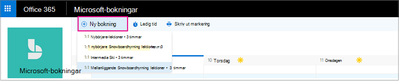
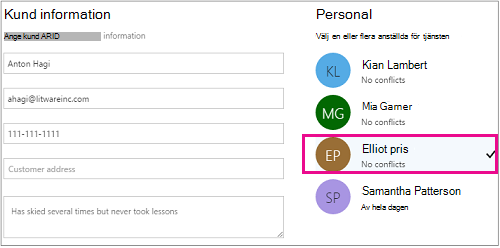

# Skapa en manuell bokningCreate a manual booking

Bokningar kan schemaläggas och bemannas på två olika sätt.Bookings can be scheduled and staffed in two different ways. Det första är den kund som använder en fristående boknings sida eller en inbäddad boknings sida som du lägger till på webbplatsen.The first way is by the customer using a standalone booking page or an embedded booking page that you add to your website. Det andra sättet är för dig eller en av dina anställda att ange bokningarna manuellt, till exempel när en kund ringer för en avtalad tid.The other way is for you or one of your employees to enter the bookings manually, such as when a customer calls for an appointment. I den här artikeln beskrivs det manuella scenariot.This article covers the manual scenario.

> [!NOTE]
> Bokningar är som standard aktiverade för kunder som har Microsoft 365 Business Standard, Microsoft 365 a3 eller Microsoft 365 A5.Bookings is turned on by default for customers who have the Microsoft 365 Business Standard, Microsoft 365 A3, or Microsoft 365 A5 subscriptions. Bokningar är också tillgängliga för kunder som har Office 365 Enterprise E3 och Office 365 Enterprise, E5, men det är inaktiverat som standard.Bookings is also available to customers who have Office 365 Enterprise E3 and Office 365 Enterprise E5, but it is turned off by default. Kom igång genom att läsa [få till gång till Microsoft-bokningar](get-access.md).To get started, see [Get access to Microsoft Bookings](get-access.md). Om du vill aktivera eller inaktivera uppslagning kan du läsa [Aktivera och inaktivera en organisation](turn-bookings-on-or-off.md).To turn Bookings on or off, see [Turn Bookings on or off for your organization](turn-bookings-on-or-off.md).

1. I Microsoft 365 väljer du Start programmet och väljer sedan **bokningar**.In Microsoft 365, select the App launcher, and then select **Bookings**.

   

1. I navigerings fönstret väljer du **kalender** \> **ny bokning**.In the navigation pane, select **Calendar** \> **New booking**.

   

1. Välj den tjänst som ska tillhandahållas.Select the service to be provided. Se [definiera dina tjänst tjänster i Microsoft-bokningar](define-service-offerings.md) för konfigurations instruktioner för tjänster.See [Define your service offerings in Microsoft Bookings](define-service-offerings.md) for service setup instructions.

1. Ange kund informationen, inklusive namn, e-postadress, telefonnummer och annan relevant information.Enter the customer information, including name, email address, phone number, and other relevant details.

1. Välj personal medlemmen för att tillhandahålla tjänsten.Select the staff member to provide the service. Listan med medlemmar i personalen baseras på vad du har angett på sidan tjänster.The list of staff members shown is based on what you set up on the services page.

   

1. Ange service uppgifterna, inklusive datum, tid, plats och annan relevant information.Enter the service details, including date, time, location, and other relevant information. När du har angett en giltig e-postadress för kunden ändras knappen **Spara** till **Skicka**, och du ser en kommentar om att en bekräftelse kommer att skickas till kunden.Once you enter a valid email address for the customer, the **Save** button will change to **Send**, and you'll see a note telling you that a confirmation will be sent to the customer. Kund bekräftelsen inkluderar en bifogad fil som du kan lägga till i kalendern.The customer confirmation includes an attachment for them to add to their calendar. Valda personal medlemmar får också mötesinbjudan med den avtalade tiden så att de kan lägga till den i sina personliga kalendrar.Selected staff members will also receive meeting invitations with the appointment information so they can add it to their personal calendars.

1. Välj **Lägg till en e-postpåminnelse**.Select **Add an email reminder**.

1. Ange när påminnelsen ska skickas, där den ska skickas (**kund**, **personal**, **alla deltagare**) och vad påminnelse meddelandet ska vara.Specify when the reminder should be sent, where it should be sent (**Customer**, **Staff**, **All attendees**), and what the reminder message should be.

1. Välj **Spara** \> **Skicka**.Select **Save** \> **Send**.

   Här är ett exempel på ett e-postmeddelande med påminnelsen som din kund får:Here's an example email of the reminder your customer will receive:

:::image type="content" source="../media/bookings-confirmed-email.png" alt-text="Skärm bild: exempel på bekräftelse via en manuell bokning":::