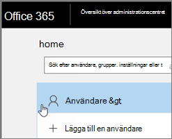

# <a name="delete-a-booking-calendar-in-bookings"></a>Ta bort en bokningskalender i Bookings

I den här artikeln förklaras hur du tar bort en oönskad bokningskalender. Du kan ta bort bokningskalendern i Microsoft 365 administrationscenter eller så kan du använda PowerShell. Bookings-kalendern är en postlåda i Exchange Online så du tar bort motsvarande användarkonto för att ta bort bokningskalendern.

> [!IMPORTANT]
> Alla bokningskalendrar som du skapade 2017 eller tidigare måste tas bort med PowerShell-instruktionerna för det här avsnittet. Alla bokningskalendrar som skapades 2018 eller senare kan tas bort Microsoft 365 administrationscentret.

Bokningskalendern är den plats där all relevant information om bokningskalendern och bokningsdata lagras, inklusive:

- Företagsinformation, logotyp och arbetstid som lades till när bokningskalendern skapades
- Relevant personal och tjänster som lades till när bokningskalendern skapades
- Alla bokningar och återkommande avtalade tider läggs till i bokningskalendern när den har skapats.

> [!WARNING]
> När en bokningskalender tas bort tas denna ytterligare information också bort permanent och kan inte återställas.

## <a name="delete-a-booking-calendar-in-the-microsoft-365-admin-center"></a>Ta bort en bokningskalender Microsoft 365 administrationscentret

1. Gå till administrationscentret för Microsoft 365.

1. Välj **Användare** i administrationscentret.

   

1. På sidan **Aktiva användare** väljer du namnen på de användare du vill ta bort och väljer sedan **Ta bort användare**.

   

## <a name="delete-a-booking-calendar-using-exchange-online-powershell"></a>Ta bort en bokningskalender med Exchange Online PowerShell

Se [Anslut för Exchange Online PowerShell](/powershell/exchange/exchange-online-powershell-v2?view=exchange-ps) för krav och vägledning för anslutning till Exchange Online PowerShell.

Om du vill utföra de här stegen måste du använda ett aktivt Microsoft PowerShell-kommandofönster som du kör genom att välja alternativet "Kör som administratör".

1. I ett PowerShell-fönster läser du in EXO V2-modulen genom att köra följande kommando:

   ```powershell
   Import-Module ExchangeOnlineManagement
   ```

   > [!NOTE]
   > Om du redan har [installerat EXO V2-modulen](/powershell/exchange/exchange-online-powershell-v2?view=exchange-ps#install-and-maintain-the-exo-v2-module)fungerar det föregående kommandot som det är skrivet.
   
2. Följande syntax används för kommandot du behöver köra:

   ```powershell
   Connect-ExchangeOnline -UserPrincipalName <UPN> 
   ```

   - _\<UPN\>_ är ditt konto i formatet användarnamn (t.ex. `john@contoso.com` ).

3. När du uppmanas att göra det loggar du in med autentiseringsuppgifterna för klientorganisationen Microsoft 365 klientorganisationen som är värd för den bokningskalender du vill ta bort permanent.

4. När det här kommandot har körts klart anger du följande kommando för att få en lista över bokningspostlådor i klientorganisationen:

   ```powershell
   Get-EXOMailbox -RecipientTypeDetails SchedulingMailbox
   ```

5. Skriv följande kommando:

   ```powershell
   remove-mailbox [BookingCalendarToDelete]
   ```

   > [!IMPORTANT]
   > Var noga med att skriva det exakta namnet på det bokningsalias som du vill ta bort permanent.

6. Ange följande kommando för att verifiera att kalendern har tagits bort:

   ```powershell
    Get-EXOMailbox -RecipientTypeDetails SchedulingMailbox
   ```

   Den borttagna kalendern visas inte i utdata.
