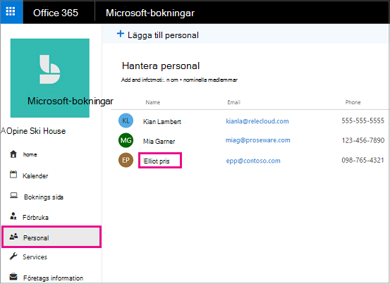
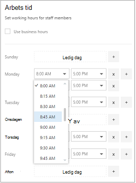
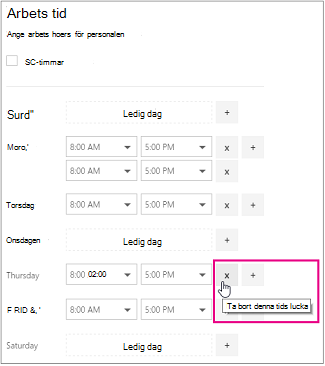

# Anställdas arbets tid i Microsoft-bokningar

Genom att ange anställdas arbets tid ser du till att deras tillgänglighet visas korrekt när kunderna försöker boka dem. Som standard matchar arbets tiderna för var och en av dina anställda den arbets tid du har upprättat i programmet Microsoft-adressbok. Se avsnittet "Ange din arbets tid" för [Ange företags information](enter-business-information.md#set-your-business-hours).

På sidan **personal** kan du anpassa anställdas arbets tid så att de stämmer överens med företagets och anställdas behov.

Om du vill boka tid för personalen så att kunderna inte kan boka dem när de inte är på kontoret kan du läsa mer i [Schemalägga företags stängningar, ledig tid och semester tid](schedule-closures-time-off-vacation.md) för anvisningar.

> [!NOTE]
> Bokningar är som standard aktiverade för kunder som har Microsoft 365 Business Standard, Microsoft 365 a3 eller Microsoft 365 A5. Bokningar är också tillgängliga för kunder som har Office 365 Enterprise E3 och Office 365 Enterprise, E5, men det är inaktiverat som standard. Kom igång genom att läsa [få till gång till Microsoft-bokningar](get-access.md). Om du vill aktivera eller inaktivera uppslagning kan du läsa [Aktivera och inaktivera en organisation](turn-bookings-on-or-off.md).

## Anpassa anställdas arbets tid

Titta på den här videon eller följ stegen nedan för att ange en anställds arbets tid.

> [!VIDEO https://www.microsoft.com/videoplayer/embed/RWuXUq]

1. I Microsoft 365 väljer du Start programmet och väljer sedan **bokningar**.

1. I navigerings fönstret väljer du **personal**och sedan den personal medlem vars arbets tid du vill ange.

   

1. Under arbets tid avmarkerar du kryss rutan **Använd kontors tid** .

1. Använd de nedrullningsbara List rutorna för att välja Start-och slut tider för varje dag. Klock slag är tillgängliga i 15-minuters ökningar.

   

1. Klicka **+** här om du vill lägga till start-och slut markeringar.

1. Välj Spara.

## Ange lediga dagar för en anställd

När du schemalägger en dag för en anställd kommer den anställd inte att synas på boknings sidan. Kunder som använder boknings sidan kan inte schemalägga honom för service den dagen.

1. På skärmen arbets tid väljer du **x** bredvid den dag då den anställde kommer att ha.

   

1. Om du vill schemalägga en dag som tidigare marker ATS som en dag avmarkerar du **+** tecknet bredvid den dag du vill schemalägga.

> [!TIP]
> Om du schemalägger semester tid eller andra långa tids block kan du läsa avsnittet "schemalägga ledighet från företaget" i [Schemalägg företagets avslut, ledig tid och semester tid](schedule-closures-time-off-vacation.md#schedule-employee-time-off).
