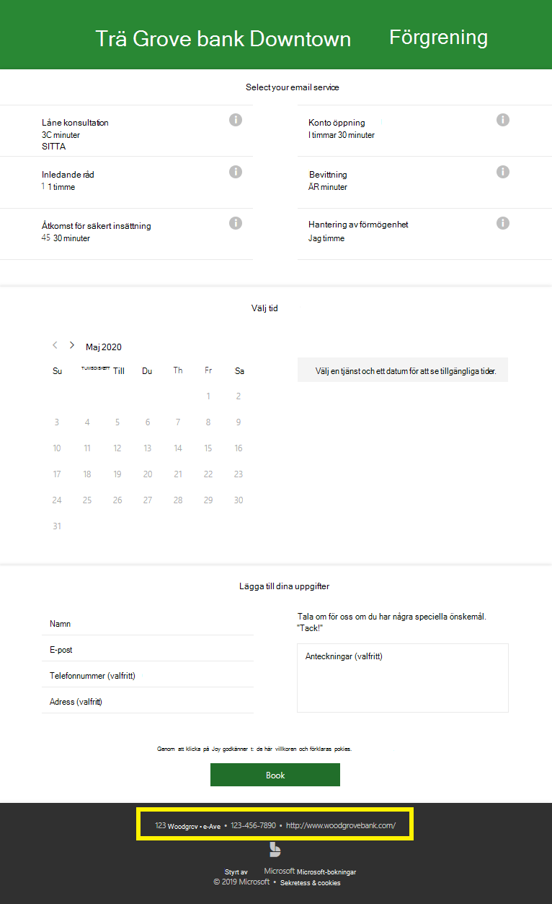
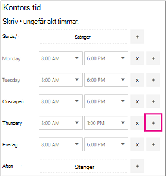
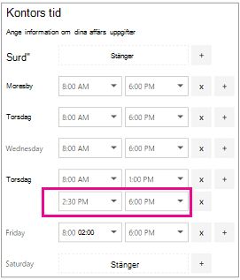
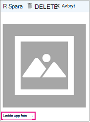

# Ange din företagsinformationEnter your business information

På Microsoft Bookings innehåller sidan Företagsinformation i webbappen all information som du vanligtvis hittar på en företagssida "Om oss".In Microsoft Bookings, the Business Information page within the web app contains all the details that you'd typically find on a business' "About us" page. Bland uppgifterna finns namn, adress, telefonnummer, webbplats-URL, sekretesspolicy, logotyp och öppettider.These details include your a relevant name, address, phone number, web site URL, privacy policy URL, logo, and business hours.

Informationen som du anger här visas på sidan som kunder och kunder använder för att boka avtalade tider (kallas för bokningssidan) och i meddelanden och påminnelser som skickas till dem från Bookings.The information you provide here will be displayed on the page customers and clients use to book appointments (known as the booking page) and in messages and reminders sent to them by Bookings. Ett exempel på den här informationen på bokningssidan är markerad nedan.An example of this information on the booking page is highlighted below.

   

> [!NOTE]
> Information om hur du kommer igång [finns i Få åtkomst till Microsoft Bookings.](get-access.md)To get started, see [Get access to Microsoft Bookings](get-access.md). Om du vill aktivera eller inaktivera Bookings kan [du gå till Aktivera eller inaktivera Bookings för din organisation.](turn-bookings-on-or-off.md)To turn Bookings on or off, see [Turn Bookings on or off for your organization](turn-bookings-on-or-off.md).

## Ange företagsnamn och kontaktinformationProvide business name and contact information

1. I Microsoft 365 väljer du appstartaren och sedan **Bookings**.In Microsoft 365, select the App launcher, and then select **Bookings**.

1. Välj Företagsinformation i **navigeringsfönstret.**In the navigation pane, select **Business information**.

1. Ange relevant namn, adress och telefonnummer som du vill använda för din Bookings-kalender.Enter the relevant name, address, and phone number you would like to use for your Bookings calendar.

1. I **Skicka kundsvar till** skriver du önskad e-postadress där e-postmeddelanden till bokningsbekräftelser och påminnelser ska vidarebefordras.In **Send customer replies to**, type the preferred email address where email replies to booking confirmations and reminders should be forwarded.

1. I fältet **Webbplats-URL** anger du URL-adressen till startsidan för ditt företag.In the **Website URL** field, enter the URL of the home page for your business.

1. Ange **webbadresser till** **sekretesspolicyn & villkor.**Enter the **privacy policy** and **terms & conditions** URLs.

1. Välj **Spara**.Select **Save**.

## Ange din arbetstidSet your business hours

Som standard är öppettiderna i bookingsappen inställda på 08:00.By default, the business hours in the Bookings app are set to 8 a.m. till 17:00, måndag till fredag.to 5 p.m., Monday through Friday. Tider anges i 15-minutersintervall.Times are provided in 15-minute increments. I appen Bookings används 12-timmarsklocka.The Bookings app uses the 12-hour clock.

Ställ **in öppettider** till din drifttid.Set **business hours** to your operational hours. Det här är de timmar som alla bokningar begränsas till.These are the hours to which all bookings are restricted. Ytterligare tidsbegränsningar för när avtalade tider kan bokas kan anges för varje tjänst och för varje anställd på tjänsterna respektive personalsidorna.Additional time restrictions of when appointments can be booked can be set for each service and for each staff member in the Services and Staff pages, respectively.

1. På sidan Företagsinformation, under Öppettider, väljer du start- och sluttider för varje dag i listrutan.On the Business information page, under Business hours, use the dropdowns to select start and end times for each day.

1. Klicka **+** för att lägga till start- och sluttidsväljare.Click **+** to add start- and end-time selectors.

## Ange timmar för ett delat arbetspassHow to set hours for a split shift

Du kan behöva blockera en del av varje dag eller vecka för att hålla personalmöten, uppdatera inventeringen eller ta hand om annan företagsrytminformation.You might need to block out a portion of each day or week to have staff meetings, update inventory, or take care of other rhythm-of-business details. Med appen Bookings kan du begränsa avtalade tider till specifika tider.The Bookings app allows you to limit customer appointments to your specified time slots.

Du har till exempel personalmöten varje torsdag från kl. 01 till 02:30 och vill blockera den tiden så att alla lärare kan delta.For example, you have staff meetings every Thursday from 1 o'clock to 2:30 and want to block out that time so all of your staff members can attend. Gör så här:To do this:

1. På sidan Företagsinformation under Öppettider väljer du en start- och sluttid för torsdagar.On the Business information page, under Business hours, select a start and end time for Thursdays. I det här exemplet anger vi 08:00.In this example we'll set 8:00 a.m. till 13:00.to 1:00 p.m.

1. Välj **+** för att skapa en ny rad för torsdag.Select **+** to create a new row for Thursday.

   

1. I den nya raden väljer du 14:30.In the new row, select 2:30 p.m. för starttiden och 18:00.for the start time and 6:00 p.m. för sluttiden.for the end time.

   

1. Välj Spara.Select Save.

    När en kund går till din bokningssida ser han eller hon att ditt företag är stängt från 1 till 2:30 på torsdagar.When a customer goes to your booking page, he or she will see that your business is closed from 1 to 2:30 on Thursdays.

## Upload din logotypUpload your logo

Om du inte redan har överfört din företagslogotyp till bookings-appen kan du göra det från sidan Med företagsinformation.If you haven't already uploaded your business logo to the Bookings app, you can do it from the Business information page.

1. På sidan Företagsinformation, under Upload logotyp, väljer du **Ändra**.On the Business information page, under Upload logo, select **Change**.

1. Välj **Upload foto**.Select **Upload photo**.

   

1. Välj **Spara**.Select **Save**.
