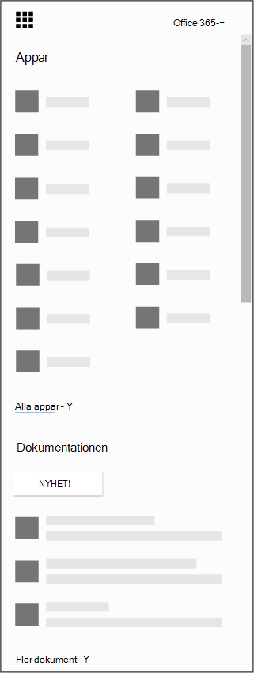

# Hämta Microsoft-programmet för iOS och Android

Tack för att du laddar ner program varan Microsoft Books! Microsoft-bokningar är tillgängligt som en mobilapp för iOS och Android. Programmet bokningar för iOS är tillgängligt i alla regioner och länder som Apple stöder. Du kan ladda ned appen från [iTunes App Store](https://apps.apple.com/app/microsoft-bookings/id1065657468). Programmet bokningar för Android kan laddas ned från [Google Play Store](https://play.google.com/store/apps/details?id=com.microsoft.exchange.bookings) i USA och Kanada.

Innan du börjar måste du konfigurera dem på webben.

1. Hittar du inte appen du söker? Från Start programmet väljer du alla appar för att se en alfabetisk lista över de Microsoft 365-appar som är tillgängliga för dig. Därifrån kan du söka efter ett visst program

   

2. Till [Start sidan för Office](https://office.com) och välj **bokningar**från Start programmet.

3. Välj **Skaffa det nu**.

4. Ange namn och typ av företag du kör, till exempel hår Salon eller tandvårds praxis, och välj **till bokningar**.

5. Nu är du redo att konfigurera pärmar för din organisation. Följ stegen [i det här avsnittet för att slutföra](bookings-overview.md) konfigureringen. Gå tillbaka till din mobila enhet och logga ut från mobilappen. Logga in igen för att gå till den nya boknings kalendern.

## Skrivskyddat läge

Alla användare som inte har Läs-och skriv åtkomst i bokningar kan fortfarande använda mobilappen i skrivskyddat läge. Alla som har en licens som läggs till i en boknings kalender kan se sina egna och deras kollegors scheman, avtalade tider och företags information. En användare med skrivskyddad åtkomst kan inte göra ändringar eller redigera och kan inte komma åt kund listan.
