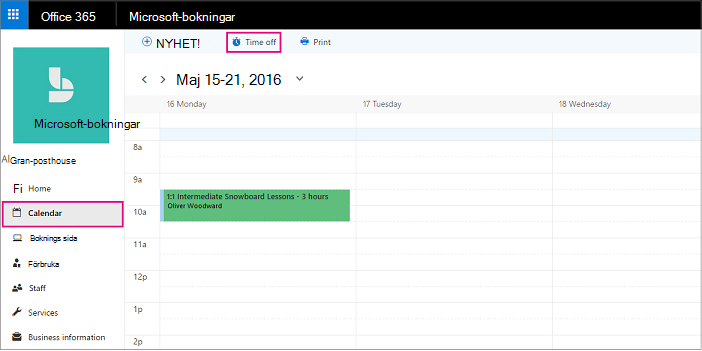

# Schemalägga verksamhetsslut, ledighet och semesterdagar

Ibland kanske du vill stänga verksamheten för helgdagar eller grupphändelser, eller så behöver dina anställda ledighet när de är sjuka, på semester eller inte tillgängliga av andra orsaker. Du kan schemalägga ledigt i kalendern i Microsoft Bookings, så den anställda kommer inte att vara tillgänglig för bokningar under den angivna tiden. När verksamheten öppnas på nytt eller anställda återgår till arbetet visas alla på bokningssidan enligt deras fastställda arbetstider.

Titta på den här videon eller följ stegen nedan för att schemalägga företagets stängningar eller anställdas av.

> [!VIDEO https://www.microsoft.com/videoplayer/embed/RE2TxDC]

## Schemalägg tillfälliga företagsslut

1. I Microsoft 365 väljer du startprogrammet och sedan Bookings.

1. Välj Time off för **kalendern** \> **i navigeringsfönstret.**

   

1. Fyll i informationen, inklusive rubrik, start- och slutdatum samt tider, plats och ytterligare anteckningar.

1. Välj **Hela dagen.**

1. Markera alla anställda.

1. Välj **Spara**.

När en kund försöker schemalägga tjänsten på en dag kontoret har stängts visas ett meddelande på bokningssidan.

   

## Schemalägga ledigt för anställda

1. I Microsoft 365 väljer du startprogrammet och sedan **Bookings**.

   

1. Välj Time off för **kalendern** \> **i navigeringsfönstret.**

   

1. Fyll i informationen, inklusive rubrik, start- och slutdatum samt tider, plats och ytterligare anteckningar. Om den anställda är borta under en hel dag eller i flera dagar väljer du **Hela dagen.**

1. Välj den eller de anställda som tar ledigt.

1. Välj **Spara**.
