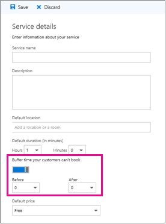

# Ange buffertstorlek i Microsoft-bokningarSet buffer time in Microsoft Bookings

Vissa av dina avtalade tider kanske kräver tid innan eller efter det att du har träffat med din kund för att konfigurera, rensa eller återställa rummet och utrustningen.Some of your appointments might require time before or after you meet with your customer to set up, clean up, or reset your room and equipment. Om du befinner dig på resan mellan avtalade tider med kunder kan du behöva tid för att se till att du och ditt team kan resa mellan avtalade tider utan att behöva vänta på att kunden väntar.Or if you’re on the road between customer appointments, you may need time to ensure you and your team can travel between appointments without making the customer wait.

Du kan ange buffertstorlek innan avtalade tider börjar efter att avtalade tider slutar eller båda för att ge personalen den tid de behöver för att förbereda nästa avtalade tid.You can set buffer time before appointments start, after appointments end, or both to give staff the extra time they need to prepare for their next appointment.

## Ange tids inställningar för buffertSet buffer time defaults

Tids inställningar för buffert är inställda på sidan **tjänst information** i bokningar.Buffer time defaults are set on the **Service details** page in Bookings. Precis som alla tjänst standarder är inställda på den här sidan kan dessa standardvärden redige ras av dig för en viss bokning för att uppfylla specifika kund behov.Like all service defaults set on this page, these defaults can be edited by you for a specific booking to meet specific customer needs.

Inställningen för buffertlängd visas precis under **Standard längden** på sidan med **service information** .The buffer time setting can be found just below the **Default duration** pickers on the **Service details** page. Innan den kan anges för en viss tjänst måste du aktivera inställningen för buffertstorlek genom att välja växlings knappen för bufferten.Before it can be set for a given service, you must enable the buffer time setting by selecting the buffer time toggle. Detta gör att List rutorna **före** och **efter** visas, vilka används för att välja den standard tid som ska behållas före och efter varje bokning, som du ser här:This causes the **Before** and **After** drop-downs to appear, which are used to pick the default amount of time to hold before and after each booking, as shown here:

   

## Tids inställning för buffert och avtalad tidBuffer time and appointment timing

För att slippa förvirring när kunderna förväntar sig att mötas kan du Visa tidsenheter och faktisk avtalad tid (den tid kunderna förväntar sig att möta dig) i kalendern och i e-postbekräftelser och påminnelser till relevant personal.To avoid confusion about when customers expect to meet with you, Bookings shows buffer time and actual appointment time (the time your customers expect to meet with you) on your calendar, and in email confirmations and reminders to relevant staff. Till exempel är det som visas i bokningar för en avtalad tid med en kund som innehåller 15 minuters tids period.For example, below is what you’d see in Bookings for an appointment with a customer that includes 15 minutes of pre-appointment buffer time.

Observera att själva händelsen (till vänster i bilden nedan) visar ljusare skuggning för buffertstorlek och mörkare skuggning för den faktiska avtalade tiden.Note that the event itself (on the left in the image below) shows lighter shading for the buffer time and darker shading for the actual customer appointment. Den avtalade tiden ringer (som öppnas när du väljer händelsen) specifikt visar att den avtalade tiden är från 9:00AM till 10:00AM med Katie Jordanien och inkluderar 15 minuters bufferts tid före den avtalade tiden och 0 minuter efter den avtalade tiden.The appointment call-out (which is opened when you select the event) specifically states that the appointment is from 9:00AM to 10:00AM with Katie Jordan and includes 15 minutes of buffer time before the appointment and 0 minutes after the appointment. Bekräftelser och påminnelser till Personalen på liknande sätt refererar till en speciell buffert och avtalad tid medan kunden bara får bekräftelse och påminnelser som hänvisar till en 9:00AM till 10:00AM avtalad tid.Confirmations and reminders to staff similarly reference specific buffer and appointment time while the customer would only get confirmations and reminders that reference a 9:00AM to 10:00AM appointment time.

   

## Buffertstorlek och tillgänglighetBuffer time and availability

Kunderna ser inte direkt och kan inte ändra de buffertlängd du angett.Your customers don’t directly see and cannot change the buffer times you set. Men för att buffra tid används för att beräkna den totala tjänste längden kommer kunderna att se dig och din relevanta personal som Bokad under både buffert och återkommande avtalad tid.However, because buffer time is used to calculate overall service duration, customers will see you and your relevant staff as booked during both buffer and regular appointment times. Kunderna ser också tillgänglighet för dig och din personal om det finns tillräckligt med tid för både den avtalade tiden och dess buffertlängd.Customers also only see availability for you and your staff if there is enough time for both the appointment and its buffer time.

I ett exempel krävs ett ledigt tids block om minst 1 timme och 15 minuter för en avtalad tid i en timme med en buffertlängd på 15 minuter.As an example, a one-hour appointment with a 15-minute pre-appointment buffer time requires an available time block of at least 1 hour and 15 minutes. En avtalad tid för den här tjänsten skulle därför fylla ett 75-minuters tid i kalendern och behöver 75 minuters tillgänglighet till bok utan konflikt.An appointment for this service would therefore fill a 75-minute block of time on your calendar and needs 75 minutes of availability to book without conflict.
