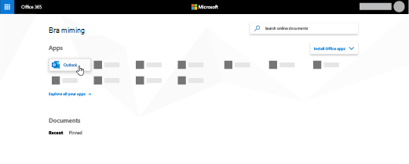
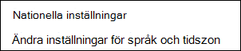

# Ange språk och tidszoner i Microsoft Bookings

Om du använder Microsoft Bookings och bokningar skapas vid fel tidpunkt kan tidszonsinställningarna behöva ändras. På samma sätt kan du behöva ändra dina språkinställningar om vissa bokningar har fel språk.

Det finns två separata språk- och tidszonsinställningar för Bookings. Den första inställningen styr språk och tidszon för bokningskalendern och ställs in med hjälp av inställningarna för Outlook på webben för den inloggade användarens personliga kalender. Den andra inställningen påverkar bokningssidan med självbetjäning som dina kunder använder och ställer in en sida med "nationella inställningar" som styr endast språk och tidszon för den sidan.

## Ange språk och tidszon för en bokningskalender

Bokningskalendern använder den inloggade användarens språk- och tidszonsinställningar. Om den inloggade användarens tidszon till exempel är Eastern Standard Time (EST) visas befintliga start- och sluttider för avtalade tider i EST i bokningskalendern. Den här tidszonen angavs ursprungligen när användarens Microsoft 365 och Outlook på webben-konton skapades.

Så här anger du språk och tidszon för bokningskalendern:

1. Logga in Microsoft 365 och välj panelen Outlook på startsidan (som i skärmbilden nedan) eller i Microsoft 365 Startprogrammet.

   

1. När Outlook öppnas väljer du  kugghjulsikonen i det övre högra hörnet på skärmen för att öppna dina personliga inställningar och kontoinställningar. Sök sedan efter "tidszon" **i Inställningar-panelens** sökruta. Panelen uppdateras och visar dina aktuella inställningar för personligt språk och tidszon för det här kontot. Som nämnts ovan styr den här inställningen även bokningskalenderens språk och tidszon.

1. Ändra språk eller tidszon genom att välja pilen i listrutan **Språk** eller Aktuell tidszon och sedan välja önskad inställning.

1. Klicka på **Spara**. Panelen Inställningar stängs, Outlook startar om på webben och de nya språk- och tidszonsinställningarna tillämpas.

## Ange språk och tidszon för bokningssidan

1. I Microsoft 365 väljer du startprogrammet och sedan **Bookings**.

1. I navigeringsfönstret väljer du **Bokningssida** och sedan **Ändra språk och tidszonsinställningar**.

   

1. Välj språk och aktuell tidszon och välj OK.

   
