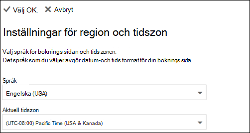

# Ange språk och tidszoner i Microsoft BookingsSet language and time zones in Microsoft Bookings

Om du använder Microsoft Bookings och bokningar skapas vid fel tidpunkt kan tidszonsinställningarna behöva ändras.If you are using Microsoft Bookings and bookings are created at the wrong time, then your time zone settings might need to be changed. På samma sätt kan du behöva ändra dina språkinställningar om vissa bokningar har fel språk.Likewise, if some bookings are in the wrong language, you might need to change your language settings.

Det finns två separata språk- och tidszonsinställningar för Bookings.There are two separate language and time zone settings for Bookings. Den första inställningen styr språk och tidszon för bokningskalendern och ställs in med hjälp av inställningarna för Outlook på webben för den inloggade användarens personliga kalender.The first setting controls the language and time zone of the booking calendar and is set using the Outlook on the web settings for the personal calendar of the logged-in user. Den andra inställningen påverkar bokningssidan med självbetjäning som dina kunder använder och ställer in en sida med "nationella inställningar" som styr endast språk och tidszon för den sidan.The second setting affects the self-service booking page that your customers use and is set using a "regional settings" page that controls language and time zone only for that page.

## Ange språk och tidszon för en bokningskalenderSetting language and time zone for a booking calendar

Bokningskalendern använder den inloggade användarens språk- och tidszonsinställningar.The booking calendar uses the logged-in user’s language and time zone settings. Om den inloggade användarens tidszon till exempel är Eastern Standard Time (EST) visas befintliga start- och sluttider för avtalade tider i EST i bokningskalendern.For example, If the logged-in user’s time zone is set to Eastern Standard Time (EST), then the booking calendar will show existing appointment start and end times in EST. Den här tidszonen angavs ursprungligen när användarens Microsoft 365 och Outlook på webben-konton skapades.This time zone was originally set when the user’s Microsoft 365 and Outlook on the web accounts were created.

Så här anger du språk och tidszon för bokningskalendern:To set the language and time zone for the booking calendar:

1. Logga in Microsoft 365 och välj panelen Outlook på startsidan (som i skärmbilden nedan) eller i Microsoft 365 Startprogrammet.Log into Microsoft 365 and select the Outlook tile on the landing page (as shown in the screenshot below) or in the Microsoft 365 App Launcher.

   

1. När Outlook öppnas väljer du  kugghjulsikonen i det övre högra hörnet på skärmen för att öppna dina personliga inställningar och kontoinställningar. Sök sedan efter "tidszon" **i Inställningar-panelens** sökruta.After Outlook opens, select the **gear icon** in the upper, right-hand corner of the screen to open your personal and account settings, then search for “time zone” in the **Settings** panel search box. Panelen uppdateras och visar dina aktuella inställningar för personligt språk och tidszon för det här kontot.The panel will update to show your current personal language and time zone settings for this account. Som nämnts ovan styr den här inställningen även bokningskalenderens språk och tidszon.As noted above, this setting also controls the language and time zone of the booking calendar.

1. Ändra språk eller tidszon genom att välja pilen i listrutan **Språk** eller Aktuell tidszon och sedan välja önskad inställning.Change the language or time zone by selecting the drop-down arrow in the **Language or Current time zone** box and choosing the desired setting.

1. Klicka på **Spara**.Click **Save**. Panelen Inställningar stängs, Outlook startar om på webben och de nya språk- och tidszonsinställningarna tillämpas.The Settings panel closes, Outlook on the web restarts, and the new language and time zone settings are applied.

## Ange språk och tidszon för bokningssidanSetting the language and time zone for the booking page

1. I Microsoft 365 väljer du startprogrammet och sedan **Bookings**.In Microsoft 365, select the app launcher, and then select **Bookings**.

1. I navigeringsfönstret väljer du **Bokningssida** och sedan **Ändra språk och tidszonsinställningar**.In the navigation pane, select **Booking page** and select **Change language and time zone settings**.

   

1. Välj språk och aktuell tidszon och välj OK.Select your language and current time zone and choose OK.

   
