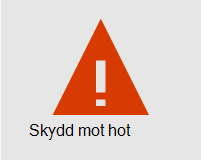
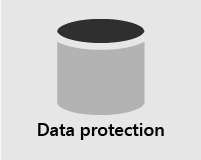
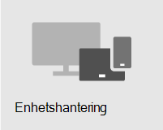

# Säkerhets översikt

> [!VIDEO https://www.microsoft.com/videoplayer/embed/RE4mzxI?autoplay=false]

Microsoft 365 Business Premium tillhandahåller hot skydd, data skydd och funktioner för att skydda ditt företag från online-hotet och obehörig åtkomst, samt skydda och hantera företags data på telefoner, surfplattor och datorer.

| [Skydd mot hot](#threat-protection)|  [Data skydd](#data-protection) |   [Enhetshantering](#device-management) |
|--|--|--|

## Skydd mot hot

Microsoft 365 Business Premium innehåller Office 365 Avancerat skydd (ATP), en molnbaserad e-postfiltrerad tjänst som skyddar dig mot skadlig program vara, utpressnings tro Jan, skadlig länkar och mycket mer. Säkerhet för ATP skyddar dig från skadliga URL-adresser i e-post-och Office-dokument. ATP-säkra bifogade filer skyddar dig från skadlig program vara och virus bifogade till meddelanden och dokument.

Multifaktorautentisering (MFA) eller tvåstegsverifiering måste du Visa en andra form av verifiering, till exempel en verifierings kod, för att bekräfta din identitet innan du kan komma åt resurser.  

Windows Defender ger omfattande skydd för dina system, filer och online-aktiviteter från virus, skadlig program vara, spionprogram och andra hot.

## Data skydd

Med data skydds funktioner i Microsoft 365 Business Premium kan du se till att viktiga data förblir säkra och bara behöriga personer har till gång till den.

Du kan använda principer för data förlust skydd (DLP) för att identifiera och hantera känslig information, till exempel sociala värdepapper eller kreditkorts nummer, så att den inte av misstag delas ut. 

Office 365 meddelande kryptering kombinerar kryptering och åtkomst rättigheter för att säkerställa att endast avsedda mottagare kan visa meddelande innehåll. Office 365 meddelande kryptering fungerar med Outlook.com, Yahoo! och Gmail samt andra e-posttjänster.

Exchange Online-arkivering är en Cloud-baserad arkiverings lösning som fungerar med Microsoft Exchange eller Exchange Online och ger avancerade funktioner för arkivering, inklusive undantag och dataredundans. Du kan använda bevarande principer för att under lätta för organisationen att minska skulder som är kopplade till e-post och annan kommunikation. Om ditt företag är obligatoriskt för att behålla kommunikationen relaterade till tvist kan du använda In-Place undantag och arbets tvister för att bevara relaterat e-postmeddelande.

## Enhetshantering

Med de avancerade funktionerna i Microsoft 365 Business Premium kan du övervaka och kontrol lera vad användarna kan göra med registrerade enheter. De här funktionerna inkluderar villkorsstyrd åtkomst, hantering av mobila enheter (MDM), BitLocker och automatiska uppdateringar.

Du kan använda villkorsstyrda åtkomst principer för att kräva ytterligare säkerhets åtgärder för vissa användare och uppgifter. Du kan till exempel kräva multifaktorautentisering (MFA) eller blockera klienter som inte stöder villkorlig åtkomst.

Med MDM kan du skydda och hantera användarnas mobila enheter som iPhone, iPad, Android och Windows-telefoner. Du kan skapa och hantera säkerhets principer för enheter, fjärrrensa en enhet för att ta bort alla företags data, återställa en enhet till fabriks inställningarna och Visa detaljerade enhets rapporter. 

Du kan aktivera BitLocker-kryptering för att skydda data i händelse av att en enhet försvinner eller blir stulen och aktivera Windows sårbarhets skydd för att ge Avancerat skydd mot utpressnings tro janheten.

Du kan konfigurera automatiska uppdateringar så att de senaste säkerhetsfunktionerna och uppdateringarna tillämpas på alla användar enheter. 