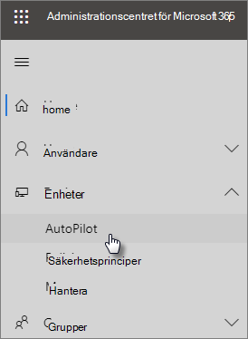

# Använda stegvisa anvisningar för att lägga till AutoPilot-enheter och -profilerUse the step-by-step guide to add Autopilot devices and profile

Du kan använda Windows AutoPilot för att konfigurera **nya** Windows 10-enheter för ditt företag så att de är redo att användas när du ger dem till dina anställda.You can use Windows AutoPilot to set up **new** Windows 10 devices for your business so they're ready for use when you give them to your employees.
  
## EnhetskravDevice requirements

Produkterna måste uppfylla dessa krav:Devices must meet these requirements:
  
- Windows 10, version 1703 eller senareWindows 10, version 1703 or later
    
- Nya enheter som inte har gått via Windows-direktupplevelseNew devices that haven't been through Windows out-of-box experience
    
## Använda installationsguiden för att skapa enheter och profilerUse the setup guide to create devices and profiles

Om du inte har skapat enhetsgrupper eller profiler ännu är det bästa sättet att komma igång att komma igång med hjälp av steg-för-steg-guiden.If you haven't created device groups or profiles yet, the best way to get started is by using the step-by-step guide. Du kan också [lägga till enheter](create-and-edit-autopilot-devices.md) och tilldela [profiler](create-and-edit-autopilot-profiles.md) till dem utan att använda guiden.You can also [add devices](create-and-edit-autopilot-devices.md) and [assign profiles](create-and-edit-autopilot-profiles.md) to them without using the guide. 
  
1. Gå till administrationscentret på <a href="https://go.microsoft.com/fwlink/p/?linkid=837890" target="_blank">https://admin.microsoft.com</a>.Go to the admin center at <a href="https://go.microsoft.com/fwlink/p/?linkid=837890" target="_blank">https://admin.microsoft.com</a>.

2. Välj **Autopilot**för **enheter** \> i det vänstra navigeringsfönstret .On the left navigation pane, choose **Devices** \> **AutoPilot**.

    
  
2. Klicka eller tryck på **Startguide**på sidan **Autopilot** .On the **AutoPilot** page, click or tap **Start guide**.
    
    
  
3. Bläddra till en plats där du har förberett den förberedda på **sidan Ladda upp CSV med en lista över enheter.** CSV-fil och sedan **öppna** \> **nästa**.On the **Upload .csv file with list of devices** page, browse to a location where you have the prepared .CSV file, then **Open** \> **Next**. Filen måste ha tre rubriker:The file must have three headers:
    
    - Kolumn A: EnhetsserienummerColumn A: Device Serial Number
    
    - Kolumn B: Produkt-ID för WindowsColumn B: Windows Product ID
    
    - Kolumn C: MaskinvaruhashColumn C: Hardware Hash
    
    Du kan hämta den här informationen från maskinvaruleverantören eller använda [Get-WindowsAutoPilotInfo PowerShell-skriptet](https://www.powershellgallery.com/packages/Get-WindowsAutoPilotInfo) för att generera en CSV-fil.You can get this information from your hardware vendor, or you can use the [Get-WindowsAutoPilotInfo PowerShell script](https://www.powershellgallery.com/packages/Get-WindowsAutoPilotInfo) to generate a CSV file. 
    
    Mer information finns i [CSV-filen med enhetslistan](https://docs.microsoft.com/microsoft-365/admin/misc/device-list). Du kan också ladda ned en exempelfil på sidan för **uppladdning av CSV-fil med lista över enheter**.For more information, see [Device list CSV-file](https://docs.microsoft.com/microsoft-365/admin/misc/device-list). You can also download a sample file on the **Upload .csv file with list of devices** page. 
    
4. På sidan **Tilldela en profil** kan du antingen välja en befintlig profil eller skapa en ny.On the **Assign a profile** page, you can either pick an existing profile or create a new one. Om du inte har en ännu uppmanas du att skapa en.If you don't have one yet, you'll be prompted to create one. 
    
    En profil är en samling inställningar som kan tillämpas på en enskild enhet eller en grupp av enheter.A profile is a collection of settings that can be applied to a single device or to a group of devices.
    
    Standardfunktionerna krävs och ställs in automatiskt.The default features are required and are set automatically. Standardfunktionerna är följande:The default features are:
    
    - Hoppa över Cortana-, OneDrive- och OEM-registrering.Skip Cortana, OneDrive, and OEM registration.
    
    - Skapa inloggning med företagets varumärke.Create sign-in experience with your company brand.
    
    - Anslut dina enheter till Azure Active Directory-konton och registrera dem automatiskt så att de kan hanteras av Microsoft 365 Business Premium.Connect your devices to Azure Active Directory accounts, and automatically enroll them to be managed by Microsoft 365 Business Premium.
    
    Mer information finns i [Om inställningar för profil för Autopilot](autopilot-profile-settings.md).For more information, see [About AutoPilot Profile settings](autopilot-profile-settings.md). 
    
5. Andra inställningar som används **Skip privacy settings** (Hoppa över sekretessinställningar) och **Don't allow user to become the local admin** (Tillåt inte användare att bli lokal administratör). Båda är inställda på **Av** som standard.The other settings are **Skip privacy settings** and **Don't allow user to become the local admin**. These are both set to **Off** by default. 
    
    Välj **Nästa**.Choose **Next**.
    
6. **Du är klar** anger att profilen du skapade (eller valde) kommer att tillämpas på den enhetsgrupp som du skapade genom att ladda upp listan över enheter.**You're done** indicates that the profile you created (or chose) will be applied to the device group you created by uploading the list of devices. Inställningarna gäller när enhetsanvändarna loggar in nästa gång.The settings will be in effect when the device users sign in next. Välj **Stäng**.Choose **Close**.
    
