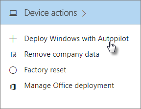

# Använda stegvisa anvisningar för att lägga till AutoPilot-enheter och -profilerUse the step-by-step guide to add Autopilot devices and profile

Du kan använda Windows AutoPilot för att konfigurera nya Windows 10-enheter för företaget så att de är redo för produktiv användning när dina anställda får dem.You can use Windows AutoPilot to set up new Windows 10 devices for your business so they are ready for productive use as soon as you give them to your employees.
  
## EnhetskravDevice requirements

Enheter måste uppfylla följande krav:Devices need to meet these requirements:
  
- Windows 10, version 1703 eller senare.Windows 10, version 1703 or later.
    
- Nya enheter som inte har genomgått Windows välkomstprogram.New devices that have not been through Windows out-of-box experience.
    
## Använda installationsguiden för att skapa enheter och profilerUse the setup guide to create devices and profiles

Om du inte redan har skapat enhetsgrupper eller profiler kommer du enklast igång genom att använda dig av en guide med stegvisa anvisningar, men du kan även [lägga till enheter](create-and-edit-autopilot-devices.md) och [tilldela profiler](create-and-edit-autopilot-profiles.md) till dem utan att använda guiden.If you have no device groups or profiles created yet, the best way to get started is by using the step-by-step guide, but you can also [add devices](create-and-edit-autopilot-devices.md) and [assign profiles](create-and-edit-autopilot-profiles.md) to them without using the guide. 
  
1. I administrationscentret för Microsoft 365 Business letar du upp kortet **Enhetsåtgärder** och väljer **Distribuera Windows med AutoPilot**.In the Microsoft 365 Business admin center, locate the **Device actions** card, and choose **Deploy Windows with Autopilot**.
    
    
  
2. På sidan **Förbered Windows** klickar eller trycker du på **Start guide** (Starta guiden).On the **Prepare Windows** page, click or tap **Start guide**.
    
    
  
3. På sidan för **uppladdning av CSV-fil med lista över enheter** bläddrar du till en plats där du har den förberedda CSV-filen. Klicka sedan på **Öppna** \> **Nästa**. Filen bör ha tre rubriker:On the **Upload .csv file with list of devices** page, browse to a locations where you have the prepared .CSV file, then **Open** \> **Next**. The file should have three headers:
    
  - Kolumn A: EnhetsserienummerColumn A: Device Serial Number
    
  - Kolumn B: Produkt-ID för WindowsColumn B: Windows Product ID
    
  - Kolumn C: MaskinvaruhashColumn C: Hardware Hash
    
    Du kan få den här informationen från din maskinvaruleverantör eller använda [PowerShell-skriptet Get-WindowsAutoPilotInfo](https://www.powershellgallery.com/packages/Get-WindowsAutoPilotInfo) som skapar en CSV-fil.You can get this information from your hardware vendor, or you can use the [Get-WindowsAutoPilotInfo PowerShell script](https://www.powershellgallery.com/packages/Get-WindowsAutoPilotInfo) that will generate a CSV file. 
    
    Mer information finns i [CSV-filen med enhetslistan](https://support.office.com/article/932e3676-2491-49f0-9177-d893d2f5276e). Du kan också ladda ned en exempelfil på sidan för **uppladdning av CSV-fil med lista över enheter**.For more information, see [Device list CSV-file](https://support.office.com/article/932e3676-2491-49f0-9177-d893d2f5276e). You can also download a sample file on the **Upload .csv file with list of devices** page. 
    
4. På sidan **Tilldela en profil** kan du välja en befintlig profil eller skapa en ny. Om du inte redan har en uppmanas du att skapa en ny.On the **Assign a profile** page, you can either pick an existing profile, or create a new one. If you don't have one yet, you will be prompted to create a new one. 
    
    En profil är en samling inställningar som kan tillämpas på en enskild enhet eller en grupp av enheter.A profile is a collection of settings that can be applied to a single device or to a group of devices.
    
    Standardfunktionerna är obligatoriska och ställs in automatiskt. Standardfunktionerna är följande:The default features are required and will be set automatically. The default features are:
    
  - Cortana-, OneDrive- och OEM-registrering hoppas över.Cortana, OneDrive and OEM registration is skipped.
    
  - Skapa inloggning med företagets varumärke.Create sign-in experience with your company brand.
    
  - Enheterna ansluts till Azure Active Directory-konton och registreras automatiskt för att hanteras av Microsoft 365 Business.Your devices are going to be connected to Azure Active Directory accounts and automatically enrolled to be managed by Microsoft 365 Business.
    
    Mer information finns iFor more information, see
    
    [Om AutoPilot-profilinställningar](autopilot-profile-settings.md) .[About AutoPilot Profile settings](autopilot-profile-settings.md) . 
    
5. Andra inställningar som används **Skip privacy settings** (Hoppa över sekretessinställningar) och **Don't allow user to become the local admin** (Tillåt inte användare att bli lokal administratör). Båda är inställda på **Av** som standard.The other settings are **Skip privacy settings** and **Don't allow user to become the local admin**. These are both set to **Off** by default. 
    
    Välj **Nästa**.Choose **Next**.
    
6. Sidan **Du är klar** visar att profilen du skapade (eller valde) kommer att användas för enhetsgruppen du skapade genom att ladda upp listan med enheter. De här inställningarna börjar gälla nästa gång enhetsanvändarna loggar in. Välj **Stäng**.**You're done** page indicates that the profile you created (or chose) will be applied to the device group you created by uploading the list of devices. These settings will be in effect when the device users sign in next. Choose **Close**.
    